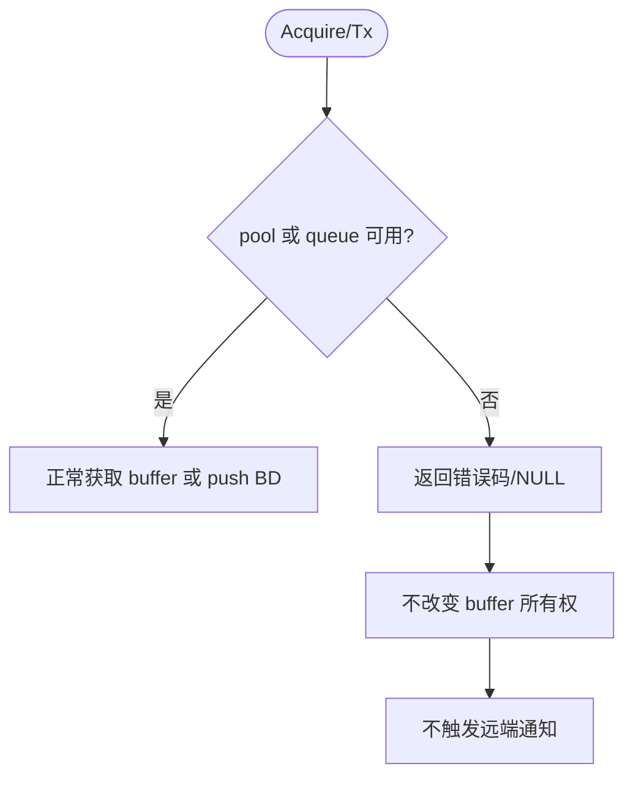

# IPCS 架构设计与软件详细设计分析报告

> 分析对象：`ipcs-architecture.pdf`、`ipcs_sdd.md`  
> 依据：`aspice_cn_4_4.md` 中 SWE.2「软件架构设计」与 SWE.3「软件详细设计与单元构建」要求  
> 角色视角：资深嵌入式软件架构专家、Automotive SPICE 专家  
> 方法：第一性原理，即先回答“软件为什么要被设计、拆分、证明”，再判断当前文档是否足以支撑实现、评审、变更影响分析和验证。

---

## 1. 第一性原理判断基线

从 SWE.2 和 SWE.3 的本质看，当前文档必须回答两个核心问题：

1. 架构设计要回答：软件由哪些构件组成、它们为什么这样划分、如何协作、如何满足软件需求、如何被分析和沟通。
2. 详细设计要回答：每个软件单元的输入、输出、状态、边界、错误、上下文、数据结构和动态行为是什么，且这些单元如何与架构和需求保持一致。

因此，一个合格的 IPCS 架构/详细设计文档，不是“把源码函数列出来”，也不是“把架构图放进去”，而是要形成如下证据链：

```text
IPCS 软件需求
  -> 架构目标/约束/原则
  -> 架构构件与接口
  -> 关键架构决策与分析依据
  -> 软件单元详细设计
  -> 数据结构/状态机/并发/内存一致性规则
  -> 需求-架构-详细设计-源码单元追溯
```

对 IPCS 这类 shared memory + interrupt 的嵌入式驱动，第一性风险集中在五类问题：

| 风险类别 | 为什么重要 |
|---|---|
| 共享内存布局 | 两端配置、地址视图、对齐和边界一旦不一致，会导致不可恢复的跨核通信错误。 |
| 队列与 buffer 生命周期 | managed/unmanaged 两种模型的所有权转移必须清楚，否则会出现重复释放、泄漏、旧数据或乱序。 |
| 中断与轮询并发 | ISR、softirq/task、polling 和 API 调用可能处于不同上下文，需要明确重入和同步约束。 |
| cache / memory barrier | 多核共享内存通信是否可见，不只取决于写内存，还取决于 cache flush/invalidate 与顺序保证。 |
| 需求追溯与变更影响 | 如果需求只追溯到组件而未追溯到具体单元，后续变更无法可靠定位影响范围。 |

---

## 2. 当前文档现状概览

### 2.1 `ipcs-architecture.pdf` 现状

`ipcs-architecture.pdf` 的主结构较完整，包含：

- 第 2 章：架构约束与全局策略，包括目标、约束、原则、需求分配。
- 第 3 章：软件架构总览，包括多 OS 部署上下文、静态结构、动态场景。
- 第 4 章：软件架构设计，包括组件设计、接口设计、功能描述、数据架构设计、动态架构。

该文档已体现 SWE.2 的几个关键方向：构件划分、组件职责、接口端口、需求分配、静态/动态架构。但仍缺少“架构分析”与“设计依据”的显式工作产品，尤其是资源、时序、并发、cache 一致性、故障恢复和可替换性方面的架构论证。

### 2.2 `ipcs_sdd.md` 现状

`ipcs_sdd.md` 的主结构如下：

- 第 2 章 `Software Architecture软件架构`：用表格映射架构组件与端口。
- 第 3.2 章：文件列表和文件说明。
- 第 3.3 章：9 个外部接口。
- 第 3.4 章：73 个内部函数/接口。
- 第 3.5 章：全局变量。
- 第 3.6 章：36 个数据结构/枚举。
- 第 3.7 章：跨函数动态流程。
- 第 3.8 章：追溯与一致性证据。

该文档已具备 SWE.3 的基础骨架：软件单元清单、接口表、数据结构表、动态流程图和源码核对结果。但内部函数的设计约束大量为空，数据结构描述仍有占位文本，追溯主要停留在“函数 -> 组件”或“外部接口 -> 需求”，还不足以证明“详细设计与架构/需求一致”。

### 2.3 可量化发现

| 发现项 | 数量/位置 | 判断 |
|---|---:|---|
| `ipcs_sdd.md` 中外部接口数量 | 9 个 | 与文档 3.8.2 统计一致。 |
| `ipcs_sdd.md` 中内部函数/接口数量 | 73 个 | 与文档 3.8.2 统计一致。 |
| `ipcs_sdd.md` 中 `对应软件架构ID` | 82 处 | 每个函数均映射到架构组件，这是优点。 |
| `ipcs_sdd.md` 中外部接口 `满足需求` | 9 处 | 仅外部接口有需求追溯，内部关键函数缺少需求/设计规则追溯。 |
| `ipcs_sdd.md` 中 `制约条件` 为空 | 73 处 | 内部函数普遍缺少前置条件、上下文、并发、边界说明。 |
| `ipcs_sdd.md` 中 `源码未提供描述` | 23 处 | 数据结构/字段语义尚未完成，影响 SWE.3 静态详细设计完整性。 |

---

## 3. 主要不足分析

### 3.1 架构文档缺少显式的架构分析与设计依据

SWE.2.BP3 要求分析软件架构，并记录架构设计决策依据。当前架构 PDF 已给出目标、原则、组件和接口，但对关键架构决策“为什么这样做”的论证还不够，例如：

- 为什么 IPCS core、queue、OSAL、HAL、config 要拆成这些组件。
- 为什么 managed channel 使用 BD + pool queue，而 unmanaged channel 使用 tx_count。
- 为什么中断接收和 polling 接收共享核心路径。
- 为什么 Linux deployment adaptation 不进入 RTOS SDD 的实现级详细设计。
- cache flush、内存可见性、丢失中断补偿、remote ready 判断的设计依据是什么。

第一性原理判断：架构决策不是为了说明“已经这样实现”，而是为了证明“这样划分可以控制变化、风险和验证成本”。

### 3.2 架构文档中的 ASPICE 术语存在版本不一致风险

`ipcs-architecture.pdf` 参考文件中列出 Automotive SPICE 2.5；需求分配说明中出现 “SWE.4（软件集成与集成测试）及 SWE.5（软件合格性测试）” 的旧式或不一致表述。当前任务依据是 ASPICE 4.0 中的 SWE.2/SWE.3，且 ASPICE 4.0 中：

- SWE.4 是 Software Unit Verification。
- SWE.5 是 Software Component Verification and Integration Verification。
- SWE.6 是 Software Verification。

第一性原理判断：术语不一致会导致评审人员无法判断工作产品边界，尤其会混淆“详细设计”“单元验证”“集成验证”“软件验证”的证据归属。

### 3.3 `ipcs_sdd.md` 的第 2 章存在“详细设计文档重复架构设计”的边界问题

`ipcs_sdd.md` 第 2 章当前标题是 `Software Architecture软件架构`，内容是架构层级、组件和端口摘要。对于 SDD 来说，这部分有价值，但它的本质不应是重新定义架构，而应是“引用架构基线并说明详细设计如何映射到架构”。

第一性原理判断：架构设计只有一个权威来源，详细设计应承接它。如果 SDD 再写一套架构，很容易出现双源不一致。

### 3.4 内部函数详细设计不满足“单元边界清楚”的要求

`ipcs_sdd.md` 第 3.4 章列出了 73 个内部函数/接口，但大量内部函数的 `制约条件` 为 `-`。从 SWE.3.BP1/BP2 看，每个软件单元至少应清楚说明：

- 调用前置条件。
- 输入/输出有效范围。
- 所属上下文：初始化、任务、ISR、softirq、polling。
- 是否可重入。
- 是否访问共享内存、全局变量、硬件寄存器。
- 错误返回与失败语义。
- 与其他单元的依赖关系。

第一性原理判断：如果一个函数的约束是 `-`，测试人员无法判断边界，维护人员无法判断变更影响，评审人员也无法判断该单元是否“按详细设计构建”。

### 3.5 数据结构字段语义仍未完成

第 3.6 章中存在 23 处 `源码未提供描述`。对 shared memory driver 来说，数据结构不是普通代码细节，而是跨核协议的一部分。以下字段尤其需要完整说明：

- `local_mem` / `remote_mem`：本端/对端地址视图与所有权。
- `ch.mng` / `ch.umng`：union 或通道类型相关分支。
- `local_shm_virt` / `remote_shm_virt`：物理/虚拟地址映射关系。
- `shm_size`：边界检查和 MMU/MPU 配置依据。
- `IPC_A53_x` / `IPC_M7_x`：处理器索引与硬件核 ID 映射。

第一性原理判断：共享内存通信的正确性依赖“双方对同一块内存有同一套解释”。字段语义缺失就等于协议的一部分没有定义。

### 3.6 动态详细设计还不够覆盖异常与恢复路径

第 3.7 章已有初始化、managed 发送/接收、unmanaged、IRQ/polling 流程，但缺少以下动态场景：

- remote not ready 时发送路径如何失败或等待。
- managed buffer 获取失败、pool 耗尽、BD queue 满的处理。
- 丢失中断后 polling 如何补偿。
- cache flush/invalidate 顺序如何保证对端可见。
- instance/channel integrity 失败后的状态处理。
- 释放/反初始化与正在处理中断之间的关系。

第一性原理判断：动态设计的价值是暴露“时间顺序上的风险”。只描述正常路径，会遗漏嵌入式驱动最常见的失效场景。

### 3.7 追溯矩阵颗粒度不够

当前 `ipcs_sdd.md` 的 3.8 能证明“覆盖了哪些章节”，也能证明“函数数量与源码一致”，但还不能充分证明：

- 每条 IPCS 需求分配到了哪些架构组件。
- 每个架构组件被哪些详细设计单元实现。
- 每个关键详细设计单元支撑哪些需求或架构接口。
- 数据结构字段与架构数据模型的一致性。
- 动态流程与架构动态场景的一致性。

第一性原理判断：追溯不是为了贴标签，而是为了回答“改一条需求会影响哪些设计、代码和验证”。

---

## 4. 修改方案：`ipcs-architecture.pdf`

以下修改方案按“具体位置 + 增加/删除/替换内容”给出。由于 `ipcs-architecture.pdf` 是 PDF 形式，建议在源文档中修改后重新导出 PDF。

### 4.1 第 1.4 References：更新 ASPICE 基线

**位置：** `1.4 REFERENCES 参考文件`

**删除/替换：**

- 删除或替换当前 `Automotive SPICE® Process Assessment Model 2.5` 引用。

**增加/替换为：**

| Reference ID | Document Name | Version | Status |
|---|---|---|---|
| 1 | Automotive SPICE® Process Reference / Assessment Model | 4.0 | Released |

**理由：** 当前任务依据 ASPICE 4.0；架构和详细设计必须使用 SWE.2/SWE.3 的 4.0 术语。

### 4.2 第 2.4 Requirements Allocation：修正后续 SWE 过程表述

**位置：** `2.4 REQUIREMENTS ALLOCATION 需求分配` 的工作产品关系说明段。

**删除：**

```text
并支撑 SWE.3（软件详细设计与单元实现）、SWE.4（软件集成与集成测试）及 SWE.5（软件合格性测试） 的范围界定。
```

**替换为：**

```text
并支撑 SWE.3（软件详细设计与单元构建）、SWE.4（软件单元验证）、SWE.5（软件构件验证与集成验证）以及 SWE.6（软件验证）的范围界定。
```

**理由：** 与 ASPICE 4.0 的 SWE 过程名称保持一致，避免评审歧义。

### 4.3 第 2 章后新增 `2.5 Architecture Analysis Criteria 架构分析准则`

**位置：** 在 `2.4 REQUIREMENTS ALLOCATION` 之后、`3 SOFTWARE ARCHITECTURE OVERVIEW` 之前。

**新增标题：**

```text
2.5 ARCHITECTURE ANALYSIS CRITERIA 架构分析准则
```

**新增内容建议：**

| 分析维度 | IPCS 需要回答的问题 | 关联风险 |
|---|---|---|
| 功能完整性 | 架构是否覆盖 managed/unmanaged、IRQ/polling、多 instance、多 channel。 | 功能遗漏 |
| 资源 | shared memory、pool、queue、stack、静态 RAM 是否可估算。 | 内存越界/资源不足 |
| 时序 | 中断处理、softirq、polling、callback 是否满足低延迟目标。 | 响应超时 |
| 并发 | API、ISR、softirq、polling 是否有清楚的上下文和重入约束。 | 竞态/死锁 |
| 数据一致性 | cache flush/invalidate、内存屏障、对齐策略是否明确。 | 旧数据/不可见 |
| 可移植性 | OSAL/HAL 是否隔离 OS/HW 差异。 | 平台移植成本高 |
| 可验证性 | 是否支持 mock、host test、fuzz、集成验证。 | 验证目标不清 |

**理由：** 补齐 SWE.2.BP3 “Analyze software architecture” 的显式证据。

### 4.4 第 2 章后新增 `2.6 Architecture Decision Records 架构决策记录`

**位置：** 在新增 `2.5` 之后。

**新增标题：**

```text
2.6 ARCHITECTURE DECISION RECORDS 架构决策记录
```

**新增内容建议：**

| ADR ID | 决策 | 依据 | 影响 | 追溯需求 |
|---|---|---|---|---|
| ADR-IPCS-001 | 分离 Core / Queue / OSAL / HAL / Config。 | 隔离协议、OS、HW、配置变化。 | 支持 Linux/RTOS 复用和 mock 测试。 | IPCS_003, IPCS_012, IPCS_036 |
| ADR-IPCS-002 | managed channel 使用 pool + BD queue。 | 避免额外拷贝，支持 buffer 生命周期管理。 | 需要定义 pool 耗尽、BD queue 满、释放规则。 | IPCS_016, IPCS_018, IPCS_023 |
| ADR-IPCS-003 | unmanaged channel 使用 tx_count。 | 应用独占通道内存，驱动只通知新数据。 | 需要定义 tx_count wrap-around 和旧数据判定。 | IPCS_021, IPCS_022 |
| ADR-IPCS-004 | IRQ 与 polling 共用接收核心。 | 丢失中断时可通过 polling 补偿。 | 需要定义预算、公平性和重复处理防护。 | IPCS_019, IPCS_023, IPCS_039 |
| ADR-IPCS-005 | Linux 部署适配独立成组件。 | Linux UIO/cdev/user-kernel 桥接属于部署差异。 | RTOS SDD 不展开其软件单元。 | IPCS_009, IPCS_036 |

**理由：** 设计依据是架构评审和后续变更影响分析的核心证据。

### 4.5 第 4.2 Interface Design：补充接口契约字段

**位置：** `4.2 INTERFACE DESIGN 接口设计`

**新增标题：**

```text
4.2.5 Interface Contract Rules 接口契约规则
```

**新增内容建议：**

对 P1/P4/P5 接口统一补充以下字段：

- 调用上下文：task、ISR、softirq、polling、初始化阶段。
- Sync/Async。
- Reentrancy。
- 输入范围。
- 输出/返回语义。
- 失败语义。
- 内存所有权。
- cache 可见性责任。
- 是否允许跨 instance 并发。
- 是否允许同 channel 并发。

**理由：** 当前 PDF 的 P1 接口已有 reentrancy，但 P4/P5 内部接口约束较粗；接口契约应成为 SDD 详细设计的输入。

### 4.6 第 4.4 Data Architecture Design：补充共享内存不变量

**位置：** `4.4 DATA ARCHITECTURE DESIGN 数据架构设计`

**新增标题：**

```text
4.4.4 Shared Memory Invariants 共享内存设计不变量
```

**新增内容建议：**

- 本端和对端的 instance/channel/pool 配置必须对称。
- `local_shm_addr` 与 `remote_shm_addr` 的物理/虚拟映射必须在 OSAL 中明确。
- queue ring 的 `read/write` 更新必须满足单生产者单消费者语义。
- BD 中 `pool_id/buf_id/data_size` 必须始终指向有效 pool 和 buffer 范围。
- managed buffer 的所有权只能在 pool queue、tx queue、rx callback、release 路径之间转移。
- unmanaged memory 由应用拥有，驱动只负责通知和 tx_count 可见性。
- 发送前后必须明确 cache flush/invalidate 或平台等效机制。

**理由：** 数据架构不变量是 SWE.2 到 SWE.3 的桥梁，也是后续单元/集成验证的依据。

### 4.7 第 4.5 Dynamic Architecture：补充异常与恢复序列

**位置：** `4.5 DYNAMIC ARCHITECTURE 动态架构图`

**新增标题：**

```text
4.5.2 Failure and Recovery Scenarios 异常与恢复场景
```

**新增内容建议：**

- Remote not ready 场景。
- Managed pool exhausted 场景。
- BD queue full 场景。
- Lost interrupt + polling recovery 场景。
- Integrity check failed 场景。
- Deinit while IRQ pending 场景。

**理由：** 当前动态场景偏正常路径；异常路径是 IPCS 驱动的高风险区域。

---

## 5. 修改方案：`ipcs_sdd.md`

以下方案可直接用于后续修改 `ipcs_sdd.md`。

### 5.1 第 1.2 Purpose：补充边界声明

**位置：** `## 1.2 Purpose of the document文档目的`

**增加内容：**

```text
本文档不重新定义 IPCS 软件架构。软件架构的权威输入为 `ipcs-architecture.pdf`；本文档只说明 `IPCS_49/` RTOS shared memory 源码如何实现该架构中与 RTOS 相关的组件、接口、数据结构和动态行为。
```

**理由：** 防止 SDD 与架构 PDF 形成双源定义。

### 5.2 第 2 章标题替换：从“软件架构”改为“架构映射”

**位置：** `# 2 Software Architecture软件架构`

**删除/替换标题：**

```text
# 2 Software Architecture软件架构
```

**替换为：**

```text
# 2 Architecture Mapping 架构映射与一致性说明
```

**理由：** SDD 应承接架构，不应重新定义架构。

### 5.3 第 2.3 后新增 `2.4 架构到详细设计映射`

**位置：** `## 2.3 运行场景` 之后、`# 3 Software DETAIL Design软件详细设计` 之前。

**新增标题：**

```text
## 2.4 架构到详细设计映射
```

**新增内容建议：**

| 架构组件 | 架构职责 | 详细设计位置 | 主要软件单元/数据结构 |
|---|---|---|---|
| Drv_Ipcs_Core_Cmp | instance/channel 管理、API、收发分发 | 3.3、3.4、3.6、3.7 | `ipcsShmInit`、`ipcsShmTx`、`ipcsShmRx`、`IPCS_SHM_PRIV_TYPE` |
| Drv_Ipcs_Queue_Cmp | BD 和 buffer queue | 3.4.1-3.4.5、3.6.1-3.6.2 | `ipcsQueuePush`、`ipcsQueuePop`、`IPCS_QUEUE_TYPE` |
| Drv_Ipcs_Osal_Cmp | OS 中断、polling、地址视图 | 3.4.41-3.4.73、3.6.26-3.6.36 | `ipcsOsInit`、`ipcsShmHardirq`、OS private structs |
| Drv_Ipcs_Hal_Cmp | 核间中断、core/IRQ 配置、cache | 3.4.24-3.4.40 | `ipcsHwInit`、`ipcsHwIrqNotify`、`ipcsHwFlushCache*` |
| Drv_Ipcs_Conf_Cmp | 静态配置模型 | 3.6.16-3.6.23 | `IPCS_SHM_CFG_TYPE`、`IPCS_SHM_CHANNEL_CFG_TYPE` |

**理由：** 补强 SWE.3.BP4 中“详细设计与软件架构一致”的证据。

### 5.4 第 3.1 后新增 `3.1.1 软件单元设计规则`

**位置：** `## 3.1 Definition定义` 之后、`## 3.2 Files` 之前。

**新增标题：**

```text
### 3.1.1 软件单元设计规则
```

**新增内容建议：**

- 所有对外 API 必须说明参数范围、返回值、错误码、调用上下文、重入性。
- 所有内部函数必须说明前置条件，不允许使用 `-` 作为长期占位。
- 访问 shared memory 的单元必须说明 cache 可见性责任。
- ISR/softirq/task/polling 路径上的函数必须说明上下文限制。
- 涉及 managed buffer 的函数必须说明 buffer 所有权转移。
- 涉及 unmanaged channel 的函数必须说明 tx_count 更新和 wrap-around 语义。
- 涉及全局变量的函数必须说明并发访问保护策略。

**理由：** 这是第 3.3/3.4/3.6 详细设计表格的统一判定准则。

### 5.5 第 3.3 外部接口表：补充接口契约字段

**位置：** `## 3.3 External Interfaces外部接口` 下的 9 个接口表。

**增加字段：**

对每个外部接口表增加以下行：

```html
<tr><td>调用上下文</td><td colspan="4">任务上下文 / 初始化上下文 / polling 上下文，禁止或允许 ISR 调用需明确。</td></tr>
<tr><td>重入性</td><td colspan="4">同 instance / 同 channel / 不同 instance 的重入规则。</td></tr>
<tr><td>内存所有权</td><td colspan="4">输入 buffer、返回 buffer 或 shared memory 的所有权归属。</td></tr>
<tr><td>cache/可见性责任</td><td colspan="4">调用前后是否需要 flush/invalidate，责任在 caller、driver 或 HAL。</td></tr>
<tr><td>失败语义</td><td colspan="4">失败后状态是否改变、buffer 是否仍归 caller、是否触发通知。</td></tr>
```

**理由：** 当前外部接口已有基本函数信息，但对 shared memory driver 最关键的上下文、所有权、cache 和失败语义还不够显式。

### 5.6 第 3.4 内部函数表：替换 73 处空制约条件

**位置：** `## 3.4 Internal Functions 内部函数`

**删除/替换：**

删除所有内部函数表中的：

```html
<tr><td>制约条件</td><td colspan="4">-</td></tr>
```

**替换原则：**

按函数类别批量补充约束，而不是留空。

| 函数类别 | 应补充的制约条件 |
|---|---|
| Queue 函数 | queue 指针非空；ring sentinel 有效；elem_size 与边界有效；SPSC 访问语义成立。 |
| Channel 查询函数 | instance 已初始化；chan_id 在范围内；channel 类型匹配。 |
| Integrity 函数 | shared memory 地址有效；sentinel/magic 可读；不修改业务状态。 |
| Rx/Tx 内部函数 | remote ready 规则；queue/pool 有效；cache 可见性；失败后状态。 |
| HAL 函数 | instance 配置有效；core/IRQ 映射有效；寄存器访问由平台保证。 |
| OSAL 函数 | OS 资源已初始化；ISR/task/polling 上下文明确；同步原语有效。 |

**示例替换：**

对 `3.4.1 ipcsQueuePop`：

```html
<tr><td>制约条件</td><td colspan="4">queue 与 buf 非空；push_ring/pop_ring 已初始化且 sentinel 有效；调用方保证该 queue 的 SPSC 访问语义；当队列为空时函数不得修改输出 buf 的有效语义。</td></tr>
```

对 `3.4.36 ipcsHwIrqNotify`：

```html
<tr><td>制约条件</td><td colspan="4">instance 已完成 HAL 初始化；remote core 与 tx irq/channel 配置有效；调用上下文允许访问核间中断控制器；失败时不得改变 IPCS core 的 channel 所有权状态。</td></tr>
```

**理由：** 这是当前 SDD 最大的 SWE.3 缺口。

### 5.7 第 3.6 数据结构：删除 23 处 `源码未提供描述`

**位置：** `## 3.6 Data Structure 类型定义`

**删除：**

删除所有字段描述中的：

```text
源码未提供描述
```

**替换示例：**

| 位置 | 字段 | 建议描述 |
|---|---|---|
| 3.6.9 | `local_mem` | 指向本端 unmanaged channel 共享内存视图，供本端应用写入。 |
| 3.6.9 | `remote_mem` | 指向对端 unmanaged channel 在本端可见的共享内存视图，供接收回调读取。 |
| 3.6.10 | `ch.mng` | 当 channel 类型为 `IPC_SHM_MANAGED` 时有效的 managed channel 私有数据。 |
| 3.6.10 | `ch.umng` | 当 channel 类型为 `IPC_SHM_UNMANAGED` 时有效的 unmanaged channel 私有数据。 |
| 3.6.19 | `ch.managed` | managed channel 配置，包括 pool 配置和回调。 |
| 3.6.19 | `ch.unmanaged` | unmanaged channel 配置，包括 channel memory size 和回调。 |
| 3.6.24 | `IPC_A53_x` | A53 cluster 中对应处理器索引，用于平台核 ID 映射。 |
| 3.6.35 | `local_shm_virt` | 本端 shared memory 的虚拟地址，适用于需要 MMU 映射的 OS。 |
| 3.6.35 | `remote_shm_virt` | 对端 shared memory 在本端地址空间中的虚拟地址。 |
| 3.6.35 | `shm_size` | 当前 instance 的 shared memory 窗口大小，用于映射与边界检查。 |

**理由：** 数据结构字段语义是静态详细设计的一部分，不能依赖读源码猜测。

### 5.8 第 3.7 动态详细设计：新增异常流程

**位置：** `## 3.7 Dynamic Detailed Design 动态详细设计`

**新增标题：**

```text
### 3.7.6 Remote not ready 处理流程
### 3.7.7 Managed pool/BD queue 异常流程
### 3.7.8 Cache 可见性与发送顺序流程
### 3.7.9 Deinit 与 pending IRQ 处理流程
```

**新增内容示例：**

`3.7.7 Managed pool/BD queue 异常流程` 可增加：



**理由：** 当前 3.7 覆盖正常主路径，不足以描述嵌入式驱动的关键失败路径。

### 5.9 第 3.8 追溯与一致性证据：新增细粒度矩阵

**位置：** `## 3.8 Traceability and Consistency Evidence 追溯与一致性证据`

**新增标题：**

```text
### 3.8.5 需求-架构-详细设计追溯矩阵
### 3.8.6 数据结构与数据架构一致性矩阵
### 3.8.7 动态场景一致性矩阵
```

**新增内容示例：**

| 需求 ID | 架构组件 | 架构接口/数据 | 详细设计单元 | 数据结构 | 动态流程 |
|---|---|---|---|---|---|
| IPCS_018 | Drv_Ipcs_Core_Cmp / Drv_Ipcs_Queue_Cmp | IF_AppSvc P1, IF_Queue P3 | `ipcsShmAcquireBuf`, `ipcsShmTx`, `ipcsQueuePop/Push` | `IPCS_SHM_BD_TYPE`, `IPCS_SHM_POOL_TYPE` | 3.7.2, 3.7.3 |
| IPCS_021 | Drv_Ipcs_Core_Cmp / Drv_Ipcs_Conf_Cmp | unmanaged channel model | `ipcsShmUnmanagedAcquire`, `ipcsShmUnmanagedTx` | `IPCS_UNMANAGED_CHANNEL_TYPE` | 3.7.4 |
| IPCS_023 | Drv_Ipcs_Core_Cmp / Drv_Ipcs_Queue_Cmp | polling recovery | `ipcsShmPollChannels`, `ipcsChannelRx` | queue/ring types | 3.7.5, 3.7.7 |
| IPCS_028 | Drv_Ipcs_Hal_Cmp / Drv_Ipcs_Osal_Cmp | IF_HWAbst / IF_OSAbst | `ipcsHwIrqNotify`, `ipcsShmHardirq` | OS/HAL private structs | 3.7.5 |

**理由：** 让追溯从“章节覆盖”升级为“需求到具体单元”的影响分析能力。

### 5.10 第 3.2 Files：建议删除或迁移构建文件的“软件单元”表达

**位置：** `### 3.2.12 ipc-shm-rtos.mk`

**删除/调整建议：**

- 不建议把 `ipc-shm-rtos.mk` 作为软件单元详细设计对象展开。
- 若当前 3.2.12 只是构建集成说明，可保留在文件列表，但删除其“组件 UML / 头文件依赖 / 软件单元流程”类表达。

**替换为：**

```text
### 3.2.12 构建集成文件：ipc-shm-rtos.mk

该文件不作为运行时软件单元处理，仅说明 RTOS shared memory driver 的源文件选择、编译宏、OS 变体集成关系。其详细验证归属于构建与集成检查，不纳入 SWE.3 函数级详细设计。
```

**理由：** SWE.3 的软件单元通常是函数、模块、状态机或模型单元；构建脚本可作为构建工作产品说明，但不应混入运行时详细设计。

---

## 6. 建议实施优先级

### P0：必须先修正

| 项目 | 位置 | 原因 |
|---|---|---|
| ASPICE 版本与 SWE 术语 | 架构 PDF 1.4、2.4 | 防止评审基线错误。 |
| 73 处空制约条件 | SDD 3.4 | 直接影响 SWE.3 单元设计完整性。 |
| 23 处字段描述占位 | SDD 3.6 | 直接影响数据结构静态设计完整性。 |
| SDD 第 2 章改为架构映射 | SDD 第 2 章 | 防止架构双源定义。 |

### P1：应尽快补齐

| 项目 | 位置 | 原因 |
|---|---|---|
| 架构分析准则 | 架构 PDF 新增 2.5 | 满足 SWE.2.BP3。 |
| 架构决策记录 | 架构 PDF 新增 2.6 | 支撑设计依据和变更分析。 |
| 接口契约规则 | 架构 PDF 4.2.5，SDD 3.3 | 明确上下文、重入、所有权、cache。 |
| 需求-架构-详细设计矩阵 | SDD 3.8.5 | 提升追溯颗粒度。 |

### P2：增强项

| 项目 | 位置 | 原因 |
|---|---|---|
| 异常动态流程 | 架构 PDF 4.5.2，SDD 3.7.6-3.7.9 | 覆盖高风险异常路径。 |
| 共享内存设计不变量 | 架构 PDF 4.4.4 | 固化跨核通信协议约束。 |
| 构建文件归类调整 | SDD 3.2.12 | 改善工作产品边界。 |

---

## 7. 总体结论

当前 `ipcs-architecture.pdf` 和 `ipcs_sdd.md` 已经具备较好的框架基础：架构 PDF 覆盖了组件、接口、需求分配和动态场景；SDD 已把源码函数、外部接口、内部函数、数据结构和动态流程组织起来。

主要不足不在“有没有章节”，而在“证据颗粒度是否足以支撑 ASPICE SWE.2/SWE.3 评审”。按第一性原理看，当前最需要补强的是：

1. 架构文档中补充设计依据、架构分析和共享内存不变量。
2. 详细设计文档中补齐每个内部函数的前置条件、上下文、错误语义和并发约束。
3. 补齐数据结构字段语义，尤其是共享内存、通道、OSAL/HAL 私有数据。
4. 将追溯从“组件级”提升到“需求-架构接口/数据-详细设计单元-动态流程”级。
5. 修正 ASPICE 版本和 SWE 术语，使文档与 ASPICE 4.0 一致。

完成上述修改后，文档将更接近 ASPICE 4.0 对 SWE.2/SWE.3 的核心要求：不是只描述软件，而是能够证明软件架构和详细设计是有依据、可分析、可追溯、可验证、可维护的。
