| ROLES / 角色 | Name / 姓名 | Department / 部门 | Date / 日期 |
|---|---|---|---|
| AUTHOR(S) / 作者： | 倘亚朋 / Cursor Agent | 软件研发部 | 2026.5.7 |
| REVIEWER(S) / 审查： | 待评审 | 软件研发部 | 2026.5.7 |
| APPROVER (S) / 批准： | 待批准 | 软件研发部 | 2026.5.7 |

## Document history: 文档历史

| Version / 版本 | Date / 日期 | Editor / 编辑人 | Status / 文档状态 | Change description / 变更简述 |
|---|---|---|---|---|
| V0.1 | 2026.5.7 | Cursor Agent | Draft | Initial version for review，基于 IPCS_49 源码、reference.md、ipcs-architecture.pdf 与 aspice.pdf 生成 |

## CONTENTS 目录

- 1 INTRODUCTION简介
  - 1.1 Confidentiality 保密性
  - 1.2 Purpose of the document文档目的
  - 1.3 Scope范围
  - 1.4 References 参考文件
  - 1.5 Abbreviations缩略语
- 2 Software Architecture软件架构
  - 2.1 架构分层与组件
  - 2.2 组件关系与端口
  - 2.3 运行场景
- 3 Software DETAIL Design软件详细设计
  - 3.1 Definition定义
  - 3.2 Files
  - 3.3 External Interfaces外部接口
  - 3.4 Internal Functions 内部函数
  - 3.5 Gobal variants 全局变量
  - 3.6 Data Structure 类型定义
  - 3.7 Dynamic Detailed Design 动态详细设计
  - 3.8 Traceability and Consistency Evidence 追溯与一致性证据

# 1 INTRODUCTION简介

## 1.1 Confidentiality 保密性

任何披露必须与负责的流程经理协调。

本文件过程说明仅限直接参与项目的人员查看。转让给其他方，尤其是 Star Gather 以外的合作伙伴，必须由项目负责人协调，并受开发合同中有关保密规定的约束。

## 1.2 Purpose of the document文档目的

本文档按照 SWE.3 Software Detailed Design and Unit Construction 的要求，为 IPCS Driver RTOS shared memory 实现建立软件详细设计。文档内容描述软件单元的静态结构、接口、数据结构、关键动态行为，并与 IPCS 软件架构中定义的组件和接口保持一致。

## 1.3 Scope范围

本文档适用于 `IPCS_49/` 中的 IPC Shared Memory Driver for Real-Time Operating Systems 源码。该源码覆盖 IPCS-SHM 核心、队列与缓冲管理、OSAL 的 AutoSAR/Baremetal/FreeRTOS/Zephyr 变体、HAL 的 MSCM 核间中断实现、公共配置数据类型和构建集成文件。

`ipcs-architecture.pdf` 中定义了 Linux 部署适配组件 `Drv_Ipcs_Linux_Adapt_Cmp`，但 `IPCS_49/` 本次输入源码未包含 Linux 适配实现文件。因此本文只在架构边界中保留该组件名称，不对其软件单元、函数或数据结构进行实现级详细设计。

## 1.4 References 参考文件

| Reference ID / 编号 | Document Name / 文档名称 | Version / 版本 | Date / 日期 | Author / 作者 | Status / 状态 |
|---|---|---|---|---|---|
| 1 | Automotive SPICE® Process Assessment Model, SWE.3 Software Detailed Design and Unit Construction | 4.0 | 2023 | VDA | Release |
| 2 | IPCS Driver 软件架构设计 ipcs-architecture.pdf | 1.0 | 2026.4.16 | 倘亚朋 | 待评审 |
| 3 | reference.md 详细设计文档模板 | N/A | N/A | N/A | 模板输入 |
| 4 | IPCS_49/ IPCF Shared Memory Driver for Real-Time Operating Systems 源码 | SW 4.0.1 | 2023 | NXP | 源码输入 |

## 1.5 Abbreviations缩略语

| Abbreviation / 缩写 | Meaning/Explanation / 解释 |
|---|---|
| API | Application Programming Interface |
| AUTOSAR | AUTomotive Open System ARchitecture |
| BD | Buffer Descriptor |
| CDD | Complex Device Driver |
| HAL | Hardware Abstraction Layer |
| HW | Hardware |
| IPCF | Inter-Platform Communication Framework |
| IPCS | Inter-Processor Communication System |
| IRQ | Interrupt Request |
| ISR | Interrupt Service Routine |
| MMU | Memory Management Unit |
| MSCM | Multi-Core Shared Memory / Messaging interrupt controller as used by source naming |
| MRU | Messaging/Message Routing Unit, used by integration notes |
| MU | Messaging Unit, used by integration notes |
| OS | Operating System |
| OSAL | OS Abstraction Layer |
| RTOS | Real-Time Operating System |
| SHM | Shared Memory |
| SPSC | Single Producer Single Consumer |
| UIO | Userspace I/O |

# 2 Software Architecture软件架构

IPCS Driver 软件架构采用 `ipcs-architecture.pdf` 中定义的分层与组件命名。`IPCS_49/` 的 RTOS shared memory 源码映射到其中的 IPCS-SHM、IPCS-OSAL 与 IPCS-HAL 三个运行时层级；配置数据类型映射到 `Drv_Ipcs_Conf_Cmp`，Linux 部署适配组件不在本源码输入范围内。

## 2.1 架构分层与组件

| 架构层级 | 组件 ID | 组件名称 | 本源码映射 | 职责 |
|---|---|---|---|---|
| IPCS-SHM | Drv_Ipcs_Core_Cmp | 通信核心组件 | common/ipc-shm.c, common/ipc-shm.h | 提供对外 IPCS API；管理实例、通道、managed/unmanaged 语义、shared memory 布局、接收分发和参数校验 |
| IPCS-SHM | Drv_Ipcs_Queue_Cmp | 队列与缓冲管理组件 | common/ipc-queue.c, common/ipc-queue.h | 提供共享内存双环 lock-free FIFO 队列，支撑 BD 与 buffer 流转 |
| IPCS-OSAL | Drv_Ipcs_Osal_Cmp | OS 适配组件 | os/ipc-os.h, os/autosar, os/baremetal, os/freertos, os/zephyr | 提供 shared memory 地址视图、中断接入、延迟处理上下文与 polling 桥接 |
| IPCS-HAL | Drv_Ipcs_Hal_Cmp | HW 适配组件 | hw/ipc-hw.c, hw/ipc-hw.h, hw/ipc-hw-platform.h | 解析核 ID 与中断配置，执行核间通知使能、关闭、触发、清除和 cache flush |
| 配置 | Drv_Ipcs_Conf_Cmp | 配置组件 | common/ipc-types.h，外部 ipcf_Ip_Cfg*.h | 描述 instance、channel、pool、shared memory、IRQ、本端/对端 core 与 callback 配置 |
| Linux 部署适配 | Drv_Ipcs_Linux_Adapt_Cmp | Linux 部署适配组件 | IPCS_49/ 未包含实现源码 | 架构中定义用于 Linux 全内核、UIO、cdev 部署；本文不展开实现级单元 |

## 2.2 组件关系与端口

| 端口 | 接口 | 提供方 | 需要方 | 源码对应 |
|---|---|---|---|---|
| P1 | IF_AppSvc | Drv_Ipcs_Core_Cmp | 应用/集成层 | ipc-shm.h 中声明、ipc-shm.c 中定义的 9 个非 static API |
| P2 | IF_CfgIn | Drv_Ipcs_Conf_Cmp | Drv_Ipcs_Core_Cmp / Drv_Ipcs_Osal_Cmp / Drv_Ipcs_Hal_Cmp | IPCS_SHM_*_CFG_TYPE 结构体及外部配置头文件 |
| P3 | IF_Queue | Drv_Ipcs_Queue_Cmp | Drv_Ipcs_Core_Cmp | ipcsQueueInit, ipcsQueuePush, ipcsQueuePop, ipcsQueueCheckIntegrity, ipcsQueueMemSize |
| P4 | IF_OSAbst | Drv_Ipcs_Osal_Cmp | Drv_Ipcs_Core_Cmp | ipcsOsInit, ipcsOsFree, ipcsOsGetLocalShm, ipcsOsGetRemoteShm, ipcsOsPollChannels, ipcsShmHardirq* |
| P5 | IF_HWAbst | Drv_Ipcs_Hal_Cmp | Drv_Ipcs_Core_Cmp / Drv_Ipcs_Osal_Cmp | ipcsHwInit, ipcsHwFree, ipcsHwIrqEnable/Disable/Notify/Clear, ipcsHwFlushCacheLocal/Remote |
| P7 | IF_PlatformOS | OS 执行环境 | Drv_Ipcs_Osal_Cmp | AutoSAR OS、Baremetal、FreeRTOS、Zephyr API |
| P8 | IF_PlatformHW | HW 执行环境 | Drv_Ipcs_Hal_Cmp | MSCM/IRQ/SCB register access and platform definitions |

## 2.3 运行场景

IPCS-SHM 初始化时按配置逐个 instance 调用 HAL 初始化、OSAL 初始化和 channel 初始化。发送路径中，managed channel 通过 pool queue 获取 buffer，发送时提交 BD 到 channel queue 并触发 HAL 通知；unmanaged channel 直接暴露通道内存，发送时递增 tx_count 并通知远端。接收路径由 OSAL 的 hardirq/softirq 或 polling 触发 IPCS-SHM 的接收分发，核心层按 channel 公平预算处理 managed BD 或 unmanaged tx_count 变化，并调用应用回调。

# 3 Software DETAIL Design软件详细设计

## 3.1 Definition定义

IPCS Driver 是面向同一 SoC 内不同处理核心的 shared memory 通信驱动。`IPCS_49/` 输入源码实现 RTOS 侧 IPCF Shared Memory Driver，支持 managed channel 与 unmanaged channel 两类通道，支持中断通知与 polling 接收，支持多个 instance 和多个 channel。

## 3.2 Files

### 3.2.1 文件列表

| 组件 | 文件 |
|---|---|
| Drv_Ipcs_Queue_Cmp / IPCS-SHM Queue | common/ipc-queue.c |
| Drv_Ipcs_Queue_Cmp / IPCS-SHM Queue | common/ipc-queue.h |
| Drv_Ipcs_Core_Cmp / IPCS-SHM | common/ipc-shm.c |
| Drv_Ipcs_Core_Cmp / IPCS-SHM | common/ipc-shm.h |
| Drv_Ipcs_Conf_Cmp / 配置数据类型 | common/ipc-types.h |
| Drv_Ipcs_Core_Cmp 公共工具 | common/ipc-util.c |
| Drv_Ipcs_Core_Cmp 公共工具 | common/ipc-util.h |
| Drv_Ipcs_Hal_Cmp / 平台定义 | hw/ipc-hw-platform.h |
| Drv_Ipcs_Hal_Cmp / IPCS-HAL | hw/ipc-hw.c |
| Drv_Ipcs_Hal_Cmp / IPCS-HAL | hw/ipc-hw.h |
| 构建集成 | ipc-shm-rtos.mk |
| Drv_Ipcs_Osal_Cmp / AutoSAR OS 变体 | os/autosar/ipc-os-autosar.c |
| Drv_Ipcs_Osal_Cmp / Baremetal 变体 | os/baremetal/ipc-os-baremetal.c |
| Drv_Ipcs_Osal_Cmp / FreeRTOS 变体 | os/freertos/ipc-os-freertos.c |
| Drv_Ipcs_Osal_Cmp / IPCS-OSAL | os/ipc-os.h |
| Drv_Ipcs_Osal_Cmp / Zephyr 变体 | os/zephyr/ipc-os-zephyr.c |
| 集成说明 | README.rst |

### 3.2.2 ipc-queue.c

**描述：**

> `common/ipc-queue.c` 属于 Drv_Ipcs_Queue_Cmp / IPCS-SHM Queue。

**依赖关系：**

`ipc-shm.h`, `ipc-queue.h`, `ipc-util.h`（与 `common/ipc-queue.c` 中 `#include` 顺序一致）

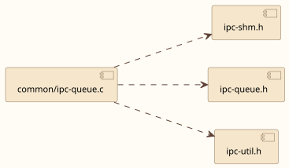

### 3.2.3 ipc-queue.h

**描述：**

> `common/ipc-queue.h` 属于 Drv_Ipcs_Queue_Cmp / IPCS-SHM Queue。

**依赖关系：**

本头文件未 `#include` IPCS_49 内其他头文件（除标准版本宏定义外无外部文件依赖）。

### 3.2.4 ipc-shm.c

**描述：**

> `common/ipc-shm.c` 属于 Drv_Ipcs_Core_Cmp / IPCS-SHM。

**依赖关系：**

`ipc-shm.h`, `ipc-os.h`, `ipc-hw.h`, `ipc-queue.h`（与 `common/ipc-shm.c` 中 `#include` 顺序一致）

### 3.2.5 ipc-shm.h

**描述：**

> `common/ipc-shm.h` 属于 Drv_Ipcs_Core_Cmp / IPCS-SHM。

**依赖关系：**

`ipc-types.h`, `ipcf_Ip_Cfg.h`（与 `common/ipc-shm.h` 中 `#include` 一致；`ipcf_Ip_Cfg.h` 为工程配置头）

### 3.2.6 ipc-types.h

**描述：**

> `common/ipc-types.h` 属于 Drv_Ipcs_Conf_Cmp / 配置数据类型。

**依赖关系：**

条件编译：`NO_STDINT_H==0` 时包含 `<stdint.h>`、`<stddef.h>`、`<errno.h>`；否则由 CPU 宏定义 `uintptr_t` 等；均包含 `Mcal.h`、`ipcf_Ip_Cfg_Defines.h`（与 `common/ipc-types.h` 一致）。

### 3.2.7 ipc-util.c

**描述：**

> `common/ipc-util.c` 属于 Drv_Ipcs_Core_Cmp 公共工具。

**依赖关系：**

`ipc-shm.h`, `ipc-util.h`（与 `common/ipc-util.c` 中 `#include` 一致）

### 3.2.8 ipc-util.h

**描述：**

> `common/ipc-util.h` 属于 Drv_Ipcs_Core_Cmp 公共工具。

**依赖关系：**

本头文件未 `#include` IPCS_49 内其他头文件。

### 3.2.9 ipc-hw-platform.h

**描述：**

> `hw/ipc-hw-platform.h` 属于 Drv_Ipcs_Hal_Cmp / 平台定义。

**依赖关系：**

当定义 `S32G3XX` 时：`S32G399A_M7_COMMON.h`, `S32G399A_SCB.h`, `S32G399A_MSCM.h`（与 `hw/ipc-hw-platform.h` 一致）

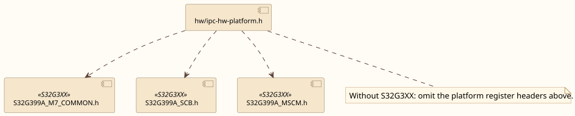

### 3.2.10 ipc-hw.c

**描述：**

> `hw/ipc-hw.c` 属于 Drv_Ipcs_Hal_Cmp / IPCS-HAL。

**依赖关系：**

`ipc-shm.h`, `ipc-os.h`, `ipc-hw.h`, `ipc-hw-platform.h`（与 `hw/ipc-hw.c` 中 `#include` 一致）

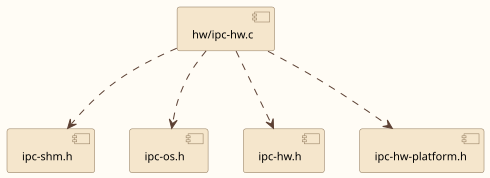

### 3.2.11 ipc-hw.h

**描述：**

> `hw/ipc-hw.h` 属于 Drv_Ipcs_Hal_Cmp / IPCS-HAL。

**依赖关系：**

本头文件未 `#include` 其他头文件（仅声明 HAL API）。

### 3.2.12 ipc-shm-rtos.mk

**描述：**

> `ipc-shm-rtos.mk` 属于 构建集成。

### 3.2.13 ipc-os-autosar.c

**描述：**

> `os/autosar/ipc-os-autosar.c` 属于 Drv_Ipcs_Osal_Cmp / AutoSAR OS 变体。

**依赖关系：**

`<Os.h>`, `ipc-shm.h`, `ipc-os.h`, `ipc-hw.h`（与 `os/autosar/ipc-os-autosar.c` 中 `#include` 顺序一致）

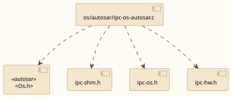

### 3.2.14 ipc-os-baremetal.c

**描述：**

> `os/baremetal/ipc-os-baremetal.c` 属于 Drv_Ipcs_Osal_Cmp / Baremetal 变体。

**依赖关系：**

`ipc-shm.h`, `ipc-os.h`, `ipc-hw.h`（与 `os/baremetal/ipc-os-baremetal.c` 一致）

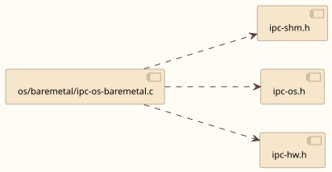

### 3.2.15 ipc-os-freertos.c

**描述：**

> `os/freertos/ipc-os-freertos.c` 属于 Drv_Ipcs_Osal_Cmp / FreeRTOS 变体。

**依赖关系：**

`ipc-shm.h`, `ipc-os.h`, `ipc-hw.h`, `FreeRTOS.h`, `task.h`（与 `os/freertos/ipc-os-freertos.c` 一致）

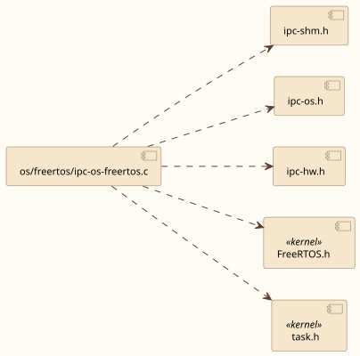

### 3.2.16 ipc-os.h

**描述：**

> `os/ipc-os.h` 属于 Drv_Ipcs_Osal_Cmp / IPCS-OSAL。

**依赖关系：**

本头文件未 `#include` 其他头文件（仅 OSAL 宏与 API 声明）。

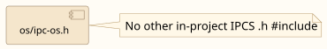

### 3.2.17 ipc-os-zephyr.c

**描述：**

> `os/zephyr/ipc-os-zephyr.c` 属于 Drv_Ipcs_Osal_Cmp / Zephyr 变体。

**依赖关系：**

`ipc-shm.h`, `ipc-os.h`, `ipc-hw.h`, `<zephyr/sys/mem_manage.h>`, `<zephyr/kernel.h>`, `<zephyr/device.h>`；当定义 `S32ZE` 时另含 `Mru_Ip.h`（见 `os/zephyr/ipc-os-zephyr.c` 条件编译）

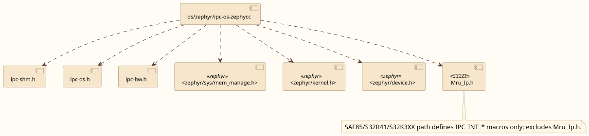

### 3.2.18 README.rst

**描述：**

> `README.rst` 属于 集成说明。

## 3.3 External Interfaces外部接口

本节严格按照 `reference.md` 的函数说明表格格式描述外部接口。按照任务要求，只有 `IPCS_49/common/ipc-shm.c` 中的非静态接口为对外接口。

### 3.3.1 ipcsShmInit

<table border="1" cellspacing="0" cellpadding="4">
<tbody>
<tr><td>对应软件架构ID</td><td colspan="4">Drv_Ipcs_Core_Cmp</td></tr>
<tr><td>函数说明</td><td colspan="4">该函数初始化配置中声明的所有 shared memory 通信实例，依次初始化 IPCS-HAL、IPCS-OSAL 和 IPCS-SHM channel 资源。</td></tr>
<tr><td>函数原型</td><td colspan="4">sint32 ipcsShmInit(const struct IPCS_SHM_INSTANCES_CFG_TYPE *cfg)</td></tr>
<tr><td>制约条件</td><td colspan="4">Config 指针非空；num_instances 大于 0 且不超过 IPC_SHM_MAX_INSTANCES；每个 instance 的 shared memory 地址、channel 数量等配置有效。</td></tr>
<tr><td rowspan="2">输入/输出参数</td><td>I/O</td><td>参数名</td><td>数据类型</td><td>说明</td></tr>
<tr><td>I</td><td>cfg</td><td>const struct IPCS_SHM_INSTANCES_CFG_TYPE *</td><td>指向 IPCS shared memory instance 配置的指针</td></tr>
<tr><td rowspan="2">返回值</td><td colspan="2">数据类型</td><td colspan="2">说明</td></tr>
<tr><td colspan="2">sint32</td><td colspan="2">IPC_SHM_E_OK：初始化成功；-IPC_SHM_E_INVAL 或下层错误码：配置或初始化失败</td></tr>
<tr><td>函数定义文件</td><td colspan="4">common/ipc-shm.c</td></tr>
<tr><td>函数声明文件</td><td colspan="4">common/ipc-shm.h</td></tr>
<tr><td>满足需求</td><td colspan="4">IPCS_001, IPCS_014, IPCS_016, IPCS_017, IPCS_020, IPCS_025, IPCS_028, IPCS_029, IPCS_031, IPCS_034</td></tr>
</tbody>
</table>

**处理流程**

### 3.3.2 ipcsShmFree

<table border="1" cellspacing="0" cellpadding="4">
<tbody>
<tr><td>对应软件架构ID</td><td colspan="4">Drv_Ipcs_Core_Cmp</td></tr>
<tr><td>函数说明</td><td colspan="4">该函数释放所有已使用的 shared memory 通信实例，清除本端 ready 状态并释放 OS/HW 资源。</td></tr>
<tr><td>函数原型</td><td colspan="4">void ipcsShmFree(void)</td></tr>
<tr><td>制约条件</td><td colspan="4">无输入参数；释放当前处于 IPC_SHM_INSTANCE_USED 状态的 instance。</td></tr>
<tr><td rowspan="2">输入/输出参数</td><td>I/O</td><td>参数名</td><td>数据类型</td><td>说明</td></tr>
<tr><td>-</td><td>-</td><td>-</td><td>-</td></tr>
<tr><td rowspan="2">返回值</td><td colspan="2">数据类型</td><td colspan="2">说明</td></tr>
<tr><td colspan="4">-</td></tr>
<tr><td>函数定义文件</td><td colspan="4">common/ipc-shm.c</td></tr>
<tr><td>函数声明文件</td><td colspan="4">common/ipc-shm.h</td></tr>
<tr><td>满足需求</td><td colspan="4">IPCS_001, IPCS_028, IPCS_029</td></tr>
</tbody>
</table>

**处理流程**

### 3.3.3 ipcsShmAcquireBuf

<table border="1" cellspacing="0" cellpadding="4">
<tbody>
<tr><td>对应软件架构ID</td><td colspan="4">Drv_Ipcs_Core_Cmp</td></tr>
<tr><td>函数说明</td><td colspan="4">该函数在 managed channel 上按照请求长度获取本端发送 buffer。</td></tr>
<tr><td>函数原型</td><td colspan="4">void * ipcsShmAcquireBuf(const uint8 instance, sint32 chan_id, uint32 mem_size)</td></tr>
<tr><td>制约条件</td><td colspan="4">instance 已初始化；chan_id 对应 managed channel；mem_size 非 0；managed channel 与 pool queue integrity 校验通过。</td></tr>
<tr><td rowspan="4">输入/输出参数</td><td>I/O</td><td>参数名</td><td>数据类型</td><td>说明</td></tr>
<tr><td>I</td><td>instance</td><td>const uint8</td><td>IPCS shared memory instance 索引</td></tr>
<tr><td>I</td><td>chan_id</td><td>sint32</td><td>IPCS shared memory channel 索引</td></tr>
<tr><td>I</td><td>mem_size</td><td>uint32</td><td>请求获取的 buffer 大小，单位为 byte</td></tr>
<tr><td rowspan="2">返回值</td><td colspan="2">数据类型</td><td colspan="2">说明</td></tr>
<tr><td colspan="2">void *</td><td colspan="2">非 NULL：可写发送 buffer 地址；NULL：instance/channel/size/integrity 无效或无可用 buffer</td></tr>
<tr><td>函数定义文件</td><td colspan="4">common/ipc-shm.c</td></tr>
<tr><td>函数声明文件</td><td colspan="4">common/ipc-shm.h</td></tr>
<tr><td>满足需求</td><td colspan="4">IPCS_016, IPCS_018, IPCS_025, IPCS_034, IPCS_035</td></tr>
</tbody>
</table>

**处理流程**

### 3.3.4 ipcsShmReleaseBuf

<table border="1" cellspacing="0" cellpadding="4">
<tbody>
<tr><td>对应软件架构ID</td><td colspan="4">Drv_Ipcs_Core_Cmp</td></tr>
<tr><td>函数说明</td><td colspan="4">该函数在 managed channel 上释放接收完成的远端 buffer，并将 buffer descriptor 归还到对应 buffer pool 队列。</td></tr>
<tr><td>函数原型</td><td colspan="4">sint32 ipcsShmReleaseBuf(const uint8 instance, sint32 chan_id, const void *buf)</td></tr>
<tr><td>制约条件</td><td colspan="4">instance 已初始化；chan_id 对应 managed channel；buf 非空；managed channel integrity 校验通过；buf 属于某个远端 pool。</td></tr>
<tr><td rowspan="4">输入/输出参数</td><td>I/O</td><td>参数名</td><td>数据类型</td><td>说明</td></tr>
<tr><td>I</td><td>instance</td><td>const uint8</td><td>IPCS shared memory instance 索引</td></tr>
<tr><td>I</td><td>chan_id</td><td>sint32</td><td>IPCS shared memory channel 索引</td></tr>
<tr><td>I</td><td>buf</td><td>const void *</td><td>managed channel buffer 指针</td></tr>
<tr><td rowspan="2">返回值</td><td colspan="2">数据类型</td><td colspan="2">说明</td></tr>
<tr><td colspan="2">sint32</td><td colspan="2">IPC_SHM_E_OK：释放成功；负错误码：instance/channel/buf/integrity 无效或 queue push 失败</td></tr>
<tr><td>函数定义文件</td><td colspan="4">common/ipc-shm.c</td></tr>
<tr><td>函数声明文件</td><td colspan="4">common/ipc-shm.h</td></tr>
<tr><td>满足需求</td><td colspan="4">IPCS_016, IPCS_018, IPCS_023, IPCS_034, IPCS_035</td></tr>
</tbody>
</table>

**处理流程**

### 3.3.5 ipcsShmTx

<table border="1" cellspacing="0" cellpadding="4">
<tbody>
<tr><td>对应软件架构ID</td><td colspan="4">Drv_Ipcs_Core_Cmp</td></tr>
<tr><td>函数说明</td><td colspan="4">该函数在 managed channel 上提交已写入的 buffer descriptor，并通过 IPCS-HAL 通知远端。</td></tr>
<tr><td>函数原型</td><td colspan="4">sint32 ipcsShmTx(const uint8 instance, sint32 chan_id, void *buf, uint32 size)</td></tr>
<tr><td>制约条件</td><td colspan="4">instance 已初始化；chan_id 对应 managed channel；buf 非空；size 非 0；managed channel integrity 校验通过；buf 属于某个本端 pool。</td></tr>
<tr><td rowspan="5">输入/输出参数</td><td>I/O</td><td>参数名</td><td>数据类型</td><td>说明</td></tr>
<tr><td>I</td><td>instance</td><td>const uint8</td><td>IPCS shared memory instance 索引</td></tr>
<tr><td>I</td><td>chan_id</td><td>sint32</td><td>IPCS shared memory channel 索引</td></tr>
<tr><td>I</td><td>buf</td><td>void *</td><td>managed channel buffer 指针</td></tr>
<tr><td>I</td><td>size</td><td>uint32</td><td>已写入 buffer 的有效数据大小，单位为 byte</td></tr>
<tr><td rowspan="2">返回值</td><td colspan="2">数据类型</td><td colspan="2">说明</td></tr>
<tr><td colspan="2">sint32</td><td colspan="2">IPC_SHM_E_OK：发送提交并通知成功；负错误码：instance/channel/buf/size/integrity 无效或 queue push 失败</td></tr>
<tr><td>函数定义文件</td><td colspan="4">common/ipc-shm.c</td></tr>
<tr><td>函数声明文件</td><td colspan="4">common/ipc-shm.h</td></tr>
<tr><td>满足需求</td><td colspan="4">IPCS_001, IPCS_015, IPCS_018, IPCS_022, IPCS_023, IPCS_028, IPCS_034, IPCS_035</td></tr>
</tbody>
</table>

**处理流程**

### 3.3.6 ipcsShmUnmanagedAcquire

<table border="1" cellspacing="0" cellpadding="4">
<tbody>
<tr><td>对应软件架构ID</td><td colspan="4">Drv_Ipcs_Core_Cmp</td></tr>
<tr><td>函数说明</td><td colspan="4">该函数获取 unmanaged channel 的本端通道内存入口。</td></tr>
<tr><td>函数原型</td><td colspan="4">void * ipcsShmUnmanagedAcquire(const uint8 instance, sint32 chan_id)</td></tr>
<tr><td>制约条件</td><td colspan="4">instance 已初始化；chan_id 对应 unmanaged channel；unmanaged channel integrity 校验通过。</td></tr>
<tr><td rowspan="3">输入/输出参数</td><td>I/O</td><td>参数名</td><td>数据类型</td><td>说明</td></tr>
<tr><td>I</td><td>instance</td><td>const uint8</td><td>IPCS shared memory instance 索引</td></tr>
<tr><td>I</td><td>chan_id</td><td>sint32</td><td>IPCS shared memory channel 索引</td></tr>
<tr><td rowspan="2">返回值</td><td colspan="2">数据类型</td><td colspan="2">说明</td></tr>
<tr><td colspan="2">void *</td><td colspan="2">非 NULL：unmanaged channel 本端内存地址；NULL：instance/channel/integrity 无效</td></tr>
<tr><td>函数定义文件</td><td colspan="4">common/ipc-shm.c</td></tr>
<tr><td>函数声明文件</td><td colspan="4">common/ipc-shm.h</td></tr>
<tr><td>满足需求</td><td colspan="4">IPCS_021, IPCS_034, IPCS_035</td></tr>
</tbody>
</table>

**处理流程**

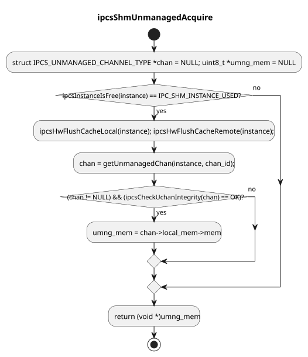

### 3.3.7 ipcsShmUnmanagedTx

<table border="1" cellspacing="0" cellpadding="4">
<tbody>
<tr><td>对应软件架构ID</td><td colspan="4">Drv_Ipcs_Core_Cmp</td></tr>
<tr><td>函数说明</td><td colspan="4">该函数在 unmanaged channel 上递增本端发送计数，并通过 IPCS-HAL 通知远端。</td></tr>
<tr><td>函数原型</td><td colspan="4">sint32 ipcsShmUnmanagedTx(const uint8 instance, sint32 chan_id)</td></tr>
<tr><td>制约条件</td><td colspan="4">instance 已初始化；chan_id 对应 unmanaged channel；unmanaged channel integrity 校验通过。</td></tr>
<tr><td rowspan="3">输入/输出参数</td><td>I/O</td><td>参数名</td><td>数据类型</td><td>说明</td></tr>
<tr><td>I</td><td>instance</td><td>const uint8</td><td>IPCS shared memory instance 索引</td></tr>
<tr><td>I</td><td>chan_id</td><td>sint32</td><td>IPCS shared memory channel 索引</td></tr>
<tr><td rowspan="2">返回值</td><td colspan="2">数据类型</td><td colspan="2">说明</td></tr>
<tr><td colspan="2">sint32</td><td colspan="2">IPC_SHM_E_OK：发送计数更新并通知成功；负错误码：instance/channel/integrity 无效</td></tr>
<tr><td>函数定义文件</td><td colspan="4">common/ipc-shm.c</td></tr>
<tr><td>函数声明文件</td><td colspan="4">common/ipc-shm.h</td></tr>
<tr><td>满足需求</td><td colspan="4">IPCS_001, IPCS_021, IPCS_022, IPCS_028, IPCS_034, IPCS_035</td></tr>
</tbody>
</table>

**处理流程**

### 3.3.8 ipcsShmIsRemoteReady

<table border="1" cellspacing="0" cellpadding="4">
<tbody>
<tr><td>对应软件架构ID</td><td colspan="4">Drv_Ipcs_Core_Cmp</td></tr>
<tr><td>函数说明</td><td colspan="4">该函数读取远端 shared memory 起始处的 ready 状态，判断对端是否初始化完成。</td></tr>
<tr><td>函数原型</td><td colspan="4">sint32 ipcsShmIsRemoteReady(const uint8 instance)</td></tr>
<tr><td>制约条件</td><td colspan="4">instance 已初始化；远端 shared memory 起始位置包含 IPCS_SHM_GLOBAL_TYPE。</td></tr>
<tr><td rowspan="2">输入/输出参数</td><td>I/O</td><td>参数名</td><td>数据类型</td><td>说明</td></tr>
<tr><td>I</td><td>instance</td><td>const uint8</td><td>IPCS shared memory instance 索引</td></tr>
<tr><td rowspan="2">返回值</td><td colspan="2">数据类型</td><td colspan="2">说明</td></tr>
<tr><td colspan="2">sint32</td><td colspan="2">IPC_SHM_E_OK：远端 ready；-IPC_SHM_E_NOT_READY：远端未 ready；-IPC_SHM_E_INVAL：instance 无效</td></tr>
<tr><td>函数定义文件</td><td colspan="4">common/ipc-shm.c</td></tr>
<tr><td>函数声明文件</td><td colspan="4">common/ipc-shm.h</td></tr>
<tr><td>满足需求</td><td colspan="4">IPCS_001, IPCS_022, IPCS_034</td></tr>
</tbody>
</table>

**处理流程**

### 3.3.9 ipcsShmPollChannels

<table border="1" cellspacing="0" cellpadding="4">
<tbody>
<tr><td>对应软件架构ID</td><td colspan="4">Drv_Ipcs_Core_Cmp</td></tr>
<tr><td>函数说明</td><td colspan="4">该函数在 polling 场景下推进当前 instance 的接收处理。</td></tr>
<tr><td>函数原型</td><td colspan="4">sint32 ipcsShmPollChannels(const uint8 instance)</td></tr>
<tr><td>制约条件</td><td colspan="4">instance 已初始化；远端 ready；OSAL 变体支持在 IPC_IRQ_NONE 场景下调用 polling 接收。</td></tr>
<tr><td rowspan="2">输入/输出参数</td><td>I/O</td><td>参数名</td><td>数据类型</td><td>说明</td></tr>
<tr><td>I</td><td>instance</td><td>const uint8</td><td>IPCS shared memory instance 索引</td></tr>
<tr><td rowspan="2">返回值</td><td colspan="2">数据类型</td><td colspan="2">说明</td></tr>
<tr><td colspan="2">sint32</td><td colspan="2">非负值：处理的消息数量；负错误码：instance 无效、远端未 ready 或 OSAL polling 不支持/无效</td></tr>
<tr><td>函数定义文件</td><td colspan="4">common/ipc-shm.c</td></tr>
<tr><td>函数声明文件</td><td colspan="4">common/ipc-shm.h</td></tr>
<tr><td>满足需求</td><td colspan="4">IPCS_019, IPCS_022, IPCS_023, IPCS_034, IPCS_039</td></tr>
</tbody>
</table>

**处理流程**

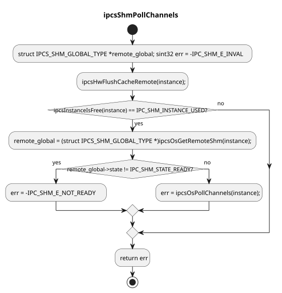

## 3.4 Internal Functions 内部函数

本节严格按照 `reference.md` 的内部函数表格格式描述内部函数。除 3.3 中列出的 9 个对外接口之外，其余源码函数、跨组件调用接口和 OS task 单元均作为内部接口。

### 3.4.1 ipcsQueuePop

<table border="1" cellspacing="0" cellpadding="4">
<tbody>
<tr><td>对应软件架构ID</td><td colspan="4">Drv_Ipcs_Queue_Cmp</td></tr>
<tr><td>函数说明</td><td colspan="4">removes element from queue</td></tr>
<tr><td>函数原型</td><td colspan="4">sint32 ipcsQueuePop(struct IPCS_QUEUE_TYPE *queue, void *buf)</td></tr>
<tr><td>制约条件</td><td colspan="4">-</td></tr>
<tr><td rowspan="3">输入/输出参数</td><td>I/O</td><td>参数名</td><td>数据类型</td><td>说明</td></tr>
<tr><td>I</td><td>queue</td><td>struct IPCS_QUEUE_TYPE *</td><td>[IN] queue pointer</td></tr>
<tr><td>I</td><td>buf</td><td>void *</td><td>[OUT] pointer where to copy the removed element</td></tr>
<tr><td rowspan="2">返回值</td><td colspan="2">数据类型</td><td colspan="2">说明</td></tr>
<tr><td colspan="2">sint32</td><td colspan="2">IPC_SHM_E_OK on success, error code otherwise</td></tr>
<tr><td>函数定义文件</td><td colspan="4">common/ipc-queue.c</td></tr>
<tr><td>函数声明文件</td><td colspan="4">common/ipc-queue.h</td></tr>
</tbody>
</table>

**处理流程**

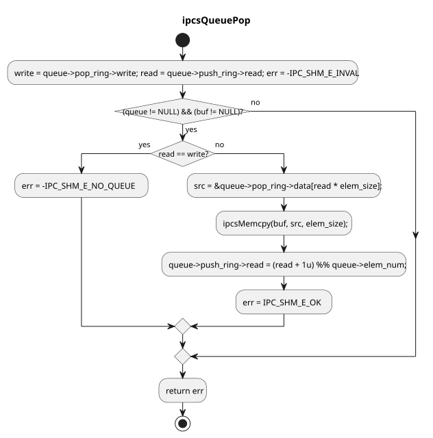

### 3.4.2 ipcsQueuePush

<table border="1" cellspacing="0" cellpadding="4">
<tbody>
<tr><td>对应软件架构ID</td><td colspan="4">Drv_Ipcs_Queue_Cmp</td></tr>
<tr><td>函数说明</td><td colspan="4">pushes element into the queue</td></tr>
<tr><td>函数原型</td><td colspan="4">sint32 ipcsQueuePush(struct IPCS_QUEUE_TYPE *queue, const void *buf)</td></tr>
<tr><td>制约条件</td><td colspan="4">-</td></tr>
<tr><td rowspan="3">输入/输出参数</td><td>I/O</td><td>参数名</td><td>数据类型</td><td>说明</td></tr>
<tr><td>I</td><td>queue</td><td>struct IPCS_QUEUE_TYPE *</td><td>[IN] queue pointer</td></tr>
<tr><td>I</td><td>buf</td><td>const void *</td><td>[IN] pointer to element to be pushed into the queue</td></tr>
<tr><td rowspan="2">返回值</td><td colspan="2">数据类型</td><td colspan="2">说明</td></tr>
<tr><td colspan="2">sint32</td><td colspan="2">IPC_SHM_E_OK on success, error code otherwise</td></tr>
<tr><td>函数定义文件</td><td colspan="4">common/ipc-queue.c</td></tr>
<tr><td>函数声明文件</td><td colspan="4">common/ipc-queue.h</td></tr>
</tbody>
</table>

**处理流程**

### 3.4.3 ipcsQueueInit

<table border="1" cellspacing="0" cellpadding="4">
<tbody>
<tr><td>对应软件架构ID</td><td colspan="4">Drv_Ipcs_Queue_Cmp</td></tr>
<tr><td>函数说明</td><td colspan="4">initializes queue and maps push/pop rings in memory</td></tr>
<tr><td>函数原型</td><td colspan="4">sint32 ipcsQueueInit(struct IPCS_QUEUE_TYPE *queue, uint16 elem_num, uint8 elem_size, uintptr_t push_ring_addr, uintptr_t pop_ring_addr)</td></tr>
<tr><td>制约条件</td><td colspan="4">-</td></tr>
<tr><td rowspan="6">输入/输出参数</td><td>I/O</td><td>参数名</td><td>数据类型</td><td>说明</td></tr>
<tr><td>I</td><td>queue</td><td>struct IPCS_QUEUE_TYPE *</td><td>[IN] queue pointer</td></tr>
<tr><td>I</td><td>elem_num</td><td>uint16</td><td>[IN] number of elements in queue</td></tr>
<tr><td>I</td><td>elem_size</td><td>uint8</td><td>[IN] element size in bytes (8-byte multiple)</td></tr>
<tr><td>I</td><td>push_ring_addr</td><td>uintptr_t</td><td>[IN] local addr where to map the push buffer ring</td></tr>
<tr><td>I</td><td>pop_ring_addr</td><td>uintptr_t</td><td>[IN] remote addr where to map the pop buffer ring</td></tr>
<tr><td rowspan="2">返回值</td><td colspan="2">数据类型</td><td colspan="2">说明</td></tr>
<tr><td colspan="2">sint32</td><td colspan="2">IPC_SHM_E_OK on success, error code otherwise</td></tr>
<tr><td>函数定义文件</td><td colspan="4">common/ipc-queue.c</td></tr>
<tr><td>函数声明文件</td><td colspan="4">common/ipc-queue.h</td></tr>
</tbody>
</table>

**处理流程**

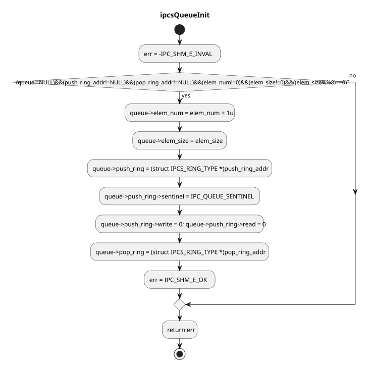

### 3.4.4 ipcsQueueCheckIntegrity

<table border="1" cellspacing="0" cellpadding="4">
<tbody>
<tr><td>对应软件架构ID</td><td colspan="4">Drv_Ipcs_Queue_Cmp</td></tr>
<tr><td>函数说明</td><td colspan="4">check if the sentinel was not overwritten</td></tr>
<tr><td>函数原型</td><td colspan="4">sint32 ipcsQueueCheckIntegrity(struct IPCS_QUEUE_TYPE *queue)</td></tr>
<tr><td>制约条件</td><td colspan="4">-</td></tr>
<tr><td rowspan="2">输入/输出参数</td><td>I/O</td><td>参数名</td><td>数据类型</td><td>说明</td></tr>
<tr><td>I</td><td>queue</td><td>struct IPCS_QUEUE_TYPE *</td><td>[IN] queue pointer</td></tr>
<tr><td rowspan="2">返回值</td><td colspan="2">数据类型</td><td colspan="2">说明</td></tr>
<tr><td colspan="2">sint32</td><td colspan="2">IPC_SHM_E_OK on success, error code otherwise</td></tr>
<tr><td>函数定义文件</td><td colspan="4">common/ipc-queue.c</td></tr>
<tr><td>函数声明文件</td><td colspan="4">common/ipc-queue.h</td></tr>
</tbody>
</table>

**处理流程**

### 3.4.5 ipcsQueueMemSize

<table border="1" cellspacing="0" cellpadding="4">
<tbody>
<tr><td>对应软件架构ID</td><td colspan="4">Drv_Ipcs_Queue_Cmp</td></tr>
<tr><td>函数说明</td><td colspan="4">return queue footprint in local mapped memory</td></tr>
<tr><td>函数原型</td><td colspan="4">static inline uint32 ipcsQueueMemSize(struct IPCS_QUEUE_TYPE *queue)</td></tr>
<tr><td>制约条件</td><td colspan="4">-</td></tr>
<tr><td rowspan="2">输入/输出参数</td><td>I/O</td><td>参数名</td><td>数据类型</td><td>说明</td></tr>
<tr><td>I</td><td>queue</td><td>struct IPCS_QUEUE_TYPE *</td><td>[IN] queue pointer</td></tr>
<tr><td rowspan="2">返回值</td><td colspan="2">数据类型</td><td colspan="2">说明</td></tr>
<tr><td colspan="2">uint32</td><td colspan="2">size of local mapped memory occupied by queue</td></tr>
<tr><td>函数定义文件</td><td colspan="4">common/ipc-queue.h</td></tr>
<tr><td>函数声明文件</td><td colspan="4">-</td></tr>
</tbody>
</table>

**处理流程**

### 3.4.6 getChannel

<table border="1" cellspacing="0" cellpadding="4">
<tbody>
<tr><td>对应软件架构ID</td><td colspan="4">Drv_Ipcs_Core_Cmp</td></tr>
<tr><td>函数说明</td><td colspan="4">该函数校验 channel id 并返回 IPCS shared memory channel 私有数据指针。</td></tr>
<tr><td>函数原型</td><td colspan="4">static inline struct IPCS_SHM_CHANNEL_TYPE * getChannel(const uint8 instance, sint32 chan_id)</td></tr>
<tr><td>制约条件</td><td colspan="4">-</td></tr>
<tr><td rowspan="3">输入/输出参数</td><td>I/O</td><td>参数名</td><td>数据类型</td><td>说明</td></tr>
<tr><td>I</td><td>instance</td><td>const uint8</td><td>IPCS shared memory instance 索引</td></tr>
<tr><td>I</td><td>chan_id</td><td>sint32</td><td>IPCS shared memory channel 索引</td></tr>
<tr><td rowspan="2">返回值</td><td colspan="2">数据类型</td><td colspan="2">说明</td></tr>
<tr><td colspan="2">struct IPCS_SHM_CHANNEL_TYPE *</td><td colspan="2">源码返回值</td></tr>
<tr><td>函数定义文件</td><td colspan="4">common/ipc-shm.c</td></tr>
<tr><td>函数声明文件</td><td colspan="4">-</td></tr>
</tbody>
</table>

**处理流程**

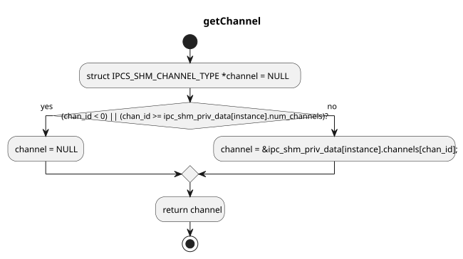

### 3.4.7 getManagedChan

<table border="1" cellspacing="0" cellpadding="4">
<tbody>
<tr><td>对应软件架构ID</td><td colspan="4">Drv_Ipcs_Core_Cmp</td></tr>
<tr><td>函数说明</td><td colspan="4">该函数校验 channel 是否为 managed 类型，并返回 managed channel 私有数据指针。</td></tr>
<tr><td>函数原型</td><td colspan="4">static inline struct IPCS_MANAGED_CHANNEL_TYPE * getManagedChan(const uint8 instance, sint32 chan_id)</td></tr>
<tr><td>制约条件</td><td colspan="4">-</td></tr>
<tr><td rowspan="3">输入/输出参数</td><td>I/O</td><td>参数名</td><td>数据类型</td><td>说明</td></tr>
<tr><td>I</td><td>instance</td><td>const uint8</td><td>IPCS shared memory instance 索引</td></tr>
<tr><td>I</td><td>chan_id</td><td>sint32</td><td>IPCS shared memory channel 索引</td></tr>
<tr><td rowspan="2">返回值</td><td colspan="2">数据类型</td><td colspan="2">说明</td></tr>
<tr><td colspan="2">struct IPCS_MANAGED_CHANNEL_TYPE *</td><td colspan="2">源码返回值</td></tr>
<tr><td>函数定义文件</td><td colspan="4">common/ipc-shm.c</td></tr>
<tr><td>函数声明文件</td><td colspan="4">-</td></tr>
</tbody>
</table>

**处理流程**

### 3.4.8 getUnmanagedChan

<table border="1" cellspacing="0" cellpadding="4">
<tbody>
<tr><td>对应软件架构ID</td><td colspan="4">Drv_Ipcs_Core_Cmp</td></tr>
<tr><td>函数说明</td><td colspan="4">该函数校验 channel 是否为 unmanaged 类型，并返回 unmanaged channel 私有数据指针。</td></tr>
<tr><td>函数原型</td><td colspan="4">static inline struct IPCS_UNMANAGED_CHANNEL_TYPE * getUnmanagedChan(const uint8 instance, sint32 chan_id)</td></tr>
<tr><td>制约条件</td><td colspan="4">-</td></tr>
<tr><td rowspan="3">输入/输出参数</td><td>I/O</td><td>参数名</td><td>数据类型</td><td>说明</td></tr>
<tr><td>I</td><td>instance</td><td>const uint8</td><td>IPCS shared memory instance 索引</td></tr>
<tr><td>I</td><td>chan_id</td><td>sint32</td><td>IPCS shared memory channel 索引</td></tr>
<tr><td rowspan="2">返回值</td><td colspan="2">数据类型</td><td colspan="2">说明</td></tr>
<tr><td colspan="2">struct IPCS_UNMANAGED_CHANNEL_TYPE *</td><td colspan="2">源码返回值</td></tr>
<tr><td>函数定义文件</td><td colspan="4">common/ipc-shm.c</td></tr>
<tr><td>函数声明文件</td><td colspan="4">-</td></tr>
</tbody>
</table>

**处理流程**

### 3.4.9 ipcsCheckUchanIntegrity

<table border="1" cellspacing="0" cellpadding="4">
<tbody>
<tr><td>对应软件架构ID</td><td colspan="4">Drv_Ipcs_Core_Cmp</td></tr>
<tr><td>函数说明</td><td colspan="4">该函数检查 unmanaged channel 本端和远端 sentinel 是否保持完整。</td></tr>
<tr><td>函数原型</td><td colspan="4">static sint32 ipcsCheckUchanIntegrity(const struct IPCS_UNMANAGED_CHANNEL_TYPE *uchan)</td></tr>
<tr><td>制约条件</td><td colspan="4">-</td></tr>
<tr><td rowspan="2">输入/输出参数</td><td>I/O</td><td>参数名</td><td>数据类型</td><td>说明</td></tr>
<tr><td>I</td><td>uchan</td><td>const struct IPCS_UNMANAGED_CHANNEL_TYPE *</td><td>源码参数</td></tr>
<tr><td rowspan="2">返回值</td><td colspan="2">数据类型</td><td colspan="2">说明</td></tr>
<tr><td colspan="2">sint32</td><td colspan="2">源码返回值</td></tr>
<tr><td>函数定义文件</td><td colspan="4">common/ipc-shm.c</td></tr>
<tr><td>函数声明文件</td><td colspan="4">-</td></tr>
</tbody>
</table>

**处理流程**

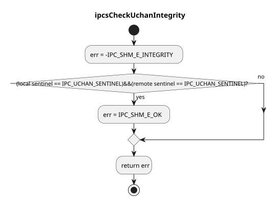

### 3.4.10 ipcsCheckMchanIntegrity

<table border="1" cellspacing="0" cellpadding="4">
<tbody>
<tr><td>对应软件架构ID</td><td colspan="4">Drv_Ipcs_Core_Cmp</td></tr>
<tr><td>函数说明</td><td colspan="4">该函数检查 managed channel 的 channel queue 及所有 pool queue sentinel 是否保持完整。</td></tr>
<tr><td>函数原型</td><td colspan="4">static sint32 ipcsCheckMchanIntegrity(struct IPCS_MANAGED_CHANNEL_TYPE *mchan)</td></tr>
<tr><td>制约条件</td><td colspan="4">-</td></tr>
<tr><td rowspan="2">输入/输出参数</td><td>I/O</td><td>参数名</td><td>数据类型</td><td>说明</td></tr>
<tr><td>I</td><td>mchan</td><td>struct IPCS_MANAGED_CHANNEL_TYPE *</td><td>源码参数</td></tr>
<tr><td rowspan="2">返回值</td><td colspan="2">数据类型</td><td colspan="2">说明</td></tr>
<tr><td colspan="2">sint32</td><td colspan="2">源码返回值</td></tr>
<tr><td>函数定义文件</td><td colspan="4">common/ipc-shm.c</td></tr>
<tr><td>函数声明文件</td><td colspan="4">-</td></tr>
</tbody>
</table>

**处理流程**

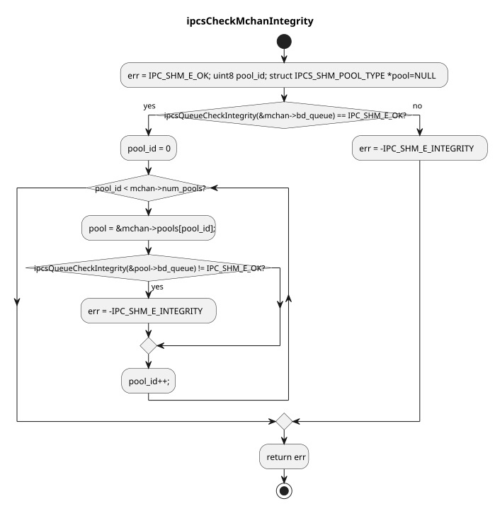

### 3.4.11 ipcsChannelRx

<table border="1" cellspacing="0" cellpadding="4">
<tbody>
<tr><td>对应软件架构ID</td><td colspan="4">Drv_Ipcs_Core_Cmp</td></tr>
<tr><td>函数说明</td><td colspan="4">handle Rx for a single channel</td></tr>
<tr><td>函数原型</td><td colspan="4">static sint32 ipcsChannelRx(const uint8 instance, sint32 chan_id, sint32 budget)</td></tr>
<tr><td>制约条件</td><td colspan="4">-</td></tr>
<tr><td rowspan="4">输入/输出参数</td><td>I/O</td><td>参数名</td><td>数据类型</td><td>说明</td></tr>
<tr><td>I</td><td>instance</td><td>const uint8</td><td>instance id</td></tr>
<tr><td>I</td><td>chan_id</td><td>sint32</td><td>channel id</td></tr>
<tr><td>I</td><td>budget</td><td>sint32</td><td>available work budget (number of messages to be processed)</td></tr>
<tr><td rowspan="2">返回值</td><td colspan="2">数据类型</td><td colspan="2">说明</td></tr>
<tr><td colspan="2">sint32</td><td colspan="2">work done</td></tr>
<tr><td>函数定义文件</td><td colspan="4">common/ipc-shm.c</td></tr>
<tr><td>函数声明文件</td><td colspan="4">-</td></tr>
</tbody>
</table>

**处理流程**

### 3.4.12 ipcsInstanceIsFree

<table border="1" cellspacing="0" cellpadding="4">
<tbody>
<tr><td>对应软件架构ID</td><td colspan="4">Drv_Ipcs_Core_Cmp</td></tr>
<tr><td>函数说明</td><td colspan="4">determine if the instance is used or not</td></tr>
<tr><td>函数原型</td><td colspan="4">static uint8 ipcsInstanceIsFree(const uint8 instance)</td></tr>
<tr><td>制约条件</td><td colspan="4">-</td></tr>
<tr><td rowspan="2">输入/输出参数</td><td>I/O</td><td>参数名</td><td>数据类型</td><td>说明</td></tr>
<tr><td>I</td><td>instance</td><td>const uint8</td><td>instance id</td></tr>
<tr><td rowspan="2">返回值</td><td colspan="2">数据类型</td><td colspan="2">说明</td></tr>
<tr><td colspan="2">uint8</td><td colspan="2">IPC_SHM_INSTANCE_FREE if instance is free,</td></tr>
<tr><td>函数定义文件</td><td colspan="4">common/ipc-shm.c</td></tr>
<tr><td>函数声明文件</td><td colspan="4">-</td></tr>
</tbody>
</table>

**处理流程**

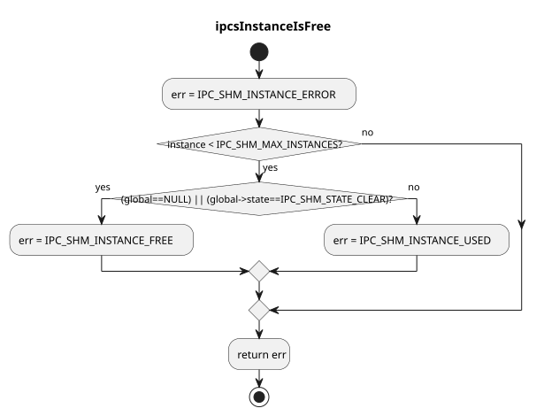

### 3.4.13 ipcsShmRx

<table border="1" cellspacing="0" cellpadding="4">
<tbody>
<tr><td>对应软件架构ID</td><td colspan="4">Drv_Ipcs_Core_Cmp</td></tr>
<tr><td>函数说明</td><td colspan="4">shm Rx handler, called from softirq</td></tr>
<tr><td>函数原型</td><td colspan="4">static sint32 ipcsShmRx(const uint8 instance, sint32 budget)</td></tr>
<tr><td>制约条件</td><td colspan="4">-</td></tr>
<tr><td rowspan="3">输入/输出参数</td><td>I/O</td><td>参数名</td><td>数据类型</td><td>说明</td></tr>
<tr><td>I</td><td>instance</td><td>const uint8</td><td>instance id</td></tr>
<tr><td>I</td><td>budget</td><td>sint32</td><td>available work budget (number of messages to be processed)</td></tr>
<tr><td rowspan="2">返回值</td><td colspan="2">数据类型</td><td colspan="2">说明</td></tr>
<tr><td colspan="2">sint32</td><td colspan="2">work done</td></tr>
<tr><td>函数定义文件</td><td colspan="4">common/ipc-shm.c</td></tr>
<tr><td>函数声明文件</td><td colspan="4">-</td></tr>
</tbody>
</table>

**处理流程**

### 3.4.14 ipcsBufPoolInit

<table border="1" cellspacing="0" cellpadding="4">
<tbody>
<tr><td>对应软件架构ID</td><td colspan="4">Drv_Ipcs_Core_Cmp</td></tr>
<tr><td>函数说明</td><td colspan="4">init buffer pool</td></tr>
<tr><td>函数原型</td><td colspan="4">static sint32 ipcsBufPoolInit(const uint8 instance, sint32 chan_id, sint32 pool_id, struct IPCS_SHM_POOL_ADDR_TYPE mng_pool, const struct IPCS_SHM_POOL_CFG_TYPE *cfg)</td></tr>
<tr><td>制约条件</td><td colspan="4">-</td></tr>
<tr><td rowspan="6">输入/输出参数</td><td>I/O</td><td>参数名</td><td>数据类型</td><td>说明</td></tr>
<tr><td>I</td><td>instance</td><td>const uint8</td><td>instance id</td></tr>
<tr><td>I</td><td>chan_id</td><td>sint32</td><td>channel index</td></tr>
<tr><td>I</td><td>pool_id</td><td>sint32</td><td>pool index in channel</td></tr>
<tr><td>I</td><td>mng_pool</td><td>struct IPCS_SHM_POOL_ADDR_TYPE</td><td>源码参数</td></tr>
<tr><td>I</td><td>cfg</td><td>const struct IPCS_SHM_POOL_CFG_TYPE *</td><td>channel configuration parameters</td></tr>
<tr><td rowspan="2">返回值</td><td colspan="2">数据类型</td><td colspan="2">说明</td></tr>
<tr><td colspan="2">sint32</td><td colspan="2">IPC_SHM_E_OK for success, error code otherwise</td></tr>
<tr><td>函数定义文件</td><td colspan="4">common/ipc-shm.c</td></tr>
<tr><td>函数声明文件</td><td colspan="4">-</td></tr>
</tbody>
</table>

**处理流程**

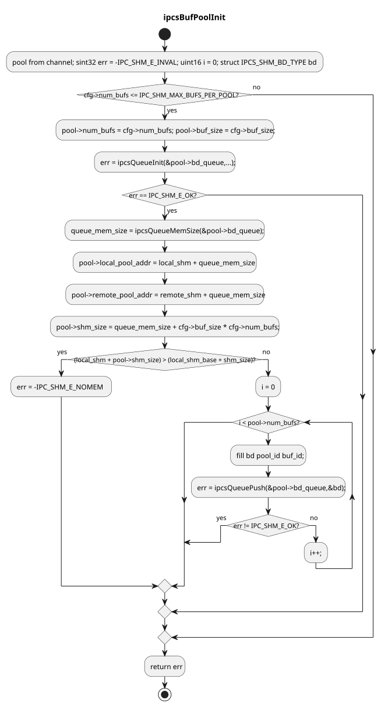

### 3.4.15 ipcsGetTotalBufPerChan

<table border="1" cellspacing="0" cellpadding="4">
<tbody>
<tr><td>对应软件架构ID</td><td colspan="4">Drv_Ipcs_Core_Cmp</td></tr>
<tr><td>函数说明</td><td colspan="4">get total buffers of an managed channel</td></tr>
<tr><td>函数原型</td><td colspan="4">static uint32 ipcsGetTotalBufPerChan(const uint8 instance, sint32 chan_id, const struct IPCS_SHM_MANAGED_CFG_TYPE *cfg)</td></tr>
<tr><td>制约条件</td><td colspan="4">-</td></tr>
<tr><td rowspan="4">输入/输出参数</td><td>I/O</td><td>参数名</td><td>数据类型</td><td>说明</td></tr>
<tr><td>I</td><td>instance</td><td>const uint8</td><td>instance id</td></tr>
<tr><td>I</td><td>chan_id</td><td>sint32</td><td>channel id</td></tr>
<tr><td>I</td><td>cfg</td><td>const struct IPCS_SHM_MANAGED_CFG_TYPE *</td><td>managed channel configuration</td></tr>
<tr><td rowspan="2">返回值</td><td colspan="2">数据类型</td><td colspan="2">说明</td></tr>
<tr><td colspan="2">uint32</td><td colspan="2">total buffers, 0 if error</td></tr>
<tr><td>函数定义文件</td><td colspan="4">common/ipc-shm.c</td></tr>
<tr><td>函数声明文件</td><td colspan="4">-</td></tr>
</tbody>
</table>

**处理流程**

### 3.4.16 managedChannelInit

<table border="1" cellspacing="0" cellpadding="4">
<tbody>
<tr><td>对应软件架构ID</td><td colspan="4">Drv_Ipcs_Core_Cmp</td></tr>
<tr><td>函数说明</td><td colspan="4">initialize managed channel</td></tr>
<tr><td>函数原型</td><td colspan="4">static sint32 managedChannelInit(const uint8 instance, sint32 chan_id, uintptr_t local_shm, uintptr_t remote_shm, const struct IPCS_SHM_MANAGED_CFG_TYPE *cfg)</td></tr>
<tr><td>制约条件</td><td colspan="4">-</td></tr>
<tr><td rowspan="6">输入/输出参数</td><td>I/O</td><td>参数名</td><td>数据类型</td><td>说明</td></tr>
<tr><td>I</td><td>instance</td><td>const uint8</td><td>instance id</td></tr>
<tr><td>I</td><td>chan_id</td><td>sint32</td><td>channel id</td></tr>
<tr><td>I</td><td>local_shm</td><td>uintptr_t</td><td>local shared memory</td></tr>
<tr><td>I</td><td>remote_shm</td><td>uintptr_t</td><td>remote shared memort</td></tr>
<tr><td>I</td><td>cfg</td><td>const struct IPCS_SHM_MANAGED_CFG_TYPE *</td><td>managed channel configuration</td></tr>
<tr><td rowspan="2">返回值</td><td colspan="2">数据类型</td><td colspan="2">说明</td></tr>
<tr><td colspan="2">sint32</td><td colspan="2">IPC_SHM_E_OK for success, error code otherwise</td></tr>
<tr><td>函数定义文件</td><td colspan="4">common/ipc-shm.c</td></tr>
<tr><td>函数声明文件</td><td colspan="4">-</td></tr>
</tbody>
</table>

**处理流程**

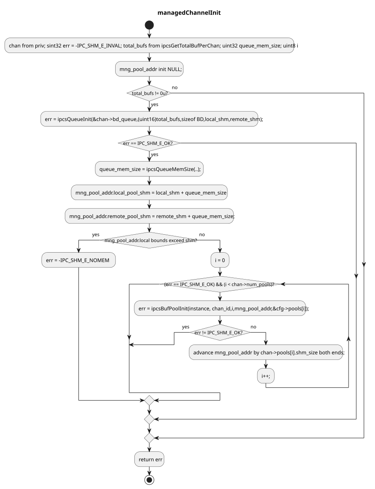

### 3.4.17 unmanagedChannelInit

<table border="1" cellspacing="0" cellpadding="4">
<tbody>
<tr><td>对应软件架构ID</td><td colspan="4">Drv_Ipcs_Core_Cmp</td></tr>
<tr><td>函数说明</td><td colspan="4">initialize unmanaged channel</td></tr>
<tr><td>函数原型</td><td colspan="4">static sint32 unmanagedChannelInit(const uint8 instance, sint32 chan_id, uintptr_t local_shm, uintptr_t remote_shm, const struct IPCS_SHM_UNMANAGED_CFG_TYPE *cfg)</td></tr>
<tr><td>制约条件</td><td colspan="4">-</td></tr>
<tr><td rowspan="6">输入/输出参数</td><td>I/O</td><td>参数名</td><td>数据类型</td><td>说明</td></tr>
<tr><td>I</td><td>instance</td><td>const uint8</td><td>instance id</td></tr>
<tr><td>I</td><td>chan_id</td><td>sint32</td><td>channel id</td></tr>
<tr><td>I</td><td>local_shm</td><td>uintptr_t</td><td>local shared memory</td></tr>
<tr><td>I</td><td>remote_shm</td><td>uintptr_t</td><td>remote shared memort</td></tr>
<tr><td>I</td><td>cfg</td><td>const struct IPCS_SHM_UNMANAGED_CFG_TYPE *</td><td>unmanaged channel configuration</td></tr>
<tr><td rowspan="2">返回值</td><td colspan="2">数据类型</td><td colspan="2">说明</td></tr>
<tr><td colspan="2">sint32</td><td colspan="2">IPC_SHM_E_OK for success, error code otherwise</td></tr>
<tr><td>函数定义文件</td><td colspan="4">common/ipc-shm.c</td></tr>
<tr><td>函数声明文件</td><td colspan="4">-</td></tr>
</tbody>
</table>

**处理流程**

### 3.4.18 ipcsShmInitChannel

<table border="1" cellspacing="0" cellpadding="4">
<tbody>
<tr><td>对应软件架构ID</td><td colspan="4">Drv_Ipcs_Core_Cmp</td></tr>
<tr><td>函数说明</td><td colspan="4">initialize a shared memory IPC channel</td></tr>
<tr><td>函数原型</td><td colspan="4">static sint32 ipcsShmInitChannel(const uint8 instance, sint32 chan_id, uintptr_t local_shm, uintptr_t remote_shm, const struct IPCS_SHM_CHANNEL_CFG_TYPE *cfg)</td></tr>
<tr><td>制约条件</td><td colspan="4">-</td></tr>
<tr><td rowspan="6">输入/输出参数</td><td>I/O</td><td>参数名</td><td>数据类型</td><td>说明</td></tr>
<tr><td>I</td><td>instance</td><td>const uint8</td><td>instance id</td></tr>
<tr><td>I</td><td>chan_id</td><td>sint32</td><td>channel index</td></tr>
<tr><td>I</td><td>local_shm</td><td>uintptr_t</td><td>local channel shared memory address</td></tr>
<tr><td>I</td><td>remote_shm</td><td>uintptr_t</td><td>remote channel shared memory address</td></tr>
<tr><td>I</td><td>cfg</td><td>const struct IPCS_SHM_CHANNEL_CFG_TYPE *</td><td>channel configuration parameters</td></tr>
<tr><td rowspan="2">返回值</td><td colspan="2">数据类型</td><td colspan="2">说明</td></tr>
<tr><td colspan="2">sint32</td><td colspan="2">0 for success, error code otherwise</td></tr>
<tr><td>函数定义文件</td><td colspan="4">common/ipc-shm.c</td></tr>
<tr><td>函数声明文件</td><td colspan="4">-</td></tr>
</tbody>
</table>

**处理流程**

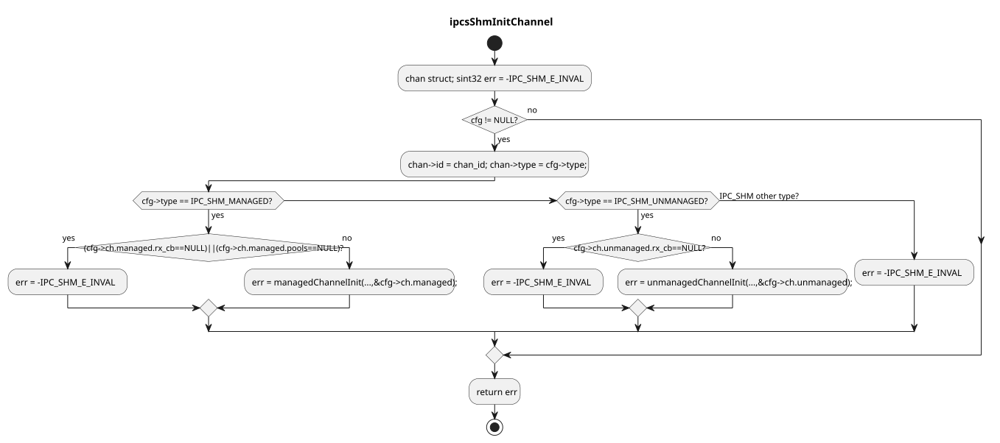

### 3.4.19 getChanMemmapSize

<table border="1" cellspacing="0" cellpadding="4">
<tbody>
<tr><td>对应软件架构ID</td><td colspan="4">Drv_Ipcs_Core_Cmp</td></tr>
<tr><td>函数说明</td><td colspan="4">Get channel local mapped memory size</td></tr>
<tr><td>函数原型</td><td colspan="4">static uint32 getChanMemmapSize(const uint8 instance, sint32 chan_id)</td></tr>
<tr><td>制约条件</td><td colspan="4">-</td></tr>
<tr><td rowspan="3">输入/输出参数</td><td>I/O</td><td>参数名</td><td>数据类型</td><td>说明</td></tr>
<tr><td>I</td><td>instance</td><td>const uint8</td><td>instance id</td></tr>
<tr><td>I</td><td>chan_id</td><td>sint32</td><td>channel id</td></tr>
<tr><td rowspan="2">返回值</td><td colspan="2">数据类型</td><td colspan="2">说明</td></tr>
<tr><td colspan="2">uint32</td><td colspan="2">Channel memory size</td></tr>
<tr><td>函数定义文件</td><td colspan="4">common/ipc-shm.c</td></tr>
<tr><td>函数声明文件</td><td colspan="4">-</td></tr>
</tbody>
</table>

**处理流程**

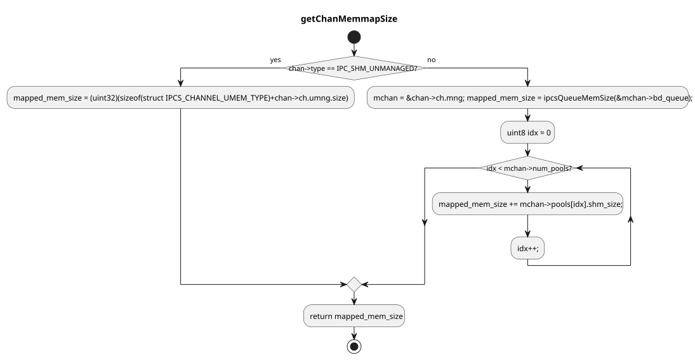

### 3.4.20 ipcsShmInitChannels

<table border="1" cellspacing="0" cellpadding="4">
<tbody>
<tr><td>对应软件架构ID</td><td colspan="4">Drv_Ipcs_Core_Cmp</td></tr>
<tr><td>函数说明</td><td colspan="4">initialize all shared memory IPC channel</td></tr>
<tr><td>函数原型</td><td colspan="4">static sint32 ipcsShmInitChannels(uint8 instance, const struct IPCS_SHM_CFG_TYPE *cfg)</td></tr>
<tr><td>制约条件</td><td colspan="4">-</td></tr>
<tr><td rowspan="3">输入/输出参数</td><td>I/O</td><td>参数名</td><td>数据类型</td><td>说明</td></tr>
<tr><td>I</td><td>instance</td><td>uint8</td><td>instance id</td></tr>
<tr><td>I</td><td>cfg</td><td>const struct IPCS_SHM_CFG_TYPE *</td><td>ipc-shm instance configuration</td></tr>
<tr><td rowspan="2">返回值</td><td colspan="2">数据类型</td><td colspan="2">说明</td></tr>
<tr><td colspan="2">sint32</td><td colspan="2">0 for success, error code otherwise</td></tr>
<tr><td>函数定义文件</td><td colspan="4">common/ipc-shm.c</td></tr>
<tr><td>函数声明文件</td><td colspan="4">-</td></tr>
</tbody>
</table>

**处理流程**

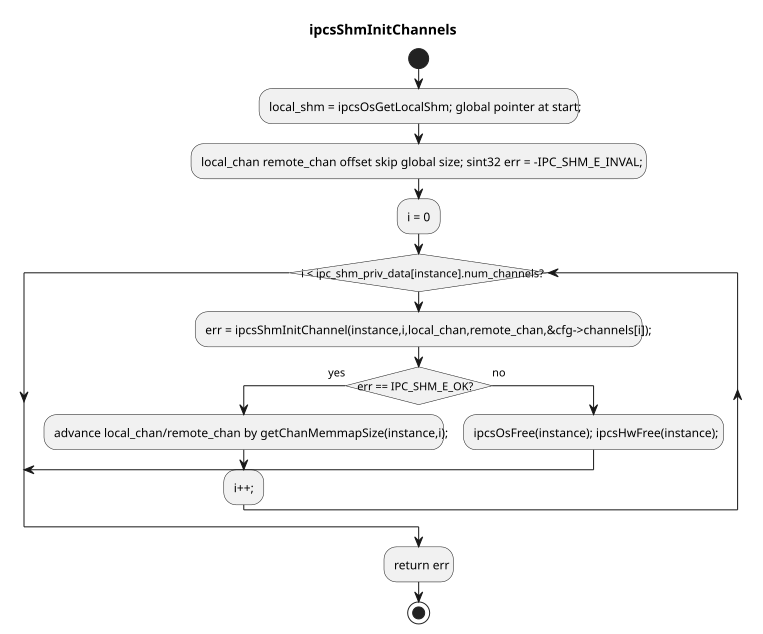

### 3.4.21 ipcsShmInitInstance

<table border="1" cellspacing="0" cellpadding="4">
<tbody>
<tr><td>对应软件架构ID</td><td colspan="4">Drv_Ipcs_Core_Cmp</td></tr>
<tr><td>函数说明</td><td colspan="4">Initialize only one instance shared memory device</td></tr>
<tr><td>函数原型</td><td colspan="4">static sint32 ipcsShmInitInstance(uint8 instance, const struct IPCS_SHM_CFG_TYPE *cfg)</td></tr>
<tr><td>制约条件</td><td colspan="4">-</td></tr>
<tr><td rowspan="3">输入/输出参数</td><td>I/O</td><td>参数名</td><td>数据类型</td><td>说明</td></tr>
<tr><td>I</td><td>instance</td><td>uint8</td><td>instance id</td></tr>
<tr><td>I</td><td>cfg</td><td>const struct IPCS_SHM_CFG_TYPE *</td><td>ipc-shm instance configuration</td></tr>
<tr><td rowspan="2">返回值</td><td colspan="2">数据类型</td><td colspan="2">说明</td></tr>
<tr><td colspan="2">sint32</td><td colspan="2">源码返回值</td></tr>
<tr><td>函数定义文件</td><td colspan="4">common/ipc-shm.c</td></tr>
<tr><td>函数声明文件</td><td colspan="4">-</td></tr>
</tbody>
</table>

**处理流程**

### 3.4.22 findPoolForBuf

<table border="1" cellspacing="0" cellpadding="4">
<tbody>
<tr><td>对应软件架构ID</td><td colspan="4">Drv_Ipcs_Core_Cmp</td></tr>
<tr><td>函数说明</td><td colspan="4">Find the pool that owns the specified buffer.</td></tr>
<tr><td>函数原型</td><td colspan="4">static sint16 findPoolForBuf(struct IPCS_MANAGED_CHANNEL_TYPE *chan, uintptr_t buf, sint32 remote)</td></tr>
<tr><td>制约条件</td><td colspan="4">-</td></tr>
<tr><td rowspan="4">输入/输出参数</td><td>I/O</td><td>参数名</td><td>数据类型</td><td>说明</td></tr>
<tr><td>I</td><td>chan</td><td>struct IPCS_MANAGED_CHANNEL_TYPE *</td><td>managed channel pointer</td></tr>
<tr><td>I</td><td>buf</td><td>uintptr_t</td><td>buffer pointer</td></tr>
<tr><td>I</td><td>remote</td><td>sint32</td><td>flag telling if buffer is from remote OS</td></tr>
<tr><td rowspan="2">返回值</td><td colspan="2">数据类型</td><td colspan="2">说明</td></tr>
<tr><td colspan="2">sint16</td><td colspan="2">pool index on success, -1 otherwise</td></tr>
<tr><td>函数定义文件</td><td colspan="4">common/ipc-shm.c</td></tr>
<tr><td>函数声明文件</td><td colspan="4">-</td></tr>
</tbody>
</table>

**处理流程**

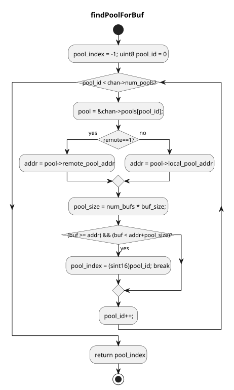

### 3.4.23 ipcsMemcpy

<table border="1" cellspacing="0" cellpadding="4">
<tbody>
<tr><td>对应软件架构ID</td><td colspan="4">Drv_Ipcs_Core_Cmp</td></tr>
<tr><td>函数说明</td><td colspan="4">-</td></tr>
<tr><td>函数原型</td><td colspan="4">void ipcsMemcpy(void *dst, const void *src, uint32 data_size)</td></tr>
<tr><td>制约条件</td><td colspan="4">-</td></tr>
<tr><td rowspan="4">输入/输出参数</td><td>I/O</td><td>参数名</td><td>数据类型</td><td>说明</td></tr>
<tr><td>I</td><td>dst</td><td>void *</td><td>目的地址指针</td></tr>
<tr><td>I</td><td>src</td><td>const void *</td><td>源地址指针</td></tr>
<tr><td>I</td><td>data_size</td><td>uint32</td><td>复制数据大小，单位为 byte</td></tr>
<tr><td rowspan="2">返回值</td><td colspan="2">数据类型</td><td colspan="2">说明</td></tr>
<tr><td colspan="4">-</td></tr>
<tr><td>函数定义文件</td><td colspan="4">common/ipc-util.c</td></tr>
<tr><td>函数声明文件</td><td colspan="4">common/ipc-util.h</td></tr>
</tbody>
</table>

**处理流程**

### 3.4.24 ipcsHwGetCoreIndexM7

<table border="1" cellspacing="0" cellpadding="4">
<tbody>
<tr><td>对应软件架构ID</td><td colspan="4">Drv_Ipcs_Hal_Cmp</td></tr>
<tr><td>函数说明</td><td colspan="4">Validate and get core index if core type is m7</td></tr>
<tr><td>函数原型</td><td colspan="4">static sint8 ipcsHwGetCoreIndexM7(uint8 index)</td></tr>
<tr><td>制约条件</td><td colspan="4">-</td></tr>
<tr><td rowspan="2">输入/输出参数</td><td>I/O</td><td>参数名</td><td>数据类型</td><td>说明</td></tr>
<tr><td>I</td><td>index</td><td>uint8</td><td>core 或 IRQ 配置索引</td></tr>
<tr><td rowspan="2">返回值</td><td colspan="2">数据类型</td><td colspan="2">说明</td></tr>
<tr><td colspan="2">sint8</td><td colspan="2">core_index if core type is m7</td></tr>
<tr><td>函数定义文件</td><td colspan="4">hw/ipc-hw.c</td></tr>
<tr><td>函数声明文件</td><td colspan="4">-</td></tr>
</tbody>
</table>

**处理流程**

### 3.4.25 ipcsHwGetCoreIndexA53

<table border="1" cellspacing="0" cellpadding="4">
<tbody>
<tr><td>对应软件架构ID</td><td colspan="4">Drv_Ipcs_Hal_Cmp</td></tr>
<tr><td>函数说明</td><td colspan="4">Validate and get core index if core type is a53</td></tr>
<tr><td>函数原型</td><td colspan="4">static sint8 ipcsHwGetCoreIndexA53(uint8 index)</td></tr>
<tr><td>制约条件</td><td colspan="4">-</td></tr>
<tr><td rowspan="2">输入/输出参数</td><td>I/O</td><td>参数名</td><td>数据类型</td><td>说明</td></tr>
<tr><td>I</td><td>index</td><td>uint8</td><td>core 或 IRQ 配置索引</td></tr>
<tr><td rowspan="2">返回值</td><td colspan="2">数据类型</td><td colspan="2">说明</td></tr>
<tr><td colspan="2">sint8</td><td colspan="2">core_index if core type is a53</td></tr>
<tr><td>函数定义文件</td><td colspan="4">hw/ipc-hw.c</td></tr>
<tr><td>函数声明文件</td><td colspan="4">-</td></tr>
</tbody>
</table>

**处理流程**

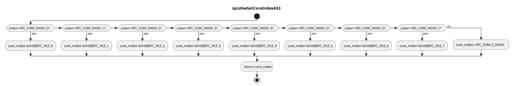

### 3.4.26 ipcsHwSetRemoteCore

<table border="1" cellspacing="0" cellpadding="4">
<tbody>
<tr><td>对应软件架构ID</td><td colspan="4">Drv_Ipcs_Hal_Cmp</td></tr>
<tr><td>函数说明</td><td colspan="4">get remote core for platform private data</td></tr>
<tr><td>函数原型</td><td colspan="4">static sint8 ipcsHwSetRemoteCore(const uint8 instance, const struct IPCS_SHM_CFG_TYPE *cfg)</td></tr>
<tr><td>制约条件</td><td colspan="4">-</td></tr>
<tr><td rowspan="3">输入/输出参数</td><td>I/O</td><td>参数名</td><td>数据类型</td><td>说明</td></tr>
<tr><td>I</td><td>instance</td><td>const uint8</td><td>configuration parameters</td></tr>
<tr><td>I</td><td>cfg</td><td>const struct IPCS_SHM_CFG_TYPE *</td><td>:     Local core type from ipcf configuration</td></tr>
<tr><td rowspan="2">返回值</td><td colspan="2">数据类型</td><td colspan="2">说明</td></tr>
<tr><td colspan="2">sint8</td><td colspan="2">IPC_SHM_E_OK for success, -IPC_SHM_E_INVAL for invalid core</td></tr>
<tr><td>函数定义文件</td><td colspan="4">hw/ipc-hw.c</td></tr>
<tr><td>函数声明文件</td><td colspan="4">-</td></tr>
</tbody>
</table>

**处理流程**

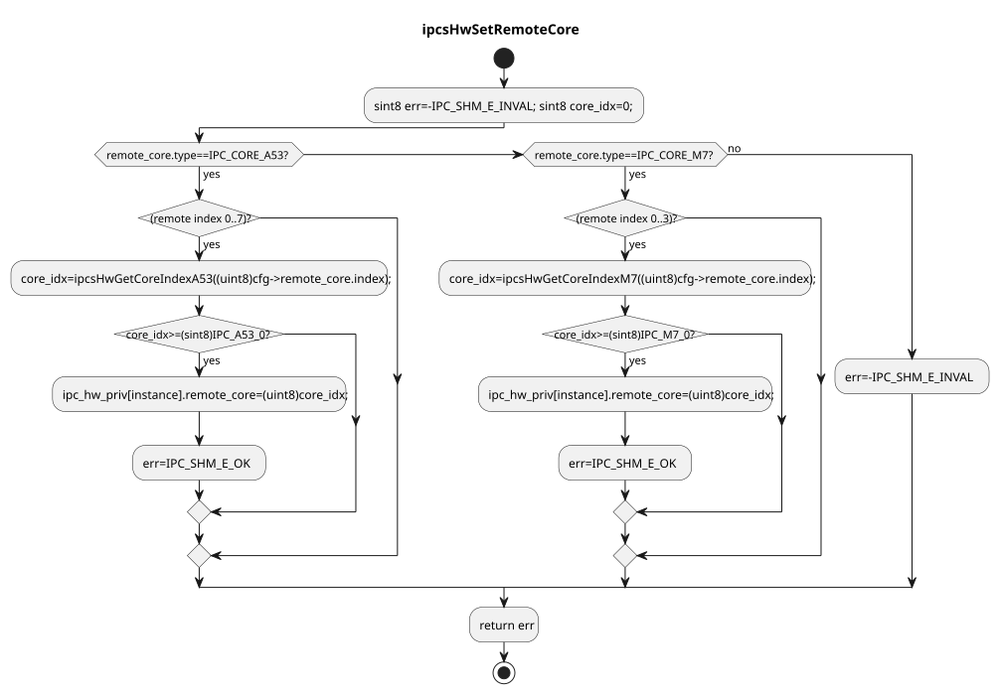

### 3.4.27 ipcsHwSetLocalCore

<table border="1" cellspacing="0" cellpadding="4">
<tbody>
<tr><td>对应软件架构ID</td><td colspan="4">Drv_Ipcs_Hal_Cmp</td></tr>
<tr><td>函数说明</td><td colspan="4">get local core for platform private data</td></tr>
<tr><td>函数原型</td><td colspan="4">static sint8 ipcsHwSetLocalCore(const uint8 instance, const struct IPCS_SHM_CFG_TYPE *cfg)</td></tr>
<tr><td>制约条件</td><td colspan="4">-</td></tr>
<tr><td rowspan="3">输入/输出参数</td><td>I/O</td><td>参数名</td><td>数据类型</td><td>说明</td></tr>
<tr><td>I</td><td>instance</td><td>const uint8</td><td>configuration parameters</td></tr>
<tr><td>I</td><td>cfg</td><td>const struct IPCS_SHM_CFG_TYPE *</td><td>:     Local core type from ipcf configuration</td></tr>
<tr><td rowspan="2">返回值</td><td colspan="2">数据类型</td><td colspan="2">说明</td></tr>
<tr><td colspan="2">sint8</td><td colspan="2">IPC_SHM_E_OK for success, -IPC_SHM_E_INVAL for invalid core</td></tr>
<tr><td>函数定义文件</td><td colspan="4">hw/ipc-hw.c</td></tr>
<tr><td>函数声明文件</td><td colspan="4">-</td></tr>
</tbody>
</table>

**处理流程**

### 3.4.28 ipcsHwSetCore

<table border="1" cellspacing="0" cellpadding="4">
<tbody>
<tr><td>对应软件架构ID</td><td colspan="4">Drv_Ipcs_Hal_Cmp</td></tr>
<tr><td>函数说明</td><td colspan="4">get local and remote core for platform private data</td></tr>
<tr><td>函数原型</td><td colspan="4">static sint8 ipcsHwSetCore(const uint8 instance, const struct IPCS_SHM_CFG_TYPE *cfg)</td></tr>
<tr><td>制约条件</td><td colspan="4">-</td></tr>
<tr><td rowspan="3">输入/输出参数</td><td>I/O</td><td>参数名</td><td>数据类型</td><td>说明</td></tr>
<tr><td>I</td><td>instance</td><td>const uint8</td><td>configuration parameters</td></tr>
<tr><td>I</td><td>cfg</td><td>const struct IPCS_SHM_CFG_TYPE *</td><td>:     Local core type from ipcf configuration</td></tr>
<tr><td rowspan="2">返回值</td><td colspan="2">数据类型</td><td colspan="2">说明</td></tr>
<tr><td colspan="2">sint8</td><td colspan="2">IPC_SHM_E_OK for success, -IPC_SHM_E_INVAL for invalid core</td></tr>
<tr><td>函数定义文件</td><td colspan="4">hw/ipc-hw.c</td></tr>
<tr><td>函数声明文件</td><td colspan="4">-</td></tr>
</tbody>
</table>

**处理流程**

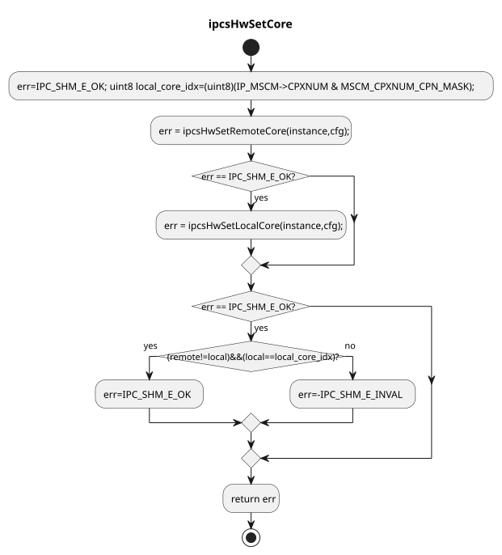

### 3.4.29 ipcsHwSetTxIrqIdx

<table border="1" cellspacing="0" cellpadding="4">
<tbody>
<tr><td>对应软件架构ID</td><td colspan="4">Drv_Ipcs_Hal_Cmp</td></tr>
<tr><td>函数说明</td><td colspan="4">get tx irq and msi index for platform private data</td></tr>
<tr><td>函数原型</td><td colspan="4">static sint8 ipcsHwSetTxIrqIdx(const uint8 instance, const struct IPCS_SHM_CFG_TYPE *cfg)</td></tr>
<tr><td>制约条件</td><td colspan="4">-</td></tr>
<tr><td rowspan="3">输入/输出参数</td><td>I/O</td><td>参数名</td><td>数据类型</td><td>说明</td></tr>
<tr><td>I</td><td>instance</td><td>const uint8</td><td>configuration parameters</td></tr>
<tr><td>I</td><td>cfg</td><td>const struct IPCS_SHM_CFG_TYPE *</td><td>:     Local core type from ipcf configuration</td></tr>
<tr><td rowspan="2">返回值</td><td colspan="2">数据类型</td><td colspan="2">说明</td></tr>
<tr><td colspan="2">sint8</td><td colspan="2">IPC_SHM_E_OK for success, -IPC_SHM_E_INVAL for invalid interrupt</td></tr>
<tr><td>函数定义文件</td><td colspan="4">hw/ipc-hw.c</td></tr>
<tr><td>函数声明文件</td><td colspan="4">-</td></tr>
</tbody>
</table>

**处理流程**

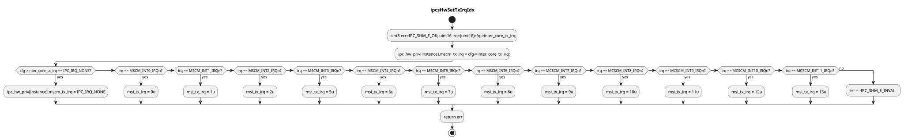

### 3.4.30 ipcsHwSetRxIrqIdx

<table border="1" cellspacing="0" cellpadding="4">
<tbody>
<tr><td>对应软件架构ID</td><td colspan="4">Drv_Ipcs_Hal_Cmp</td></tr>
<tr><td>函数说明</td><td colspan="4">get rx irq and msi index for platform private data</td></tr>
<tr><td>函数原型</td><td colspan="4">static sint8 ipcsHwSetRxIrqIdx(const uint8 instance, const struct IPCS_SHM_CFG_TYPE *cfg)</td></tr>
<tr><td>制约条件</td><td colspan="4">-</td></tr>
<tr><td rowspan="3">输入/输出参数</td><td>I/O</td><td>参数名</td><td>数据类型</td><td>说明</td></tr>
<tr><td>I</td><td>instance</td><td>const uint8</td><td>configuration parameters</td></tr>
<tr><td>I</td><td>cfg</td><td>const struct IPCS_SHM_CFG_TYPE *</td><td>:     Local core type from ipcf configuration</td></tr>
<tr><td rowspan="2">返回值</td><td colspan="2">数据类型</td><td colspan="2">说明</td></tr>
<tr><td colspan="2">sint8</td><td colspan="2">IPC_SHM_E_OK for success, -IPC_SHM_E_INVAL for invalid interrupt</td></tr>
<tr><td>函数定义文件</td><td colspan="4">hw/ipc-hw.c</td></tr>
<tr><td>函数声明文件</td><td colspan="4">-</td></tr>
</tbody>
</table>

**处理流程**

### 3.4.31 ipcsHwSetIrqIdx

<table border="1" cellspacing="0" cellpadding="4">
<tbody>
<tr><td>对应软件架构ID</td><td colspan="4">Drv_Ipcs_Hal_Cmp</td></tr>
<tr><td>函数说明</td><td colspan="4">get irq and msi index for platform private data</td></tr>
<tr><td>函数原型</td><td colspan="4">static sint8 ipcsHwSetIrqIdx(const uint8 instance, const struct IPCS_SHM_CFG_TYPE *cfg)</td></tr>
<tr><td>制约条件</td><td colspan="4">-</td></tr>
<tr><td rowspan="3">输入/输出参数</td><td>I/O</td><td>参数名</td><td>数据类型</td><td>说明</td></tr>
<tr><td>I</td><td>instance</td><td>const uint8</td><td>configuration parameters</td></tr>
<tr><td>I</td><td>cfg</td><td>const struct IPCS_SHM_CFG_TYPE *</td><td>:     Local core type from ipcf configuration</td></tr>
<tr><td rowspan="2">返回值</td><td colspan="2">数据类型</td><td colspan="2">说明</td></tr>
<tr><td colspan="2">sint8</td><td colspan="2">IPC_SHM_E_OK for success, -IPC_SHM_E_INVAL for invalid interrupt</td></tr>
<tr><td>函数定义文件</td><td colspan="4">hw/ipc-hw.c</td></tr>
<tr><td>函数声明文件</td><td colspan="4">-</td></tr>
</tbody>
</table>

**处理流程**

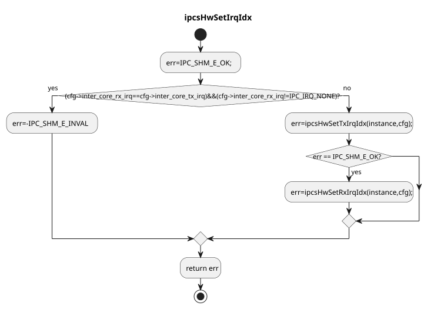

### 3.4.32 ipcsHwInit

<table border="1" cellspacing="0" cellpadding="4">
<tbody>
<tr><td>对应软件架构ID</td><td colspan="4">Drv_Ipcs_Hal_Cmp</td></tr>
<tr><td>函数说明</td><td colspan="4">platform specific initialization</td></tr>
<tr><td>函数原型</td><td colspan="4">sint8 ipcsHwInit(const uint8 instance, const struct IPCS_SHM_CFG_TYPE *cfg)</td></tr>
<tr><td>制约条件</td><td colspan="4">-</td></tr>
<tr><td rowspan="3">输入/输出参数</td><td>I/O</td><td>参数名</td><td>数据类型</td><td>说明</td></tr>
<tr><td>I</td><td>instance</td><td>const uint8</td><td>IPCS shared memory instance 索引</td></tr>
<tr><td>I</td><td>cfg</td><td>const struct IPCS_SHM_CFG_TYPE *</td><td>configuration parameters</td></tr>
<tr><td rowspan="2">返回值</td><td colspan="2">数据类型</td><td colspan="2">说明</td></tr>
<tr><td colspan="2">sint8</td><td colspan="2">IPC_SHM_E_OK for success, -IPC_SHM_E_INVAL for either inter core</td></tr>
<tr><td>函数定义文件</td><td colspan="4">hw/ipc-hw.c</td></tr>
<tr><td>函数声明文件</td><td colspan="4">hw/ipc-hw.h</td></tr>
</tbody>
</table>

**处理流程**

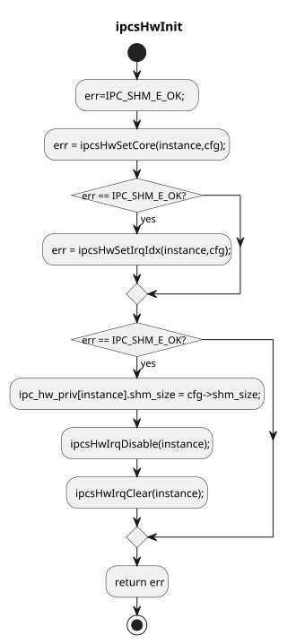

### 3.4.33 ipcsHwFree

<table border="1" cellspacing="0" cellpadding="4">
<tbody>
<tr><td>对应软件架构ID</td><td colspan="4">Drv_Ipcs_Hal_Cmp</td></tr>
<tr><td>函数说明</td><td colspan="4">free hw resources</td></tr>
<tr><td>函数原型</td><td colspan="4">void ipcsHwFree(const uint8 instance)</td></tr>
<tr><td>制约条件</td><td colspan="4">-</td></tr>
<tr><td rowspan="2">输入/输出参数</td><td>I/O</td><td>参数名</td><td>数据类型</td><td>说明</td></tr>
<tr><td>I</td><td>instance</td><td>const uint8</td><td>IPCS shared memory instance 索引</td></tr>
<tr><td rowspan="2">返回值</td><td colspan="2">数据类型</td><td colspan="2">说明</td></tr>
<tr><td colspan="4">-</td></tr>
<tr><td>函数定义文件</td><td colspan="4">hw/ipc-hw.c</td></tr>
<tr><td>函数声明文件</td><td colspan="4">hw/ipc-hw.h</td></tr>
</tbody>
</table>

**处理流程**

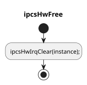

### 3.4.34 ipcsHwIrqEnable

<table border="1" cellspacing="0" cellpadding="4">
<tbody>
<tr><td>对应软件架构ID</td><td colspan="4">Drv_Ipcs_Hal_Cmp</td></tr>
<tr><td>函数说明</td><td colspan="4">enable notifications from remote</td></tr>
<tr><td>函数原型</td><td colspan="4">void ipcsHwIrqEnable(const uint8 instance)</td></tr>
<tr><td>制约条件</td><td colspan="4">-</td></tr>
<tr><td rowspan="2">输入/输出参数</td><td>I/O</td><td>参数名</td><td>数据类型</td><td>说明</td></tr>
<tr><td>I</td><td>instance</td><td>const uint8</td><td>IPCS shared memory instance 索引</td></tr>
<tr><td rowspan="2">返回值</td><td colspan="2">数据类型</td><td colspan="2">说明</td></tr>
<tr><td colspan="4">-</td></tr>
<tr><td>函数定义文件</td><td colspan="4">hw/ipc-hw.c</td></tr>
<tr><td>函数声明文件</td><td colspan="4">hw/ipc-hw.h</td></tr>
</tbody>
</table>

**处理流程**

### 3.4.35 ipcsHwIrqDisable

<table border="1" cellspacing="0" cellpadding="4">
<tbody>
<tr><td>对应软件架构ID</td><td colspan="4">Drv_Ipcs_Hal_Cmp</td></tr>
<tr><td>函数说明</td><td colspan="4">disable notifications from remote</td></tr>
<tr><td>函数原型</td><td colspan="4">void ipcsHwIrqDisable(const uint8 instance)</td></tr>
<tr><td>制约条件</td><td colspan="4">-</td></tr>
<tr><td rowspan="2">输入/输出参数</td><td>I/O</td><td>参数名</td><td>数据类型</td><td>说明</td></tr>
<tr><td>I</td><td>instance</td><td>const uint8</td><td>IPCS shared memory instance 索引</td></tr>
<tr><td rowspan="2">返回值</td><td colspan="2">数据类型</td><td colspan="2">说明</td></tr>
<tr><td colspan="4">-</td></tr>
<tr><td>函数定义文件</td><td colspan="4">hw/ipc-hw.c</td></tr>
<tr><td>函数声明文件</td><td colspan="4">hw/ipc-hw.h</td></tr>
</tbody>
</table>

**处理流程**

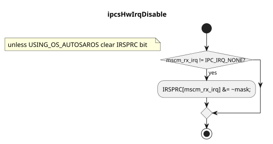

### 3.4.36 ipcsHwIrqNotify

<table border="1" cellspacing="0" cellpadding="4">
<tbody>
<tr><td>对应软件架构ID</td><td colspan="4">Drv_Ipcs_Hal_Cmp</td></tr>
<tr><td>函数说明</td><td colspan="4">notify remote that data is available</td></tr>
<tr><td>函数原型</td><td colspan="4">void ipcsHwIrqNotify(const uint8 instance)</td></tr>
<tr><td>制约条件</td><td colspan="4">-</td></tr>
<tr><td rowspan="2">输入/输出参数</td><td>I/O</td><td>参数名</td><td>数据类型</td><td>说明</td></tr>
<tr><td>I</td><td>instance</td><td>const uint8</td><td>IPCS shared memory instance 索引</td></tr>
<tr><td rowspan="2">返回值</td><td colspan="2">数据类型</td><td colspan="2">说明</td></tr>
<tr><td colspan="4">-</td></tr>
<tr><td>函数定义文件</td><td colspan="4">hw/ipc-hw.c</td></tr>
<tr><td>函数声明文件</td><td colspan="4">hw/ipc-hw.h</td></tr>
</tbody>
</table>

**处理流程**

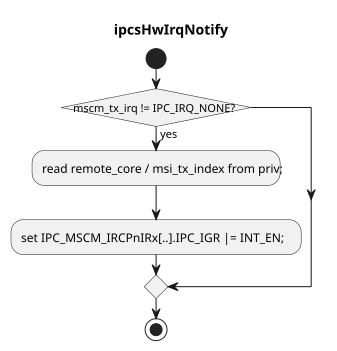

### 3.4.37 ipcsHwIrqClear

<table border="1" cellspacing="0" cellpadding="4">
<tbody>
<tr><td>对应软件架构ID</td><td colspan="4">Drv_Ipcs_Hal_Cmp</td></tr>
<tr><td>函数说明</td><td colspan="4">clear available data notification</td></tr>
<tr><td>函数原型</td><td colspan="4">void ipcsHwIrqClear(const uint8 instance)</td></tr>
<tr><td>制约条件</td><td colspan="4">-</td></tr>
<tr><td rowspan="2">输入/输出参数</td><td>I/O</td><td>参数名</td><td>数据类型</td><td>说明</td></tr>
<tr><td>I</td><td>instance</td><td>const uint8</td><td>IPCS shared memory instance 索引</td></tr>
<tr><td rowspan="2">返回值</td><td colspan="2">数据类型</td><td colspan="2">说明</td></tr>
<tr><td colspan="4">-</td></tr>
<tr><td>函数定义文件</td><td colspan="4">hw/ipc-hw.c</td></tr>
<tr><td>函数声明文件</td><td colspan="4">hw/ipc-hw.h</td></tr>
</tbody>
</table>

**处理流程**

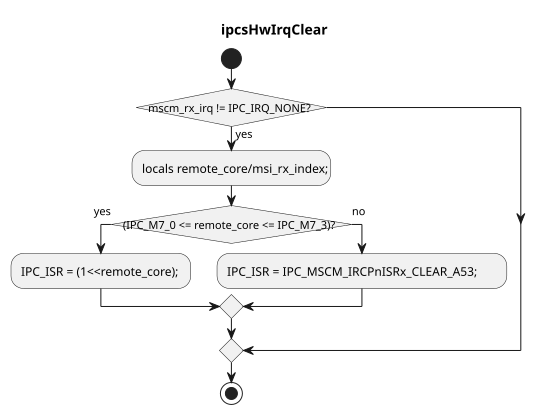

### 3.4.38 ipcsHwFlushCache

<table border="1" cellspacing="0" cellpadding="4">
<tbody>
<tr><td>对应软件架构ID</td><td colspan="4">Drv_Ipcs_Hal_Cmp</td></tr>
<tr><td>函数说明</td><td colspan="4">-</td></tr>
<tr><td>函数原型</td><td colspan="4">static void ipcsHwFlushCache(uint32 data_addr, uint32 data_size)</td></tr>
<tr><td>制约条件</td><td colspan="4">-</td></tr>
<tr><td rowspan="3">输入/输出参数</td><td>I/O</td><td>参数名</td><td>数据类型</td><td>说明</td></tr>
<tr><td>I</td><td>data_addr</td><td>uint32</td><td>源码参数</td></tr>
<tr><td>I</td><td>data_size</td><td>uint32</td><td>复制数据大小，单位为 byte</td></tr>
<tr><td rowspan="2">返回值</td><td colspan="2">数据类型</td><td colspan="2">说明</td></tr>
<tr><td colspan="2">void</td><td colspan="2">源码返回值</td></tr>
<tr><td>函数定义文件</td><td colspan="4">hw/ipc-hw.c</td></tr>
<tr><td>函数声明文件</td><td colspan="4">-</td></tr>
</tbody>
</table>

**处理流程**

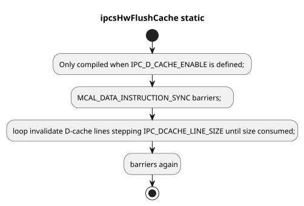

### 3.4.39 ipcsHwFlushCacheLocal

<table border="1" cellspacing="0" cellpadding="4">
<tbody>
<tr><td>对应软件架构ID</td><td colspan="4">Drv_Ipcs_Hal_Cmp</td></tr>
<tr><td>函数说明</td><td colspan="4">Clear and invalidate cache content</td></tr>
<tr><td>函数原型</td><td colspan="4">void ipcsHwFlushCacheLocal(const uint8 instance)</td></tr>
<tr><td>制约条件</td><td colspan="4">-</td></tr>
<tr><td rowspan="2">输入/输出参数</td><td>I/O</td><td>参数名</td><td>数据类型</td><td>说明</td></tr>
<tr><td>I</td><td>instance</td><td>const uint8</td><td>instance id</td></tr>
<tr><td rowspan="2">返回值</td><td colspan="2">数据类型</td><td colspan="2">说明</td></tr>
<tr><td colspan="4">-</td></tr>
<tr><td>函数定义文件</td><td colspan="4">hw/ipc-hw.c</td></tr>
<tr><td>函数声明文件</td><td colspan="4">hw/ipc-hw.h</td></tr>
</tbody>
</table>

**处理流程**

### 3.4.40 ipcsHwFlushCacheRemote

<table border="1" cellspacing="0" cellpadding="4">
<tbody>
<tr><td>对应软件架构ID</td><td colspan="4">Drv_Ipcs_Hal_Cmp</td></tr>
<tr><td>函数说明</td><td colspan="4">Clear and invalidate cache content</td></tr>
<tr><td>函数原型</td><td colspan="4">void ipcsHwFlushCacheRemote(const uint8 instance)</td></tr>
<tr><td>制约条件</td><td colspan="4">-</td></tr>
<tr><td rowspan="2">输入/输出参数</td><td>I/O</td><td>参数名</td><td>数据类型</td><td>说明</td></tr>
<tr><td>I</td><td>instance</td><td>const uint8</td><td>instance id</td></tr>
<tr><td rowspan="2">返回值</td><td colspan="2">数据类型</td><td colspan="2">说明</td></tr>
<tr><td colspan="4">-</td></tr>
<tr><td>函数定义文件</td><td colspan="4">hw/ipc-hw.c</td></tr>
<tr><td>函数声明文件</td><td colspan="4">hw/ipc-hw.h</td></tr>
</tbody>
</table>

**处理流程**

### 3.4.41 ipcsOsInit

<table border="1" cellspacing="0" cellpadding="4">
<tbody>
<tr><td>对应软件架构ID</td><td colspan="4">Drv_Ipcs_Osal_Cmp</td></tr>
<tr><td>函数说明</td><td colspan="4">OS specific initialization code</td></tr>
<tr><td>函数原型</td><td colspan="4">sint32 ipcsOsInit(const uint8 instance, const struct IPCS_SHM_CFG_TYPE *cfg, sint32 (*rx_cb)(const uint8, sint32))</td></tr>
<tr><td>制约条件</td><td colspan="4">-</td></tr>
<tr><td rowspan="4">输入/输出参数</td><td>I/O</td><td>参数名</td><td>数据类型</td><td>说明</td></tr>
<tr><td>I</td><td>instance</td><td>const uint8</td><td>IPCS shared memory instance 索引</td></tr>
<tr><td>I</td><td>cfg</td><td>const struct IPCS_SHM_CFG_TYPE *</td><td>configuration parameters</td></tr>
<tr><td>I</td><td>rx_cb</td><td>sint32 (*rx_cb)(const uint8, sint32)</td><td>rx callback to be called from rx softirq</td></tr>
<tr><td rowspan="2">返回值</td><td colspan="2">数据类型</td><td colspan="2">说明</td></tr>
<tr><td colspan="2">sint32</td><td colspan="2">IPC_SHM_E_OK on success, -IPC_SHM_E_NOTSUP if softirq task not in</td></tr>
<tr><td>函数定义文件</td><td colspan="4">os/autosar/ipc-os-autosar.c</td></tr>
<tr><td>函数声明文件</td><td colspan="4">os/ipc-os.h</td></tr>
</tbody>
</table>

**处理流程**

### 3.4.42 ipcsOsFree

<table border="1" cellspacing="0" cellpadding="4">
<tbody>
<tr><td>对应软件架构ID</td><td colspan="4">Drv_Ipcs_Osal_Cmp</td></tr>
<tr><td>函数说明</td><td colspan="4">free OS specific resources</td></tr>
<tr><td>函数原型</td><td colspan="4">void ipcsOsFree(const uint8 instance)</td></tr>
<tr><td>制约条件</td><td colspan="4">-</td></tr>
<tr><td rowspan="2">输入/输出参数</td><td>I/O</td><td>参数名</td><td>数据类型</td><td>说明</td></tr>
<tr><td>I</td><td>instance</td><td>const uint8</td><td>IPCS shared memory instance 索引</td></tr>
<tr><td rowspan="2">返回值</td><td colspan="2">数据类型</td><td colspan="2">说明</td></tr>
<tr><td colspan="4">-</td></tr>
<tr><td>函数定义文件</td><td colspan="4">os/autosar/ipc-os-autosar.c</td></tr>
<tr><td>函数声明文件</td><td colspan="4">os/ipc-os.h</td></tr>
</tbody>
</table>

**处理流程**

### 3.4.43 ipcsShmSoftirq

<table border="1" cellspacing="0" cellpadding="4">
<tbody>
<tr><td>对应软件架构ID</td><td colspan="4">Drv_Ipcs_Osal_Cmp</td></tr>
<tr><td>函数说明</td><td colspan="4">task acting as deferred interrupt handler</td></tr>
<tr><td>函数原型</td><td colspan="4">TASK(ipcsShmSoftirq)</td></tr>
<tr><td>制约条件</td><td colspan="4">-</td></tr>
<tr><td rowspan="2">输入/输出参数</td><td>I/O</td><td>参数名</td><td>数据类型</td><td>说明</td></tr>
<tr><td>-</td><td>-</td><td>-</td><td>-</td></tr>
<tr><td rowspan="2">返回值</td><td colspan="2">数据类型</td><td colspan="2">说明</td></tr>
<tr><td colspan="4">-</td></tr>
<tr><td>函数定义文件</td><td colspan="4">os/autosar/ipc-os-autosar.c</td></tr>
<tr><td>函数声明文件</td><td colspan="4">-</td></tr>
</tbody>
</table>

**处理流程**

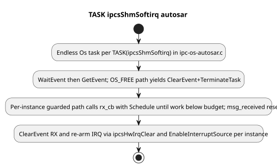

### 3.4.44 ipcsShmHardirq

<table border="1" cellspacing="0" cellpadding="4">
<tbody>
<tr><td>对应软件架构ID</td><td colspan="4">Drv_Ipcs_Osal_Cmp</td></tr>
<tr><td>函数说明</td><td colspan="4">driver interrupt service routine</td></tr>
<tr><td>函数原型</td><td colspan="4">void ipcsShmHardirq(void)</td></tr>
<tr><td>制约条件</td><td colspan="4">-</td></tr>
<tr><td rowspan="2">输入/输出参数</td><td>I/O</td><td>参数名</td><td>数据类型</td><td>说明</td></tr>
<tr><td>-</td><td>-</td><td>-</td><td>-</td></tr>
<tr><td rowspan="2">返回值</td><td colspan="2">数据类型</td><td colspan="2">说明</td></tr>
<tr><td colspan="4">-</td></tr>
<tr><td>函数定义文件</td><td colspan="4">os/autosar/ipc-os-autosar.c</td></tr>
<tr><td>函数声明文件</td><td colspan="4">os/ipc-os.h</td></tr>
</tbody>
</table>

**处理流程**

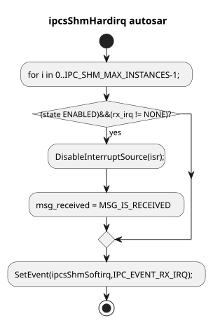

### 3.4.45 ipcsShmHardirqInstance

<table border="1" cellspacing="0" cellpadding="4">
<tbody>
<tr><td>对应软件架构ID</td><td colspan="4">Drv_Ipcs_Osal_Cmp</td></tr>
<tr><td>函数说明</td><td colspan="4">driver interrupt service routine</td></tr>
<tr><td>函数原型</td><td colspan="4">void ipcsShmHardirqInstance(const uint8 instance)</td></tr>
<tr><td>制约条件</td><td colspan="4">-</td></tr>
<tr><td rowspan="2">输入/输出参数</td><td>I/O</td><td>参数名</td><td>数据类型</td><td>说明</td></tr>
<tr><td>I</td><td>instance</td><td>const uint8</td><td>IPCS shared memory instance 索引</td></tr>
<tr><td rowspan="2">返回值</td><td colspan="2">数据类型</td><td colspan="2">说明</td></tr>
<tr><td colspan="4">-</td></tr>
<tr><td>函数定义文件</td><td colspan="4">os/autosar/ipc-os-autosar.c</td></tr>
<tr><td>函数声明文件</td><td colspan="4">os/ipc-os.h</td></tr>
</tbody>
</table>

**处理流程**

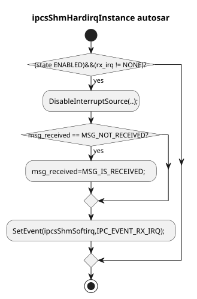

### 3.4.46 ipcsOsGetLocalShm

<table border="1" cellspacing="0" cellpadding="4">
<tbody>
<tr><td>对应软件架构ID</td><td colspan="4">Drv_Ipcs_Osal_Cmp</td></tr>
<tr><td>函数说明</td><td colspan="4">get local shared mem address</td></tr>
<tr><td>函数原型</td><td colspan="4">uintptr_t ipcsOsGetLocalShm(const uint8 instance)</td></tr>
<tr><td>制约条件</td><td colspan="4">-</td></tr>
<tr><td rowspan="2">输入/输出参数</td><td>I/O</td><td>参数名</td><td>数据类型</td><td>说明</td></tr>
<tr><td>I</td><td>instance</td><td>const uint8</td><td>IPCS shared memory instance 索引</td></tr>
<tr><td rowspan="2">返回值</td><td colspan="2">数据类型</td><td colspan="2">说明</td></tr>
<tr><td colspan="2">uintptr_t</td><td colspan="2">源码返回值</td></tr>
<tr><td>函数定义文件</td><td colspan="4">os/autosar/ipc-os-autosar.c</td></tr>
<tr><td>函数声明文件</td><td colspan="4">os/ipc-os.h</td></tr>
</tbody>
</table>

**处理流程**

### 3.4.47 ipcsOsGetRemoteShm

<table border="1" cellspacing="0" cellpadding="4">
<tbody>
<tr><td>对应软件架构ID</td><td colspan="4">Drv_Ipcs_Osal_Cmp</td></tr>
<tr><td>函数说明</td><td colspan="4">get remote shared mem address</td></tr>
<tr><td>函数原型</td><td colspan="4">uintptr_t ipcsOsGetRemoteShm(const uint8 instance)</td></tr>
<tr><td>制约条件</td><td colspan="4">-</td></tr>
<tr><td rowspan="2">输入/输出参数</td><td>I/O</td><td>参数名</td><td>数据类型</td><td>说明</td></tr>
<tr><td>I</td><td>instance</td><td>const uint8</td><td>IPCS shared memory instance 索引</td></tr>
<tr><td rowspan="2">返回值</td><td colspan="2">数据类型</td><td colspan="2">说明</td></tr>
<tr><td colspan="2">uintptr_t</td><td colspan="2">源码返回值</td></tr>
<tr><td>函数定义文件</td><td colspan="4">os/autosar/ipc-os-autosar.c</td></tr>
<tr><td>函数声明文件</td><td colspan="4">os/ipc-os.h</td></tr>
</tbody>
</table>

**处理流程**

### 3.4.48 ipcsOsPollChannels

<table border="1" cellspacing="0" cellpadding="4">
<tbody>
<tr><td>对应软件架构ID</td><td colspan="4">Drv_Ipcs_Osal_Cmp</td></tr>
<tr><td>函数说明</td><td colspan="4">invoke rx callback configured at initialization</td></tr>
<tr><td>函数原型</td><td colspan="4">sint32 ipcsOsPollChannels(const uint8 instance)</td></tr>
<tr><td>制约条件</td><td colspan="4">-</td></tr>
<tr><td rowspan="2">输入/输出参数</td><td>I/O</td><td>参数名</td><td>数据类型</td><td>说明</td></tr>
<tr><td>I</td><td>instance</td><td>const uint8</td><td>IPCS shared memory instance 索引</td></tr>
<tr><td rowspan="2">返回值</td><td colspan="2">数据类型</td><td colspan="2">说明</td></tr>
<tr><td colspan="2">sint32</td><td colspan="2">work done, error code otherwise</td></tr>
<tr><td>函数定义文件</td><td colspan="4">os/autosar/ipc-os-autosar.c</td></tr>
<tr><td>函数声明文件</td><td colspan="4">os/ipc-os.h</td></tr>
</tbody>
</table>

**处理流程**

### 3.4.49 ipcsOsInit

<table border="1" cellspacing="0" cellpadding="4">
<tbody>
<tr><td>对应软件架构ID</td><td colspan="4">Drv_Ipcs_Osal_Cmp</td></tr>
<tr><td>函数说明</td><td colspan="4">OS specific initialization code</td></tr>
<tr><td>函数原型</td><td colspan="4">sint32 ipcsOsInit(const uint8 instance, const struct IPCS_SHM_CFG_TYPE *cfg, sint32 (*rx_cb)(const uint8, sint32))</td></tr>
<tr><td>制约条件</td><td colspan="4">-</td></tr>
<tr><td rowspan="4">输入/输出参数</td><td>I/O</td><td>参数名</td><td>数据类型</td><td>说明</td></tr>
<tr><td>I</td><td>instance</td><td>const uint8</td><td>instance id</td></tr>
<tr><td>I</td><td>cfg</td><td>const struct IPCS_SHM_CFG_TYPE *</td><td>configuration parameters</td></tr>
<tr><td>I</td><td>rx_cb</td><td>sint32 (*rx_cb)(const uint8, sint32)</td><td>rx callback to be called from interrupt handler</td></tr>
<tr><td rowspan="2">返回值</td><td colspan="2">数据类型</td><td colspan="2">说明</td></tr>
<tr><td colspan="2">sint32</td><td colspan="2">IPC_SHM_E_OK on success, -IPC_SHM_E_INVAL for invalid parameter rx_cb</td></tr>
<tr><td>函数定义文件</td><td colspan="4">os/baremetal/ipc-os-baremetal.c</td></tr>
<tr><td>函数声明文件</td><td colspan="4">os/ipc-os.h</td></tr>
</tbody>
</table>

**处理流程**

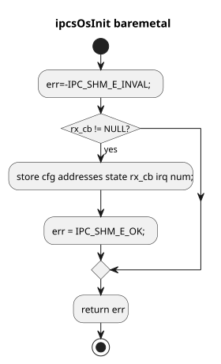

### 3.4.50 ipcsOsFree

<table border="1" cellspacing="0" cellpadding="4">
<tbody>
<tr><td>对应软件架构ID</td><td colspan="4">Drv_Ipcs_Osal_Cmp</td></tr>
<tr><td>函数说明</td><td colspan="4">free OS specific resources</td></tr>
<tr><td>函数原型</td><td colspan="4">void ipcsOsFree(const uint8 instance)</td></tr>
<tr><td>制约条件</td><td colspan="4">-</td></tr>
<tr><td rowspan="2">输入/输出参数</td><td>I/O</td><td>参数名</td><td>数据类型</td><td>说明</td></tr>
<tr><td>I</td><td>instance</td><td>const uint8</td><td>instance id</td></tr>
<tr><td rowspan="2">返回值</td><td colspan="2">数据类型</td><td colspan="2">说明</td></tr>
<tr><td colspan="4">-</td></tr>
<tr><td>函数定义文件</td><td colspan="4">os/baremetal/ipc-os-baremetal.c</td></tr>
<tr><td>函数声明文件</td><td colspan="4">os/ipc-os.h</td></tr>
</tbody>
</table>

**处理流程**

### 3.4.51 ipcsShmHardirq

<table border="1" cellspacing="0" cellpadding="4">
<tbody>
<tr><td>对应软件架构ID</td><td colspan="4">Drv_Ipcs_Osal_Cmp</td></tr>
<tr><td>函数说明</td><td colspan="4">driver interrupt service routine</td></tr>
<tr><td>函数原型</td><td colspan="4">void ipcsShmHardirq(void)</td></tr>
<tr><td>制约条件</td><td colspan="4">-</td></tr>
<tr><td rowspan="2">输入/输出参数</td><td>I/O</td><td>参数名</td><td>数据类型</td><td>说明</td></tr>
<tr><td>-</td><td>-</td><td>-</td><td>-</td></tr>
<tr><td rowspan="2">返回值</td><td colspan="2">数据类型</td><td colspan="2">说明</td></tr>
<tr><td colspan="4">-</td></tr>
<tr><td>函数定义文件</td><td colspan="4">os/baremetal/ipc-os-baremetal.c</td></tr>
<tr><td>函数声明文件</td><td colspan="4">os/ipc-os.h</td></tr>
</tbody>
</table>

**处理流程**

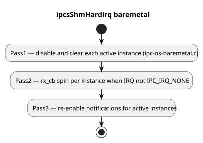

### 3.4.52 ipcsShmHardirqInstance

<table border="1" cellspacing="0" cellpadding="4">
<tbody>
<tr><td>对应软件架构ID</td><td colspan="4">Drv_Ipcs_Osal_Cmp</td></tr>
<tr><td>函数说明</td><td colspan="4">driver interrupt service routine</td></tr>
<tr><td>函数原型</td><td colspan="4">void ipcsShmHardirqInstance(const uint8 instance)</td></tr>
<tr><td>制约条件</td><td colspan="4">-</td></tr>
<tr><td rowspan="2">输入/输出参数</td><td>I/O</td><td>参数名</td><td>数据类型</td><td>说明</td></tr>
<tr><td>I</td><td>instance</td><td>const uint8</td><td>IPCS shared memory instance 索引</td></tr>
<tr><td rowspan="2">返回值</td><td colspan="2">数据类型</td><td colspan="2">说明</td></tr>
<tr><td colspan="4">-</td></tr>
<tr><td>函数定义文件</td><td colspan="4">os/baremetal/ipc-os-baremetal.c</td></tr>
<tr><td>函数声明文件</td><td colspan="4">os/ipc-os.h</td></tr>
</tbody>
</table>

**处理流程**

### 3.4.53 ipcsOsGetLocalShm

<table border="1" cellspacing="0" cellpadding="4">
<tbody>
<tr><td>对应软件架构ID</td><td colspan="4">Drv_Ipcs_Osal_Cmp</td></tr>
<tr><td>函数说明</td><td colspan="4">get local shared mem address</td></tr>
<tr><td>函数原型</td><td colspan="4">uintptr_t ipcsOsGetLocalShm(const uint8 instance)</td></tr>
<tr><td>制约条件</td><td colspan="4">-</td></tr>
<tr><td rowspan="2">输入/输出参数</td><td>I/O</td><td>参数名</td><td>数据类型</td><td>说明</td></tr>
<tr><td>I</td><td>instance</td><td>const uint8</td><td>instance id</td></tr>
<tr><td rowspan="2">返回值</td><td colspan="2">数据类型</td><td colspan="2">说明</td></tr>
<tr><td colspan="2">uintptr_t</td><td colspan="2">源码返回值</td></tr>
<tr><td>函数定义文件</td><td colspan="4">os/baremetal/ipc-os-baremetal.c</td></tr>
<tr><td>函数声明文件</td><td colspan="4">os/ipc-os.h</td></tr>
</tbody>
</table>

**处理流程**

### 3.4.54 ipcsOsGetRemoteShm

<table border="1" cellspacing="0" cellpadding="4">
<tbody>
<tr><td>对应软件架构ID</td><td colspan="4">Drv_Ipcs_Osal_Cmp</td></tr>
<tr><td>函数说明</td><td colspan="4">get remote shared mem address</td></tr>
<tr><td>函数原型</td><td colspan="4">uintptr_t ipcsOsGetRemoteShm(const uint8 instance)</td></tr>
<tr><td>制约条件</td><td colspan="4">-</td></tr>
<tr><td rowspan="2">输入/输出参数</td><td>I/O</td><td>参数名</td><td>数据类型</td><td>说明</td></tr>
<tr><td>I</td><td>instance</td><td>const uint8</td><td>instance id</td></tr>
<tr><td rowspan="2">返回值</td><td colspan="2">数据类型</td><td colspan="2">说明</td></tr>
<tr><td colspan="2">uintptr_t</td><td colspan="2">源码返回值</td></tr>
<tr><td>函数定义文件</td><td colspan="4">os/baremetal/ipc-os-baremetal.c</td></tr>
<tr><td>函数声明文件</td><td colspan="4">os/ipc-os.h</td></tr>
</tbody>
</table>

**处理流程**

### 3.4.55 ipcsOsPollChannels

<table border="1" cellspacing="0" cellpadding="4">
<tbody>
<tr><td>对应软件架构ID</td><td colspan="4">Drv_Ipcs_Osal_Cmp</td></tr>
<tr><td>函数说明</td><td colspan="4">invoke rx callback configured at initialization</td></tr>
<tr><td>函数原型</td><td colspan="4">sint32 ipcsOsPollChannels(const uint8 instance)</td></tr>
<tr><td>制约条件</td><td colspan="4">-</td></tr>
<tr><td rowspan="2">输入/输出参数</td><td>I/O</td><td>参数名</td><td>数据类型</td><td>说明</td></tr>
<tr><td>I</td><td>instance</td><td>const uint8</td><td>IPCS shared memory instance 索引</td></tr>
<tr><td rowspan="2">返回值</td><td colspan="2">数据类型</td><td colspan="2">说明</td></tr>
<tr><td colspan="2">sint32</td><td colspan="2">work done, error code otherwise</td></tr>
<tr><td>函数定义文件</td><td colspan="4">os/baremetal/ipc-os-baremetal.c</td></tr>
<tr><td>函数声明文件</td><td colspan="4">os/ipc-os.h</td></tr>
</tbody>
</table>

**处理流程**

### 3.4.56 ipcsOsInit

<table border="1" cellspacing="0" cellpadding="4">
<tbody>
<tr><td>对应软件架构ID</td><td colspan="4">Drv_Ipcs_Osal_Cmp</td></tr>
<tr><td>函数说明</td><td colspan="4">OS specific initialization code</td></tr>
<tr><td>函数原型</td><td colspan="4">sint32 ipcsOsInit(const uint8 instance, const struct IPCS_SHM_CFG_TYPE *cfg, sint32 (*rx_cb)(const uint8, sint32))</td></tr>
<tr><td>制约条件</td><td colspan="4">-</td></tr>
<tr><td rowspan="4">输入/输出参数</td><td>I/O</td><td>参数名</td><td>数据类型</td><td>说明</td></tr>
<tr><td>I</td><td>instance</td><td>const uint8</td><td>IPCS shared memory instance 索引</td></tr>
<tr><td>I</td><td>cfg</td><td>const struct IPCS_SHM_CFG_TYPE *</td><td>configuration parameters</td></tr>
<tr><td>I</td><td>rx_cb</td><td>sint32 (*rx_cb)(const uint8, sint32)</td><td>rx callback to be called from rx softirq</td></tr>
<tr><td rowspan="2">返回值</td><td colspan="2">数据类型</td><td colspan="2">说明</td></tr>
<tr><td colspan="2">sint32</td><td colspan="2">IPC_SHM_E_OK on success, -IPC_SHM_E_NOMEM if the softirq task creation</td></tr>
<tr><td>函数定义文件</td><td colspan="4">os/freertos/ipc-os-freertos.c</td></tr>
<tr><td>函数声明文件</td><td colspan="4">os/ipc-os.h</td></tr>
</tbody>
</table>

**处理流程**

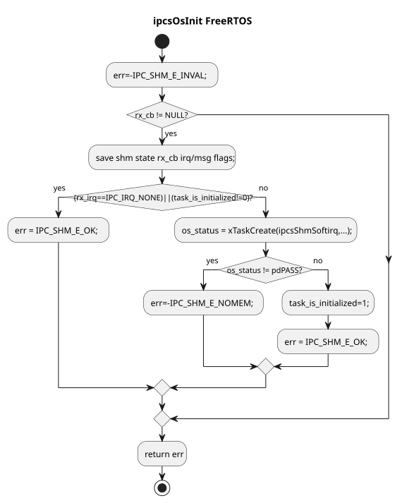

### 3.4.57 ipcsOsFree

<table border="1" cellspacing="0" cellpadding="4">
<tbody>
<tr><td>对应软件架构ID</td><td colspan="4">Drv_Ipcs_Osal_Cmp</td></tr>
<tr><td>函数说明</td><td colspan="4">free OS specific resources</td></tr>
<tr><td>函数原型</td><td colspan="4">void ipcsOsFree(const uint8 instance)</td></tr>
<tr><td>制约条件</td><td colspan="4">-</td></tr>
<tr><td rowspan="2">输入/输出参数</td><td>I/O</td><td>参数名</td><td>数据类型</td><td>说明</td></tr>
<tr><td>I</td><td>instance</td><td>const uint8</td><td>IPCS shared memory instance 索引</td></tr>
<tr><td rowspan="2">返回值</td><td colspan="2">数据类型</td><td colspan="2">说明</td></tr>
<tr><td colspan="4">-</td></tr>
<tr><td>函数定义文件</td><td colspan="4">os/freertos/ipc-os-freertos.c</td></tr>
<tr><td>函数声明文件</td><td colspan="4">os/ipc-os.h</td></tr>
</tbody>
</table>

**处理流程**

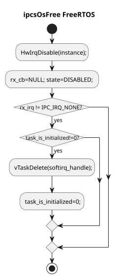

### 3.4.58 ipcsShmSoftirq

<table border="1" cellspacing="0" cellpadding="4">
<tbody>
<tr><td>对应软件架构ID</td><td colspan="4">Drv_Ipcs_Osal_Cmp</td></tr>
<tr><td>函数说明</td><td colspan="4">task acting as deferred interrupt handler</td></tr>
<tr><td>函数原型</td><td colspan="4">static void ipcsShmSoftirq(void)</td></tr>
<tr><td>制约条件</td><td colspan="4">-</td></tr>
<tr><td rowspan="2">输入/输出参数</td><td>I/O</td><td>参数名</td><td>数据类型</td><td>说明</td></tr>
<tr><td>-</td><td>-</td><td>-</td><td>-</td></tr>
<tr><td rowspan="2">返回值</td><td colspan="2">数据类型</td><td colspan="2">说明</td></tr>
<tr><td colspan="2">void</td><td colspan="2">源码返回值</td></tr>
<tr><td>函数定义文件</td><td colspan="4">os/freertos/ipc-os-freertos.c</td></tr>
<tr><td>函数声明文件</td><td colspan="4">-</td></tr>
</tbody>
</table>

**处理流程**

### 3.4.59 ipcsShmHardirq

<table border="1" cellspacing="0" cellpadding="4">
<tbody>
<tr><td>对应软件架构ID</td><td colspan="4">Drv_Ipcs_Osal_Cmp</td></tr>
<tr><td>函数说明</td><td colspan="4">driver interrupt service routine</td></tr>
<tr><td>函数原型</td><td colspan="4">void ipcsShmHardirq(void)</td></tr>
<tr><td>制约条件</td><td colspan="4">-</td></tr>
<tr><td rowspan="2">输入/输出参数</td><td>I/O</td><td>参数名</td><td>数据类型</td><td>说明</td></tr>
<tr><td>-</td><td>-</td><td>-</td><td>-</td></tr>
<tr><td rowspan="2">返回值</td><td colspan="2">数据类型</td><td colspan="2">说明</td></tr>
<tr><td colspan="4">-</td></tr>
<tr><td>函数定义文件</td><td colspan="4">os/freertos/ipc-os-freertos.c</td></tr>
<tr><td>函数声明文件</td><td colspan="4">os/ipc-os.h</td></tr>
</tbody>
</table>

**处理流程**

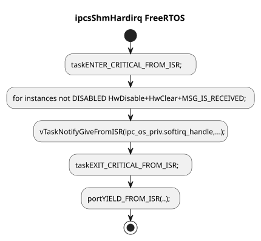

### 3.4.60 ipcsShmHardirqInstance

<table border="1" cellspacing="0" cellpadding="4">
<tbody>
<tr><td>对应软件架构ID</td><td colspan="4">Drv_Ipcs_Osal_Cmp</td></tr>
<tr><td>函数说明</td><td colspan="4">driver interrupt service routine</td></tr>
<tr><td>函数原型</td><td colspan="4">void ipcsShmHardirqInstance(const uint8 instance)</td></tr>
<tr><td>制约条件</td><td colspan="4">-</td></tr>
<tr><td rowspan="2">输入/输出参数</td><td>I/O</td><td>参数名</td><td>数据类型</td><td>说明</td></tr>
<tr><td>I</td><td>instance</td><td>const uint8</td><td>IPCS shared memory instance 索引</td></tr>
<tr><td rowspan="2">返回值</td><td colspan="2">数据类型</td><td colspan="2">说明</td></tr>
<tr><td colspan="4">-</td></tr>
<tr><td>函数定义文件</td><td colspan="4">os/freertos/ipc-os-freertos.c</td></tr>
<tr><td>函数声明文件</td><td colspan="4">os/ipc-os.h</td></tr>
</tbody>
</table>

**处理流程**

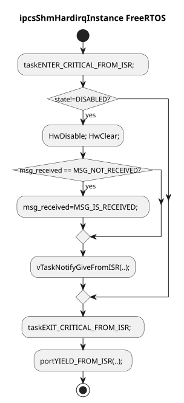

### 3.4.61 ipcsOsGetLocalShm

<table border="1" cellspacing="0" cellpadding="4">
<tbody>
<tr><td>对应软件架构ID</td><td colspan="4">Drv_Ipcs_Osal_Cmp</td></tr>
<tr><td>函数说明</td><td colspan="4">get local shared mem address</td></tr>
<tr><td>函数原型</td><td colspan="4">uintptr_t ipcsOsGetLocalShm(const uint8 instance)</td></tr>
<tr><td>制约条件</td><td colspan="4">-</td></tr>
<tr><td rowspan="2">输入/输出参数</td><td>I/O</td><td>参数名</td><td>数据类型</td><td>说明</td></tr>
<tr><td>I</td><td>instance</td><td>const uint8</td><td>IPCS shared memory instance 索引</td></tr>
<tr><td rowspan="2">返回值</td><td colspan="2">数据类型</td><td colspan="2">说明</td></tr>
<tr><td colspan="2">uintptr_t</td><td colspan="2">源码返回值</td></tr>
<tr><td>函数定义文件</td><td colspan="4">os/freertos/ipc-os-freertos.c</td></tr>
<tr><td>函数声明文件</td><td colspan="4">os/ipc-os.h</td></tr>
</tbody>
</table>

**处理流程**

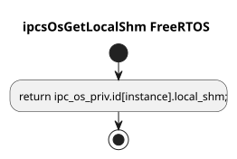

### 3.4.62 ipcsOsGetRemoteShm

<table border="1" cellspacing="0" cellpadding="4">
<tbody>
<tr><td>对应软件架构ID</td><td colspan="4">Drv_Ipcs_Osal_Cmp</td></tr>
<tr><td>函数说明</td><td colspan="4">get remote shared mem address</td></tr>
<tr><td>函数原型</td><td colspan="4">uintptr_t ipcsOsGetRemoteShm(const uint8 instance)</td></tr>
<tr><td>制约条件</td><td colspan="4">-</td></tr>
<tr><td rowspan="2">输入/输出参数</td><td>I/O</td><td>参数名</td><td>数据类型</td><td>说明</td></tr>
<tr><td>I</td><td>instance</td><td>const uint8</td><td>IPCS shared memory instance 索引</td></tr>
<tr><td rowspan="2">返回值</td><td colspan="2">数据类型</td><td colspan="2">说明</td></tr>
<tr><td colspan="2">uintptr_t</td><td colspan="2">源码返回值</td></tr>
<tr><td>函数定义文件</td><td colspan="4">os/freertos/ipc-os-freertos.c</td></tr>
<tr><td>函数声明文件</td><td colspan="4">os/ipc-os.h</td></tr>
</tbody>
</table>

**处理流程**

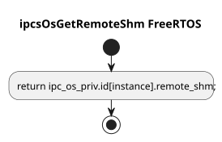

### 3.4.63 ipcsOsPollChannels

<table border="1" cellspacing="0" cellpadding="4">
<tbody>
<tr><td>对应软件架构ID</td><td colspan="4">Drv_Ipcs_Osal_Cmp</td></tr>
<tr><td>函数说明</td><td colspan="4">invoke rx callback configured at initialization</td></tr>
<tr><td>函数原型</td><td colspan="4">sint32 ipcsOsPollChannels(const uint8 instance)</td></tr>
<tr><td>制约条件</td><td colspan="4">-</td></tr>
<tr><td rowspan="2">输入/输出参数</td><td>I/O</td><td>参数名</td><td>数据类型</td><td>说明</td></tr>
<tr><td>I</td><td>instance</td><td>const uint8</td><td>IPCS shared memory instance 索引</td></tr>
<tr><td rowspan="2">返回值</td><td colspan="2">数据类型</td><td colspan="2">说明</td></tr>
<tr><td colspan="2">sint32</td><td colspan="2">work done, error code otherwise</td></tr>
<tr><td>函数定义文件</td><td colspan="4">os/freertos/ipc-os-freertos.c</td></tr>
<tr><td>函数声明文件</td><td colspan="4">os/ipc-os.h</td></tr>
</tbody>
</table>

**处理流程**

### 3.4.64 ipcsShmSoftirq

<table border="1" cellspacing="0" cellpadding="4">
<tbody>
<tr><td>对应软件架构ID</td><td colspan="4">Drv_Ipcs_Osal_Cmp</td></tr>
<tr><td>函数说明</td><td colspan="4">task acting as deferred interrupt handler</td></tr>
<tr><td>函数原型</td><td colspan="4">static void ipcsShmSoftirq(void *arg1, void *arg2, void *arg3)</td></tr>
<tr><td>制约条件</td><td colspan="4">-</td></tr>
<tr><td rowspan="4">输入/输出参数</td><td>I/O</td><td>参数名</td><td>数据类型</td><td>说明</td></tr>
<tr><td>I</td><td>arg1</td><td>void *</td><td>源码参数</td></tr>
<tr><td>I</td><td>arg2</td><td>void *</td><td>源码参数</td></tr>
<tr><td>I</td><td>arg3</td><td>void *</td><td>源码参数</td></tr>
<tr><td rowspan="2">返回值</td><td colspan="2">数据类型</td><td colspan="2">说明</td></tr>
<tr><td colspan="2">void</td><td colspan="2">源码返回值</td></tr>
<tr><td>函数定义文件</td><td colspan="4">os/zephyr/ipc-os-zephyr.c</td></tr>
<tr><td>函数声明文件</td><td colspan="4">-</td></tr>
</tbody>
</table>

**处理流程**

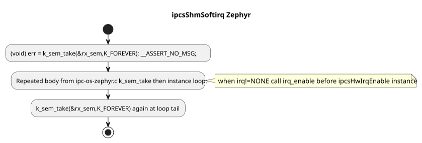

### 3.4.65 ipcsShmHardirq

<table border="1" cellspacing="0" cellpadding="4">
<tbody>
<tr><td>对应软件架构ID</td><td colspan="4">Drv_Ipcs_Osal_Cmp</td></tr>
<tr><td>函数说明</td><td colspan="4">driver interrupt service routine</td></tr>
<tr><td>函数原型</td><td colspan="4">void ipcsShmHardirq(const void *arg)</td></tr>
<tr><td>制约条件</td><td colspan="4">-</td></tr>
<tr><td rowspan="2">输入/输出参数</td><td>I/O</td><td>参数名</td><td>数据类型</td><td>说明</td></tr>
<tr><td>I</td><td>arg</td><td>const void *</td><td>源码参数</td></tr>
<tr><td rowspan="2">返回值</td><td colspan="2">数据类型</td><td colspan="2">说明</td></tr>
<tr><td colspan="4">-</td></tr>
<tr><td>函数定义文件</td><td colspan="4">os/zephyr/ipc-os-zephyr.c</td></tr>
<tr><td>函数声明文件</td><td colspan="4">os/ipc-os.h</td></tr>
</tbody>
</table>

**处理流程**

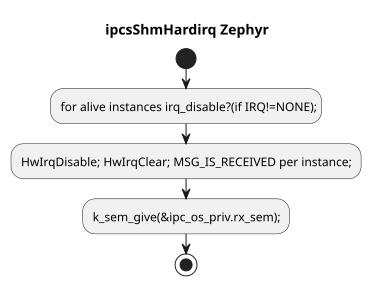

### 3.4.66 ipcsShmHardirqInstance

<table border="1" cellspacing="0" cellpadding="4">
<tbody>
<tr><td>对应软件架构ID</td><td colspan="4">Drv_Ipcs_Osal_Cmp</td></tr>
<tr><td>函数说明</td><td colspan="4">driver interrupt service routine</td></tr>
<tr><td>函数原型</td><td colspan="4">void ipcsShmHardirqInstance(const uint8 instance)</td></tr>
<tr><td>制约条件</td><td colspan="4">-</td></tr>
<tr><td rowspan="2">输入/输出参数</td><td>I/O</td><td>参数名</td><td>数据类型</td><td>说明</td></tr>
<tr><td>I</td><td>instance</td><td>const uint8</td><td>IPCS shared memory instance 索引</td></tr>
<tr><td rowspan="2">返回值</td><td colspan="2">数据类型</td><td colspan="2">说明</td></tr>
<tr><td colspan="4">-</td></tr>
<tr><td>函数定义文件</td><td colspan="4">os/zephyr/ipc-os-zephyr.c</td></tr>
<tr><td>函数声明文件</td><td colspan="4">os/ipc-os.h</td></tr>
</tbody>
</table>

**处理流程**

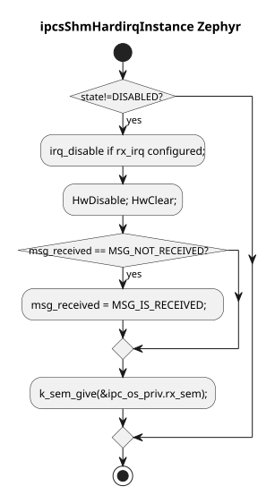

### 3.4.67 ipcsOsMemMap

<table border="1" cellspacing="0" cellpadding="4">
<tbody>
<tr><td>对应软件架构ID</td><td colspan="4">Drv_Ipcs_Osal_Cmp</td></tr>
<tr><td>函数说明</td><td colspan="4">map physical to virtual memory</td></tr>
<tr><td>函数原型</td><td colspan="4">static void ipcsOsMemMap(const uint8 instance)</td></tr>
<tr><td>制约条件</td><td colspan="4">-</td></tr>
<tr><td rowspan="2">输入/输出参数</td><td>I/O</td><td>参数名</td><td>数据类型</td><td>说明</td></tr>
<tr><td>I</td><td>instance</td><td>const uint8</td><td>IPCS shared memory instance 索引</td></tr>
<tr><td rowspan="2">返回值</td><td colspan="2">数据类型</td><td colspan="2">说明</td></tr>
<tr><td colspan="2">void</td><td colspan="2">源码返回值</td></tr>
<tr><td>函数定义文件</td><td colspan="4">os/zephyr/ipc-os-zephyr.c</td></tr>
<tr><td>函数声明文件</td><td colspan="4">-</td></tr>
</tbody>
</table>

**处理流程**

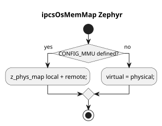

### 3.4.68 ipcsOsMemUnmap

<table border="1" cellspacing="0" cellpadding="4">
<tbody>
<tr><td>对应软件架构ID</td><td colspan="4">Drv_Ipcs_Osal_Cmp</td></tr>
<tr><td>函数说明</td><td colspan="4">unmap physical to virtual memory</td></tr>
<tr><td>函数原型</td><td colspan="4">static void ipcsOsMemUnmap(const uint8 instance)</td></tr>
<tr><td>制约条件</td><td colspan="4">-</td></tr>
<tr><td rowspan="2">输入/输出参数</td><td>I/O</td><td>参数名</td><td>数据类型</td><td>说明</td></tr>
<tr><td>I</td><td>instance</td><td>const uint8</td><td>IPCS shared memory instance 索引</td></tr>
<tr><td rowspan="2">返回值</td><td colspan="2">数据类型</td><td colspan="2">说明</td></tr>
<tr><td colspan="2">void</td><td colspan="2">源码返回值</td></tr>
<tr><td>函数定义文件</td><td colspan="4">os/zephyr/ipc-os-zephyr.c</td></tr>
<tr><td>函数声明文件</td><td colspan="4">-</td></tr>
</tbody>
</table>

**处理流程**

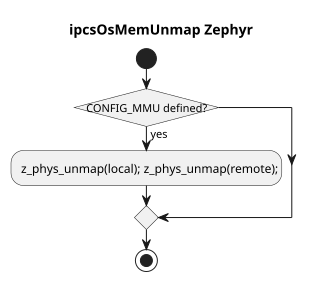

### 3.4.69 ipcsOsInit

<table border="1" cellspacing="0" cellpadding="4">
<tbody>
<tr><td>对应软件架构ID</td><td colspan="4">Drv_Ipcs_Osal_Cmp</td></tr>
<tr><td>函数说明</td><td colspan="4">OS specific initialization code</td></tr>
<tr><td>函数原型</td><td colspan="4">sint32 ipcsOsInit(const uint8 instance, const struct IPCS_SHM_CFG_TYPE *cfg, sint32 (*rx_cb)(const uint8, sint32))</td></tr>
<tr><td>制约条件</td><td colspan="4">-</td></tr>
<tr><td rowspan="4">输入/输出参数</td><td>I/O</td><td>参数名</td><td>数据类型</td><td>说明</td></tr>
<tr><td>I</td><td>instance</td><td>const uint8</td><td>IPCS shared memory instance 索引</td></tr>
<tr><td>I</td><td>cfg</td><td>const struct IPCS_SHM_CFG_TYPE *</td><td>configuration parameters</td></tr>
<tr><td>I</td><td>rx_cb</td><td>sint32 (*rx_cb)(const uint8, sint32)</td><td>rx callback to be called from rx softirq</td></tr>
<tr><td rowspan="2">返回值</td><td colspan="2">数据类型</td><td colspan="2">说明</td></tr>
<tr><td colspan="2">sint32</td><td colspan="2">IPC_SHM_E_OK on success, -IPC_SHM_E_NOMEM if the softirq task creation</td></tr>
<tr><td>函数定义文件</td><td colspan="4">os/zephyr/ipc-os-zephyr.c</td></tr>
<tr><td>函数声明文件</td><td colspan="4">os/ipc-os.h</td></tr>
</tbody>
</table>

**处理流程**

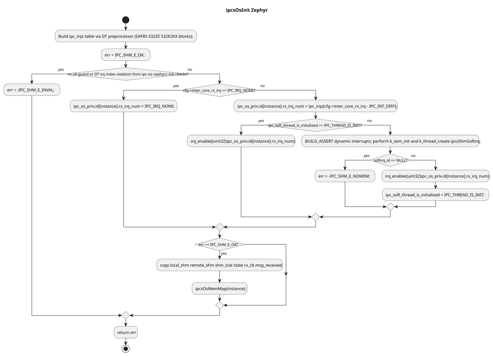

### 3.4.70 ipcsOsFree

<table border="1" cellspacing="0" cellpadding="4">
<tbody>
<tr><td>对应软件架构ID</td><td colspan="4">Drv_Ipcs_Osal_Cmp</td></tr>
<tr><td>函数说明</td><td colspan="4">free OS specific resources</td></tr>
<tr><td>函数原型</td><td colspan="4">void ipcsOsFree(const uint8 instance)</td></tr>
<tr><td>制约条件</td><td colspan="4">-</td></tr>
<tr><td rowspan="2">输入/输出参数</td><td>I/O</td><td>参数名</td><td>数据类型</td><td>说明</td></tr>
<tr><td>I</td><td>instance</td><td>const uint8</td><td>IPCS shared memory instance 索引</td></tr>
<tr><td rowspan="2">返回值</td><td colspan="2">数据类型</td><td colspan="2">说明</td></tr>
<tr><td colspan="4">-</td></tr>
<tr><td>函数定义文件</td><td colspan="4">os/zephyr/ipc-os-zephyr.c</td></tr>
<tr><td>函数声明文件</td><td colspan="4">os/ipc-os.h</td></tr>
</tbody>
</table>

**处理流程**

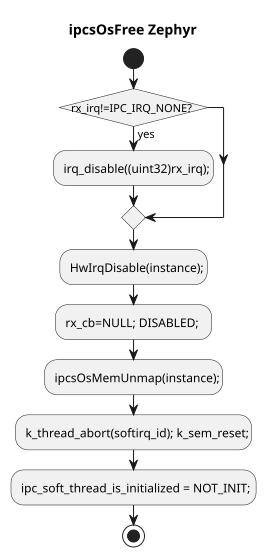

### 3.4.71 ipcsOsGetLocalShm

<table border="1" cellspacing="0" cellpadding="4">
<tbody>
<tr><td>对应软件架构ID</td><td colspan="4">Drv_Ipcs_Osal_Cmp</td></tr>
<tr><td>函数说明</td><td colspan="4">get local shared mem address</td></tr>
<tr><td>函数原型</td><td colspan="4">uintptr_t ipcsOsGetLocalShm(const uint8 instance)</td></tr>
<tr><td>制约条件</td><td colspan="4">-</td></tr>
<tr><td rowspan="2">输入/输出参数</td><td>I/O</td><td>参数名</td><td>数据类型</td><td>说明</td></tr>
<tr><td>I</td><td>instance</td><td>const uint8</td><td>IPCS shared memory instance 索引</td></tr>
<tr><td rowspan="2">返回值</td><td colspan="2">数据类型</td><td colspan="2">说明</td></tr>
<tr><td colspan="2">uintptr_t</td><td colspan="2">源码返回值</td></tr>
<tr><td>函数定义文件</td><td colspan="4">os/zephyr/ipc-os-zephyr.c</td></tr>
<tr><td>函数声明文件</td><td colspan="4">os/ipc-os.h</td></tr>
</tbody>
</table>

**处理流程**

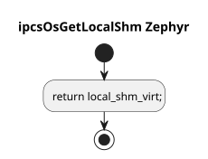

### 3.4.72 ipcsOsGetRemoteShm

<table border="1" cellspacing="0" cellpadding="4">
<tbody>
<tr><td>对应软件架构ID</td><td colspan="4">Drv_Ipcs_Osal_Cmp</td></tr>
<tr><td>函数说明</td><td colspan="4">get remote shared mem address</td></tr>
<tr><td>函数原型</td><td colspan="4">uintptr_t ipcsOsGetRemoteShm(const uint8 instance)</td></tr>
<tr><td>制约条件</td><td colspan="4">-</td></tr>
<tr><td rowspan="2">输入/输出参数</td><td>I/O</td><td>参数名</td><td>数据类型</td><td>说明</td></tr>
<tr><td>I</td><td>instance</td><td>const uint8</td><td>IPCS shared memory instance 索引</td></tr>
<tr><td rowspan="2">返回值</td><td colspan="2">数据类型</td><td colspan="2">说明</td></tr>
<tr><td colspan="2">uintptr_t</td><td colspan="2">源码返回值</td></tr>
<tr><td>函数定义文件</td><td colspan="4">os/zephyr/ipc-os-zephyr.c</td></tr>
<tr><td>函数声明文件</td><td colspan="4">os/ipc-os.h</td></tr>
</tbody>
</table>

**处理流程**

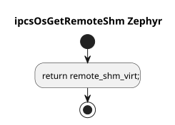

### 3.4.73 ipcsOsPollChannels

<table border="1" cellspacing="0" cellpadding="4">
<tbody>
<tr><td>对应软件架构ID</td><td colspan="4">Drv_Ipcs_Osal_Cmp</td></tr>
<tr><td>函数说明</td><td colspan="4">invoke rx callback configured at initialization</td></tr>
<tr><td>函数原型</td><td colspan="4">sint32 ipcsOsPollChannels(const uint8 instance)</td></tr>
<tr><td>制约条件</td><td colspan="4">-</td></tr>
<tr><td rowspan="2">输入/输出参数</td><td>I/O</td><td>参数名</td><td>数据类型</td><td>说明</td></tr>
<tr><td>I</td><td>instance</td><td>const uint8</td><td>IPCS shared memory instance 索引</td></tr>
<tr><td rowspan="2">返回值</td><td colspan="2">数据类型</td><td colspan="2">说明</td></tr>
<tr><td colspan="2">sint32</td><td colspan="2">work done, error code otherwise</td></tr>
<tr><td>函数定义文件</td><td colspan="4">os/zephyr/ipc-os-zephyr.c</td></tr>
<tr><td>函数声明文件</td><td colspan="4">os/ipc-os.h</td></tr>
</tbody>
</table>

**处理流程**

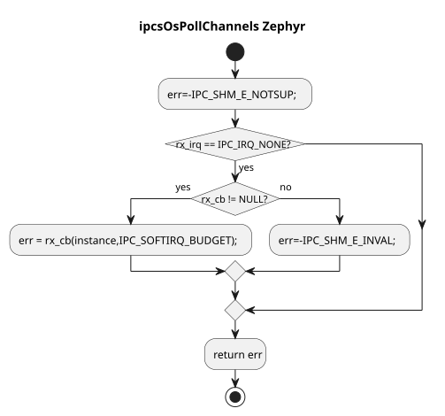

## 3.5 Gobal variants 全局变量

| 全局变量名称 | 全局变量类型 | 全局变量范围 | 全局变量描述 | 全局变量的存储RAM区 |
|---|---|---|---|---|
| ipc_shm_priv_data | static struct IPCS_SHM_PRIV_TYPE [IPC_SHM_MAX_INSTANCES] | common/ipc-shm.c | IPCS shm private data | 源码未显式指定 |
| ipc_hw_priv | static struct IPCS_HW_PRIV_TYPE_TYPE [IPC_SHM_MAX_INSTANCES] | hw/ipc-hw.c | platform specific private data | 源码未显式指定 |
| ipc_os_priv | static struct IPCS_OS_PRIV_TYPE_TYPE | os/autosar/ipc-os-autosar.c | AutoSAR OS specific private data | 源码未显式指定 |
| ipc_os_priv | static struct IPCS_OS_PRIV_TYPE_TYPE | os/baremetal/ipc-os-baremetal.c | Baremetal OS specific private data | 源码未显式指定 |
| ipc_os_priv | static struct IPCS_OS_PRIV_TYPE_TYPE | os/freertos/ipc-os-freertos.c | FreeRTOS OS specific private data | 源码未显式指定 |
| ipc_os_priv | static struct IPCS_OS_PRIV_TYPE_TYPE | os/zephyr/ipc-os-zephyr.c | Zephyr OS specific private data | 源码未显式指定 |
| softirq_stack | K_THREAD_STACK_DEFINE(softirq_stack, IPC_SOFTIRQ_STACK_SIZE) | os/zephyr/ipc-os-zephyr.c | Zephyr deferred interrupt handler stack | 源码未显式指定 |

## 3.6 Data Structure 类型定义

### 3.6.1 struct IPCS_RING_TYPE

| Type | Name | Description |
|---|---|---|
| uint64 | sentinel | a magic word to ensure ring integrity |
| volatile uint32 | write | write index, position used to store next byte in the buffer |
| volatile uint32 | read | read index, read next byte from this position |
| uint8 | data[] | circular buffer |

### 3.6.2 struct IPCS_QUEUE_TYPE

| Type | Name | Description |
|---|---|---|
| uint16 | elem_num | number of elements in queue |
| uint8 | elem_size | element size in bytes (8-byte multiple) |
| struct IPCS_RING_TYPE | *push_ring | push buffer ring mapped in local shared memory |
| struct IPCS_RING_TYPE | *pop_ring | pop buffer ring mapped in remote shared memory |

### 3.6.3 enum IPCS_SHM_INSTANCE_STATE_E

| Name | Description |
|---|---|
| IPC_SHM_INSTANCE_USED | instance is used |
| IPC_SHM_INSTANCE_FREE | instance is free and can be used |
| IPC_SHM_INSTANCE_ERROR | there are some errors |

### 3.6.4 struct IPCS_SHM_POOL_ADDR_TYPE

| Type | Name | Description |
|---|---|---|
| uintptr_t | local_pool_shm | address of local buffer pool |
| uintptr_t | remote_pool_shm | address of remote buffer pool |

### 3.6.5 struct IPCS_SHM_BD_TYPE

| Type | Name | Description |
|---|---|---|
| sint16 | pool_id | index of buffer pool |
| uint16 | buf_id | index of buffer from buffer pool |
| uint32 | data_size | size of data written in buffer |

### 3.6.6 struct IPCS_SHM_POOL_TYPE

| Type | Name | Description |
|---|---|---|
| uint16 | num_bufs | number of buffers in pool |
| uint32 | buf_size | size of buffers |
| uint32 | shm_size | size of shared memory mapped by this pool (queue + bufs) |
| uintptr_t | local_pool_addr | address of local buffer pool |
| uintptr_t | remote_pool_addr | address of remote buffer pool |
| struct IPCS_QUEUE_TYPE | bd_queue | queue containing BDs of free buffers |

### 3.6.7 struct IPCS_MANAGED_CHANNEL_TYPE

| Type | Name | Description |
|---|---|---|
| struct IPCS_QUEUE_TYPE | bd_queue | queue containing BDs of sent/received buffers |
| uint8 | num_pools | number of buffer pools |
| struct IPCS_SHM_POOL_TYPE | pools[IPC_SHM_MAX_POOLS] | buffer pools private data |
| void (*rx_cb)(void *cb_arg, const uint8 instance, sint32 chan_id, void *buf, uint32 size) | rx_cb | receive callback |
| void | *cb_arg | optional receive callback argument |

### 3.6.8 struct IPCS_CHANNEL_UMEM_TYPE

| Type | Name | Description |
|---|---|---|
| uint32 | sentinel | magic word to ensure unmanaged channel integrity |
| volatile uint32 | tx_count | local channel Tx counter (it wraps around at max uint32) |
| uint8 | mem[] | local channel unmanaged memory buffer |

### 3.6.9 struct IPCS_UNMANAGED_CHANNEL_TYPE

| Type | Name | Description |
|---|---|---|
| uint32 | size | unmanaged channel memory size requested by app |
| struct IPCS_CHANNEL_UMEM_TYPE | *local_mem | 源码未提供描述 |
| struct IPCS_CHANNEL_UMEM_TYPE | *remote_mem | 源码未提供描述 |
| uint32 | remote_tx_count | copy of remote Tx counter |
| void (*rx_cb)(void *cb_arg, const uint8 instance, sint32 chan_id, void *buf) | rx_cb | receive callback |
| void | *cb_arg | optional receive callback argument |

### 3.6.10 struct IPCS_SHM_CHANNEL_TYPE

| Type | Name | Description |
|---|---|---|
| sint32 | id | channel id |
| enum IPCS_SHM_CHANNEL_TYPE_E | type | channel type (see IPCS_SHM_CHANNEL_TYPE_E) |
| struct IPCS_MANAGED_CHANNEL_TYPE | ch.mng | 源码未提供描述 |
| struct IPCS_UNMANAGED_CHANNEL_TYPE | ch.umng | 源码未提供描述 |

### 3.6.11 struct IPCS_SHM_GLOBAL_TYPE

| Type | Name | Description |
|---|---|---|
| uint64 | state | state to indicate whether local is initialized |

### 3.6.12 struct IPCS_SHM_PRIV_TYPE

| Type | Name | Description |
|---|---|---|
| uint32 | shm_size | local/remote shared memory size |
| uint8 | num_channels | number of shared memory channels |
| struct IPCS_SHM_CHANNEL_TYPE | channels[IPC_SHM_MAX_CHANNELS] | ipc channels private data |
| struct IPCS_SHM_GLOBAL_TYPE | *global | local global data shared with remote |

### 3.6.13 enum IPCS_SHM_CHANNEL_TYPE_E

| Name | Description |
|---|---|
| IPC_SHM_MANAGED | channel with buffer management enabled |
| IPC_SHM_UNMANAGED | buf mgmt disabled, app owns entire channel memory |

### 3.6.14 enum IPCS_SHM_CORE_TYPE_E

| Name | Description |
|---|---|
| IPC_CORE_DEFAULT | used for letting driver auto-select remote core type |
| IPC_CORE_A53 | ARM Cortex-A53 core |
| IPC_CORE_M7 | ARM Cortex-M7 core |
| IPC_CORE_M4 | ARM Cortex-M4 core |
| IPC_CORE_Z7 | PowerPC e200z7 core |
| IPC_CORE_Z4 | PowerPC e200z4 core |
| IPC_CORE_Z2 | PowerPC e200z2 core |
| IPC_CORE_R52 | ARM Cortex-R52 core |
| IPC_CORE_M33 | ARM Cortex-M33 core |
| IPC_CORE_BBE32 | Tensilica ConnX BBE32EP core |

### 3.6.15 enum IPCS_SHM_CORE_INDEX_E

| Name | Description |
|---|---|
| IPC_CORE_INDEX_0 | Processor index 0 |
| IPC_CORE_INDEX_1 | Processor index 1 |
| IPC_CORE_INDEX_2 | Processor index 2 |
| IPC_CORE_INDEX_3 | Processor index 3 |
| IPC_CORE_INDEX_4 | Processor index 4 |
| IPC_CORE_INDEX_5 | Processor index 5 |
| IPC_CORE_INDEX_6 | Processor index 6 |
| IPC_CORE_INDEX_7 | Processor index 7 |

### 3.6.16 struct IPCS_SHM_POOL_CFG_TYPE

| Type | Name | Description |
|---|---|---|
| uint16 | num_bufs | number of buffers |
| uint32 | buf_size | buffer size |

### 3.6.17 struct IPCS_SHM_MANAGED_CFG_TYPE

| Type | Name | Description |
|---|---|---|
| uint8 | num_pools | number of buffer pools |
| struct IPCS_SHM_POOL_CFG_TYPE | *pools | memory buffer pools parameters |
| void (*rx_cb)(void *cb_arg, const uint8 instance, sint32 chan_id, void *buf, uint32 size) | rx_cb | receive callback |
| void | *cb_arg | optional receive callback argument |

### 3.6.18 struct IPCS_SHM_UNMANAGED_CFG_TYPE

| Type | Name | Description |
|---|---|---|
| uint32 | size | unmanaged channel memory size |
| void (*rx_cb)(void *cb_arg, const uint8 instance, sint32 chan_id, void *mem) | rx_cb | receive callback |
| void | *cb_arg | optional receive callback argument |

### 3.6.19 struct IPCS_SHM_CHANNEL_CFG_TYPE

| Type | Name | Description |
|---|---|---|
| enum IPCS_SHM_CHANNEL_TYPE_E | type | channel type from &enum IPCS_SHM_CHANNEL_TYPE_E |
| struct IPCS_SHM_MANAGED_CFG_TYPE | ch.managed | 源码未提供描述 |
| struct IPCS_SHM_UNMANAGED_CFG_TYPE | ch.unmanaged | 源码未提供描述 |

### 3.6.20 struct IPCS_SHM_REMOTE_CORE_TYPE

| Type | Name | Description |
|---|---|---|
| enum IPCS_SHM_CORE_TYPE_E | type | core type from &enum IPCS_SHM_CORE_TYPE_E |
| enum IPCS_SHM_CORE_INDEX_E | index | core number |

### 3.6.21 struct IPCS_SHM_LOCAL_CORE_TYPE

| Type | Name | Description |
|---|---|---|
| enum IPCS_SHM_CORE_TYPE_E | type | core type from &enum IPCS_SHM_CORE_TYPE_E |
| enum IPCS_SHM_CORE_INDEX_E | index | core number targeted by remote core interrupt |
| uint32 | trusted | trusted cores mask |

### 3.6.22 struct IPCS_SHM_CFG_TYPE

| Type | Name | Description |
|---|---|---|
| uintptr_t | local_shm_addr | local shared memory physical address |
| uintptr_t | remote_shm_addr | remote shared memory physical address |
| uint32 | shm_size | local/remote shared memory size |
| sint32 | inter_core_tx_irq | inter-core interrupt reserved for shm driver Tx |
| sint32 | inter_core_rx_irq | inter-core interrupt reserved for shm driver Rx |
| uint8 | mru_tx_channel_id | mru channel index for shm driver Tx |
| uint8 | mru_rx_channel_id | mru channel index for shm driver Rx |
| struct IPCS_SHM_LOCAL_CORE_TYPE | local_core | local core targeted by remote core interrupt |
| struct IPCS_SHM_REMOTE_CORE_TYPE | remote_core | remote core to trigger the interrupt on |
| uint8 | num_channels | number of shared memory channels |
| struct IPCS_SHM_CHANNEL_CFG_TYPE * | channels | IPC channels parameters array |
| ISRType | isr_id_handler | the name of OsIsr defined to handle the interrupt |

### 3.6.23 struct IPCS_SHM_INSTANCES_CFG_TYPE

| Type | Name | Description |
|---|---|---|
| uint8 | num_instances | number of shared memory instances |
| struct IPCS_SHM_CFG_TYPE | *shm_cfg | IPC shm parameters array |

### 3.6.24 enum IPCS_PROCESSOR_IDX_E

| Name | Description |
|---|---|
| IPC_A53_0 | 源码未提供描述 |
| IPC_A53_1 | 源码未提供描述 |
| IPC_A53_2 | 源码未提供描述 |
| IPC_A53_3 | 源码未提供描述 |
| IPC_M7_0 | 源码未提供描述 |
| IPC_M7_1 | 源码未提供描述 |
| IPC_M7_2 | 源码未提供描述 |
| IPC_M7_3 | 源码未提供描述 |
| IPC_A53_4 | 源码未提供描述 |
| IPC_A53_5 | 源码未提供描述 |
| IPC_A53_6 | 源码未提供描述 |
| IPC_A53_7 | 源码未提供描述 |

### 3.6.25 enum msg_receive

| Name | Description |
|---|---|
| MSG_NOT_RECEIVED | no new message received from the remote core |
| MSG_IS_RECEIVED | new message received from the remote core |

### 3.6.26 struct IPCS_OS_PRIV_INSTANCE_TYPE

| Type | Name | Description |
|---|---|---|
| uintptr_t | local_shm | local shared memory address |
| uintptr_t | remote_shm | remote shared memory address |
| sint32 | state | state to indicate whether instance is initialized |
| sint32 | rx_irq_num | rx interrupt number |
| sint32 | msg_received | state to indicate notification received for a new message |
| ISRType | isr_id_handler | the name of OsIsr defined to handle the interrupt |

### 3.6.27 struct IPCS_OS_PRIV_TYPE_TYPE

| Type | Name | Description |
|---|---|---|
| struct IPCS_OS_PRIV_INSTANCE_TYPE | id[IPC_SHM_MAX_INSTANCES] | 源码未提供描述 |
| sint32 (*rx_cb)(const uint8 instance, sint32 budget) | rx_cb | upper layer rx callback |
| sint32 | task_is_initialized | flag to know if the softirq task is initialized |

### 3.6.28 struct IPCS_OS_PRIV_INSTANCE_TYPE

| Type | Name | Description |
|---|---|---|
| uintptr_t | local_shm | local shared memory address |
| uintptr_t | remote_shm | remote shared memory address |
| sint32 | state | state to indicate whether instance is initialized |
| sint32 | rx_irq_num | rx interrupt number |

### 3.6.29 struct IPCS_OS_PRIV_TYPE_TYPE

| Type | Name | Description |
|---|---|---|
| struct IPCS_OS_PRIV_INSTANCE_TYPE | id[IPC_SHM_MAX_INSTANCES] | private data per instance |
| sint32 (*rx_cb)(const uint8 instance, sint32 budget) | rx_cb | upper layer rx callback |

### 3.6.30 enum msg_receive

| Name | Description |
|---|---|
| MSG_NOT_RECEIVED | no new message received from the remote core |
| MSG_IS_RECEIVED | new message received from the remote core |

### 3.6.31 struct IPCS_OS_PRIV_INSTANCE_TYPE

| Type | Name | Description |
|---|---|---|
| uintptr_t | local_shm | local shared memory address |
| uintptr_t | remote_shm | remote shared memory address |
| sint32 | state | state of instance |
| sint32 | rx_irq_num | rx interrupt number |
| sint32 | msg_received | state to indicate notification received for a new message |

### 3.6.32 struct IPCS_OS_PRIV_TYPE_TYPE

| Type | Name | Description |
|---|---|---|
| struct IPCS_OS_PRIV_INSTANCE_TYPE | id[IPC_SHM_MAX_INSTANCES] | private data per instance |
| sint32 (*rx_cb)(const uint8 instance, sint32 budget) | rx_cb | upper layer rx callback |
| TaskHandle_t | softirq_handle | rx task handle used by the ISR to notify the rx task |
| sint32 | task_is_initialized | flag to know if the softirq task is initialized |

### 3.6.33 enum msg_receive

| Name | Description |
|---|---|
| MSG_NOT_RECEIVED | no new message received from the remote core |
| MSG_IS_RECEIVED | new message received from the remote core |

### 3.6.34 enum IPCS_THREAD_IS_INIT_E

| Name | Description |
|---|---|
| IPC_THREAD_NOT_INIT | thread has not been initialized |
| IPC_THREAD_IS_INIT | thread is initialized |

### 3.6.35 struct IPCS_OS_PRIV_INSTANCE_TYPE

| Type | Name | Description |
|---|---|---|
| sint32 | msg_received | state to indicate notification received for a new message |
| uintptr_t | local_shm | local shared memory physical address |
| uintptr_t | remote_shm | remote shared memory physical address |
| uintptr_t | local_shm_virt | 源码未提供描述 |
| uintptr_t | remote_shm_virt | 源码未提供描述 |
| uint32 | shm_size | 源码未提供描述 |
| sint32 | state | state of instance |
| sint32 | rx_irq_num | rx interrupt number |

### 3.6.36 struct IPCS_OS_PRIV_TYPE_TYPE

| Type | Name | Description |
|---|---|---|
| uint8 | ipc_soft_thread_is_initialized | 源码未提供描述 |
| sint32 (*rx_cb)(const uint8 instance, sint32 budget) | rx_cb | upper layer rx callback |
| struct IPCS_OS_PRIV_INSTANCE_TYPE | id[IPC_SHM_MAX_INSTANCES] | private data per instance |
| struct k_thread | softirq_data | rx softirq thread object |
| k_tid_t | softirq_id | rx softirq thread ID |
| struct k_sem | rx_sem | semaphore for signaling rx operations |

## 3.7 Dynamic Detailed Design 动态详细设计

3.3 和 3.4 已为每个函数提供 Mermaid 流程图或时序图。本节补充跨函数级动态流程，描述初始化、managed 发送/接收、unmanaged 发送/接收以及中断/轮询路径。

### 3.7.1 初始化流程

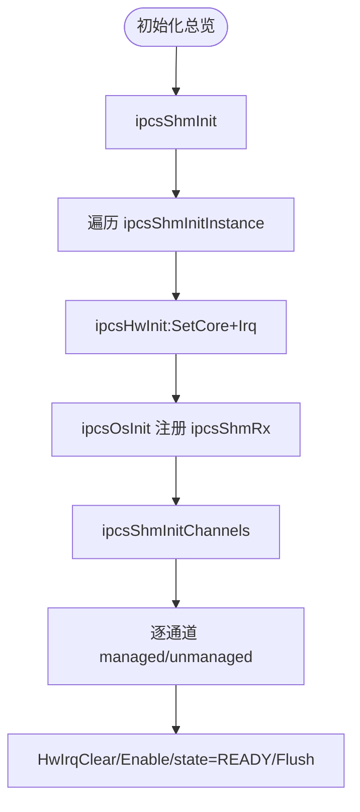
```mermaid
flowchart TD
  ST([初始化总览]) --> I[ipcsShmInit]
  I --> L[遍历 ipcsShmInitInstance]
  L --> H[ipcsHwInit:SetCore+Irq]
  H --> O[ipcsOsInit 注册 ipcsShmRx]
  O --> C[ipcsShmInitChannels]
  C --> CH[逐通道 managed/unmanaged]
  CH --> IQ[HwIrqClear/Enable/state=READY/Flush]
```

### 3.7.2 Managed 发送流程

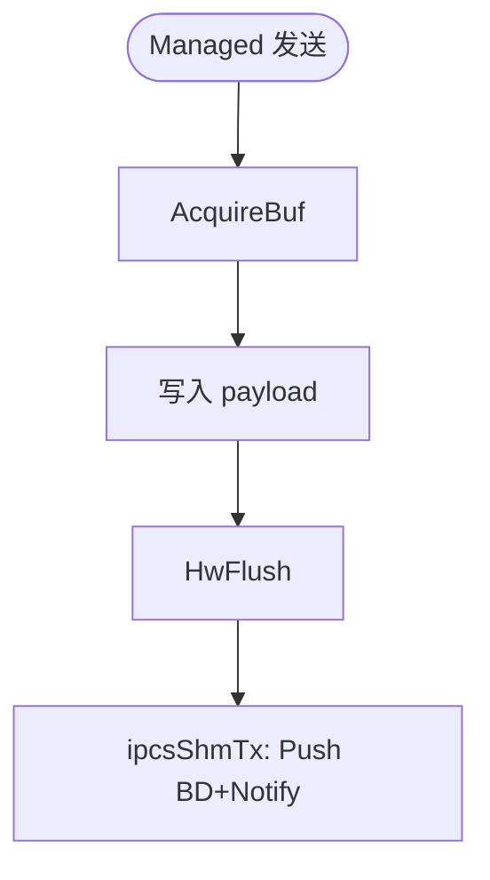
```mermaid
flowchart TD
  TX([Managed 发送]) --> AC[AcquireBuf]
  AC --> FILL[写入 payload]
  FILL --> HX[HwFlush]
  HX --> T[ipcsShmTx: Push BD+Notify]
```

### 3.7.3 Managed 接收与释放流程

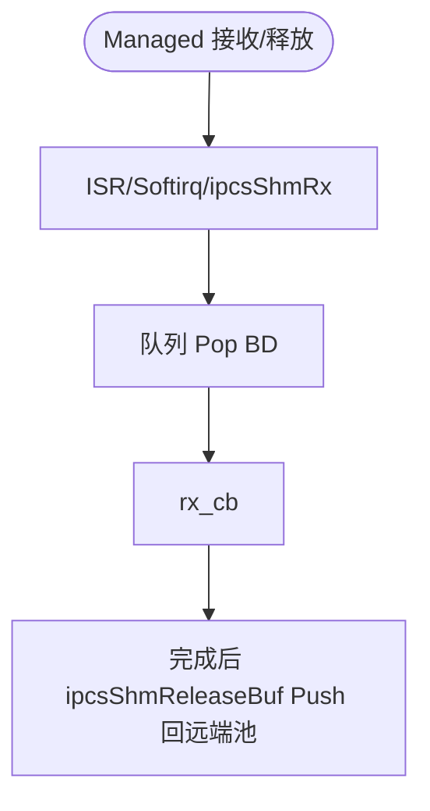
```mermaid
flowchart TD
  RX([Managed 接收/释放]) --> IRQ[ISR/Softirq/ipcsShmRx]
  IRQ --> POP[队列 Pop BD]
  POP --> CB[rx_cb]
  CB --> REL[完成后 ipcsShmReleaseBuf Push 回远端池]
```

### 3.7.4 Unmanaged 发送与接收流程

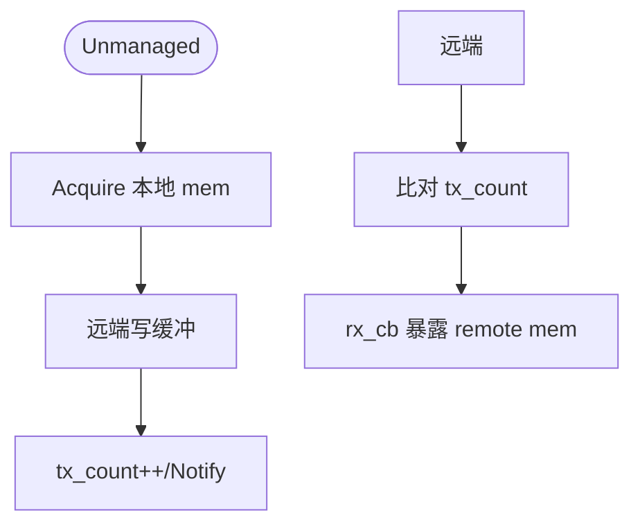
```mermaid
flowchart TD
  UM([Unmanaged]) --> AQ[Acquire 本地 mem]
  AQ --> WF[远端写缓冲]
  WF --> TX[tx_count++/Notify]
  RXD[远端] --> CMP[比对 tx_count]
  CMP --> CB[rx_cb 暴露 remote mem]
```

### 3.7.5 中断与轮询流程

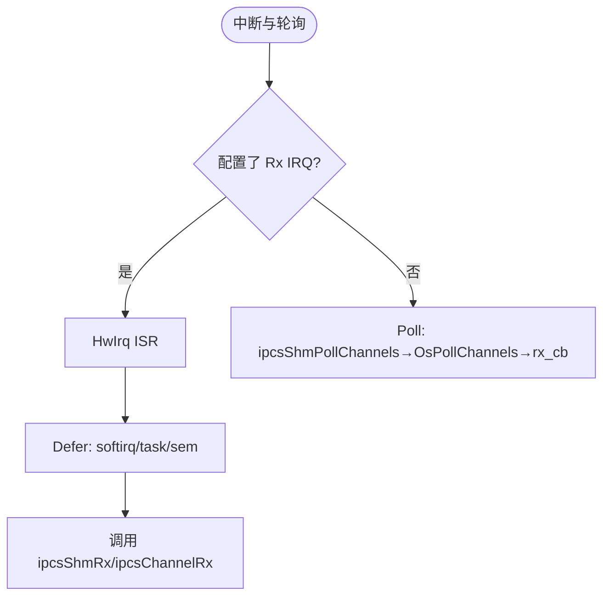
```mermaid
flowchart TD
  P([中断与轮询]) --> A{配置了 Rx IRQ?}
  A -->|是| ISR[HwIrq ISR]
  ISR --> DEF[Defer: softirq/task/sem]
  DEF --> RXX[调用 ipcsShmRx/ipcsChannelRx]
  A -->|否| PL[Poll: ipcsShmPollChannels→OsPollChannels→rx_cb]
```

## 3.8 Traceability and Consistency Evidence 追溯与一致性证据

### 3.8.1 SWE.3 覆盖说明

| SWE.3 要求 | 本文覆盖位置 |
|---|---|
| 静态详细设计：软件单元、静态结构、接口、输入输出范围 | 3.2、3.3、3.4、3.5、3.6 |
| 动态详细设计：软件单元间交互 | 3.3、3.4 的 Mermaid 图和 3.7 |
| 软件单元与详细设计一致 | 3.8.2、3.8.3、3.8.4 的源码核对结果 |
| 详细设计与软件架构一致 | 第 2 章和 3.3/3.4 对应软件架构ID 使用 ipcs-architecture.pdf 中组件命名 |
| 沟通与评审 | 文档历史和评审/批准栏 |

### 3.8.2 源码核对结果

| 核对项 | 结果 |
|---|---|
| 对外接口数量 | 9，均来自 common/ipc-shm.c 的非 static 定义 |
| 内部函数/接口数量 | 73，包含除 9 个对外 API 之外的源码函数/OS task 单元 |
| 源码函数定义总数 | 82 |
| 具名 struct/enum 数量 | 36 |
| Mermaid 图数量 | 102：第 3.2 节 15 张（含头文件依赖示意）、第 3.3/3.4 节 82 张（9+73，与各软件单元流程对应）、第 3.7 节 5 张（跨单元动态交互，含序列图与流程图） |

### 3.8.3 函数数量按文件统计

| 文件 | 函数/软件单元数量 | 函数/软件单元名称 |
|---|---|---|
| common/ipc-queue.c | 4 | ipcsQueuePop, ipcsQueuePush, ipcsQueueInit, ipcsQueueCheckIntegrity |
| common/ipc-queue.h | 1 | ipcsQueueMemSize |
| common/ipc-shm.c | 26 | getChannel, getManagedChan, getUnmanagedChan, ipcsCheckUchanIntegrity, ipcsCheckMchanIntegrity, ipcsChannelRx, ipcsInstanceIsFree, ipcsShmRx, ipcsBufPoolInit, ipcsGetTotalBufPerChan, managedChannelInit, unmanagedChannelInit, ipcsShmInitChannel, getChanMemmapSize, ipcsShmInitChannels, ipcsShmInitInstance, ipcsShmFree, ipcsShmAcquireBuf, ipcsShmInit, findPoolForBuf, ipcsShmReleaseBuf, ipcsShmTx, ipcsShmUnmanagedAcquire, ipcsShmUnmanagedTx, ipcsShmIsRemoteReady, ipcsShmPollChannels |
| common/ipc-util.c | 1 | ipcsMemcpy |
| hw/ipc-hw.c | 17 | ipcsHwGetCoreIndexM7, ipcsHwGetCoreIndexA53, ipcsHwSetRemoteCore, ipcsHwSetLocalCore, ipcsHwSetCore, ipcsHwSetTxIrqIdx, ipcsHwSetRxIrqIdx, ipcsHwSetIrqIdx, ipcsHwInit, ipcsHwFree, ipcsHwIrqEnable, ipcsHwIrqDisable, ipcsHwIrqNotify, ipcsHwIrqClear, ipcsHwFlushCache, ipcsHwFlushCacheLocal, ipcsHwFlushCacheRemote |
| os/autosar/ipc-os-autosar.c | 8 | ipcsOsInit, ipcsOsFree, ipcsShmHardirq, ipcsShmHardirqInstance, ipcsOsGetLocalShm, ipcsOsGetRemoteShm, ipcsOsPollChannels, ipcsShmSoftirq |
| os/baremetal/ipc-os-baremetal.c | 7 | ipcsOsInit, ipcsOsFree, ipcsShmHardirq, ipcsShmHardirqInstance, ipcsOsGetLocalShm, ipcsOsGetRemoteShm, ipcsOsPollChannels |
| os/freertos/ipc-os-freertos.c | 8 | ipcsOsInit, ipcsOsFree, ipcsShmSoftirq, ipcsShmHardirq, ipcsShmHardirqInstance, ipcsOsGetLocalShm, ipcsOsGetRemoteShm, ipcsOsPollChannels |
| os/zephyr/ipc-os-zephyr.c | 10 | ipcsShmSoftirq, ipcsShmHardirq, ipcsShmHardirqInstance, ipcsOsMemMap, ipcsOsMemUnmap, ipcsOsInit, ipcsOsFree, ipcsOsGetLocalShm, ipcsOsGetRemoteShm, ipcsOsPollChannels |

### 3.8.4 对外/内部接口判定规则

按照本次任务要求：只有 `IPCS_49/common/ipc-shm.c` 文件中的非静态接口为对外接口；除 3.3 中列出的 9 个接口外，其他所有函数和跨文件调用接口均按内部接口处理。外部接口“满足需求”行仅使用 `ipcs-architecture.pdf` 第 2.4 章中出现的需求 ID。
