| ROLES / 角色 | Name / 姓名 | Department / 部门 | Date / 日期 |
|---|---|---|---|
| AUTHOR(S) / 作者： | Cursor Agent | 软件研发部 | 2026.5.18 |
| REVIEWER(S) / 审查： | 待评审 | 软件研发部 | 2026.5.18 |
| APPROVER (S) / 批准： | 待批准 | 软件研发部 | 2026.5.18 |

## Document history: 文档历史

| Version / 版本 | Date / 日期 | Editor / 编辑人 | Status / 文档状态 | Change description / 变更简述 |
|---|---|---|---|---|
| V0.1 | 2026.5.18 | Cursor Agent | Draft | 基于 `ipc-shm/os_uio`、`ipc-shm/os_kernel/ipc-uio.c`、`ipc-shm/hw/c1/ipc-hw.c` 源码与 `ipcs-architecture.pdf`、`ipcs_sdd.md` 模板生成 UIO 部署 Linux 适配组件详细设计 |

## CONTENTS 目录

- 1 INTRODUCTION简介
  - 1.1 Confidentiality 保密性
  - 1.2 Purpose of the document文档目的
  - 1.3 Scope范围
  - 1.4 References 参考文件
  - 1.5 Abbreviations缩略语
- 2 Software Architecture软件架构
  - 2.1 架构分层与组件
  - 2.2 分层架构视图
  - 2.3 设计说明
  - 2.4 组件关系与端口
  - 2.5 运行场景
  - 2.6 User-Kernel 接口设计
- 3 Software DETAIL Design软件详细设计
  - 3.1 Definition定义
  - 3.2 Files
  - 3.3 External Interfaces外部接口（User Glue）
  - 3.4 Internal Functions 内部函数（User Glue）
  - 3.5 Global variants 全局变量
  - 3.6 Data Structure 类型定义
  - 3.7 Kernel Driver 概要设计
  - 3.8 Traceability and Consistency Evidence 追溯与一致性证据

# 1 INTRODUCTION简介

## 1.1 Confidentiality 保密性

任何披露必须与负责的流程经理协调。

本文件过程说明仅限直接参与项目的人员查看。转让给其他方，尤其是 Star Gather 以外的合作伙伴，必须由项目负责人协调，并受开发合同中有关保密规定的约束。

## 1.2 Purpose of the document文档目的

本文档按照 Automotive SPICE® SWE.3 Software Detailed Design and Unit Construction 的要求，为 IPCS Driver **Linux UIO 用户态部署适配方案**建立软件详细设计。文档内容描述 Linux 适配组件的静态结构、分层架构、User-Kernel 边界接口、User Glue 层软件单元的接口契约与关键动态行为，并与 `ipcs-architecture.pdf` 中定义的 `Drv_Ipcs_Linux_Adapt_Cmp` 及 IPCS 三层（IPCS-SHM / IPCS-OS / IPCS-HW）接口契约保持一致。

## 1.3 Scope范围

本文档适用于工作区 `ipc-shm/` 目录下 **UIO 部署方案（prompt task3-a）** 的实现源码，具体包括：

| 子组件 | 源码路径 | 说明 |
|---|---|---|
| User Glue（用户态 OS/HW 契约实现） | `ipc-shm/os_uio/ipc-os.c`, `ipc-shm/os_uio/ipc-os.h` | 实现 `ipcsOs*` 与 `ipcsHw*`（用户态 HW 经 UIO 代理） |
| UIO 内核驱动 | `ipc-shm/os_kernel/ipc-uio.c`, `ipc-shm/os_kernel/ipc-uio.h` | Platform 设备、UIO、cdev 初始化通道 |
| 内核 HW 实现（UIO 模块内链接） | `ipc-shm/hw/c1/ipc-hw.c`, `ipc-shm/hw/ipc-hw.h`, `ipc-shm/hw/c1/ipc-hw-platform.h` | MSCM 核间中断，由内核 UIO 模块调用 |

不在本文展开实现级详细设计的范围：`ipc-shm/ipc-shm.c`（IPCS-SHM 核心）、`ipc-shm/os_cdev`（cdev 用户态变体）、`ipc-shm/os_kernel/ipc-os.c`（全内核变体）。

## 1.4 References 参考文件

| Reference ID / 编号 | Document Name / 文档名称 | Version / 版本 | Date / 日期 | Author / 作者 | Status / 状态 |
|---|---|---|---|---|---|
| 1 | Automotive SPICE® Process Assessment Model, SWE.3 Software Detailed Design and Unit Construction | 4.0 | 2023 | VDA | Release |
| 2 | IPCS Driver 软件架构设计 ipcs-architecture.pdf | 1.0 | 2026.4.16 | 倘亚朋 | 待评审 |
| 3 | ipcs_sdd.md IPCS Driver RTOS 详细设计 | V0.1 | 2026.5.7 | Cursor Agent | Draft |
| 4 | ipc-shm/ IPC Shared Memory Driver Linux UIO 源码 | 2.0（`IPC_UIO_VERSION`） | 2023 | NXP | 源码输入 |

## 1.5 Abbreviations缩略语

| Abbreviation / 缩写 | Meaning/Explanation / 解释 |
|---|---|
| API | Application Programming Interface |
| cdev | Character Device |
| HAL | Hardware Abstraction Layer |
| IPCS | Inter-Processor Communication System |
| IRQ | Interrupt Request |
| MSCM | Multi-Core Shared Memory / Messaging（源码寄存器命名） |
| SHM | Shared Memory |
| UIO | Userspace I/O |

# 2 Software Architecture软件架构

UIO 部署方案在架构上对应 `Drv_Ipcs_Linux_Adapt_Cmp`（Linux 部署适配组件）的 **UIO 变体**。该变体将架构三层中的 **IPCS-OS** 与 **IPCS-HW** 在 Linux 用户态合并为 User Glue，在内核态由 UIO Driver + HW 模块完成硬件访问与中断投递。

## 2.1 架构分层与组件

| 架构层级（逻辑） | 组件 ID | 组件名称 | 源码映射 | 职责 |
|---|---|---|---|---|
| Linux 部署适配 | Drv_Ipcs_Linux_Adapt_Cmp | Linux 部署适配组件（UIO 变体） | 本 SDD 覆盖的全部单元 | 在 Linux 用户态运行 IPCS-SHM，通过 UIO/cdev/`/dev/mem` 与内核协同 |
| User Glue | Drv_Ipcs_Linux_Uio_User_Glue | Linux UIO 用户态粘合层 | `os_uio/ipc-os.c`, `os_uio/ipc-os.h` | 实现 `IF_OSAbst`；以 UIO write 代理实现 `IF_HWAbst`；mmap 本地/远端 SHM；Rx softirq 线程 |
| Kernel Driver | Drv_Ipcs_Linux_Uio_Driver | Linux UIO 内核驱动 | `os_kernel/ipc-uio.c`, `os_kernel/ipc-uio.h` | Platform probe；cdev 接收用户配置；注册 UIO；硬中断中 disable/clear HW IRQ |
| IPCS-HW（内核实例） | Drv_Ipcs_Hal_Cmp | HW 适配组件 | `hw/c1/ipc-hw.c`（链入 `ipc-shm-uio.ko`） | MSCM 寄存器访问；核间中断 enable/disable/notify/clear |
| IPCS-SHM | Drv_Ipcs_Core_Cmp | 通信核心组件 | `ipc-shm.c`（链接 `libipc-shm.a`） | 调用 `ipcsOs*` / `ipcsHw*`；不属本 SDD 函数级展开范围 |

## 2.2 分层架构视图

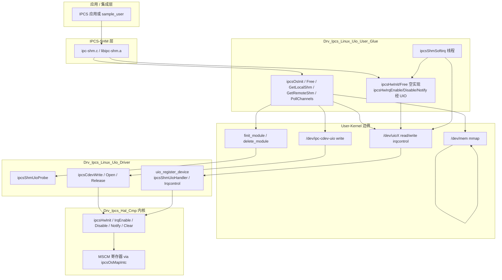

## 2.3 设计说明

1. **三层契约在 User 侧的折叠**：`os_uio/ipc-os.c` 同时实现 OS 适配 API（`ipc-os.h`）与 HW 适配 API（`ipc-hw.h` 声明、本文件定义）。`ipcsHwInit` / `ipcsHwFree` 为空实现，注释说明 HW 初始化由内核 UIO 模块完成；`ipcsHwIrqEnable` / `Disable` / `Notify` 通过向 UIO 设备 `write` 发送 `IPC_UIO_*_CMD` 命令，由内核 `ipcsShmUioIrqcontrol` 转调 `ipcsHw*`。
2. **共享内存映射**：用户态使用 `/dev/mem` + `mmap` 将 `cfg->local_shm_addr` / `cfg->remote_shm_addr` 映射为虚拟地址，经 `ipcsOsGetLocalShm` / `ipcsOsGetRemoteShm` 提供给 IPCS-SHM。页对齐与 offset 计算逻辑见 `ipcsOsInit`。
3. **内核侧初始化通道**：首次 `ipcsOsInit` 时 `finit_module` 加载 `ipc-shm-uio.ko`（路径由编译宏 `IPC_UIO_MODULE_PATH` 注入），并向 `/dev/ipc-cdev-uio` 写入 `struct IPCS_UIO_CDEV_DATA_TYPE`，触发 `ipcsUioInit`：`ipcsHwInit` + `uio_register_device`。
4. **中断路径**：硬件 Rx IRQ → `ipcsShmUioHandler`（disable + clear）→ UIO 框架唤醒用户态 → `read(uio_fd)` → `ipcsShmSoftirq` 循环调用 `rx_cb` → `ipcsHwIrqEnable` 重新使能。
5. **Polling 路径**：当 `cfg->inter_core_rx_irq == IPC_IRQ_NONE` 时，不创建 UIO 设备与不启动 softirq 线程；`ipcsOsPollChannels` 直接调用 `rx_cb`。
6. **实例与资源**：`IPC_SHM_MAX_INSTANCES` 为 4；全局设备句柄（cdev、`/dev/mem`、内核模块）在首个 instance 初始化时打开，在**所有** instance 均 `IPC_SHM_INSTANCE_DISABLED` 后关闭并 `delete_module`。

## 2.4 组件关系与端口

| 端口 | 接口 | 提供方 | 需要方 | 源码对应 |
|---|---|---|---|---|
| P4 | IF_OSAbst | Drv_Ipcs_Linux_Uio_User_Glue | Drv_Ipcs_Core_Cmp | `ipcsOsInit`, `ipcsOsFree`, `ipcsOsGetLocalShm`, `ipcsOsGetRemoteShm`, `ipcsOsPollChannels`（`os_uio/ipc-os.h`） |
| P5 | IF_HWAbst（用户态代理） | Drv_Ipcs_Linux_Uio_User_Glue | Drv_Ipcs_Core_Cmp | `ipcsHwInit`, `ipcsHwFree`, `ipcsHwIrqEnable`, `ipcsHwIrqDisable`, `ipcsHwIrqNotify`（`os_uio/ipc-os.c`；声明 `hw/ipc-hw.h`） |
| P5 | IF_HWAbst（内核实现） | Drv_Ipcs_Hal_Cmp | Drv_Ipcs_Linux_Uio_Driver | `ipcsHwInit`, `ipcsHwIrqEnable`, `ipcsHwIrqDisable`, `ipcsHwIrqNotify`, `ipcsHwIrqClear`（`hw/c1/ipc-hw.c`） |
| P9 | IF_UK_Module | Linux 内核模块加载器 | Drv_Ipcs_Linux_Uio_User_Glue | `open` + `finit_module` / `delete_module`（`IPC_UIO_MODULE_PATH`, `IPC_UIO_MODULE_NAME`） |
| P10 | IF_UK_CdevInit | Drv_Ipcs_Linux_Uio_Driver | Drv_Ipcs_Linux_Uio_User_Glue | `/dev/ipc-cdev-uio`：`write` 传递 `IPCS_UIO_CDEV_DATA_TYPE` |
| P11 | IF_UK_DevMem | Linux `/dev/mem` | Drv_Ipcs_Linux_Uio_User_Glue | `mmap` 物理 SHM |
| P12 | IF_UK_Uio | Drv_Ipcs_Linux_Uio_Driver | Drv_Ipcs_Linux_Uio_User_Glue | UIO `read`（事件）、`write`（irqcontrol 命令） |

## 2.5 运行场景

### 2.5.1 初始化场景

1. 应用调用 `ipcsShmInit` → 核心层 `ipcsOsInit(instance, cfg, ipcsShmRx)`。
2. User Glue 首次执行：`finit_module` 加载 `ipc-shm-uio.ko`；打开 `/dev/ipc-cdev-uio`、`/dev/mem`。
3. User Glue 对每个 instance：`mmap` local/remote SHM；`write(cdev, IPCS_UIO_CDEV_DATA_TYPE)`。
4. 内核 `ipcsCdevWrite` → `ipcsUioInit` → `ipcsHwInit`；若 `inter_core_rx_irq != IPC_IRQ_NONE`，`platform_get_irq` + `uio_register_device`（name=`instance_N`，version=`2.0`）。
5. User Glue 在 sysfs 下匹配 UIO 设备后 `open(/dev/uioX)`，创建 `SCHED_FIFO` 最高优先级的 `ipcsShmSoftirq` 线程。

### 2.5.2 中断接收场景

1. 远端触发核间中断 → `ipcsShmUioHandler` → `ipcsHwIrqDisable` + `ipcsHwIrqClear` → `IRQ_HANDLED`。
2. 用户态 `ipcsShmSoftirq` 中 `read(uio_fd)` 返回 → 循环 `rx_cb(instance, IPC_SOFTIRQ_BUDGET)` 直至 `work < budget` → `ipcsHwIrqEnable`（UIO write `IPC_UIO_ENABLE_CMD`）。

### 2.5.3 发送通知场景

IPCS-SHM 发送路径调用 `ipcsHwIrqNotify` → User Glue `ipcsSendUioCmd(..., IPC_UIO_TRIGGER_CMD)` → 内核 `ipcsShmUioIrqcontrol` → `ipcsHwIrqNotify` → MSCM 写寄存器触发对端中断。

### 2.5.4 释放场景

`ipcsOsFree`：disable HW IRQ；`pthread_cancel` + `pthread_join` softirq 线程；`close(uio_fd)`；`munmap`；当所有 instance 禁用后 `close(cdev/mem)` 并 `delete_module(IPC_UIO_MODULE_NAME)`。

## 2.6 User-Kernel 接口设计

### 2.6.1 内核模块加载

| 项目 | 说明 |
|---|---|
| 用户态接口 | `open(IPC_UIO_MODULE_PATH, O_RDONLY)` + `finit_module(fd, "", 0)`；卸载 `delete_module(IPC_UIO_MODULE_NAME, O_NONBLOCK)` |
| 模块路径宏 | 编译期 `-DIPC_UIO_MODULE_PATH="..."`（`os_uio/Makefile` 指向 `$(IPC_UIO_MODULE_DIR)/ipc-shm-uio.ko`） |
| 模块名宏 | `IPC_UIO_MODULE_NAME`：`ipc-shm-uio` → `ipc_shm_uio`（`tr '-' '_'`） |
| 内核模块 | `module_platform_driver(ipc_shm_driver)`，`MODULE_ALIAS("ipc-shm-uio")`，`MODULE_VERSION("2.0")` |

### 2.6.2 字符设备 `/dev/ipc-cdev-uio`

| 项目 | 说明 |
|---|---|
| 设备名 | `IPC_CDEV_NAME` = `"ipc-cdev-uio"`（内核 `ipc-uio.c`） |
| 用户打开 | `open("/dev/ipc-cdev-uio", O_RDWR)`（`IPC_UIO_CDEV_NAME`） |
| 互斥 | 内核 `mmap_device_mutex`：`ipcsCdevOpen` 使用 `mutex_trylock`，忙则 `-EBUSY` |
| 初始化写 | `write(fd, &data_cfg, sizeof(IPCS_UIO_CDEV_DATA_TYPE))` |
| 载荷结构 | `struct IPCS_UIO_CDEV_DATA_TYPE { uint8_t instance; struct IPCS_SHM_CFG_TYPE cfg; }`（`ipc-uio.h`） |
| 内核处理 | `ipcsCdevWrite`：`copy_from_user` → `instance < IPC_SHM_MAX_INSTANCES` 校验 → `ipcsUioInit` |
| 返回值 | 成功返回 `sizeof(IPCS_UIO_CDEV_DATA_TYPE)`；失败返回负 errno |

### 2.6.3 物理内存映射 `/dev/mem`

| 项目 | 说明 |
|---|---|
| 设备 | `IPC_UIO_DEV_MEM_NAME` = `"/dev/mem"` |
| 操作 | `mmap(NULL, offset+shm_size, PROT_READ\|PROT_WRITE, MAP_SHARED, dev_mem_fd, page_phys_addr)` |
| 页对齐 | `page_phys_addr = (cfg_addr / page_size) * page_size`；virt = map + (cfg_addr - page_phys_addr) |

### 2.6.4 UIO 设备

| 项目 | 说明 |
|---|---|
| 发现 | 扫描 `/sys/class/uio/*/name` 匹配 `instance_%d`，`/version` 匹配 `DRIVER_VERSION`（`"2.0"`） |
| 设备节点 | `/dev/<uio_dir_name>` |
| 单开限制 | 内核 `atomic_t refcnt`：`ipcsShmUioOpen` dec 失败返回 `-EBUSY` |
| 事件读取 | `read(uio_fd, &irq_count, sizeof(irq_count))` 阻塞至内核 `IRQ_HANDLED` 后唤醒 |
| 命令写入 | `write(uio_fd, &cmd, sizeof(int))`，`cmd` 为 `IPC_UIO_DISABLE_CMD(0x0001)` / `IPC_UIO_ENABLE_CMD(0x0002)` / `IPC_UIO_TRIGGER_CMD(0x0003)` |
| 内核 irqcontrol | `ipcsShmUioIrqcontrol` → `ipcsHwIrqDisable` / `Enable` / `Notify` |
| 硬中断 | `ipcsShmUioHandler`：`ipcsHwIrqDisable` + `ipcsHwIrqClear`，返回 `IRQ_HANDLED` |

### 2.6.5 Platform 设备匹配（内核）

| compatible 字符串 | 源码 `of_device_id` |
|---|---|
| `fsl,s32v234-mscm` | `ipc_shm_ids[]` |
| `nxp,s32cc-mscm` | `ipc_shm_ids[]` |

MSCM 寄存器：`platform_get_resource(IORESOURCE_MEM, 0)` → `devm_ioremap_resource` → `ipcsOsMapIntc()` 返回 `ipc_pdev_priv.pdev_reg`。

# 3 Software DETAIL Design软件详细设计

## 3.1 Definition定义

Linux UIO 适配组件在 Linux 用户态进程中承载 IPCS-SHM 与 IPCS-OS/HW 契约的实现：OS 层负责 SHM 虚拟地址、Rx 软中断线程与 polling；HW 层在用户态不直接访问 MSCM，而是通过 UIO 与内核 cdev 配置通道委托内核 `hw/c1/ipc-hw.c` 完成。

## 3.2 Files

### 3.2.1 文件列表

| 组件 | 文件 |
|---|---|
| Drv_Ipcs_Linux_Uio_User_Glue | `ipc-shm/os_uio/ipc-os.c` |
| Drv_Ipcs_Linux_Uio_User_Glue | `ipc-shm/os_uio/ipc-os.h` |
| Drv_Ipcs_Linux_Uio_User_Glue | `ipc-shm/os_uio/Makefile` |
| Drv_Ipcs_Linux_Uio_Driver | `ipc-shm/os_kernel/ipc-uio.c` |
| Drv_Ipcs_Linux_Uio_Driver | `ipc-shm/os_kernel/ipc-uio.h` |
| Drv_Ipcs_Hal_Cmp（UIO 内核链接） | `ipc-shm/hw/c1/ipc-hw.c` |
| Drv_Ipcs_Hal_Cmp | `ipc-shm/hw/ipc-hw.h` |
| Drv_Ipcs_Hal_Cmp | `ipc-shm/hw/c1/ipc-hw-platform.h` |
| 共享类型 / SHM API | `ipc-shm/ipc-shm.h` |

### 3.2.2 os_uio/ipc-os.c

**描述：**

> `os_uio/ipc-os.c` 属于 Drv_Ipcs_Linux_Uio_User_Glue，实现 Linux UIO 部署下的 `ipcsOs*` 与 `ipcsHw*`（用户态）。

**依赖关系：**

`<fcntl.h>`, `<unistd.h>`, `<stdio.h>`, `<sys/mman.h>`, `<sys/syscall.h>`, `<pthread.h>`, `<stdlib.h>`, `<dirent.h>`, `ipc-os.h`, `ipc-hw.h`, `ipc-shm.h`, `ipc-uio.h`（与源文件 `#include` 一致）

## 3.3 External Interfaces外部接口（User Glue）

本节描述 `os_uio` 对 IPCS-SHM 核心层暴露的 OS 与 HW 契约接口（声明于 `ipc-os.h` 与 `hw/ipc-hw.h`，定义于 `os_uio/ipc-os.c`）。

### 3.3.1 ipcsOsInit

<table border="1" cellspacing="0" cellpadding="4">
<tbody>
<tr><td>对应软件架构ID</td><td colspan="4">Drv_Ipcs_Linux_Uio_User_Glue</td></tr>
<tr><td>函数说明</td><td colspan="4">OS 侧按 instance 初始化：保存配置与 Rx 回调；首次调用时加载 ipc-shm-uio 内核模块并打开 cdev、/dev/mem；mmap 本地/远端物理共享内存；向 cdev 写入 IPCS_UIO_CDEV_DATA_TYPE 触发内核 UIO/HW 初始化；若配置 Rx IRQ 则发现 UIO 设备、打开 UIO 并创建 SCHED_FIFO 最高优先级的 Rx softirq 线程。</td></tr>
<tr><td>函数原型</td><td colspan="4">int ipcsOsInit(const uint8_t instance, const struct IPCS_SHM_CFG_TYPE *cfg, int (*rx_cb)(const uint8_t, int))</td></tr>
<tr><td>制约条件</td><td colspan="4">rx_cb 非 NULL；cfg 由调用方保证有效；instance 索引在 IPC_SHM_MAX_INSTANCES 范围内由上层保证；首次初始化依赖 IPC_UIO_MODULE_PATH 指向的 .ko 可加载、/dev/ipc-cdev-uio 与 /dev/mem 可打开。</td></tr>
<tr><td rowspan="4">输入/输出参数</td><td>I/O</td><td>参数名</td><td>数据类型</td><td>说明</td></tr>
<tr><td>I</td><td>instance</td><td>const uint8_t</td><td>IPCS shared memory instance 索引</td></tr>
<tr><td>I</td><td>cfg</td><td>const struct IPCS_SHM_CFG_TYPE *</td><td>指向该 instance 的 SHM 与 IRQ 配置</td></tr>
<tr><td>I</td><td>rx_cb</td><td>int (*)(const uint8_t, int)</td><td>Rx 回调，由 softirq 线程或 polling 路径调用</td></tr>
<tr><td rowspan="2">返回值</td><td colspan="2">数据类型</td><td colspan="2">说明</td></tr>
<tr><td colspan="2">int</td><td colspan="2">0：成功；-EINVAL：rx_cb 为空或 cdev write 失败；-ENODEV：模块/cdev/mem/uio 打开或 finit_module 失败；-ENOMEM：mmap 失败；-ENOENT：未找到匹配 UIO 设备</td></tr>
<tr><td>函数定义文件</td><td colspan="4">ipc-shm/os_uio/ipc-os.c</td></tr>
<tr><td>函数声明文件</td><td colspan="4">ipc-shm/os_uio/ipc-os.h</td></tr>
<tr><td>满足需求</td><td colspan="4">（架构需求 ID 由项目基线映射，本文档从源码追溯接口行为）</td></tr>
</tbody>
</table>

**处理流程**

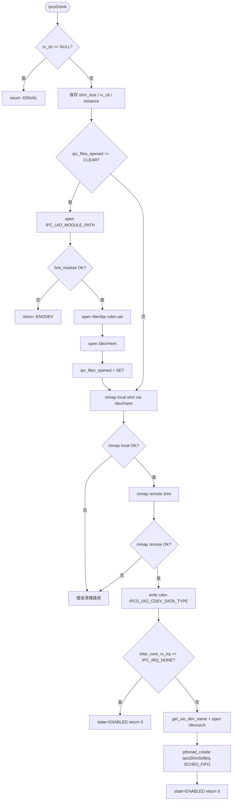

### 3.3.2 ipcsOsFree

<table border="1" cellspacing="0" cellpadding="4">
<tbody>
<tr><td>对应软件架构ID</td><td colspan="4">Drv_Ipcs_Linux_Uio_User_Glue</td></tr>
<tr><td>函数说明</td><td colspan="4">释放指定 instance 的 OS 资源：标记 instance 为 DISABLED；若配置了 Rx IRQ 则 disable HW IRQ、取消并 join softirq 线程、关闭 UIO fd；munmap 本地/远端 SHM；当所有 instance 均 DISABLED 时关闭 cdev 与 /dev/mem 并 delete_module 卸载内核模块。</td></tr>
<tr><td>函数原型</td><td colspan="4">void ipcsOsFree(const uint8_t instance)</td></tr>
<tr><td>制约条件</td><td colspan="4">无返回值；若仍有其他 ENABLED instance 则保留全局 cdev/mem 与已加载模块。</td></tr>
<tr><td rowspan="2">输入/输出参数</td><td>I/O</td><td>参数名</td><td>数据类型</td><td>说明</td></tr>
<tr><td>I</td><td>instance</td><td>const uint8_t</td><td>IPCS shared memory instance 索引</td></tr>
<tr><td rowspan="2">返回值</td><td colspan="2">数据类型</td><td colspan="2">说明</td></tr>
<tr><td colspan="4">-</td></tr>
<tr><td>函数定义文件</td><td colspan="4">ipc-shm/os_uio/ipc-os.c</td></tr>
<tr><td>函数声明文件</td><td colspan="4">ipc-shm/os_uio/ipc-os.h</td></tr>
<tr><td>满足需求</td><td colspan="4">（架构需求 ID 由项目基线映射）</td></tr>
</tbody>
</table>

**处理流程**

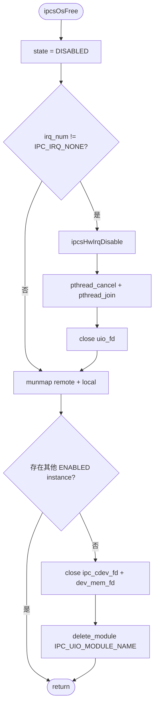

### 3.3.3 ipcsOsGetLocalShm

<table border="1" cellspacing="0" cellpadding="4">
<tbody>
<tr><td>对应软件架构ID</td><td colspan="4">Drv_Ipcs_Linux_Uio_User_Glue</td></tr>
<tr><td>函数说明</td><td colspan="4">返回指定 instance 的本地共享内存虚拟地址（mmap 后加页内偏移）。</td></tr>
<tr><td>函数原型</td><td colspan="4">uintptr_t ipcsOsGetLocalShm(const uint8_t instance)</td></tr>
<tr><td>制约条件</td><td colspan="4">instance 已由 ipcsOsInit 成功初始化。</td></tr>
<tr><td rowspan="2">输入/输出参数</td><td>I/O</td><td>参数名</td><td>数据类型</td><td>说明</td></tr>
<tr><td>I</td><td>instance</td><td>const uint8_t</td><td>IPCS shared memory instance 索引</td></tr>
<tr><td rowspan="2">返回值</td><td colspan="2">数据类型</td><td colspan="2">说明</td></tr>
<tr><td colspan="2">uintptr_t</td><td colspan="2">local_virt_shm 指针值</td></tr>
<tr><td>函数定义文件</td><td colspan="4">ipc-shm/os_uio/ipc-os.c</td></tr>
<tr><td>函数声明文件</td><td colspan="4">ipc-shm/os_uio/ipc-os.h</td></tr>
<tr><td>满足需求</td><td colspan="4">（架构需求 ID 由项目基线映射）</td></tr>
</tbody>
</table>

**处理流程**

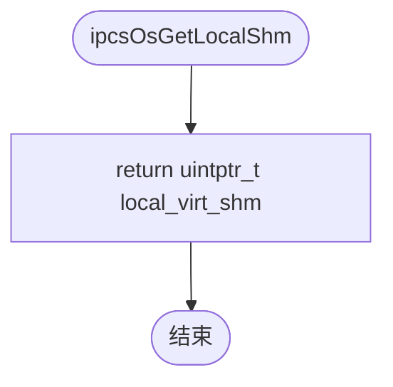

### 3.3.4 ipcsOsGetRemoteShm

<table border="1" cellspacing="0" cellpadding="4">
<tbody>
<tr><td>对应软件架构ID</td><td colspan="4">Drv_Ipcs_Linux_Uio_User_Glue</td></tr>
<tr><td>函数说明</td><td colspan="4">返回指定 instance 的远端共享内存虚拟地址（mmap 后加页内偏移）。</td></tr>
<tr><td>函数原型</td><td colspan="4">uintptr_t ipcsOsGetRemoteShm(const uint8_t instance)</td></tr>
<tr><td>制约条件</td><td colspan="4">instance 已由 ipcsOsInit 成功初始化。</td></tr>
<tr><td rowspan="2">输入/输出参数</td><td>I/O</td><td>参数名</td><td>数据类型</td><td>说明</td></tr>
<tr><td>I</td><td>instance</td><td>const uint8_t</td><td>IPCS shared memory instance 索引</td></tr>
<tr><td rowspan="2">返回值</td><td colspan="2">数据类型</td><td colspan="2">说明</td></tr>
<tr><td colspan="2">uintptr_t</td><td colspan="2">remote_virt_shm 指针值</td></tr>
<tr><td>函数定义文件</td><td colspan="4">ipc-shm/os_uio/ipc-os.c</td></tr>
<tr><td>函数声明文件</td><td colspan="4">ipc-shm/os_uio/ipc-os.h</td></tr>
<tr><td>满足需求</td><td colspan="4">（架构需求 ID 由项目基线映射）</td></tr>
</tbody>
</table>

**处理流程**

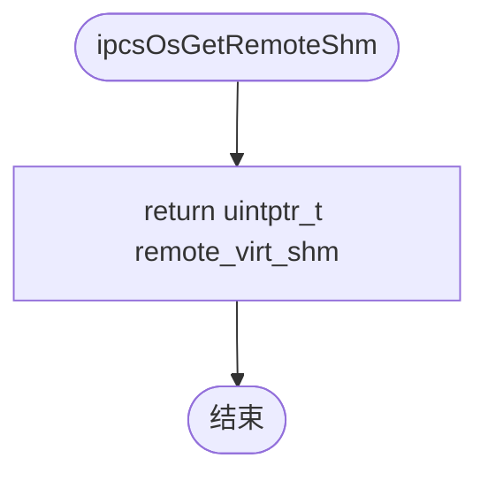

### 3.3.5 ipcsOsPollChannels

<table border="1" cellspacing="0" cellpadding="4">
<tbody>
<tr><td>对应软件架构ID</td><td colspan="4">Drv_Ipcs_Linux_Uio_User_Glue</td></tr>
<tr><td>函数说明</td><td colspan="4">在 polling 模式下调用初始化时注册的 rx_cb；若 instance 配置了 Rx 硬件中断则返回 -EOPNOTSUPP，由 softirq 线程处理接收。</td></tr>
<tr><td>函数原型</td><td colspan="4">int ipcsOsPollChannels(const uint8_t instance)</td></tr>
<tr><td>制约条件</td><td colspan="4">仅当 ipc_os_priv.id[instance].irq_num == IPC_IRQ_NONE 时执行 polling。</td></tr>
<tr><td rowspan="2">输入/输出参数</td><td>I/O</td><td>参数名</td><td>数据类型</td><td>说明</td></tr>
<tr><td>I</td><td>instance</td><td>const uint8_t</td><td>IPCS shared memory instance 索引</td></tr>
<tr><td rowspan="2">返回值</td><td colspan="2">数据类型</td><td colspan="2">说明</td></tr>
<tr><td colspan="2">int</td><td colspan="2">irq_num==IPC_IRQ_NONE 且 rx_cb 非空：返回 rx_cb(instance, IPC_SOFTIRQ_BUDGET) 的工作量和；rx_cb 为空：-EINVAL；已配置 IRQ：-EOPNOTSUPP</td></tr>
<tr><td>函数定义文件</td><td colspan="4">ipc-shm/os_uio/ipc-os.c</td></tr>
<tr><td>函数声明文件</td><td colspan="4">ipc-shm/os_uio/ipc-os.h</td></tr>
<tr><td>满足需求</td><td colspan="4">（架构需求 ID 由项目基线映射）</td></tr>
</tbody>
</table>

**处理流程**

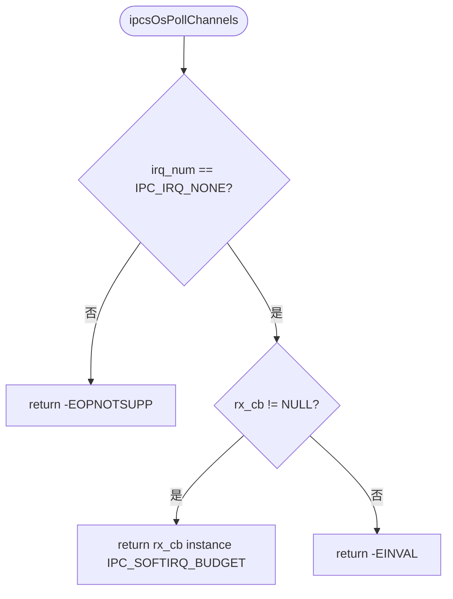

### 3.3.6 ipcsHwInit

<table border="1" cellspacing="0" cellpadding="4">
<tbody>
<tr><td>对应软件架构ID</td><td colspan="4">Drv_Ipcs_Linux_Uio_User_Glue</td></tr>
<tr><td>函数说明</td><td colspan="4">用户态空实现：HW 初始化由内核 UIO 模块在 ipcsCdevWrite → ipcsUioInit → ipcsHwInit 路径完成。</td></tr>
<tr><td>函数原型</td><td colspan="4">int ipcsHwInit(const uint8_t instance, const struct IPCS_SHM_CFG_TYPE *cfg)</td></tr>
<tr><td>制约条件</td><td colspan="4">-</td></tr>
<tr><td rowspan="3">输入/输出参数</td><td>I/O</td><td>参数名</td><td>数据类型</td><td>说明</td></tr>
<tr><td>I</td><td>instance</td><td>const uint8_t</td><td>IPCS shared memory instance 索引</td></tr>
<tr><td>I</td><td>cfg</td><td>const struct IPCS_SHM_CFG_TYPE *</td><td>配置参数（用户态未使用）</td></tr>
<tr><td rowspan="2">返回值</td><td colspan="2">数据类型</td><td colspan="2">说明</td></tr>
<tr><td colspan="2">int</td><td colspan="2">恒为 0</td></tr>
<tr><td>函数定义文件</td><td colspan="4">ipc-shm/os_uio/ipc-os.c</td></tr>
<tr><td>函数声明文件</td><td colspan="4">ipc-shm/hw/ipc-hw.h</td></tr>
<tr><td>满足需求</td><td colspan="4">（架构需求 ID 由项目基线映射）</td></tr>
</tbody>
</table>

**处理流程**

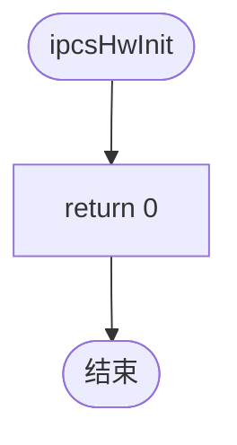

### 3.3.7 ipcsHwFree

<table border="1" cellspacing="0" cellpadding="4">
<tbody>
<tr><td>对应软件架构ID</td><td colspan="4">Drv_Ipcs_Linux_Uio_User_Glue</td></tr>
<tr><td>函数说明</td><td colspan="4">用户态空实现：HW 释放由内核 UIO 模块负责。</td></tr>
<tr><td>函数原型</td><td colspan="4">void ipcsHwFree(const uint8_t instance)</td></tr>
<tr><td>制约条件</td><td colspan="4">-</td></tr>
<tr><td rowspan="2">输入/输出参数</td><td>I/O</td><td>参数名</td><td>数据类型</td><td>说明</td></tr>
<tr><td>I</td><td>instance</td><td>const uint8_t</td><td>IPCS shared memory instance 索引（未使用）</td></tr>
<tr><td rowspan="2">返回值</td><td colspan="2">数据类型</td><td colspan="2">说明</td></tr>
<tr><td colspan="4">-</td></tr>
<tr><td>函数定义文件</td><td colspan="4">ipc-shm/os_uio/ipc-os.c</td></tr>
<tr><td>函数声明文件</td><td colspan="4">ipc-shm/hw/ipc-hw.h</td></tr>
<tr><td>满足需求</td><td colspan="4">（架构需求 ID 由项目基线映射）</td></tr>
</tbody>
</table>

**处理流程**

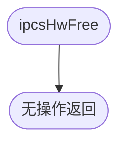

### 3.3.8 ipcsHwIrqEnable

<table border="1" cellspacing="0" cellpadding="4">
<tbody>
<tr><td>对应软件架构ID</td><td colspan="4">Drv_Ipcs_Linux_Uio_User_Glue</td></tr>
<tr><td>函数说明</td><td colspan="4">通过 UIO 设备 write 发送 IPC_UIO_ENABLE_CMD，由内核 ipcsShmUioIrqcontrol 调用 ipcsHwIrqEnable 使能远端 Rx 通知。</td></tr>
<tr><td>函数原型</td><td colspan="4">void ipcsHwIrqEnable(const uint8_t instance)</td></tr>
<tr><td>制约条件</td><td colspan="4">instance 已打开 uio_fd。</td></tr>
<tr><td rowspan="2">输入/输出参数</td><td>I/O</td><td>参数名</td><td>数据类型</td><td>说明</td></tr>
<tr><td>I</td><td>instance</td><td>const uint8_t</td><td>IPCS shared memory instance 索引</td></tr>
<tr><td rowspan="2">返回值</td><td colspan="2">数据类型</td><td colspan="2">说明</td></tr>
<tr><td colspan="4">-</td></tr>
<tr><td>函数定义文件</td><td colspan="4">ipc-shm/os_uio/ipc-os.c</td></tr>
<tr><td>函数声明文件</td><td colspan="4">ipc-shm/hw/ipc-hw.h</td></tr>
<tr><td>满足需求</td><td colspan="4">（架构需求 ID 由项目基线映射）</td></tr>
</tbody>
</table>

**处理流程**

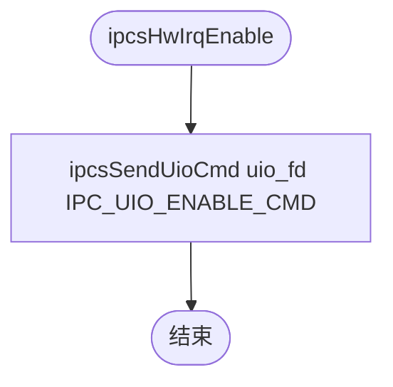

### 3.3.9 ipcsHwIrqDisable

<table border="1" cellspacing="0" cellpadding="4">
<tbody>
<tr><td>对应软件架构ID</td><td colspan="4">Drv_Ipcs_Linux_Uio_User_Glue</td></tr>
<tr><td>函数说明</td><td colspan="4">通过 UIO 设备 write 发送 IPC_UIO_DISABLE_CMD，由内核调用 ipcsHwIrqDisable。</td></tr>
<tr><td>函数原型</td><td colspan="4">void ipcsHwIrqDisable(const uint8_t instance)</td></tr>
<tr><td>制约条件</td><td colspan="4">instance 已打开 uio_fd。</td></tr>
<tr><td rowspan="2">输入/输出参数</td><td>I/O</td><td>参数名</td><td>数据类型</td><td>说明</td></tr>
<tr><td>I</td><td>instance</td><td>const uint8_t</td><td>IPCS shared memory instance 索引</td></tr>
<tr><td rowspan="2">返回值</td><td colspan="2">数据类型</td><td colspan="2">说明</td></tr>
<tr><td colspan="4">-</td></tr>
<tr><td>函数定义文件</td><td colspan="4">ipc-shm/os_uio/ipc-os.c</td></tr>
<tr><td>函数声明文件</td><td colspan="4">ipc-shm/hw/ipc-hw.h</td></tr>
<tr><td>满足需求</td><td colspan="4">（架构需求 ID 由项目基线映射）</td></tr>
</tbody>
</table>

**处理流程**

### 3.3.10 ipcsHwIrqNotify

<table border="1" cellspacing="0" cellpadding="4">
<tbody>
<tr><td>对应软件架构ID</td><td colspan="4">Drv_Ipcs_Linux_Uio_User_Glue</td></tr>
<tr><td>函数说明</td><td colspan="4">通过 UIO 设备 write 发送 IPC_UIO_TRIGGER_CMD，由内核调用 ipcsHwIrqNotify 触发对端核间中断。</td></tr>
<tr><td>函数原型</td><td colspan="4">void ipcsHwIrqNotify(const uint8_t instance)</td></tr>
<tr><td>制约条件</td><td colspan="4">instance 已打开 uio_fd。</td></tr>
<tr><td rowspan="2">输入/输出参数</td><td>I/O</td><td>参数名</td><td>数据类型</td><td>说明</td></tr>
<tr><td>I</td><td>instance</td><td>const uint8_t</td><td>IPCS shared memory instance 索引</td></tr>
<tr><td rowspan="2">返回值</td><td colspan="2">数据类型</td><td colspan="2">说明</td></tr>
<tr><td colspan="4">-</td></tr>
<tr><td>函数定义文件</td><td colspan="4">ipc-shm/os_uio/ipc-os.c</td></tr>
<tr><td>函数声明文件</td><td colspan="4">ipc-shm/hw/ipc-hw.h</td></tr>
<tr><td>满足需求</td><td colspan="4">（架构需求 ID 由项目基线映射）</td></tr>
</tbody>
</table>

**处理流程**

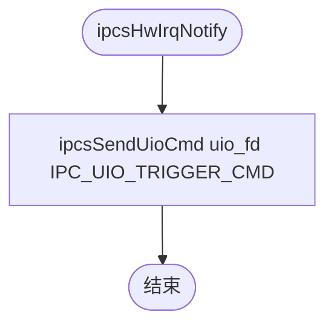

## 3.4 Internal Functions 内部函数（User Glue）

本节描述 `os_uio/ipc-os.c` 中 `static` 函数及 Rx softirq 线程入口。

### 3.4.1 line_from_file

<table border="1" cellspacing="0" cellpadding="4">
<tbody>
<tr><td>对应软件架构ID</td><td colspan="4">Drv_Ipcs_Linux_Uio_User_Glue</td></tr>
<tr><td>函数说明</td><td colspan="4">从指定文件读取第一行到缓冲区，遇换行符截断为 C 字符串。</td></tr>
<tr><td>函数原型</td><td colspan="4">static int line_from_file(char *filename, char *buf)</td></tr>
<tr><td>制约条件</td><td colspan="4">buf 长度至少满足 IPC_UIO_PARAMS_LEN（130）清零与 IPC_SHM_UIO_BUF_LEN（255）读取。</td></tr>
<tr><td rowspan="3">输入/输出参数</td><td>I/O</td><td>参数名</td><td>数据类型</td><td>说明</td></tr>
<tr><td>I</td><td>filename</td><td>char *</td><td>待读取文件路径</td></tr>
<tr><td>O</td><td>buf</td><td>char *</td><td>输出首行内容</td></tr>
<tr><td rowspan="2">返回值</td><td colspan="2">数据类型</td><td colspan="2">说明</td></tr>
<tr><td colspan="2">int</td><td colspan="2">0：成功；-ENONET：fopen 失败；-EIO：fgets 失败</td></tr>
<tr><td>函数定义文件</td><td colspan="4">ipc-shm/os_uio/ipc-os.c</td></tr>
<tr><td>函数声明文件</td><td colspan="4">-</td></tr>
</tbody>
</table>

**处理流程**

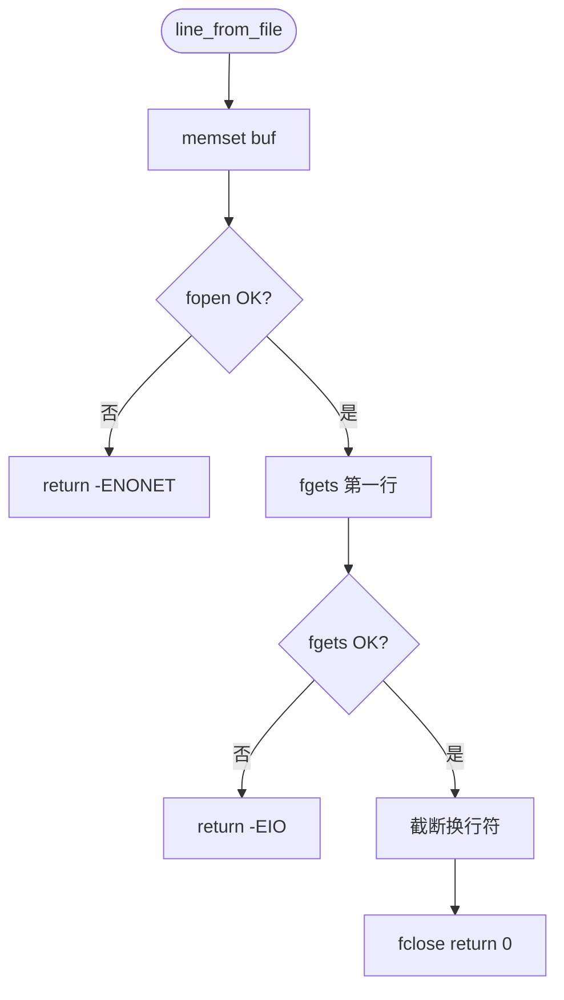

### 3.4.2 line_match

<table border="1" cellspacing="0" cellpadding="4">
<tbody>
<tr><td>对应软件架构ID</td><td colspan="4">Drv_Ipcs_Linux_Uio_User_Glue</td></tr>
<tr><td>函数说明</td><td colspan="4">读取文件首行并与 filter 字符串比较，用于匹配 UIO sysfs name/version。</td></tr>
<tr><td>函数原型</td><td colspan="4">static int line_match(char *filename, char *filter)</td></tr>
<tr><td>制约条件</td><td colspan="4">-</td></tr>
<tr><td rowspan="3">输入/输出参数</td><td>I/O</td><td>参数名</td><td>数据类型</td><td>说明</td></tr>
<tr><td>I</td><td>filename</td><td>char *</td><td>文件路径</td></tr>
<tr><td>I</td><td>filter</td><td>char *</td><td>期望匹配字符串</td></tr>
<tr><td rowspan="2">返回值</td><td colspan="2">数据类型</td><td colspan="2">说明</td></tr>
<tr><td colspan="2">int</td><td colspan="2">0：匹配；非 0：line_from_file 错误或 strncmp 不匹配返回 EINVAL</td></tr>
<tr><td>函数定义文件</td><td colspan="4">ipc-shm/os_uio/ipc-os.c</td></tr>
<tr><td>函数声明文件</td><td colspan="4">-</td></tr>
</tbody>
</table>

**处理流程**

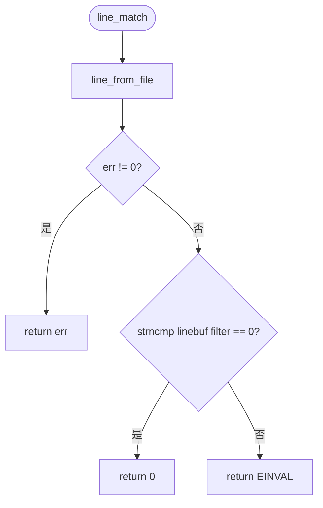

### 3.4.3 get_uio_dev_name

<table border="1" cellspacing="0" cellpadding="4">
<tbody>
<tr><td>对应软件架构ID</td><td colspan="4">Drv_Ipcs_Linux_Uio_User_Glue</td></tr>
<tr><td>函数说明</td><td colspan="4">扫描 IPC_SHM_UIO_DIR（/sys/class/uio），查找 name 为 instance_N、version 为 DRIVER_VERSION（2.0）的 UIO 目录名并写入 dev_name。</td></tr>
<tr><td>函数原型</td><td colspan="4">static int get_uio_dev_name(char *dev_name, const uint8_t instance)</td></tr>
<tr><td>制约条件</td><td colspan="4">内核已注册对应 instance 的 UIO 设备。</td></tr>
<tr><td rowspan="3">输入/输出参数</td><td>I/O</td><td>参数名</td><td>数据类型</td><td>说明</td></tr>
<tr><td>O</td><td>dev_name</td><td>char *</td><td>输出 UIO 目录名（用于拼接 /dev/）</td></tr>
<tr><td>I</td><td>instance</td><td>const uint8_t</td><td>instance 索引</td></tr>
<tr><td rowspan="2">返回值</td><td colspan="2">数据类型</td><td colspan="2">说明</td></tr>
<tr><td colspan="2">int</td><td colspan="2">0：找到；-ENONET：未找到；-EIO：scandir/sprintf/snprintf 失败</td></tr>
<tr><td>函数定义文件</td><td colspan="4">ipc-shm/os_uio/ipc-os.c</td></tr>
<tr><td>函数声明文件</td><td colspan="4">-</td></tr>
</tbody>
</table>

**处理流程**

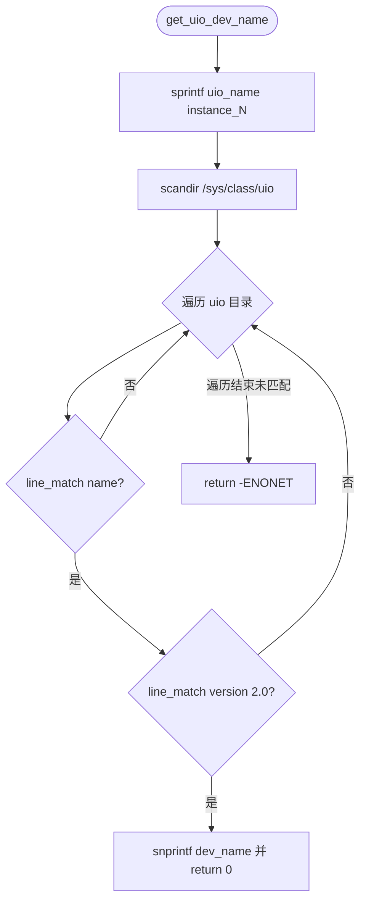

### 3.4.4 ipcsShmSoftirq

<table border="1" cellspacing="0" cellpadding="4">
<tbody>
<tr><td>对应软件架构ID</td><td colspan="4">Drv_Ipcs_Linux_Uio_User_Glue</td></tr>
<tr><td>函数说明</td><td colspan="4">Rx softirq 线程入口：无限循环中在 rx_cb 非空时 read(uio_fd) 阻塞等待内核中断事件，然后以 IPC_SOFTIRQ_BUDGET 为预算循环调用 rx_cb，work>=budget 时 sched_yield，最后 ipcsHwIrqEnable 重新使能中断。</td></tr>
<tr><td>函数原型</td><td colspan="4">static void *ipcsShmSoftirq(void *arg)</td></tr>
<tr><td>制约条件</td><td colspan="4">arg 指向 IPCS_OS_PRIV_INSTANCE_TYPE；线程属性为 SCHED_FIFO 最高优先级（ipcsOsInit 中设置）。</td></tr>
<tr><td rowspan="2">输入/输出参数</td><td>I/O</td><td>参数名</td><td>数据类型</td><td>说明</td></tr>
<tr><td>I</td><td>arg</td><td>void *</td><td>指向 struct IPCS_OS_PRIV_INSTANCE_TYPE</td></tr>
<tr><td rowspan="2">返回值</td><td colspan="2">数据类型</td><td colspan="2">说明</td></tr>
<tr><td colspan="2">void *</td><td colspan="2">正常不退出；返回 NULL（不可达于 while(1) 之外）</td></tr>
<tr><td>函数定义文件</td><td colspan="4">ipc-shm/os_uio/ipc-os.c</td></tr>
<tr><td>函数声明文件</td><td colspan="4">-</td></tr>
</tbody>
</table>

**处理流程**

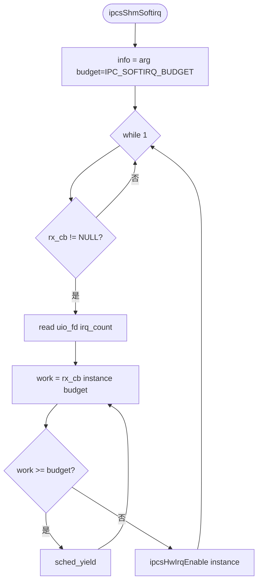

### 3.4.5 ipcsSendUioCmd

<table border="1" cellspacing="0" cellpadding="4">
<tbody>
<tr><td>对应软件架构ID</td><td colspan="4">Drv_Ipcs_Linux_Uio_User_Glue</td></tr>
<tr><td>函数说明</td><td colspan="4">向 UIO 设备 fd 写入 4 字节命令整数；写入长度不等于 sizeof(int) 时打印调试信息。</td></tr>
<tr><td>函数原型</td><td colspan="4">static void ipcsSendUioCmd(uint32_t uio_fd, int32_t cmd)</td></tr>
<tr><td>制约条件</td><td colspan="4">uio_fd 为有效打开的描述符。</td></tr>
<tr><td rowspan="3">输入/输出参数</td><td>I/O</td><td>参数名</td><td>数据类型</td><td>说明</td></tr>
<tr><td>I</td><td>uio_fd</td><td>uint32_t</td><td>UIO 设备文件描述符（源码形参类型）</td></tr>
<tr><td>I</td><td>cmd</td><td>int32_t</td><td>IPC_UIO_DISABLE/ENABLE/TRIGGER_CMD</td></tr>
<tr><td rowspan="2">返回值</td><td colspan="2">数据类型</td><td colspan="2">说明</td></tr>
<tr><td colspan="4">-</td></tr>
<tr><td>函数定义文件</td><td colspan="4">ipc-shm/os_uio/ipc-os.c</td></tr>
<tr><td>函数声明文件</td><td colspan="4">-</td></tr>
</tbody>
</table>

**处理流程**

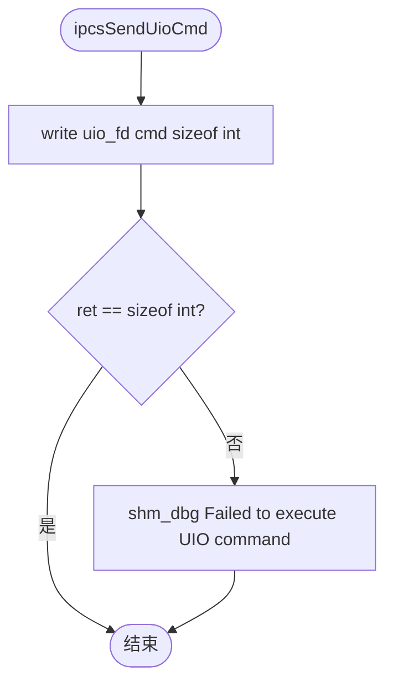

## 3.5 Global variants 全局变量

| 符号 | 类型 | 文件 | 说明 |
|---|---|---|---|
| `ipc_os_priv` | `static struct IPCS_OS_PRIV_TYPE_TYPE` | `os_uio/ipc-os.c` | 全局 OS 私有数据：ipc_files_opened、ipc_cdev_fd、dev_mem_fd、每 instance 的 `IPCS_OS_PRIV_INSTANCE_TYPE id[4]` |

## 3.6 Data Structure 类型定义

### 3.6.1 enum ipc_status（文件内）

| 枚举值 | 数值 | 说明 |
|---|---|---|
| IPC_STATUS_CLEAR | 0 | 设备文件未打开 |
| IPC_STATUS_SET | 1 | 设备文件已打开 |

### 3.6.2 struct IPCS_OS_PRIV_INSTANCE_TYPE

| 成员 | 类型 | 说明（源自源码注释） |
|---|---|---|
| state | uint8_t | instance 是否已初始化 |
| instance | uint8_t | instance 索引 |
| irq_num | int | inter_core_rx_irq 配置值 |
| uio_fd | int | UIO 设备 fd |
| local_virt_shm | void * | 本地 SHM 虚拟地址 |
| remote_virt_shm | void * | 远端 SHM 虚拟地址 |
| local_shm_map | void * | 本地 mmap 页基址 |
| remote_shm_map | void * | 远端 mmap 页基址 |
| local_shm_offset | size_t | 本地页内偏移 |
| remote_shm_offset | size_t | 远端页内偏移 |
| shm_size | size_t | SHM 大小 |
| rx_cb | int (*)(const uint8_t, int) | 上层 Rx 回调 |
| irq_thread_id | pthread_t | Rx 线程 id |

### 3.6.3 struct IPCS_OS_PRIV_TYPE_TYPE

| 成员 | 类型 | 说明 |
|---|---|---|
| ipc_files_opened | uint8_t | 全局 cdev/mem/模块是否已打开 |
| ipc_cdev_fd | int | /dev/ipc-cdev-uio |
| dev_mem_fd | int | /dev/mem |
| id | struct IPCS_OS_PRIV_INSTANCE_TYPE[IPC_SHM_MAX_INSTANCES] | 每 instance 私有数据 |

### 3.6.4 struct IPCS_UIO_CDEV_DATA_TYPE（User-Kernel 载荷）

| 成员 | 类型 | 说明 |
|---|---|---|
| instance | uint8_t | instance 索引 |
| cfg | struct IPCS_SHM_CFG_TYPE | 完整 SHM/HW 配置 |

定义文件：`ipc-shm/os_kernel/ipc-uio.h`（用户态通过 `-I../os_kernel` 包含）。

### 3.6.5 相关宏（os_uio/ipc-os.c）

| 宏 | 值 | 说明 |
|---|---|---|
| IPC_UIO_DEV_MEM_NAME | "/dev/mem" | 物理内存映射 |
| IPC_UIO_CDEV_NAME | "/dev/ipc-cdev-uio" | 初始化 cdev |
| IPC_SHM_UIO_DIR | "/sys/class/uio" | UIO sysfs |
| IPC_SHM_UIO_BUF_LEN | 255 | 路径/行缓冲 |
| IPC_UIO_PARAMS_LEN | 130 | line_from_file 清零长度 |
| DRIVER_VERSION | "2.0" | 与内核 IPC_UIO_VERSION 一致 |
| RX_SOFTIRQ_POLICY | SCHED_FIFO | softirq 调度策略 |
| IPC_SHM_MAX_INSTANCES | 4u | 最大 instance 数 |
| IPC_SOFTIRQ_BUDGET | 128u | `ipc-os.h` |

## 3.7 Kernel Driver 概要设计

内核侧 `Drv_Ipcs_Linux_Uio_Driver` 与 `hw/c1/ipc-hw.c` 函数级表格从略；下表列出 `ipc-uio.c` 中全部函数单元供追溯，详细契约可据同格式在评审阶段扩展。

| 函数 | 可见性 | 职责摘要 |
|---|---|---|
| ipcsShmUioOpen | static | UIO open；refcnt 单开 |
| ipcsShmUioRelease | static | UIO release；恢复 refcnt |
| ipcsShmUioIrqcontrol | static | 处理 UIO write 命令 → ipcsHw* |
| ipcsShmUioHandler | static | 硬中断：disable + clear → IRQ_HANDLED |
| ipcsUioInit | static | sprintf uio_name；ipcsHwInit；platform_get_irq；uio_register_device |
| ipcsCdevOpen | static | mutex_trylock |
| ipcsCdevRelease | static | mutex_unlock |
| ipcsCdevWrite | static | copy_from_user IPCS_UIO_CDEV_DATA_TYPE → ipcsUioInit |
| ipcsShmUioProbe | static | 映射 MSCM；alloc_chrdev_region；cdev/class/device |
| ipcsShmUioRemove | static | 销毁 cdev/device；uio_unregister_device |
| ipcsOsMapIntc | global | 返回 pdev_reg |
| ipcsOsUnmapIntc | global | 空实现 |

内核 `ipcsHw*` 实现见 `hw/c1/ipc-hw.c`：`ipcsHwInit` → `_ipcsHwInit`；`ipcsHwIrqEnable/Disable/Notify/Clear` 操作 MSCM `IRSPRC` / `IRCPnIRx` 寄存器。

## 3.8 Traceability and Consistency Evidence 追溯与一致性证据

| 检查项 | 证据 |
|---|---|
| User Glue 外部 API 与 `ipc-os.h` / `ipc-hw.h` 一致 | `os_uio/ipc-os.h` 声明 5 个 `ipcsOs*`；`ipc-hw.h` 声明 5 个 `ipcsHw*`，均在 `ipc-os.c` 定义 |
| User Glue 内部函数无遗漏 | `ipc-os.c` 中 static：`line_from_file`, `line_match`, `get_uio_dev_name`, `ipcsShmSoftirq`, `ipcsSendUioCmd` |
| UIO 命令与内核一致 | `ipc-uio.h` `IPC_UIO_*_CMD` ↔ `ipcsShmUioIrqcontrol` switch |
| UIO name/version 匹配 | 内核 `instance_%d` + `IPC_UIO_VERSION "2.0"` ↔ 用户 `get_uio_dev_name` |
| cdev 载荷 | `IPCS_UIO_CDEV_DATA_TYPE` 在 write/read 两侧 sizeof 一致 |
| HW 用户态委托 | `ipcsHwInit/Free` 用户态 return 0 / 空；内核 `ipcsUioInit` 调用 `ipcsHwInit` |
| 函数契约表格式 | 与 `ipcs_sdd.md` 3.3.1 相同 HTML table 列结构 |
| 流程图 | 每节表格后附 mermaid flowchart，逻辑与源码控制流一致 |

---

*文档结束。所有接口、数据结构、错误码、设备路径与宏均来自 `ipc-shm/os_uio`、`ipc-shm/os_kernel/ipc-uio.*`、`ipc-shm/hw/c1/ipc-hw.c` 源码，未添加源码中不存在的 API。*
