SW Detail Design Specification

For IPCS Driver

IPCS Driver软件详细设计规范

| ROLES角色 | Name姓名 | Department部门 | Date日期 |
|---|---|---|---|
| AUTHOR(S)作者： | 倘亚朋 | 软件研发部 | 2026.5.22 |
| REVIEWER(S)审查： | 安然/赵笃/喻明睿/张帅/伊焕利/肖敏元/倘亚朋/宋晓婷/栗瑞江/Wenke | 软件研发部 | 2026.5.22 |
| APPROVER (S)批准： | 安然 | 软件研发部 | 2026.5.22 |

| Version / 版本 | Date / 日期 | Editor / 编辑人 | Status / 文档状态 | Change description / 变更简述 |
|---|---|---|---|---|
| V0.1 | 2026.5.7 | Cursor Agent | Draft | Initial version for review，基于软件需求、ipcs-architecture.pdf、reference.md 与 ASPICE SWE.3 生成 |
| V0.2 | 2026.5.19 | Cursor Agent | Draft | 按 ASPICE SWE.3 重构为第 1–6 章；新增 章节2.4–2.6、Linux Refinement、第 5 章与第 6 章追溯 |
| V0.7 | 2026.5.19 | Cursor Agent | Draft | 完善 Linux 部署变体函数设计、关键场景 SVG 与分层静态图 |
| V0.8 | 2026.5.19 | Cursor Agent | Draft | 章节5.7/章节6.7 跨单元场景改为 UML 序列图（PlantUML→SVG） |
| V0.9 | 2026.5.20 | Cursor Agent | Draft | 新增第 7 章双向追溯矩阵（架构 章节2.4 × 章节2 单元 × 物理实现） |
| V1.0 | 2026.5.20 | Cursor Agent | Draft | 章节序号连贯（5.x 重排、6.5/6.7 子节）；第 7 章追溯矩阵产品化（剔除过程类伪追溯行） |
| V1.1 | 2026.5.20 | Cursor Agent | Draft | 章节5.1/5.2、章节6.1/6.2 对齐 章节4.1/4.2；头文件组件 UML→SVG；实现文件列表核对 PASS |
| V0.6 | 2026.5.19 | Cursor Agent | Draft | 补强第 2、3 章；明确 UIO/CDEV 与全内核实现的用户侧/内核侧职责 |
| V0.5 | 2026.5.19 | Cursor Agent | Draft | 精简第 2 章为组件—单元映射；重写第 3 章分层与部署变体；清理目录重复项 |
| V0.4 | 2026.5.19 | Cursor Agent | Draft | 拆分第 2 章；新增第 3 章三层架构与 Linux 适配；勘误 UIO/CDEV 代理与全内核形态 |
| V0.3 | 2026.5.19 | Cursor Agent | Draft | 第 2 章改为架构符合性与软件单元划分；增加 SW-Unit-ID 与组件映射；插图全部 SVG；对照详细设计与实现一致性修订 |

## CONTENTS 目录

- 1 INTRODUCTION简介
  - 1.1 Confidentiality 保密性
  - 1.2 Purpose of the document文档目的
  - 1.3 Scope范围
  - 1.4 References 参考文件
  - 1.5 Abbreviations缩略语
- 2 SOFTWARE UNIT IDENTIFICATION 软件单元划分
  - 2.1 Software Unit List 软件单元清单
  - 2.2 Architecture Component to Software Unit Mapping 架构组件与软件单元映射
- 3 LAYERED ARCHITECTURE AND DEPLOYMENT VARIANTS 分层架构与部署变体设计
  - 3.1 SHM / OSAL / HAL Interface Contract 三层接口契约
  - 3.2 RTOS Deployment Variant RTOS 部署变体
  - 3.3 Linux Deployment Variants Linux 部署变体
  - 3.3.1 UIO Implementation UIO 实现
  - 3.3.2 CDEV Implementation CDEV 实现
  - 3.3.3 In-Kernel Implementation 全内核实现
  - 3.4 OSAL/HAL Implementation Mapping OSAL/HAL 实现对照
- 4 COMMON SOFTWARE UNIT DETAILED DESIGN 公共软件单元详细设计
  - 4.1 Definition and Scope 定义与范围
  - 4.2 File Structure 文件结构
  - 4.3 SWU_IPCS_CORE_SHM Software Unit Design — External Interfaces 软件单元设计 — 外部接口
  - 4.4 SWU_IPCS_CORE_SHM、SWU_IPCS_CORE_QUEUE、SWU_IPCS_CORE_UTIL Software Unit Design — Internal Functions 软件单元设计 — 内部函数
  - 4.5 Global Variables 全局变量
  - 4.6 Data Types 类型定义
  - 4.7 Dynamic Detailed Design 动态详细设计
- 5 RTOS DEPLOYMENT VARIANT DETAILED DESIGN RTOS 部署变体详细设计
  - 5.1 Definition and Scope 定义与范围
  - 5.2 File Structure 文件结构
  - 5.3 SWU_IPCS_OSAL_AUTOSAR Software Unit Design 软件单元设计
  - 5.4 SWU_IPCS_OSAL_FREERTOS Software Unit Design 软件单元设计
  - 5.5 SWU_IPCS_OSAL_THREADX Software Unit Design 软件单元设计
  - 5.6 SWU_IPCS_HAL_MCU Software Unit Design 软件单元设计
  - 5.7 Global Variables 全局变量
  - 5.8 Data Types 类型定义
  - 5.9 Dynamic Detailed Design 动态详细设计
- 6 LINUX DEPLOYMENT VARIANT DETAILED DESIGN Linux 部署变体详细设计
  - 6.1 Definition and Scope 定义与范围
  - 6.2 File Structure 文件结构
  - 6.3 SWU_IPCS_LINUX_OS_KERN Software Unit Design 软件单元设计
  - 6.4 SWU_IPCS_LINUX_OS_UIO Software Unit Design 软件单元设计
  - 6.5 SWU_IPCS_LINUX_UIO_KO Software Unit Design 软件单元设计
  - 6.6 SWU_IPCS_LINUX_OS_CDEV Software Unit Design 软件单元设计
  - 6.7 SWU_IPCS_LINUX_CDEV_KO Software Unit Design 软件单元设计
  - 6.8 SWU_IPCS_HAL_LINUX Software Unit Design 软件单元设计
  - 6.9 Dynamic Detailed Design 动态详细设计
  - 6.10 Global Variables 全局变量
  - 6.11 Data Types 类型定义
- 7 BIDIRECTIONAL TRACEABILITY AND CONSISTENCY 双向追溯与一致性
  - 7.1 Traceability Statement 追溯性策略与声明
  - 7.2 Bidirectional Traceability Matrix 双向追溯矩阵

# 1 INTRODUCTION 简介

## 1.1 CONFIDENTIALITY 保密性

任何披露必须与负责的流程经理协调。

本文件过程说明仅限直接参与项目的人员查看。转让给其他方，尤其是 Star Gather 以外的合作伙伴，必须由项目负责人协调，并受开发合同中有关保密规定的约束。

## 1.2 DOCUMENT PURPOSE 文档目的

本文档按照 SWE.3 Software Detailed Design and Unit Construction 的要求，为 IPCS Driver（RTOS 与 Linux 部署变体）建立软件详细设计。文档内容描述软件单元的静态结构、接口、数据结构、关键动态行为，并与 IPCS 软件架构中定义的组件和接口保持一致。

## 1.3 SCOPE 范围

本文档规定 IPC Shared Memory Driver（IPCS Driver）的软件详细设计（SWE.3）范围。**设计输入**为：已分配的软件需求、软件架构设计、ASPICE SWE.3 过程要求及约束。**设计输出**为下文各章所述的软件单元结构、接口、数据类型与动态行为。

设计范围包括：

- 跨部署变体共享的通信核心与队列（架构组件 Drv_Ipcs_Core_Cmp、Drv_Ipcs_Queue_Cmp、Drv_Ipcs_Conf_Cmp）；
- RTOS 部署变体 OSAL/HAL 实现（FreeRTOS、ThreadX、AUTOSAR OS）；
- Linux 部署变体适配与 HAL 实现（全内核、UIO、CDEV）。

## 1.4 REFERENCES 参考文件

| Reference ID / 编号 | Document Name / 文档名称 | Version / 版本 | Date / 日期 | Author / 作者 | Status / 状态 |
|---|---|---|---|---|---|
| 1 | Automotive SPICE® Process Assessment Model, SWE.3 Software Detailed Design and Unit Construction | 4.0 | 2023 | VDA | Release |
| 2 | IPCS Driver 软件架构设计 ipcs-architecture.pdf | 1.0 | 2026.4.16 | 倘亚朋 | 待评审 |
| 3 | reference.md 详细设计文档模板 | N/A | N/A | N/A | 模板输入 |

## 1.5 ABBREVIATIONS 缩略语

| Abbreviation / 缩写 | Meaning/Explanation / 解释 |
|---|---|
| API | Application Programming Interface |
| AUTOSAR | AUTomotive Open System ARchitecture |
| BD | Buffer Descriptor |
| CDD | Complex Device Driver |
| HAL | Hardware Abstraction Layer |
| HW | Hardware |
| IPCS | Inter-Processor Communication System |
| IRQ | Interrupt Request |
| ISR | Interrupt Service Routine |
| OS | Operating System |
| OSAL | OS Abstraction Layer |
| RTOS | Real-Time Operating System |
| SHM | Shared Memory |
| UIO | Userspace I/O |
| Deployment Variant | 部署变体（RTOS 部署变体 / Linux 部署变体） |
| Implementation | 实现（如 FreeRTOS 实现、UIO 实现、全内核实现） |
| User-Side Proxy | 用户侧代理（Linux UIO/CDEV 用户库：满足 P4/P5 契约，对 OS/HW 操作为转发实现） |
| In-Kernel | 全内核实现 |
| CDEV | Character Device |

# 2 SOFTWARE UNIT IDENTIFICATION 软件单元划分

## 2.1 SOFTWARE UNIT LIST 软件单元清单

软件单元按可编译实现文件（`.c`）划分。头文件作为单元接口或类型规格，在 章节4.2 Files 及函数设计表「函数声明文件」中描述，不单独编号为 SWU。

| SW-Unit-ID | 实现文件 | 说明 |
|---|---|---|
| SWU_IPCS_CORE_SHM | ipcs/ipcs_cores/ipc-shm.c | SHM Core，实现实例、通道、发送接收主流程 |
| SWU_IPCS_CORE_QUEUE | ipcs/ipcs_cores/ipc-queue.c | 环形队列实现 |
| SWU_IPCS_CORE_UTIL | ipcs/ipcs_cores/ipc-util.c | Core 工具函数 |
| SWU_IPCS_HAL_MCU | ipcs/mcu/hw/ipc-hw.c | RTOS 部署变体 HAL 实现 |
| SWU_IPCS_HAL_LINUX | ipcs/mpu/hw/c1/ipc-hw.c | Linux 内核侧 HAL 实现 |
| SWU_IPCS_OSAL_AUTOSAR | ipcs/mcu/os/autosar/ipc-os-autosar.c | AUTOSAR OS 实现 |
| SWU_IPCS_OSAL_FREERTOS | ipcs/mcu/os/freertos/ipc-os-freertos.c | FreeRTOS 实现 |
| SWU_IPCS_OSAL_THREADX | ipcs/mcu/os/threadx/ipc-os-threadx.c | ThreadX 实现 |
| SWU_IPCS_LINUX_OS_UIO | ipcs/mpu/os_uio/ipc-os.c | UIO 用户侧 OSAL/HAL 契约代理 |
| SWU_IPCS_LINUX_OS_CDEV | ipcs/mpu/os_cdev/ipc-os.c | CDEV 用户侧 OSAL/HAL 契约代理 |
| SWU_IPCS_LINUX_OS_KERN | ipcs/mpu/os_kernel/ipc-os.c | Linux 全内核 OSAL 实现 |
| SWU_IPCS_LINUX_UIO_KO | ipcs/mpu/os_kernel/ipc-uio.c | UIO 内核 Backend |
| SWU_IPCS_LINUX_CDEV_KO | ipcs/mpu/os_kernel/ipc-cdev.c | CDEV 内核 Backend |

## 2.2 COMPONENT-SWU MAPPING 组件单元映射

| 架构组件 ID | SW-Unit-ID | 适用范围 |
|---|---|---|
| Drv_Ipcs_Core_Cmp | SWU_IPCS_CORE_SHM、SWU_IPCS_CORE_UTIL | 全部部署变体 |
| Drv_Ipcs_Queue_Cmp | SWU_IPCS_CORE_QUEUE | 全部部署变体 |
| Drv_Ipcs_Osal_Cmp | SWU_IPCS_OSAL_AUTOSAR、SWU_IPCS_OSAL_FREERTOS、SWU_IPCS_OSAL_THREADX、SWU_IPCS_LINUX_OS_KERN | RTOS 各 OS 实现、Linux 全内核实现 |
| Drv_Ipcs_Hal_Cmp | SWU_IPCS_HAL_MCU、SWU_IPCS_HAL_LINUX | RTOS HAL、Linux 内核 HAL |
| Drv_Ipcs_Linux_Adapt_Cmp | SWU_IPCS_LINUX_OS_UIO、SWU_IPCS_LINUX_OS_CDEV、SWU_IPCS_LINUX_OS_KERN、SWU_IPCS_LINUX_UIO_KO、SWU_IPCS_LINUX_CDEV_KO、SWU_IPCS_HAL_LINUX | Linux 部署变体 |

第 4 章及以下函数说明表中的「软件单元 ID」引用本章；「对应软件架构 ID」引用 架构设计规范中的架构组件 ID。

# 3 LAYERED ARCHITECTURE 分层部署变体

## 3.1 SHM/OSAL/HAL CONTRACT 三层接口契约

IPCS 采用 SHM、OSAL、HAL 三层结构。SHM为应用层提供固定函数原型接口，只通过固定函数原型调用 OSAL 与 HAL；不同部署变体实现不得改变这些接口契约。详细的接口设计参考 IPCS Driver 软件架构设计文档。

| 层 | 架构组件 | 接口符号 | 接口文件 | 关键接口 | 设计约束 |
|---|---|---|---|---|---|
| SHM | Drv_Ipcs_Core_Cmp、Drv_Ipcs_Queue_Cmp | IF_AppSvc | `ipc-shm.h` | `ipcsShmInit`、`ipcsShmTx`、`ipcsShmPollChannels` | 对上提供应用接口，对下只依赖 OSAL/HAL 契约 |
| OSAL | Drv_Ipcs_Osal_Cmp | IF_OSAbst | `ipc-os.h` 或同名 Linux 用户侧符号 | `ipcsOsInit`、`ipcsOsGetLocalShm`、`ipcsOsPollChannels` | 提供共享内存映射、收包调度与中断上下文联结 |
| HAL | Drv_Ipcs_Hal_Cmp | IF_HWAbst | `ipc-hw.h` | `ipcsHwInit`、`ipcsHwIrqNotify`、`ipcsHwIrqEnable` | 提供 核间中断控制器/IRQ、缓存与平台核索引操作 |

该契约保证 `ipcs_cores` 可在 RTOS、Linux UIO、Linux CDEV、Linux 全内核实现间复用。

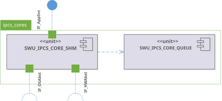

## 3.2 RTOS DEPLOYMENT VARIANT RTOS部署变体

RTOS 部署变体包括 FreeRTOS、ThreadX、AUTOSAR OS 三种实现。

| 实现 | OSAL 实现单元 | HAL 实现单元 | 结构说明 |
|---|---|---|---|
| FreeRTOS 实现 | SWU_IPCS_OSAL_FREERTOS | SWU_IPCS_HAL_MCU | SHM、OSAL、HAL 位于同一地址空间 |
| ThreadX 实现 | SWU_IPCS_OSAL_THREADX | SWU_IPCS_HAL_MCU | SHM、OSAL、HAL 位于同一地址空间 |
| AUTOSAR OS 实现 | SWU_IPCS_OSAL_AUTOSAR | SWU_IPCS_HAL_MCU | SHM、OSAL、HAL 位于同一地址空间 |

RTOS 部署变体中，Core 调用 `ipcsOs*` 与 `ipcsHw*` 时直接进入 OSAL/HAL 实现，不存在用户侧代理或内核 Backend。

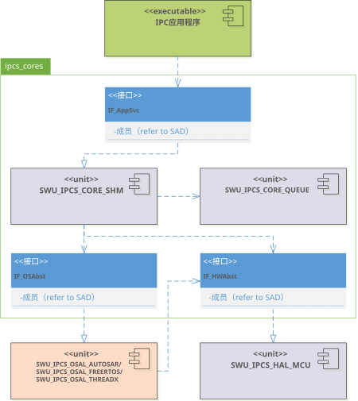

## 3.3 LINUX DEPLOY VARIANTS LINUX部署变体

Linux 部署变体包括 UIO、CDEV、全内核三种实现。`ipcs-architecture.pdf` 中的 `Drv_Ipcs_Linux_Adapt_Cmp` 是逻辑组件；本 SDD 按架构 Refinement 进一步分解其用户侧与内核侧职责。

### 3.3.1 UIO Implementation UIO 实现

UIO 实现由用户库代理、UIO 内核 Backend、Linux HAL 三部分组成。

| 部分 | 实现单元 | 设计职责 |
|---|---|---|
| 用户侧代理 | SWU_IPCS_LINUX_OS_UIO | 导出 `ipcsOs*`、`ipcsHw*` 同名符号，满足 SHM 对 OSAL/HAL 的接口契约；完成 `/dev/mem` 映射、UIO 设备打开、RX 线程创建 |
| 内核 Backend | SWU_IPCS_LINUX_UIO_KO | 注册 UIO 设备、处理中断、向用户侧传递事件 |
| 内核 HAL | SWU_IPCS_HAL_LINUX | 执行 核间中断控制器 与 IRQ 相关真实硬件操作 |

用户侧 `ipcsHwIrqEnable`、`ipcsHwIrqDisable`、`ipcsHwIrqNotify` 通过 `ipcsSendUioCmd` 写 UIO fd 转发命令；`ipcsHwInit`、`ipcsHwFree` 是空实现，设计规定初始化和释放由内核 UIO 模块处理。

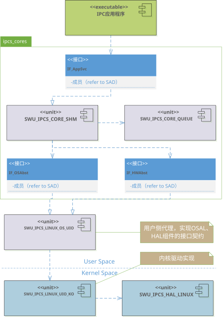

### 3.3.1.1 User-Kernel Adaptation Interface (IF_LinuxAdapt_UIO) User-Kernel 适配接口

Core 仍只依赖 章节3.1 的 `IF_OSAbst` / `IF_HWAbst`。UIO 变体中，用户侧 `SWU_IPCS_LINUX_OS_UIO` 对上层**呈现**这两套接口；跨地址空间实现则经 **`IF_LinuxAdapt_UIO`** 由 `SWU_IPCS_LINUX_UIO_KO` 完成。该接口属于 `Drv_Ipcs_Linux_Adapt_Cmp` 内部分配接口，不是新的架构层。

共享内存映射（`ipcsOsGetLocalShm` / `ipcsOsGetRemoteShm`）经 `/dev/mem` 完成，**不经过**本适配接口。本文档不展开 VFS、系统调用、UIO 子系统内部实现；仅定义 User Adapt SWU 与 Kernel Adapt SWU 之间的操作契约（定义见 `ipcs/mpu/os_kernel/ipc-uio.h`）。

UIO 变体采用 **Init 通道 + Runtime 通道** 双通道模型：

| 通道 | 用户节点 | 内核处理 | 用途 |
|---|---|---|---|
| Init | `/dev/ipc-cdev-uio`（write） | `ipc-uio.c` → `ipcsUioInit()` | 传递 `{instance, IPCS_SHM_CFG_TYPE}`，触发 `ipcsHwInit` 与 UIO 设备注册 |
| Runtime | `/dev/uioN`（write / read） | `ipcsShmUioIrqcontrol()` / `ipcsShmUioHandler()` | HW 中断控制与 RX 事件通知 |

适配操作与架构接口映射如下：

| 适配操作 | 方向 | 载荷 / 命令 | 用户侧入口 | 内核侧处理 | 映射架构接口 |
|---|---|---|---|---|---|
| `UIO_INIT_INSTANCE` | User → Kernel | `struct IPCS_UIO_CDEV_DATA_TYPE` | `ipcsOsInit` 内 write Init 通道 | `ipcsCdevWrite` → `ipcsUioInit` | `IF_OSAbst` 初始化（内核段）；`IF_HWAbst` 初始化 |
| `UIO_HW_DISABLE` | User → Kernel | `IPC_UIO_DISABLE_CMD`（0x0001） | `ipcsHwIrqDisable` | `ipcsShmUioIrqcontrol` → `ipcsHwIrqDisable` | `IF_HWAbst` |
| `UIO_HW_ENABLE` | User → Kernel | `IPC_UIO_ENABLE_CMD`（0x0002） | `ipcsHwIrqEnable` | `ipcsShmUioIrqcontrol` → `ipcsHwIrqEnable` | `IF_HWAbst` |
| `UIO_HW_TRIGGER` | User → Kernel | `IPC_UIO_TRIGGER_CMD`（0x0003） | `ipcsHwIrqNotify` | `ipcsShmUioIrqcontrol` → `ipcsHwIrqNotify` | `IF_HWAbst` |
| `UIO_RX_EVENT` | Kernel → User | UIO 事件计数（read 返回） | `ipcsShmSoftirq` 线程 read Runtime 通道 | hardirq → `ipcsShmUioHandler` → UIO 框架唤醒 | `IF_OSAbst` 收包调度（`rx_cb`） |

收包路径：硬件 IRQ → 内核 `ipcsShmUioHandler`（清中断）→ UIO 事件 → 用户线程 `read` 返回 → 调用 `rx_cb` → 再次 `ipcsHwIrqEnable`。动态交互详见 章节6.7 UIO 序列图。

### 3.3.2 CDEV Implementation CDEV 实现

CDEV 实现由用户库代理、字符设备 Backend、Linux HAL 三部分组成。

| 部分 | 实现单元 | 设计职责 |
|---|---|---|
| 用户侧代理 | SWU_IPCS_LINUX_OS_CDEV | 导出 `ipcsOs*`、`ipcsHw*` 同名符号，满足 SHM 对 OSAL/HAL 的接口契约；通过 `/dev/ipc-shm-cdev` 与内核通信 |
| 内核 Backend | SWU_IPCS_LINUX_CDEV_KO | 提供字符设备、ioctl、wait queue、ISR 处理 |
| 内核 HAL | SWU_IPCS_HAL_LINUX | 执行 核间中断控制器 与 IRQ 相关真实硬件操作 |

用户侧 `ipcsHwIrqEnable`、`ipcsHwIrqDisable`、`ipcsHwIrqNotify` 使用 `IPC_CDEV_CMD_*` ioctl 转发到内核；`ipcsHwInit`、`ipcsHwFree` 是空实现，设计规定由内核模块处理。

### 3.3.2.1 User-Kernel Adaptation Interface (IF_LinuxAdapt_CDEV) User-Kernel 适配接口

与 UIO 变体相同，Core 只依赖 `IF_OSAbst` / `IF_HWAbst`；用户侧 `SWU_IPCS_LINUX_OS_CDEV` 对外呈现上述契约，跨域实现经 **`IF_LinuxAdapt_CDEV`** 由 `SWU_IPCS_LINUX_CDEV_KO` 完成。接口定义见 `ipcs/mpu/os_kernel/ipc-cdev.h`（用户态与内核态共用）。

CDEV 变体经单一字符设备 **`/dev/ipc-shm-cdev`** 承载全部适配操作（ioctl 控制 + read 收包唤醒）。共享内存仍经 `/dev/mem` mmap，不经过本接口。VFS、系统调用等 Linux 通用机制本文档从略。

| 适配操作 | 方向 | ioctl 宏 / 载荷 | 用户侧入口 | 内核侧处理 | 映射架构接口 |
|---|---|---|---|---|---|
| `CDEV_SET_INSTANCE` | User → Kernel | `IPC_CDEV_CMD_SET_INSTANCE`（instance） | `ipcsOsInit` 前置步骤 | `ipcsCdevIoctl` 记录 target instance | `IF_OSAbst` 初始化（上下文） |
| `CDEV_INIT_INSTANCE` | User → Kernel | `IPC_CDEV_CMD_INIT_INSTANCE`（`IPCS_SHM_CFG_TYPE*`） | `ipcsOsInit` | `ipcsCdevOsInit` → `ipcsHwInit` + `request_irq` | `IF_OSAbst` 初始化（内核段）；`IF_HWAbst` 初始化 |
| `CDEV_HW_DISABLE` | User → Kernel | `IPC_CDEV_CMD_DISABLE_RX_IRQ`（instance） | `ipcsHwIrqDisable` | `ipcsCdevIoctl` → `ipcsHwIrqDisable` | `IF_HWAbst` |
| `CDEV_HW_ENABLE` | User → Kernel | `IPC_CDEV_CMD_ENABLE_RX_IRQ`（instance） | `ipcsHwIrqEnable` | `ipcsCdevIoctl` → `ipcsHwIrqEnable` | `IF_HWAbst` |
| `CDEV_HW_TRIGGER` | User → Kernel | `IPC_CDEV_CMD_TRIGGER_TX_IRQ`（instance） | `ipcsHwIrqNotify` | `ipcsCdevIoctl` → `ipcsHwIrqNotify` | `IF_HWAbst` |
| `CDEV_RX_EVENT` | Kernel → User | read 阻塞返回（wait queue 唤醒） | `ipcsShmSoftirq` 线程 read | hardirq → `wake_up_interruptible` | `IF_OSAbst` 收包调度（`rx_cb`） |

与 UIO 变体对比：CDEV 不依赖 Linux UIO 框架；Init 与 HW 控制均通过自定义 ioctl 完成；RX 通知经内核 wait queue + 用户 read，而非 UIO event read。动态交互详见 章节6.7 CDEV 序列图。

### 3.3.3 In-Kernel Implementation 全内核实现

全内核实现不使用用户侧代理。Core、OSAL、HAL 均在内核模块中运行，形态与 RTOS 部署变体一致。

| 部分 | 实现单元 | 设计职责 |
|---|---|---|
| OSAL | SWU_IPCS_LINUX_OS_KERN | 实现 `ipcsOsInit`、`ipcsOsFree`、`ipcsOsGetLocalShm`、`ipcsOsGetRemoteShm`、`ipcsOsPollChannels` |
| HAL | SWU_IPCS_HAL_LINUX | 实现 `ipcsHwInit`、`ipcsHwIrqEnable`、`ipcsHwIrqDisable`、`ipcsHwIrqNotify`、`ipcsHwIrqClear` 等硬件操作 |

`ipcs/mpu/os_kernel/ipc-os.c` 使用 tasklet 进行延迟收包处理，`ipcs/mpu/hw/c1/ipc-hw.c` 负责映射 核间中断控制器 并访问中断相关寄存器。

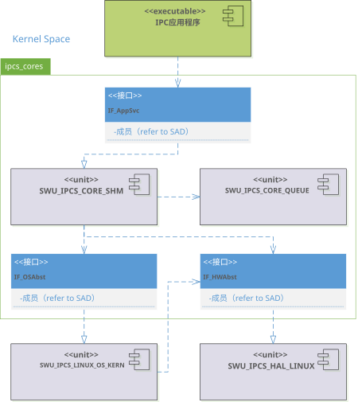

# 4 COMMON SWU DESIGN 公共单元设计

## 4.1 DEFINITION AND SCOPE 定义与范围

IPCS Driver 是面向同一 SoC 内不同处理核心的 shared memory 通信驱动。公共部分（ipcs/ipcs_cores）实现 IPCF Shared Memory 协议核心，支持 managed/unmanaged channel、中断通知与 polling、多 instance/channel。

本章描述跨部署变体共享的 Core、Queue、配置类型（SHM 层）。分层与部署变体见第 3 章；RTOS 实现见第 5 章；Linux 实现见第 6 章。

## 4.2 FILE STRUCTURE 文件结构

### 4.2.1 File List 文件列表

| 组件 | 文件 |
|---|---|
| Drv_Ipcs_Queue_Cmp | ipcs/ipcs_cores/ipc-queue.c |
| Drv_Ipcs_Queue_Cmp | ipcs/ipcs_cores/ipc-queue.h |
| Drv_Ipcs_Core_Cmp | ipcs/ipcs_cores/ipc-shm.c |
| Drv_Ipcs_Core_Cmp | ipcs/ipcs_cores/ipc-shm.h |
| Drv_Ipcs_Conf_Cmp | ipcs/ipcs_cores/ipc-types.h |
| Drv_Ipcs_Core_Cmp | ipcs/ipcs_cores/ipc-util.c |
| Drv_Ipcs_Core_Cmp | ipcs/ipcs_cores/ipc-util.h |

### 4.2.2 ipc-queue.c

描述：

> ipcs/ipcs_cores/ipc-queue.c 属于 Drv_Ipcs_Queue_Cmp / IPCS-SHM Queue。

依赖关系：

ipc-shm.h, ipc-queue.h, ipc-util.h（与 ipcs/ipcs_cores/ipc-queue.c 中 #include 顺序一致）

### 4.2.3 ipc-queue.h

描述：

> ipcs/ipcs_cores/ipc-queue.h 属于 Drv_Ipcs_Queue_Cmp / IPCS-SHM Queue。

依赖关系：

本头文件未 #include ipcs 内其他头文件（除标准版本宏定义外无外部文件依赖）。

### 4.2.4 ipc-shm.c

描述：

> ipcs/ipcs_cores/ipc-shm.c 属于 Drv_Ipcs_Core_Cmp / IPCS-SHM。

依赖关系：

ipc-shm.h, ipc-os.h, ipc-hw.h, ipc-queue.h（与 ipcs/ipcs_cores/ipc-shm.c 中 #include 顺序一致）

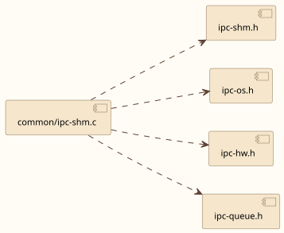

### 4.2.5 ipc-shm.h

描述：

> ipcs/ipcs_cores/ipc-shm.h 属于 Drv_Ipcs_Core_Cmp / IPCS-SHM。

依赖关系：

ipc-types.h, ipcf_Ip_Cfg.h（与 ipcs/ipcs_cores/ipc-shm.h 中 #include 一致；ipcf_Ip_Cfg.h 为工程配置头）

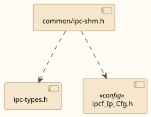

### 4.2.6 ipc-types.h

描述：

> ipcs/ipcs_cores/ipc-types.h 属于 Drv_Ipcs_Conf_Cmp / 配置数据类型。

依赖关系：

条件编译：NO_STDINT_H==0 时包含 <stdint.h>、<stddef.h>、<errno.h>；否则由 CPU 宏定义 uintptr_t 等；均包含 Mcal.h、ipcf_Ip_Cfg_Defines.h（与 ipcs/ipcs_cores/ipc-types.h 一致）。

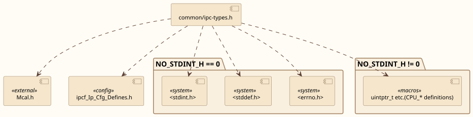

### 4.2.7 ipc-util.c

描述：

> ipcs/ipcs_cores/ipc-util.c 属于 Drv_Ipcs_Core_Cmp 公共工具。

依赖关系：

ipc-shm.h, ipc-util.h（与 ipcs/ipcs_cores/ipc-util.c 中 #include 一致）

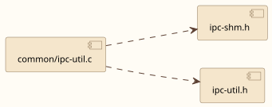

### 4.2.8 ipc-util.h

描述：

> ipcs/ipcs_cores/ipc-util.h 属于 Drv_Ipcs_Core_Cmp 公共工具。

依赖关系：

本头文件未 #include ipcs 内其他头文件。

## 4.3 SWU_CORE_SHM EXT INTERFACES 外部接口

### 4.3.1 ipcsShmInit

<table border="1" cellspacing="0" cellpadding="4">
<tbody>
<tr>
<td>对应软件架构ID</td>
<td colspan="4">Drv_Ipcs_Core_Cmp</td>
</tr>
<tr>
<td>软件单元 ID</td>
<td colspan="4">SWU_IPCS_CORE_SHM</td>
</tr>
<tr>
<td>函数说明</td>
<td colspan="4">该函数初始化配置中声明的所有 shared memory 通信实例，依次初始化 IPCS-HAL、IPCS-OSAL 和 IPCS-SHM channel 资源。</td>
</tr>
<tr>
<td>函数原型</td>
<td colspan="4">sint32 ipcsShmInit(const struct IPCS_SHM_INSTANCES_CFG_TYPE *cfg)</td>
</tr>
<tr>
<td>制约条件</td>
<td colspan="4">Config 指针非空；num_instances 大于 0 且不超过 IPC_SHM_MAX_INSTANCES；每个 instance 的 shared memory 地址、channel 数量等配置有效。</td>
</tr>
<tr>
<td rowspan="2">输入/输出参数</td>
<td>I/O</td>
<td>参数名</td>
<td>数据类型</td>
<td>说明</td>
</tr>
<tr>
<td>I</td>
<td>cfg</td>
<td>const struct IPCS_SHM_INSTANCES_CFG_TYPE *</td>
<td>指向 IPCS shared memory instance 配置的指针</td>
</tr>
<tr>
<td rowspan="2">返回值</td>
<td colspan="2">数据类型</td>
<td colspan="2">说明</td>
</tr>
<tr>
<td colspan="2">sint32</td>
<td colspan="2">IPC_SHM_E_OK：初始化成功；-IPC_SHM_E_INVAL 或下层错误码：配置或初始化失败</td>
</tr>
<tr>
<td>函数定义文件</td>
<td colspan="4">ipcs/ipcs_cores/ipc-shm.c</td>
</tr>
<tr>
<td>函数声明文件</td>
<td colspan="4">ipcs/ipcs_cores/ipc-shm.h</td>
</tr>
<tr>
<td>满足需求</td>
<td colspan="4">IPCS_001, IPCS_014, IPCS_016, IPCS_017, IPCS_020, IPCS_025, IPCS_028, IPCS_029, IPCS_031, IPCS_034</td>
</tr>
</tbody>
</table>

processing flow

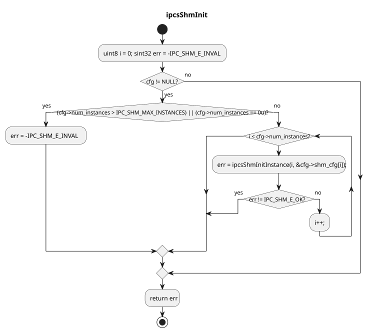

### 4.3.2 ipcsShmFree

<table border="1" cellspacing="0" cellpadding="4">
<tbody>
<tr>
<td>对应软件架构ID</td>
<td colspan="4">Drv_Ipcs_Core_Cmp</td>
</tr>
<tr>
<td>软件单元 ID</td>
<td colspan="4">SWU_IPCS_CORE_SHM</td>
</tr>
<tr>
<td>函数说明</td>
<td colspan="4">该函数释放所有已使用的 shared memory 通信实例，清除本端 ready 状态并释放 OS/HW 资源。</td>
</tr>
<tr>
<td>函数原型</td>
<td colspan="4">void ipcsShmFree(void)</td>
</tr>
<tr>
<td>制约条件</td>
<td colspan="4">无输入参数；释放当前处于 IPC_SHM_INSTANCE_USED 状态的 instance。</td>
</tr>
<tr>
<td rowspan="2">输入/输出参数</td>
<td>I/O</td>
<td>参数名</td>
<td>数据类型</td>
<td>说明</td>
</tr>
<tr>
<td>-</td>
<td>-</td>
<td>-</td>
<td>-</td>
</tr>
<tr>
<td rowspan="2">返回值</td>
<td colspan="2">数据类型</td>
<td colspan="2">说明</td>
</tr>
<tr>
<td colspan="4">-</td>
</tr>
<tr>
<td>函数定义文件</td>
<td colspan="4">ipcs/ipcs_cores/ipc-shm.c</td>
</tr>
<tr>
<td>函数声明文件</td>
<td colspan="4">ipcs/ipcs_cores/ipc-shm.h</td>
</tr>
<tr>
<td>满足需求</td>
<td colspan="4">IPCS_001, IPCS_028, IPCS_029</td>
</tr>
</tbody>
</table>

processing flow

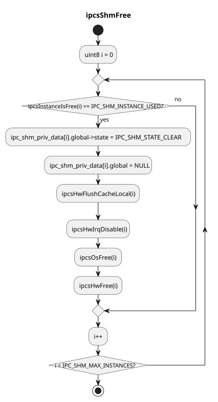

### 4.3.3 ipcsShmAcquireBuf

<table border="1" cellspacing="0" cellpadding="4">
<tbody>
<tr>
<td>对应软件架构ID</td>
<td colspan="4">Drv_Ipcs_Core_Cmp</td>
</tr>
<tr>
<td>软件单元 ID</td>
<td colspan="4">SWU_IPCS_CORE_SHM</td>
</tr>
<tr>
<td>函数说明</td>
<td colspan="4">该函数在 managed channel 上按照请求长度获取本端发送 buffer。</td>
</tr>
<tr>
<td>函数原型</td>
<td colspan="4">void * ipcsShmAcquireBuf(const uint8 instance, sint32 chan_id, uint32 mem_size)</td>
</tr>
<tr>
<td>制约条件</td>
<td colspan="4">instance 已初始化；chan_id 对应 managed channel；mem_size 非 0；managed channel 与 pool queue integrity 校验通过。</td>
</tr>
<tr>
<td rowspan="4">输入/输出参数</td>
<td>I/O</td>
<td>参数名</td>
<td>数据类型</td>
<td>说明</td>
</tr>
<tr>
<td>I</td>
<td>instance</td>
<td>const uint8</td>
<td>IPCS shared memory instance 索引</td>
</tr>
<tr>
<td>I</td>
<td>chan_id</td>
<td>sint32</td>
<td>IPCS shared memory channel 索引</td>
</tr>
<tr>
<td>I</td>
<td>mem_size</td>
<td>uint32</td>
<td>请求获取的 buffer 大小，单位为 byte</td>
</tr>
<tr>
<td rowspan="2">返回值</td>
<td colspan="2">数据类型</td>
<td colspan="2">说明</td>
</tr>
<tr>
<td colspan="2">void *</td>
<td colspan="2">非 NULL：可写发送 buffer 地址；NULL：instance/channel/size/integrity 无效或无可用 buffer</td>
</tr>
<tr>
<td>函数定义文件</td>
<td colspan="4">ipcs/ipcs_cores/ipc-shm.c</td>
</tr>
<tr>
<td>函数声明文件</td>
<td colspan="4">ipcs/ipcs_cores/ipc-shm.h</td>
</tr>
<tr>
<td>满足需求</td>
<td colspan="4">IPCS_016, IPCS_018, IPCS_025, IPCS_034, IPCS_035</td>
</tr>
</tbody>
</table>

processing flow

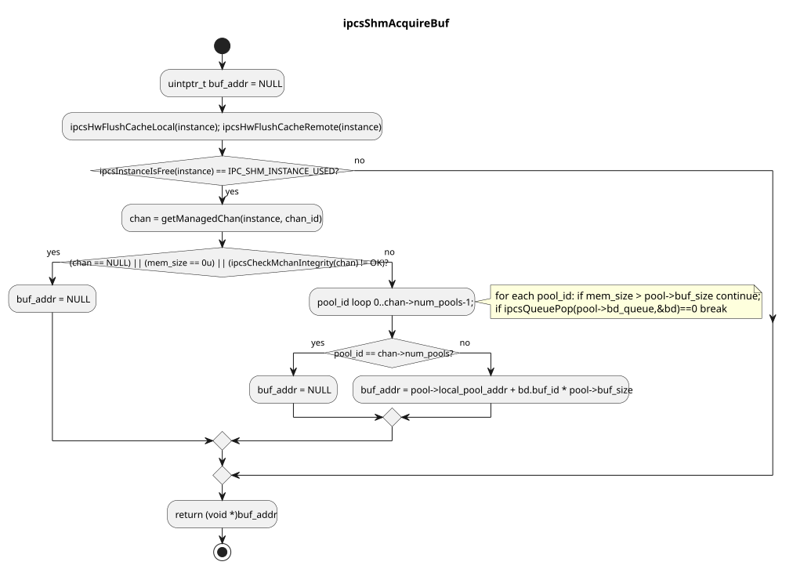

### 4.3.4 ipcsShmReleaseBuf

<table border="1" cellspacing="0" cellpadding="4">
<tbody>
<tr>
<td>对应软件架构ID</td>
<td colspan="4">Drv_Ipcs_Core_Cmp</td>
</tr>
<tr>
<td>软件单元 ID</td>
<td colspan="4">SWU_IPCS_CORE_SHM</td>
</tr>
<tr>
<td>函数说明</td>
<td colspan="4">该函数在 managed channel 上释放接收完成的远端 buffer，并将 buffer descriptor 归还到对应 buffer pool 队列。</td>
</tr>
<tr>
<td>函数原型</td>
<td colspan="4">sint32 ipcsShmReleaseBuf(const uint8 instance, sint32 chan_id, const void *buf)</td>
</tr>
<tr>
<td>制约条件</td>
<td colspan="4">instance 已初始化；chan_id 对应 managed channel；buf 非空；managed channel integrity 校验通过；buf 属于某个远端 pool。</td>
</tr>
<tr>
<td rowspan="4">输入/输出参数</td>
<td>I/O</td>
<td>参数名</td>
<td>数据类型</td>
<td>说明</td>
</tr>
<tr>
<td>I</td>
<td>instance</td>
<td>const uint8</td>
<td>IPCS shared memory instance 索引</td>
</tr>
<tr>
<td>I</td>
<td>chan_id</td>
<td>sint32</td>
<td>IPCS shared memory channel 索引</td>
</tr>
<tr>
<td>I</td>
<td>buf</td>
<td>const void *</td>
<td>managed channel buffer 指针</td>
</tr>
<tr>
<td rowspan="2">返回值</td>
<td colspan="2">数据类型</td>
<td colspan="2">说明</td>
</tr>
<tr>
<td colspan="2">sint32</td>
<td colspan="2">IPC_SHM_E_OK：释放成功；负错误码：instance/channel/buf/integrity 无效或 queue push 失败</td>
</tr>
<tr>
<td>函数定义文件</td>
<td colspan="4">ipcs/ipcs_cores/ipc-shm.c</td>
</tr>
<tr>
<td>函数声明文件</td>
<td colspan="4">ipcs/ipcs_cores/ipc-shm.h</td>
</tr>
<tr>
<td>满足需求</td>
<td colspan="4">IPCS_016, IPCS_018, IPCS_023, IPCS_034, IPCS_035</td>
</tr>
</tbody>
</table>

processing flow

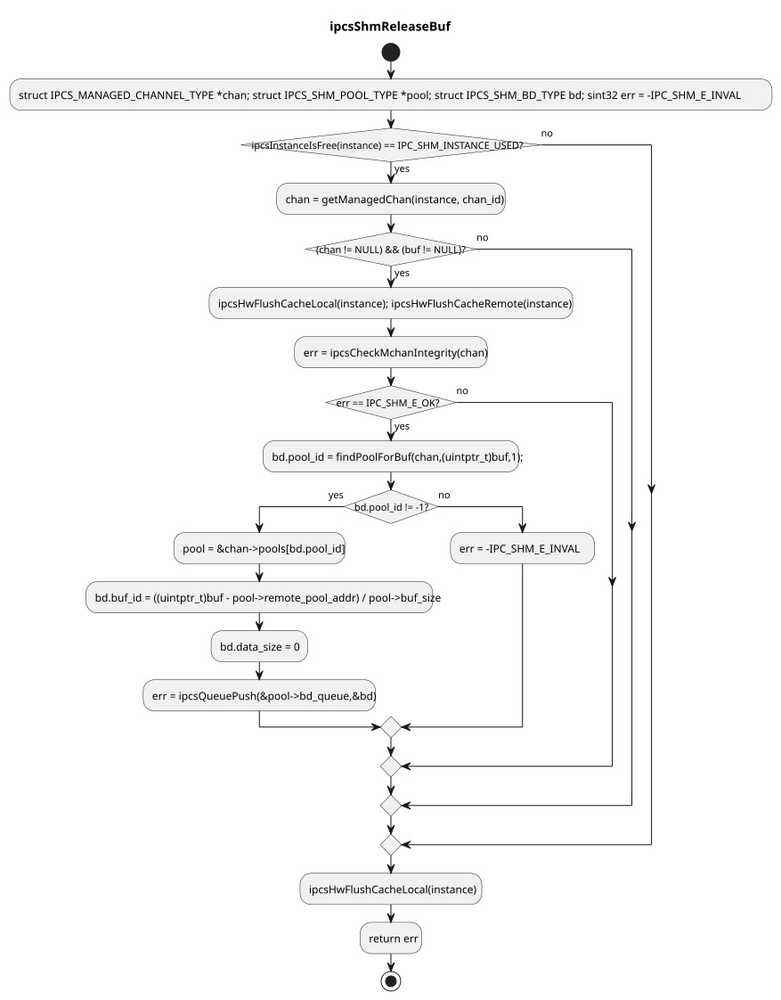

### 4.3.5 ipcsShmTx

<table border="1" cellspacing="0" cellpadding="4">
<tbody>
<tr>
<td>对应软件架构ID</td>
<td colspan="4">Drv_Ipcs_Core_Cmp</td>
</tr>
<tr>
<td>软件单元 ID</td>
<td colspan="4">SWU_IPCS_CORE_SHM</td>
</tr>
<tr>
<td>函数说明</td>
<td colspan="4">该函数在 managed channel 上提交已写入的 buffer descriptor，并通过 IPCS-HAL 通知远端。</td>
</tr>
<tr>
<td>函数原型</td>
<td colspan="4">sint32 ipcsShmTx(const uint8 instance, sint32 chan_id, void *buf, uint32 size)</td>
</tr>
<tr>
<td>制约条件</td>
<td colspan="4">instance 已初始化；chan_id 对应 managed channel；buf 非空；size 非 0；managed channel integrity 校验通过；buf 属于某个本端 pool。</td>
</tr>
<tr>
<td rowspan="5">输入/输出参数</td>
<td>I/O</td>
<td>参数名</td>
<td>数据类型</td>
<td>说明</td>
</tr>
<tr>
<td>I</td>
<td>instance</td>
<td>const uint8</td>
<td>IPCS shared memory instance 索引</td>
</tr>
<tr>
<td>I</td>
<td>chan_id</td>
<td>sint32</td>
<td>IPCS shared memory channel 索引</td>
</tr>
<tr>
<td>I</td>
<td>buf</td>
<td>void *</td>
<td>managed channel buffer 指针</td>
</tr>
<tr>
<td>I</td>
<td>size</td>
<td>uint32</td>
<td>已写入 buffer 的有效数据大小，单位为 byte</td>
</tr>
<tr>
<td rowspan="2">返回值</td>
<td colspan="2">数据类型</td>
<td colspan="2">说明</td>
</tr>
<tr>
<td colspan="2">sint32</td>
<td colspan="2">IPC_SHM_E_OK：发送提交并通知成功；负错误码：instance/channel/buf/size/integrity 无效或 queue push 失败</td>
</tr>
<tr>
<td>函数定义文件</td>
<td colspan="4">ipcs/ipcs_cores/ipc-shm.c</td>
</tr>
<tr>
<td>函数声明文件</td>
<td colspan="4">ipcs/ipcs_cores/ipc-shm.h</td>
</tr>
<tr>
<td>满足需求</td>
<td colspan="4">IPCS_001, IPCS_015, IPCS_018, IPCS_022, IPCS_023, IPCS_028, IPCS_034, IPCS_035</td>
</tr>
</tbody>
</table>

processing flow

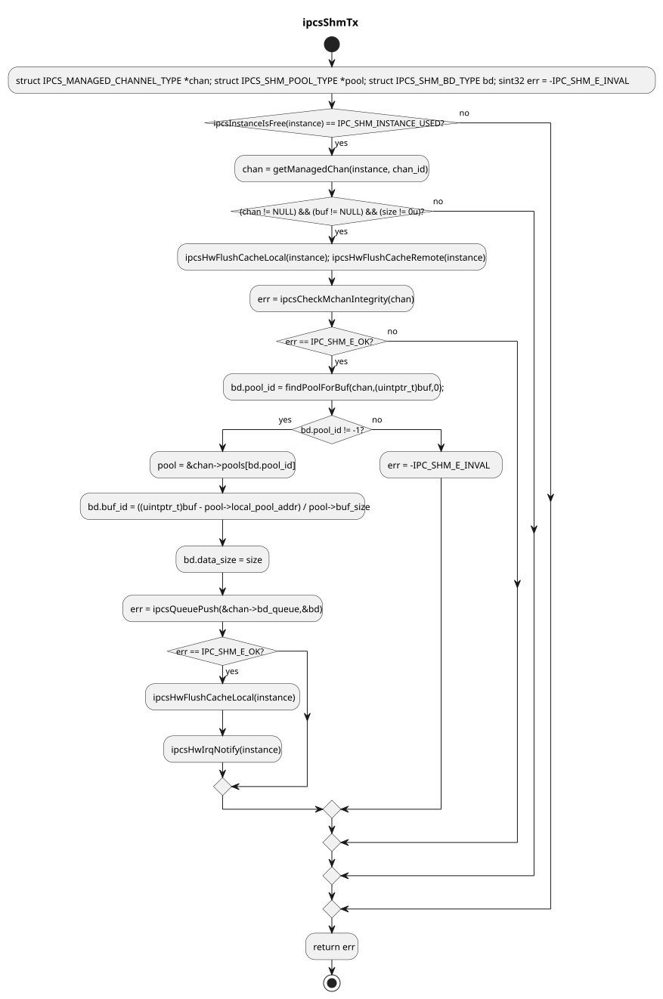

### 4.3.6 ipcsShmUnmanagedAcquire

<table border="1" cellspacing="0" cellpadding="4">
<tbody>
<tr>
<td>对应软件架构ID</td>
<td colspan="4">Drv_Ipcs_Core_Cmp</td>
</tr>
<tr>
<td>软件单元 ID</td>
<td colspan="4">SWU_IPCS_CORE_SHM</td>
</tr>
<tr>
<td>函数说明</td>
<td colspan="4">该函数获取 unmanaged channel 的本端通道内存入口。</td>
</tr>
<tr>
<td>函数原型</td>
<td colspan="4">void * ipcsShmUnmanagedAcquire(const uint8 instance, sint32 chan_id)</td>
</tr>
<tr>
<td>制约条件</td>
<td colspan="4">instance 已初始化；chan_id 对应 unmanaged channel；unmanaged channel integrity 校验通过。</td>
</tr>
<tr>
<td rowspan="3">输入/输出参数</td>
<td>I/O</td>
<td>参数名</td>
<td>数据类型</td>
<td>说明</td>
</tr>
<tr>
<td>I</td>
<td>instance</td>
<td>const uint8</td>
<td>IPCS shared memory instance 索引</td>
</tr>
<tr>
<td>I</td>
<td>chan_id</td>
<td>sint32</td>
<td>IPCS shared memory channel 索引</td>
</tr>
<tr>
<td rowspan="2">返回值</td>
<td colspan="2">数据类型</td>
<td colspan="2">说明</td>
</tr>
<tr>
<td colspan="2">void *</td>
<td colspan="2">非 NULL：unmanaged channel 本端内存地址；NULL：instance/channel/integrity 无效</td>
</tr>
<tr>
<td>函数定义文件</td>
<td colspan="4">ipcs/ipcs_cores/ipc-shm.c</td>
</tr>
<tr>
<td>函数声明文件</td>
<td colspan="4">ipcs/ipcs_cores/ipc-shm.h</td>
</tr>
<tr>
<td>满足需求</td>
<td colspan="4">IPCS_021, IPCS_034, IPCS_035</td>
</tr>
</tbody>
</table>

processing flow

### 4.3.7 ipcsShmUnmanagedTx

<table border="1" cellspacing="0" cellpadding="4">
<tbody>
<tr>
<td>对应软件架构ID</td>
<td colspan="4">Drv_Ipcs_Core_Cmp</td>
</tr>
<tr>
<td>软件单元 ID</td>
<td colspan="4">SWU_IPCS_CORE_SHM</td>
</tr>
<tr>
<td>函数说明</td>
<td colspan="4">该函数在 unmanaged channel 上递增本端发送计数，并通过 IPCS-HAL 通知远端。</td>
</tr>
<tr>
<td>函数原型</td>
<td colspan="4">sint32 ipcsShmUnmanagedTx(const uint8 instance, sint32 chan_id)</td>
</tr>
<tr>
<td>制约条件</td>
<td colspan="4">instance 已初始化；chan_id 对应 unmanaged channel；unmanaged channel integrity 校验通过。</td>
</tr>
<tr>
<td rowspan="3">输入/输出参数</td>
<td>I/O</td>
<td>参数名</td>
<td>数据类型</td>
<td>说明</td>
</tr>
<tr>
<td>I</td>
<td>instance</td>
<td>const uint8</td>
<td>IPCS shared memory instance 索引</td>
</tr>
<tr>
<td>I</td>
<td>chan_id</td>
<td>sint32</td>
<td>IPCS shared memory channel 索引</td>
</tr>
<tr>
<td rowspan="2">返回值</td>
<td colspan="2">数据类型</td>
<td colspan="2">说明</td>
</tr>
<tr>
<td colspan="2">sint32</td>
<td colspan="2">IPC_SHM_E_OK：发送计数更新并通知成功；负错误码：instance/channel/integrity 无效</td>
</tr>
<tr>
<td>函数定义文件</td>
<td colspan="4">ipcs/ipcs_cores/ipc-shm.c</td>
</tr>
<tr>
<td>函数声明文件</td>
<td colspan="4">ipcs/ipcs_cores/ipc-shm.h</td>
</tr>
<tr>
<td>满足需求</td>
<td colspan="4">IPCS_001, IPCS_021, IPCS_022, IPCS_028, IPCS_034, IPCS_035</td>
</tr>
</tbody>
</table>

processing flow

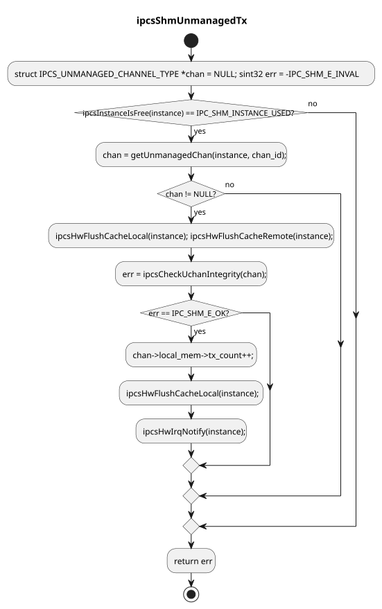

### 4.3.8 ipcsShmIsRemoteReady

<table border="1" cellspacing="0" cellpadding="4">
<tbody>
<tr>
<td>对应软件架构ID</td>
<td colspan="4">Drv_Ipcs_Core_Cmp</td>
</tr>
<tr>
<td>软件单元 ID</td>
<td colspan="4">SWU_IPCS_CORE_SHM</td>
</tr>
<tr>
<td>函数说明</td>
<td colspan="4">该函数读取远端 shared memory 起始处的 ready 状态，判断对端是否初始化完成。</td>
</tr>
<tr>
<td>函数原型</td>
<td colspan="4">sint32 ipcsShmIsRemoteReady(const uint8 instance)</td>
</tr>
<tr>
<td>制约条件</td>
<td colspan="4">instance 已初始化；远端 shared memory 起始位置包含 IPCS_SHM_GLOBAL_TYPE。</td>
</tr>
<tr>
<td rowspan="2">输入/输出参数</td>
<td>I/O</td>
<td>参数名</td>
<td>数据类型</td>
<td>说明</td>
</tr>
<tr>
<td>I</td>
<td>instance</td>
<td>const uint8</td>
<td>IPCS shared memory instance 索引</td>
</tr>
<tr>
<td rowspan="2">返回值</td>
<td colspan="2">数据类型</td>
<td colspan="2">说明</td>
</tr>
<tr>
<td colspan="2">sint32</td>
<td colspan="2">IPC_SHM_E_OK：远端 ready；-IPC_SHM_E_NOT_READY：远端未 ready；-IPC_SHM_E_INVAL：instance 无效</td>
</tr>
<tr>
<td>函数定义文件</td>
<td colspan="4">ipcs/ipcs_cores/ipc-shm.c</td>
</tr>
<tr>
<td>函数声明文件</td>
<td colspan="4">ipcs/ipcs_cores/ipc-shm.h</td>
</tr>
<tr>
<td>满足需求</td>
<td colspan="4">IPCS_001, IPCS_022, IPCS_034</td>
</tr>
</tbody>
</table>

processing flow

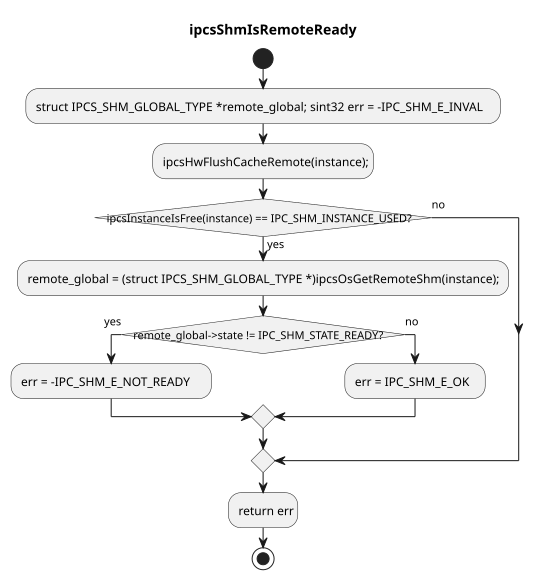

### 4.3.9 ipcsShmPollChannels

<table border="1" cellspacing="0" cellpadding="4">
<tbody>
<tr>
<td>对应软件架构ID</td>
<td colspan="4">Drv_Ipcs_Core_Cmp</td>
</tr>
<tr>
<td>软件单元 ID</td>
<td colspan="4">SWU_IPCS_CORE_SHM</td>
</tr>
<tr>
<td>函数说明</td>
<td colspan="4">该函数在 polling 场景下推进当前 instance 的接收处理。</td>
</tr>
<tr>
<td>函数原型</td>
<td colspan="4">sint32 ipcsShmPollChannels(const uint8 instance)</td>
</tr>
<tr>
<td>制约条件</td>
<td colspan="4">instance 已初始化；远端 ready；OSAL 变体支持在 IPC_IRQ_NONE 场景下调用 polling 接收。</td>
</tr>
<tr>
<td rowspan="2">输入/输出参数</td>
<td>I/O</td>
<td>参数名</td>
<td>数据类型</td>
<td>说明</td>
</tr>
<tr>
<td>I</td>
<td>instance</td>
<td>const uint8</td>
<td>IPCS shared memory instance 索引</td>
</tr>
<tr>
<td rowspan="2">返回值</td>
<td colspan="2">数据类型</td>
<td colspan="2">说明</td>
</tr>
<tr>
<td colspan="2">sint32</td>
<td colspan="2">非负值：处理的消息数量；负错误码：instance 无效、远端未 ready 或 OSAL polling 不支持/无效</td>
</tr>
<tr>
<td>函数定义文件</td>
<td colspan="4">ipcs/ipcs_cores/ipc-shm.c</td>
</tr>
<tr>
<td>函数声明文件</td>
<td colspan="4">ipcs/ipcs_cores/ipc-shm.h</td>
</tr>
<tr>
<td>满足需求</td>
<td colspan="4">IPCS_019, IPCS_022, IPCS_023, IPCS_034, IPCS_039</td>
</tr>
</tbody>
</table>

processing flow

## 4.4 SWU CORE/QUEUE/UTIL INTERNAL 内部函数

### 4.4.1 ipcsQueuePop

<table border="1" cellspacing="0" cellpadding="4">
<tbody>
<tr>
<td>对应软件架构ID</td>
<td colspan="4">Drv_Ipcs_Queue_Cmp</td>
</tr>
<tr>
<td>软件单元 ID</td>
<td colspan="4">SWU_IPCS_CORE_QUEUE</td>
</tr>
<tr>
<td>函数说明</td>
<td colspan="4">removes element from queue</td>
</tr>
<tr>
<td>函数原型</td>
<td colspan="4">sint32 ipcsQueuePop(struct IPCS_QUEUE_TYPE *queue, void *buf)</td>
</tr>
<tr>
<td>制约条件</td>
<td colspan="4">-</td>
</tr>
<tr>
<td rowspan="3">输入/输出参数</td>
<td>I/O</td>
<td>参数名</td>
<td>数据类型</td>
<td>说明</td>
</tr>
<tr>
<td>I</td>
<td>queue</td>
<td>struct IPCS_QUEUE_TYPE *</td>
<td>[IN] queue pointer</td>
</tr>
<tr>
<td>I</td>
<td>buf</td>
<td>void *</td>
<td>[OUT] pointer where to copy the removed element</td>
</tr>
<tr>
<td rowspan="2">返回值</td>
<td colspan="2">数据类型</td>
<td colspan="2">说明</td>
</tr>
<tr>
<td colspan="2">sint32</td>
<td colspan="2">IPC_SHM_E_OK on success, error code otherwise</td>
</tr>
<tr>
<td>函数定义文件</td>
<td colspan="4">ipcs/ipcs_cores/ipc-queue.c</td>
</tr>
<tr>
<td>函数声明文件</td>
<td colspan="4">ipcs/ipcs_cores/ipc-queue.h</td>
</tr>
</tbody>
</table>

processing flow

### 4.4.2 ipcsQueuePush

<table border="1" cellspacing="0" cellpadding="4">
<tbody>
<tr>
<td>对应软件架构ID</td>
<td colspan="4">Drv_Ipcs_Queue_Cmp</td>
</tr>
<tr>
<td>软件单元 ID</td>
<td colspan="4">SWU_IPCS_CORE_QUEUE</td>
</tr>
<tr>
<td>函数说明</td>
<td colspan="4">pushes element into the queue</td>
</tr>
<tr>
<td>函数原型</td>
<td colspan="4">sint32 ipcsQueuePush(struct IPCS_QUEUE_TYPE *queue, const void *buf)</td>
</tr>
<tr>
<td>制约条件</td>
<td colspan="4">-</td>
</tr>
<tr>
<td rowspan="3">输入/输出参数</td>
<td>I/O</td>
<td>参数名</td>
<td>数据类型</td>
<td>说明</td>
</tr>
<tr>
<td>I</td>
<td>queue</td>
<td>struct IPCS_QUEUE_TYPE *</td>
<td>[IN] queue pointer</td>
</tr>
<tr>
<td>I</td>
<td>buf</td>
<td>const void *</td>
<td>[IN] pointer to element to be pushed into the queue</td>
</tr>
<tr>
<td rowspan="2">返回值</td>
<td colspan="2">数据类型</td>
<td colspan="2">说明</td>
</tr>
<tr>
<td colspan="2">sint32</td>
<td colspan="2">IPC_SHM_E_OK on success, error code otherwise</td>
</tr>
<tr>
<td>函数定义文件</td>
<td colspan="4">ipcs/ipcs_cores/ipc-queue.c</td>
</tr>
<tr>
<td>函数声明文件</td>
<td colspan="4">ipcs/ipcs_cores/ipc-queue.h</td>
</tr>
</tbody>
</table>

processing flow

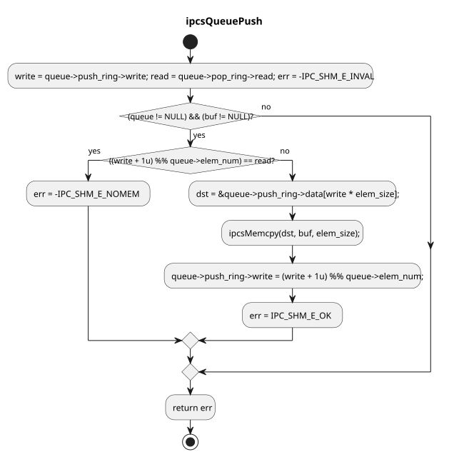

### 4.4.3 ipcsQueueInit

<table border="1" cellspacing="0" cellpadding="4">
<tbody>
<tr>
<td>对应软件架构ID</td>
<td colspan="4">Drv_Ipcs_Queue_Cmp</td>
</tr>
<tr>
<td>软件单元 ID</td>
<td colspan="4">SWU_IPCS_CORE_QUEUE</td>
</tr>
<tr>
<td>函数说明</td>
<td colspan="4">initializes queue and maps push/pop rings in memory</td>
</tr>
<tr>
<td>函数原型</td>
<td colspan="4">sint32 ipcsQueueInit(struct IPCS_QUEUE_TYPE *queue, uint16 elem_num, uint8 elem_size, uintptr_t push_ring_addr, uintptr_t pop_ring_addr)</td>
</tr>
<tr>
<td>制约条件</td>
<td colspan="4">-</td>
</tr>
<tr>
<td rowspan="6">输入/输出参数</td>
<td>I/O</td>
<td>参数名</td>
<td>数据类型</td>
<td>说明</td>
</tr>
<tr>
<td>I</td>
<td>queue</td>
<td>struct IPCS_QUEUE_TYPE *</td>
<td>[IN] queue pointer</td>
</tr>
<tr>
<td>I</td>
<td>elem_num</td>
<td>uint16</td>
<td>[IN] number of elements in queue</td>
</tr>
<tr>
<td>I</td>
<td>elem_size</td>
<td>uint8</td>
<td>[IN] element size in bytes (8-byte multiple)</td>
</tr>
<tr>
<td>I</td>
<td>push_ring_addr</td>
<td>uintptr_t</td>
<td>[IN] local addr where to map the push buffer ring</td>
</tr>
<tr>
<td>I</td>
<td>pop_ring_addr</td>
<td>uintptr_t</td>
<td>[IN] remote addr where to map the pop buffer ring</td>
</tr>
<tr>
<td rowspan="2">返回值</td>
<td colspan="2">数据类型</td>
<td colspan="2">说明</td>
</tr>
<tr>
<td colspan="2">sint32</td>
<td colspan="2">IPC_SHM_E_OK on success, error code otherwise</td>
</tr>
<tr>
<td>函数定义文件</td>
<td colspan="4">ipcs/ipcs_cores/ipc-queue.c</td>
</tr>
<tr>
<td>函数声明文件</td>
<td colspan="4">ipcs/ipcs_cores/ipc-queue.h</td>
</tr>
</tbody>
</table>

processing flow

### 4.4.4 ipcsQueueCheckIntegrity

<table border="1" cellspacing="0" cellpadding="4">
<tbody>
<tr>
<td>对应软件架构ID</td>
<td colspan="4">Drv_Ipcs_Queue_Cmp</td>
</tr>
<tr>
<td>软件单元 ID</td>
<td colspan="4">SWU_IPCS_CORE_QUEUE</td>
</tr>
<tr>
<td>函数说明</td>
<td colspan="4">check if the sentinel was not overwritten</td>
</tr>
<tr>
<td>函数原型</td>
<td colspan="4">sint32 ipcsQueueCheckIntegrity(struct IPCS_QUEUE_TYPE *queue)</td>
</tr>
<tr>
<td>制约条件</td>
<td colspan="4">-</td>
</tr>
<tr>
<td rowspan="2">输入/输出参数</td>
<td>I/O</td>
<td>参数名</td>
<td>数据类型</td>
<td>说明</td>
</tr>
<tr>
<td>I</td>
<td>queue</td>
<td>struct IPCS_QUEUE_TYPE *</td>
<td>[IN] queue pointer</td>
</tr>
<tr>
<td rowspan="2">返回值</td>
<td colspan="2">数据类型</td>
<td colspan="2">说明</td>
</tr>
<tr>
<td colspan="2">sint32</td>
<td colspan="2">IPC_SHM_E_OK on success, error code otherwise</td>
</tr>
<tr>
<td>函数定义文件</td>
<td colspan="4">ipcs/ipcs_cores/ipc-queue.c</td>
</tr>
<tr>
<td>函数声明文件</td>
<td colspan="4">ipcs/ipcs_cores/ipc-queue.h</td>
</tr>
</tbody>
</table>

processing flow

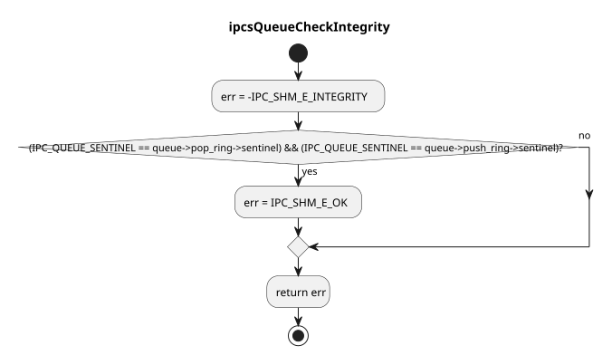

### 4.4.5 ipcsQueueMemSize

<table border="1" cellspacing="0" cellpadding="4">
<tbody>
<tr>
<td>对应软件架构ID</td>
<td colspan="4">Drv_Ipcs_Queue_Cmp</td>
</tr>
<tr>
<td>软件单元 ID</td>
<td colspan="4">SWU_IPCS_CORE_QUEUE</td>
</tr>
<tr>
<td>函数说明</td>
<td colspan="4">return queue footprint in local mapped memory</td>
</tr>
<tr>
<td>函数原型</td>
<td colspan="4">static inline uint32 ipcsQueueMemSize(struct IPCS_QUEUE_TYPE *queue)</td>
</tr>
<tr>
<td>制约条件</td>
<td colspan="4">-</td>
</tr>
<tr>
<td rowspan="2">输入/输出参数</td>
<td>I/O</td>
<td>参数名</td>
<td>数据类型</td>
<td>说明</td>
</tr>
<tr>
<td>I</td>
<td>queue</td>
<td>struct IPCS_QUEUE_TYPE *</td>
<td>[IN] queue pointer</td>
</tr>
<tr>
<td rowspan="2">返回值</td>
<td colspan="2">数据类型</td>
<td colspan="2">说明</td>
</tr>
<tr>
<td colspan="2">uint32</td>
<td colspan="2">size of local mapped memory occupied by queue</td>
</tr>
<tr>
<td>函数定义文件</td>
<td colspan="4">ipcs/ipcs_cores/ipc-queue.h</td>
</tr>
<tr>
<td>函数声明文件</td>
<td colspan="4">-</td>
</tr>
</tbody>
</table>

processing flow

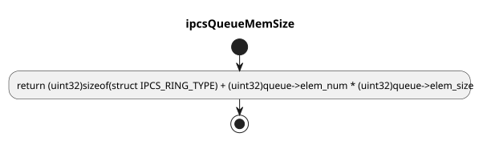

### 4.4.6 getChannel

<table border="1" cellspacing="0" cellpadding="4">
<tbody>
<tr>
<td>对应软件架构ID</td>
<td colspan="4">Drv_Ipcs_Core_Cmp</td>
</tr>
<tr>
<td>软件单元 ID</td>
<td colspan="4">SWU_IPCS_CORE_SHM</td>
</tr>
<tr>
<td>函数说明</td>
<td colspan="4">该函数校验 channel id 并返回 IPCS shared memory channel 私有数据指针。</td>
</tr>
<tr>
<td>函数原型</td>
<td colspan="4">static inline struct IPCS_SHM_CHANNEL_TYPE * getChannel(const uint8 instance, sint32 chan_id)</td>
</tr>
<tr>
<td>制约条件</td>
<td colspan="4">-</td>
</tr>
<tr>
<td rowspan="3">输入/输出参数</td>
<td>I/O</td>
<td>参数名</td>
<td>数据类型</td>
<td>说明</td>
</tr>
<tr>
<td>I</td>
<td>instance</td>
<td>const uint8</td>
<td>IPCS shared memory instance 索引</td>
</tr>
<tr>
<td>I</td>
<td>chan_id</td>
<td>sint32</td>
<td>IPCS shared memory channel 索引</td>
</tr>
<tr>
<td rowspan="2">返回值</td>
<td colspan="2">数据类型</td>
<td colspan="2">说明</td>
</tr>
<tr>
<td colspan="2">struct IPCS_SHM_CHANNEL_TYPE *</td>
<td colspan="2">源码返回值</td>
</tr>
<tr>
<td>函数定义文件</td>
<td colspan="4">ipcs/ipcs_cores/ipc-shm.c</td>
</tr>
<tr>
<td>函数声明文件</td>
<td colspan="4">-</td>
</tr>
</tbody>
</table>

processing flow

### 4.4.7 getManagedChan

<table border="1" cellspacing="0" cellpadding="4">
<tbody>
<tr>
<td>对应软件架构ID</td>
<td colspan="4">Drv_Ipcs_Core_Cmp</td>
</tr>
<tr>
<td>软件单元 ID</td>
<td colspan="4">SWU_IPCS_CORE_SHM</td>
</tr>
<tr>
<td>函数说明</td>
<td colspan="4">该函数校验 channel 是否为 managed 类型，并返回 managed channel 私有数据指针。</td>
</tr>
<tr>
<td>函数原型</td>
<td colspan="4">static inline struct IPCS_MANAGED_CHANNEL_TYPE * getManagedChan(const uint8 instance, sint32 chan_id)</td>
</tr>
<tr>
<td>制约条件</td>
<td colspan="4">-</td>
</tr>
<tr>
<td rowspan="3">输入/输出参数</td>
<td>I/O</td>
<td>参数名</td>
<td>数据类型</td>
<td>说明</td>
</tr>
<tr>
<td>I</td>
<td>instance</td>
<td>const uint8</td>
<td>IPCS shared memory instance 索引</td>
</tr>
<tr>
<td>I</td>
<td>chan_id</td>
<td>sint32</td>
<td>IPCS shared memory channel 索引</td>
</tr>
<tr>
<td rowspan="2">返回值</td>
<td colspan="2">数据类型</td>
<td colspan="2">说明</td>
</tr>
<tr>
<td colspan="2">struct IPCS_MANAGED_CHANNEL_TYPE *</td>
<td colspan="2">源码返回值</td>
</tr>
<tr>
<td>函数定义文件</td>
<td colspan="4">ipcs/ipcs_cores/ipc-shm.c</td>
</tr>
<tr>
<td>函数声明文件</td>
<td colspan="4">-</td>
</tr>
</tbody>
</table>

processing flow

### 4.4.8 getUnmanagedChan

<table border="1" cellspacing="0" cellpadding="4">
<tbody>
<tr>
<td>对应软件架构ID</td>
<td colspan="4">Drv_Ipcs_Core_Cmp</td>
</tr>
<tr>
<td>软件单元 ID</td>
<td colspan="4">SWU_IPCS_CORE_SHM</td>
</tr>
<tr>
<td>函数说明</td>
<td colspan="4">该函数校验 channel 是否为 unmanaged 类型，并返回 unmanaged channel 私有数据指针。</td>
</tr>
<tr>
<td>函数原型</td>
<td colspan="4">static inline struct IPCS_UNMANAGED_CHANNEL_TYPE * getUnmanagedChan(const uint8 instance, sint32 chan_id)</td>
</tr>
<tr>
<td>制约条件</td>
<td colspan="4">-</td>
</tr>
<tr>
<td rowspan="3">输入/输出参数</td>
<td>I/O</td>
<td>参数名</td>
<td>数据类型</td>
<td>说明</td>
</tr>
<tr>
<td>I</td>
<td>instance</td>
<td>const uint8</td>
<td>IPCS shared memory instance 索引</td>
</tr>
<tr>
<td>I</td>
<td>chan_id</td>
<td>sint32</td>
<td>IPCS shared memory channel 索引</td>
</tr>
<tr>
<td rowspan="2">返回值</td>
<td colspan="2">数据类型</td>
<td colspan="2">说明</td>
</tr>
<tr>
<td colspan="2">struct IPCS_UNMANAGED_CHANNEL_TYPE *</td>
<td colspan="2">源码返回值</td>
</tr>
<tr>
<td>函数定义文件</td>
<td colspan="4">ipcs/ipcs_cores/ipc-shm.c</td>
</tr>
<tr>
<td>函数声明文件</td>
<td colspan="4">-</td>
</tr>
</tbody>
</table>

processing flow

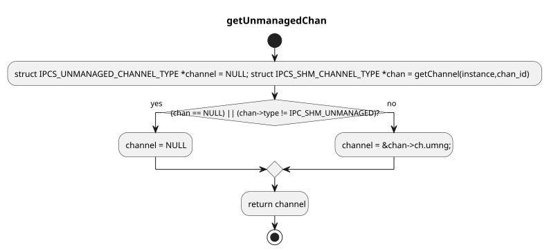

### 4.4.9 ipcsCheckUchanIntegrity

<table border="1" cellspacing="0" cellpadding="4">
<tbody>
<tr>
<td>对应软件架构ID</td>
<td colspan="4">Drv_Ipcs_Core_Cmp</td>
</tr>
<tr>
<td>软件单元 ID</td>
<td colspan="4">SWU_IPCS_CORE_SHM</td>
</tr>
<tr>
<td>函数说明</td>
<td colspan="4">该函数检查 unmanaged channel 本端和远端 sentinel 是否保持完整。</td>
</tr>
<tr>
<td>函数原型</td>
<td colspan="4">static sint32 ipcsCheckUchanIntegrity(const struct IPCS_UNMANAGED_CHANNEL_TYPE *uchan)</td>
</tr>
<tr>
<td>制约条件</td>
<td colspan="4">-</td>
</tr>
<tr>
<td rowspan="2">输入/输出参数</td>
<td>I/O</td>
<td>参数名</td>
<td>数据类型</td>
<td>说明</td>
</tr>
<tr>
<td>I</td>
<td>uchan</td>
<td>const struct IPCS_UNMANAGED_CHANNEL_TYPE *</td>
<td>源码参数</td>
</tr>
<tr>
<td rowspan="2">返回值</td>
<td colspan="2">数据类型</td>
<td colspan="2">说明</td>
</tr>
<tr>
<td colspan="2">sint32</td>
<td colspan="2">源码返回值</td>
</tr>
<tr>
<td>函数定义文件</td>
<td colspan="4">ipcs/ipcs_cores/ipc-shm.c</td>
</tr>
<tr>
<td>函数声明文件</td>
<td colspan="4">-</td>
</tr>
</tbody>
</table>

processing flow

### 4.4.10 ipcsCheckMchanIntegrity

<table border="1" cellspacing="0" cellpadding="4">
<tbody>
<tr>
<td>对应软件架构ID</td>
<td colspan="4">Drv_Ipcs_Core_Cmp</td>
</tr>
<tr>
<td>软件单元 ID</td>
<td colspan="4">SWU_IPCS_CORE_SHM</td>
</tr>
<tr>
<td>函数说明</td>
<td colspan="4">该函数检查 managed channel 的 channel queue 及所有 pool queue sentinel 是否保持完整。</td>
</tr>
<tr>
<td>函数原型</td>
<td colspan="4">static sint32 ipcsCheckMchanIntegrity(struct IPCS_MANAGED_CHANNEL_TYPE *mchan)</td>
</tr>
<tr>
<td>制约条件</td>
<td colspan="4">-</td>
</tr>
<tr>
<td rowspan="2">输入/输出参数</td>
<td>I/O</td>
<td>参数名</td>
<td>数据类型</td>
<td>说明</td>
</tr>
<tr>
<td>I</td>
<td>mchan</td>
<td>struct IPCS_MANAGED_CHANNEL_TYPE *</td>
<td>源码参数</td>
</tr>
<tr>
<td rowspan="2">返回值</td>
<td colspan="2">数据类型</td>
<td colspan="2">说明</td>
</tr>
<tr>
<td colspan="2">sint32</td>
<td colspan="2">源码返回值</td>
</tr>
<tr>
<td>函数定义文件</td>
<td colspan="4">ipcs/ipcs_cores/ipc-shm.c</td>
</tr>
<tr>
<td>函数声明文件</td>
<td colspan="4">-</td>
</tr>
</tbody>
</table>

processing flow

### 4.4.11 ipcsChannelRx

<table border="1" cellspacing="0" cellpadding="4">
<tbody>
<tr>
<td>对应软件架构ID</td>
<td colspan="4">Drv_Ipcs_Core_Cmp</td>
</tr>
<tr>
<td>软件单元 ID</td>
<td colspan="4">SWU_IPCS_CORE_SHM</td>
</tr>
<tr>
<td>函数说明</td>
<td colspan="4">handle Rx for a single channel</td>
</tr>
<tr>
<td>函数原型</td>
<td colspan="4">static sint32 ipcsChannelRx(const uint8 instance, sint32 chan_id, sint32 budget)</td>
</tr>
<tr>
<td>制约条件</td>
<td colspan="4">-</td>
</tr>
<tr>
<td rowspan="4">输入/输出参数</td>
<td>I/O</td>
<td>参数名</td>
<td>数据类型</td>
<td>说明</td>
</tr>
<tr>
<td>I</td>
<td>instance</td>
<td>const uint8</td>
<td>instance id</td>
</tr>
<tr>
<td>I</td>
<td>chan_id</td>
<td>sint32</td>
<td>channel id</td>
</tr>
<tr>
<td>I</td>
<td>budget</td>
<td>sint32</td>
<td>available work budget (number of messages to be processed)</td>
</tr>
<tr>
<td rowspan="2">返回值</td>
<td colspan="2">数据类型</td>
<td colspan="2">说明</td>
</tr>
<tr>
<td colspan="2">sint32</td>
<td colspan="2">work done</td>
</tr>
<tr>
<td>函数定义文件</td>
<td colspan="4">ipcs/ipcs_cores/ipc-shm.c</td>
</tr>
<tr>
<td>函数声明文件</td>
<td colspan="4">-</td>
</tr>
</tbody>
</table>

processing flow

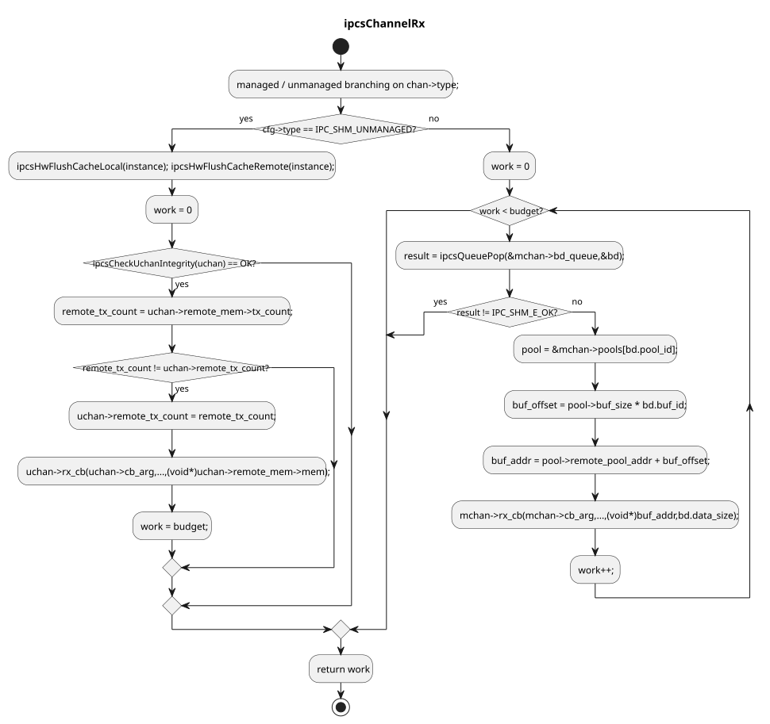

### 4.4.12 ipcsInstanceIsFree

<table border="1" cellspacing="0" cellpadding="4">
<tbody>
<tr>
<td>对应软件架构ID</td>
<td colspan="4">Drv_Ipcs_Core_Cmp</td>
</tr>
<tr>
<td>软件单元 ID</td>
<td colspan="4">SWU_IPCS_CORE_SHM</td>
</tr>
<tr>
<td>函数说明</td>
<td colspan="4">determine if the instance is used or not</td>
</tr>
<tr>
<td>函数原型</td>
<td colspan="4">static uint8 ipcsInstanceIsFree(const uint8 instance)</td>
</tr>
<tr>
<td>制约条件</td>
<td colspan="4">-</td>
</tr>
<tr>
<td rowspan="2">输入/输出参数</td>
<td>I/O</td>
<td>参数名</td>
<td>数据类型</td>
<td>说明</td>
</tr>
<tr>
<td>I</td>
<td>instance</td>
<td>const uint8</td>
<td>instance id</td>
</tr>
<tr>
<td rowspan="2">返回值</td>
<td colspan="2">数据类型</td>
<td colspan="2">说明</td>
</tr>
<tr>
<td colspan="2">uint8</td>
<td colspan="2">IPC_SHM_INSTANCE_FREE if instance is free,</td>
</tr>
<tr>
<td>函数定义文件</td>
<td colspan="4">ipcs/ipcs_cores/ipc-shm.c</td>
</tr>
<tr>
<td>函数声明文件</td>
<td colspan="4">-</td>
</tr>
</tbody>
</table>

processing flow

### 4.4.13 ipcsShmRx

<table border="1" cellspacing="0" cellpadding="4">
<tbody>
<tr>
<td>对应软件架构ID</td>
<td colspan="4">Drv_Ipcs_Core_Cmp</td>
</tr>
<tr>
<td>软件单元 ID</td>
<td colspan="4">SWU_IPCS_CORE_SHM</td>
</tr>
<tr>
<td>函数说明</td>
<td colspan="4">shm Rx handler, called from softirq</td>
</tr>
<tr>
<td>函数原型</td>
<td colspan="4">static sint32 ipcsShmRx(const uint8 instance, sint32 budget)</td>
</tr>
<tr>
<td>制约条件</td>
<td colspan="4">-</td>
</tr>
<tr>
<td rowspan="3">输入/输出参数</td>
<td>I/O</td>
<td>参数名</td>
<td>数据类型</td>
<td>说明</td>
</tr>
<tr>
<td>I</td>
<td>instance</td>
<td>const uint8</td>
<td>instance id</td>
</tr>
<tr>
<td>I</td>
<td>budget</td>
<td>sint32</td>
<td>available work budget (number of messages to be processed)</td>
</tr>
<tr>
<td rowspan="2">返回值</td>
<td colspan="2">数据类型</td>
<td colspan="2">说明</td>
</tr>
<tr>
<td colspan="2">sint32</td>
<td colspan="2">work done</td>
</tr>
<tr>
<td>函数定义文件</td>
<td colspan="4">ipcs/ipcs_cores/ipc-shm.c</td>
</tr>
<tr>
<td>函数声明文件</td>
<td colspan="4">-</td>
</tr>
</tbody>
</table>

processing flow

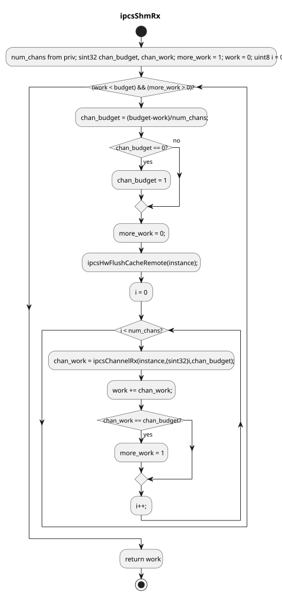

### 4.4.14 ipcsBufPoolInit

<table border="1" cellspacing="0" cellpadding="4">
<tbody>
<tr>
<td>对应软件架构ID</td>
<td colspan="4">Drv_Ipcs_Core_Cmp</td>
</tr>
<tr>
<td>软件单元 ID</td>
<td colspan="4">SWU_IPCS_CORE_SHM</td>
</tr>
<tr>
<td>函数说明</td>
<td colspan="4">init buffer pool</td>
</tr>
<tr>
<td>函数原型</td>
<td colspan="4">static sint32 ipcsBufPoolInit(const uint8 instance, sint32 chan_id, sint32 pool_id, struct IPCS_SHM_POOL_ADDR_TYPE mng_pool, const struct IPCS_SHM_POOL_CFG_TYPE *cfg)</td>
</tr>
<tr>
<td>制约条件</td>
<td colspan="4">-</td>
</tr>
<tr>
<td rowspan="6">输入/输出参数</td>
<td>I/O</td>
<td>参数名</td>
<td>数据类型</td>
<td>说明</td>
</tr>
<tr>
<td>I</td>
<td>instance</td>
<td>const uint8</td>
<td>instance id</td>
</tr>
<tr>
<td>I</td>
<td>chan_id</td>
<td>sint32</td>
<td>channel index</td>
</tr>
<tr>
<td>I</td>
<td>pool_id</td>
<td>sint32</td>
<td>pool index in channel</td>
</tr>
<tr>
<td>I</td>
<td>mng_pool</td>
<td>struct IPCS_SHM_POOL_ADDR_TYPE</td>
<td>源码参数</td>
</tr>
<tr>
<td>I</td>
<td>cfg</td>
<td>const struct IPCS_SHM_POOL_CFG_TYPE *</td>
<td>channel configuration parameters</td>
</tr>
<tr>
<td rowspan="2">返回值</td>
<td colspan="2">数据类型</td>
<td colspan="2">说明</td>
</tr>
<tr>
<td colspan="2">sint32</td>
<td colspan="2">IPC_SHM_E_OK for success, error code otherwise</td>
</tr>
<tr>
<td>函数定义文件</td>
<td colspan="4">ipcs/ipcs_cores/ipc-shm.c</td>
</tr>
<tr>
<td>函数声明文件</td>
<td colspan="4">-</td>
</tr>
</tbody>
</table>

processing flow

### 4.4.15 ipcsGetTotalBufPerChan

<table border="1" cellspacing="0" cellpadding="4">
<tbody>
<tr>
<td>对应软件架构ID</td>
<td colspan="4">Drv_Ipcs_Core_Cmp</td>
</tr>
<tr>
<td>软件单元 ID</td>
<td colspan="4">SWU_IPCS_CORE_SHM</td>
</tr>
<tr>
<td>函数说明</td>
<td colspan="4">get total buffers of an managed channel</td>
</tr>
<tr>
<td>函数原型</td>
<td colspan="4">static uint32 ipcsGetTotalBufPerChan(const uint8 instance, sint32 chan_id, const struct IPCS_SHM_MANAGED_CFG_TYPE *cfg)</td>
</tr>
<tr>
<td>制约条件</td>
<td colspan="4">-</td>
</tr>
<tr>
<td rowspan="4">输入/输出参数</td>
<td>I/O</td>
<td>参数名</td>
<td>数据类型</td>
<td>说明</td>
</tr>
<tr>
<td>I</td>
<td>instance</td>
<td>const uint8</td>
<td>instance id</td>
</tr>
<tr>
<td>I</td>
<td>chan_id</td>
<td>sint32</td>
<td>channel id</td>
</tr>
<tr>
<td>I</td>
<td>cfg</td>
<td>const struct IPCS_SHM_MANAGED_CFG_TYPE *</td>
<td>managed channel configuration</td>
</tr>
<tr>
<td rowspan="2">返回值</td>
<td colspan="2">数据类型</td>
<td colspan="2">说明</td>
</tr>
<tr>
<td colspan="2">uint32</td>
<td colspan="2">total buffers, 0 if error</td>
</tr>
<tr>
<td>函数定义文件</td>
<td colspan="4">ipcs/ipcs_cores/ipc-shm.c</td>
</tr>
<tr>
<td>函数声明文件</td>
<td colspan="4">-</td>
</tr>
</tbody>
</table>

processing flow

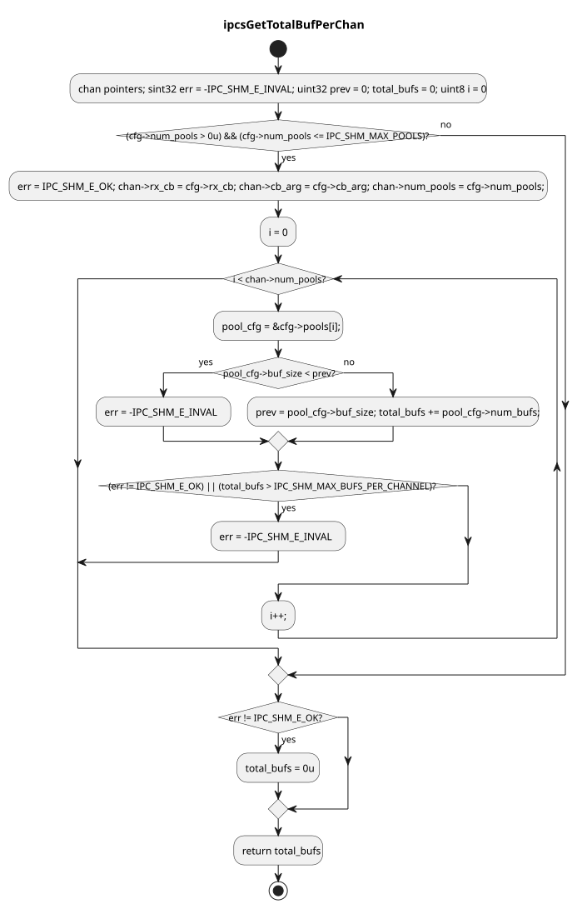

### 4.4.16 managedChannelInit

<table border="1" cellspacing="0" cellpadding="4">
<tbody>
<tr>
<td>对应软件架构ID</td>
<td colspan="4">Drv_Ipcs_Core_Cmp</td>
</tr>
<tr>
<td>软件单元 ID</td>
<td colspan="4">SWU_IPCS_CORE_SHM</td>
</tr>
<tr>
<td>函数说明</td>
<td colspan="4">initialize managed channel</td>
</tr>
<tr>
<td>函数原型</td>
<td colspan="4">static sint32 managedChannelInit(const uint8 instance, sint32 chan_id, uintptr_t local_shm, uintptr_t remote_shm, const struct IPCS_SHM_MANAGED_CFG_TYPE *cfg)</td>
</tr>
<tr>
<td>制约条件</td>
<td colspan="4">-</td>
</tr>
<tr>
<td rowspan="6">输入/输出参数</td>
<td>I/O</td>
<td>参数名</td>
<td>数据类型</td>
<td>说明</td>
</tr>
<tr>
<td>I</td>
<td>instance</td>
<td>const uint8</td>
<td>instance id</td>
</tr>
<tr>
<td>I</td>
<td>chan_id</td>
<td>sint32</td>
<td>channel id</td>
</tr>
<tr>
<td>I</td>
<td>local_shm</td>
<td>uintptr_t</td>
<td>local shared memory</td>
</tr>
<tr>
<td>I</td>
<td>remote_shm</td>
<td>uintptr_t</td>
<td>remote shared memort</td>
</tr>
<tr>
<td>I</td>
<td>cfg</td>
<td>const struct IPCS_SHM_MANAGED_CFG_TYPE *</td>
<td>managed channel configuration</td>
</tr>
<tr>
<td rowspan="2">返回值</td>
<td colspan="2">数据类型</td>
<td colspan="2">说明</td>
</tr>
<tr>
<td colspan="2">sint32</td>
<td colspan="2">IPC_SHM_E_OK for success, error code otherwise</td>
</tr>
<tr>
<td>函数定义文件</td>
<td colspan="4">ipcs/ipcs_cores/ipc-shm.c</td>
</tr>
<tr>
<td>函数声明文件</td>
<td colspan="4">-</td>
</tr>
</tbody>
</table>

processing flow

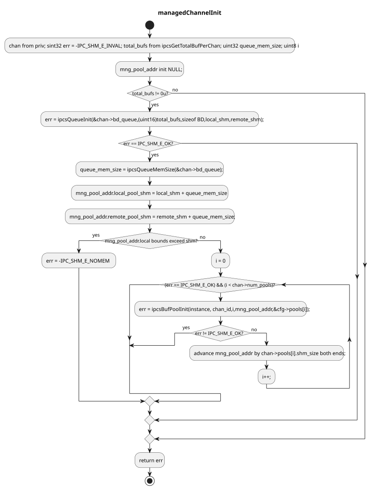

### 4.4.17 unmanagedChannelInit

<table border="1" cellspacing="0" cellpadding="4">
<tbody>
<tr>
<td>对应软件架构ID</td>
<td colspan="4">Drv_Ipcs_Core_Cmp</td>
</tr>
<tr>
<td>软件单元 ID</td>
<td colspan="4">SWU_IPCS_CORE_SHM</td>
</tr>
<tr>
<td>函数说明</td>
<td colspan="4">initialize unmanaged channel</td>
</tr>
<tr>
<td>函数原型</td>
<td colspan="4">static sint32 unmanagedChannelInit(const uint8 instance, sint32 chan_id, uintptr_t local_shm, uintptr_t remote_shm, const struct IPCS_SHM_UNMANAGED_CFG_TYPE *cfg)</td>
</tr>
<tr>
<td>制约条件</td>
<td colspan="4">-</td>
</tr>
<tr>
<td rowspan="6">输入/输出参数</td>
<td>I/O</td>
<td>参数名</td>
<td>数据类型</td>
<td>说明</td>
</tr>
<tr>
<td>I</td>
<td>instance</td>
<td>const uint8</td>
<td>instance id</td>
</tr>
<tr>
<td>I</td>
<td>chan_id</td>
<td>sint32</td>
<td>channel id</td>
</tr>
<tr>
<td>I</td>
<td>local_shm</td>
<td>uintptr_t</td>
<td>local shared memory</td>
</tr>
<tr>
<td>I</td>
<td>remote_shm</td>
<td>uintptr_t</td>
<td>remote shared memort</td>
</tr>
<tr>
<td>I</td>
<td>cfg</td>
<td>const struct IPCS_SHM_UNMANAGED_CFG_TYPE *</td>
<td>unmanaged channel configuration</td>
</tr>
<tr>
<td rowspan="2">返回值</td>
<td colspan="2">数据类型</td>
<td colspan="2">说明</td>
</tr>
<tr>
<td colspan="2">sint32</td>
<td colspan="2">IPC_SHM_E_OK for success, error code otherwise</td>
</tr>
<tr>
<td>函数定义文件</td>
<td colspan="4">ipcs/ipcs_cores/ipc-shm.c</td>
</tr>
<tr>
<td>函数声明文件</td>
<td colspan="4">-</td>
</tr>
</tbody>
</table>

processing flow

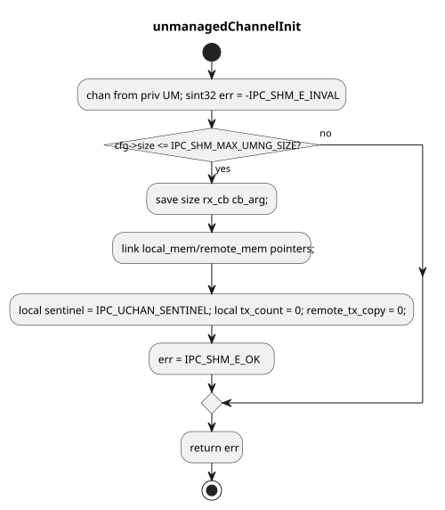

### 4.4.18 ipcsShmInitChannel

<table border="1" cellspacing="0" cellpadding="4">
<tbody>
<tr>
<td>对应软件架构ID</td>
<td colspan="4">Drv_Ipcs_Core_Cmp</td>
</tr>
<tr>
<td>软件单元 ID</td>
<td colspan="4">SWU_IPCS_CORE_SHM</td>
</tr>
<tr>
<td>函数说明</td>
<td colspan="4">initialize a shared memory IPC channel</td>
</tr>
<tr>
<td>函数原型</td>
<td colspan="4">static sint32 ipcsShmInitChannel(const uint8 instance, sint32 chan_id, uintptr_t local_shm, uintptr_t remote_shm, const struct IPCS_SHM_CHANNEL_CFG_TYPE *cfg)</td>
</tr>
<tr>
<td>制约条件</td>
<td colspan="4">-</td>
</tr>
<tr>
<td rowspan="6">输入/输出参数</td>
<td>I/O</td>
<td>参数名</td>
<td>数据类型</td>
<td>说明</td>
</tr>
<tr>
<td>I</td>
<td>instance</td>
<td>const uint8</td>
<td>instance id</td>
</tr>
<tr>
<td>I</td>
<td>chan_id</td>
<td>sint32</td>
<td>channel index</td>
</tr>
<tr>
<td>I</td>
<td>local_shm</td>
<td>uintptr_t</td>
<td>local channel shared memory address</td>
</tr>
<tr>
<td>I</td>
<td>remote_shm</td>
<td>uintptr_t</td>
<td>remote channel shared memory address</td>
</tr>
<tr>
<td>I</td>
<td>cfg</td>
<td>const struct IPCS_SHM_CHANNEL_CFG_TYPE *</td>
<td>channel configuration parameters</td>
</tr>
<tr>
<td rowspan="2">返回值</td>
<td colspan="2">数据类型</td>
<td colspan="2">说明</td>
</tr>
<tr>
<td colspan="2">sint32</td>
<td colspan="2">0 for success, error code otherwise</td>
</tr>
<tr>
<td>函数定义文件</td>
<td colspan="4">ipcs/ipcs_cores/ipc-shm.c</td>
</tr>
<tr>
<td>函数声明文件</td>
<td colspan="4">-</td>
</tr>
</tbody>
</table>

processing flow

### 4.4.19 getChanMemmapSize

<table border="1" cellspacing="0" cellpadding="4">
<tbody>
<tr>
<td>对应软件架构ID</td>
<td colspan="4">Drv_Ipcs_Core_Cmp</td>
</tr>
<tr>
<td>软件单元 ID</td>
<td colspan="4">SWU_IPCS_CORE_SHM</td>
</tr>
<tr>
<td>函数说明</td>
<td colspan="4">Get channel local mapped memory size</td>
</tr>
<tr>
<td>函数原型</td>
<td colspan="4">static uint32 getChanMemmapSize(const uint8 instance, sint32 chan_id)</td>
</tr>
<tr>
<td>制约条件</td>
<td colspan="4">-</td>
</tr>
<tr>
<td rowspan="3">输入/输出参数</td>
<td>I/O</td>
<td>参数名</td>
<td>数据类型</td>
<td>说明</td>
</tr>
<tr>
<td>I</td>
<td>instance</td>
<td>const uint8</td>
<td>instance id</td>
</tr>
<tr>
<td>I</td>
<td>chan_id</td>
<td>sint32</td>
<td>channel id</td>
</tr>
<tr>
<td rowspan="2">返回值</td>
<td colspan="2">数据类型</td>
<td colspan="2">说明</td>
</tr>
<tr>
<td colspan="2">uint32</td>
<td colspan="2">Channel memory size</td>
</tr>
<tr>
<td>函数定义文件</td>
<td colspan="4">ipcs/ipcs_cores/ipc-shm.c</td>
</tr>
<tr>
<td>函数声明文件</td>
<td colspan="4">-</td>
</tr>
</tbody>
</table>

processing flow

### 4.4.20 ipcsShmInitChannels

<table border="1" cellspacing="0" cellpadding="4">
<tbody>
<tr>
<td>对应软件架构ID</td>
<td colspan="4">Drv_Ipcs_Core_Cmp</td>
</tr>
<tr>
<td>软件单元 ID</td>
<td colspan="4">SWU_IPCS_CORE_SHM</td>
</tr>
<tr>
<td>函数说明</td>
<td colspan="4">initialize all shared memory IPC channel</td>
</tr>
<tr>
<td>函数原型</td>
<td colspan="4">static sint32 ipcsShmInitChannels(uint8 instance, const struct IPCS_SHM_CFG_TYPE *cfg)</td>
</tr>
<tr>
<td>制约条件</td>
<td colspan="4">-</td>
</tr>
<tr>
<td rowspan="3">输入/输出参数</td>
<td>I/O</td>
<td>参数名</td>
<td>数据类型</td>
<td>说明</td>
</tr>
<tr>
<td>I</td>
<td>instance</td>
<td>uint8</td>
<td>instance id</td>
</tr>
<tr>
<td>I</td>
<td>cfg</td>
<td>const struct IPCS_SHM_CFG_TYPE *</td>
<td>ipc-shm instance configuration</td>
</tr>
<tr>
<td rowspan="2">返回值</td>
<td colspan="2">数据类型</td>
<td colspan="2">说明</td>
</tr>
<tr>
<td colspan="2">sint32</td>
<td colspan="2">0 for success, error code otherwise</td>
</tr>
<tr>
<td>函数定义文件</td>
<td colspan="4">ipcs/ipcs_cores/ipc-shm.c</td>
</tr>
<tr>
<td>函数声明文件</td>
<td colspan="4">-</td>
</tr>
</tbody>
</table>

processing flow

### 4.4.21 ipcsShmInitInstance

<table border="1" cellspacing="0" cellpadding="4">
<tbody>
<tr>
<td>对应软件架构ID</td>
<td colspan="4">Drv_Ipcs_Core_Cmp</td>
</tr>
<tr>
<td>软件单元 ID</td>
<td colspan="4">SWU_IPCS_CORE_SHM</td>
</tr>
<tr>
<td>函数说明</td>
<td colspan="4">Initialize only one instance shared memory device</td>
</tr>
<tr>
<td>函数原型</td>
<td colspan="4">static sint32 ipcsShmInitInstance(uint8 instance, const struct IPCS_SHM_CFG_TYPE *cfg)</td>
</tr>
<tr>
<td>制约条件</td>
<td colspan="4">-</td>
</tr>
<tr>
<td rowspan="3">输入/输出参数</td>
<td>I/O</td>
<td>参数名</td>
<td>数据类型</td>
<td>说明</td>
</tr>
<tr>
<td>I</td>
<td>instance</td>
<td>uint8</td>
<td>instance id</td>
</tr>
<tr>
<td>I</td>
<td>cfg</td>
<td>const struct IPCS_SHM_CFG_TYPE *</td>
<td>ipc-shm instance configuration</td>
</tr>
<tr>
<td rowspan="2">返回值</td>
<td colspan="2">数据类型</td>
<td colspan="2">说明</td>
</tr>
<tr>
<td colspan="2">sint32</td>
<td colspan="2">源码返回值</td>
</tr>
<tr>
<td>函数定义文件</td>
<td colspan="4">ipcs/ipcs_cores/ipc-shm.c</td>
</tr>
<tr>
<td>函数声明文件</td>
<td colspan="4">-</td>
</tr>
</tbody>
</table>

processing flow

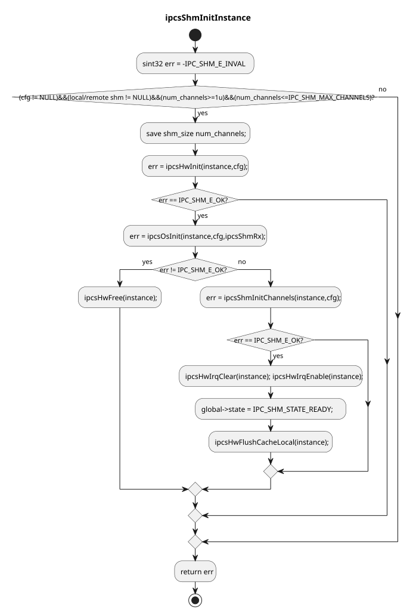

### 4.4.22 findPoolForBuf

<table border="1" cellspacing="0" cellpadding="4">
<tbody>
<tr>
<td>对应软件架构ID</td>
<td colspan="4">Drv_Ipcs_Core_Cmp</td>
</tr>
<tr>
<td>软件单元 ID</td>
<td colspan="4">SWU_IPCS_CORE_SHM</td>
</tr>
<tr>
<td>函数说明</td>
<td colspan="4">Find the pool that owns the specified buffer.</td>
</tr>
<tr>
<td>函数原型</td>
<td colspan="4">static sint16 findPoolForBuf(struct IPCS_MANAGED_CHANNEL_TYPE *chan, uintptr_t buf, sint32 remote)</td>
</tr>
<tr>
<td>制约条件</td>
<td colspan="4">-</td>
</tr>
<tr>
<td rowspan="4">输入/输出参数</td>
<td>I/O</td>
<td>参数名</td>
<td>数据类型</td>
<td>说明</td>
</tr>
<tr>
<td>I</td>
<td>chan</td>
<td>struct IPCS_MANAGED_CHANNEL_TYPE *</td>
<td>managed channel pointer</td>
</tr>
<tr>
<td>I</td>
<td>buf</td>
<td>uintptr_t</td>
<td>buffer pointer</td>
</tr>
<tr>
<td>I</td>
<td>remote</td>
<td>sint32</td>
<td>flag telling if buffer is from remote OS</td>
</tr>
<tr>
<td rowspan="2">返回值</td>
<td colspan="2">数据类型</td>
<td colspan="2">说明</td>
</tr>
<tr>
<td colspan="2">sint16</td>
<td colspan="2">pool index on success, -1 otherwise</td>
</tr>
<tr>
<td>函数定义文件</td>
<td colspan="4">ipcs/ipcs_cores/ipc-shm.c</td>
</tr>
<tr>
<td>函数声明文件</td>
<td colspan="4">-</td>
</tr>
</tbody>
</table>

processing flow

### 4.4.23 ipcsMemcpy

<table border="1" cellspacing="0" cellpadding="4">
<tbody>
<tr>
<td>对应软件架构ID</td>
<td colspan="4">Drv_Ipcs_Core_Cmp</td>
</tr>
<tr>
<td>软件单元 ID</td>
<td colspan="4">SWU_IPCS_CORE_UTIL</td>
</tr>
<tr>
<td>函数说明</td>
<td colspan="4">-</td>
</tr>
<tr>
<td>函数原型</td>
<td colspan="4">void ipcsMemcpy(void *dst, const void *src, uint32 data_size)</td>
</tr>
<tr>
<td>制约条件</td>
<td colspan="4">-</td>
</tr>
<tr>
<td rowspan="4">输入/输出参数</td>
<td>I/O</td>
<td>参数名</td>
<td>数据类型</td>
<td>说明</td>
</tr>
<tr>
<td>I</td>
<td>dst</td>
<td>void *</td>
<td>目的地址指针</td>
</tr>
<tr>
<td>I</td>
<td>src</td>
<td>const void *</td>
<td>源地址指针</td>
</tr>
<tr>
<td>I</td>
<td>data_size</td>
<td>uint32</td>
<td>复制数据大小，单位为 byte</td>
</tr>
<tr>
<td rowspan="2">返回值</td>
<td colspan="2">数据类型</td>
<td colspan="2">说明</td>
</tr>
<tr>
<td colspan="4">-</td>
</tr>
<tr>
<td>函数定义文件</td>
<td colspan="4">ipcs/ipcs_cores/ipc-util.c</td>
</tr>
<tr>
<td>函数声明文件</td>
<td colspan="4">ipcs/ipcs_cores/ipc-util.h</td>
</tr>
</tbody>
</table>

processing flow

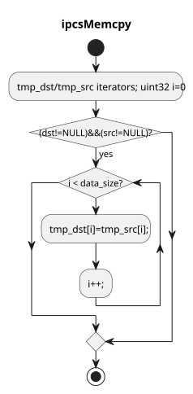

## 4.5 GLOBAL VARIABLES 全局变量

| 全局变量名称 | 全局变量类型 | 全局变量范围 | 全局变量描述 | 全局变量的存储RAM区 |
|---|---|---|---|---|
| ipc_shm_priv_data | static struct IPCS_SHM_PRIV_TYPE [IPC_SHM_MAX_INSTANCES] | ipcs/ipcs_cores/ipc-shm.c | IPCS shm private data | 编译器/链接器默认 RAM（.bss，未指定 section） |

## 4.6 DATA TYPES 类型定义

### 4.6.1 struct IPCS_RING_TYPE

| Type | Name | Description |
|---|---|---|
| uint64 | sentinel | a magic word to ensure ring integrity |
| volatile uint32 | write | write index, position used to store next byte in the buffer |
| volatile uint32 | read | read index, read next byte from this position |
| uint8 | data[] | circular buffer |

### 4.6.2 struct IPCS_QUEUE_TYPE

| Type | Name | Description |
|---|---|---|
| uint16 | elem_num | number of elements in queue |
| uint8 | elem_size | element size in bytes (8-byte multiple) |
| struct IPCS_RING_TYPE | *push_ring | push buffer ring mapped in local shared memory |
| struct IPCS_RING_TYPE | *pop_ring | pop buffer ring mapped in remote shared memory |

### 4.6.3 enum IPCS_SHM_INSTANCE_STATE_E

| Name | Description |
|---|---|
| IPC_SHM_INSTANCE_USED | instance is used |
| IPC_SHM_INSTANCE_FREE | instance is free and can be used |
| IPC_SHM_INSTANCE_ERROR | there are some errors |

### 4.6.4 struct IPCS_SHM_POOL_ADDR_TYPE

| Type | Name | Description |
|---|---|---|
| uintptr_t | local_pool_shm | address of local buffer pool |
| uintptr_t | remote_pool_shm | address of remote buffer pool |

### 4.6.5 struct IPCS_SHM_BD_TYPE

| Type | Name | Description |
|---|---|---|
| sint16 | pool_id | index of buffer pool |
| uint16 | buf_id | index of buffer from buffer pool |
| uint32 | data_size | size of data written in buffer |

### 4.6.6 struct IPCS_SHM_POOL_TYPE

| Type | Name | Description |
|---|---|---|
| uint16 | num_bufs | number of buffers in pool |
| uint32 | buf_size | size of buffers |
| uint32 | shm_size | size of shared memory mapped by this pool (queue + bufs) |
| uintptr_t | local_pool_addr | address of local buffer pool |
| uintptr_t | remote_pool_addr | address of remote buffer pool |
| struct IPCS_QUEUE_TYPE | bd_queue | queue containing BDs of free buffers |

### 4.6.7 struct IPCS_MANAGED_CHANNEL_TYPE

| Type | Name | Description |
|---|---|---|
| struct IPCS_QUEUE_TYPE | bd_queue | queue containing BDs of sent/received buffers |
| uint8 | num_pools | number of buffer pools |
| struct IPCS_SHM_POOL_TYPE | pools[IPC_SHM_MAX_POOLS] | buffer pools private data |
| void (rx_cb)(void cb_arg, const uint8 instance, sint32 chan_id, void *buf, uint32 size) | rx_cb | receive callback |
| void | *cb_arg | optional receive callback argument |

### 4.6.8 struct IPCS_CHANNEL_UMEM_TYPE

| Type | Name | Description |
|---|---|---|
| uint32 | sentinel | magic word to ensure unmanaged channel integrity |
| volatile uint32 | tx_count | local channel Tx counter (it wraps around at max uint32) |
| uint8 | mem[] | local channel unmanaged memory buffer |

### 4.6.9 struct IPCS_UNMANAGED_CHANNEL_TYPE

| Type | Name | Description |
|---|---|---|
| uint32 | size | unmanaged channel memory size requested by app |
| struct IPCS_CHANNEL_UMEM_TYPE | *local_mem | 源码未提供描述 |
| struct IPCS_CHANNEL_UMEM_TYPE | *remote_mem | 源码未提供描述 |
| uint32 | remote_tx_count | copy of remote Tx counter |
| void (rx_cb)(void cb_arg, const uint8 instance, sint32 chan_id, void *buf) | rx_cb | receive callback |
| void | *cb_arg | optional receive callback argument |

### 4.6.10 struct IPCS_SHM_CHANNEL_TYPE

| Type | Name | Description |
|---|---|---|
| sint32 | id | channel id |
| enum IPCS_SHM_CHANNEL_TYPE_E | type | channel type (see IPCS_SHM_CHANNEL_TYPE_E) |
| struct IPCS_MANAGED_CHANNEL_TYPE | ch.mng | 源码未提供描述 |
| struct IPCS_UNMANAGED_CHANNEL_TYPE | ch.umng | 源码未提供描述 |

### 4.6.11 struct IPCS_SHM_GLOBAL_TYPE

| Type | Name | Description |
|---|---|---|
| uint64 | state | state to indicate whether local is initialized |

### 4.6.12 struct IPCS_SHM_PRIV_TYPE

| Type | Name | Description |
|---|---|---|
| uint32 | shm_size | local/remote shared memory size |
| uint8 | num_channels | number of shared memory channels |
| struct IPCS_SHM_CHANNEL_TYPE | channels[IPC_SHM_MAX_CHANNELS] | ipc channels private data |
| struct IPCS_SHM_GLOBAL_TYPE | *global | local global data shared with remote |

### 4.6.13 enum IPCS_SHM_CHANNEL_TYPE_E

| Name | Description |
|---|---|
| IPC_SHM_MANAGED | channel with buffer management enabled |
| IPC_SHM_UNMANAGED | buf mgmt disabled, app owns entire channel memory |

### 4.6.14 enum IPCS_SHM_CORE_TYPE_E

| Name | Description |
|---|---|
| IPC_CORE_DEFAULT | used for letting driver auto-select remote core type |
| IPC_CORE_A53 | ARM Cortex-A53 core |
| IPC_CORE_M7 | ARM Cortex-M7 core |
| IPC_CORE_M4 | ARM Cortex-M4 core |
| IPC_CORE_Z7 | PowerPC e200z7 core |
| IPC_CORE_Z4 | PowerPC e200z4 core |
| IPC_CORE_Z2 | PowerPC e200z2 core |
| IPC_CORE_R52 | ARM Cortex-R52 core |
| IPC_CORE_M33 | ARM Cortex-M33 core |
| IPC_CORE_BBE32 | Tensilica ConnX BBE32EP core |

### 4.6.15 enum IPCS_SHM_CORE_INDEX_E

| Name | Description |
|---|---|
| IPC_CORE_INDEX_0 | Processor index 0 |
| IPC_CORE_INDEX_1 | Processor index 1 |
| IPC_CORE_INDEX_2 | Processor index 2 |
| IPC_CORE_INDEX_3 | Processor index 3 |
| IPC_CORE_INDEX_4 | Processor index 4 |
| IPC_CORE_INDEX_5 | Processor index 5 |
| IPC_CORE_INDEX_6 | Processor index 6 |
| IPC_CORE_INDEX_7 | Processor index 7 |

### 4.6.16 struct IPCS_SHM_POOL_CFG_TYPE

| Type | Name | Description |
|---|---|---|
| uint16 | num_bufs | number of buffers |
| uint32 | buf_size | buffer size |

### 4.6.17 struct IPCS_SHM_MANAGED_CFG_TYPE

| Type | Name | Description |
|---|---|---|
| uint8 | num_pools | number of buffer pools |
| struct IPCS_SHM_POOL_CFG_TYPE | *pools | memory buffer pools parameters |
| void (rx_cb)(void cb_arg, const uint8 instance, sint32 chan_id, void *buf, uint32 size) | rx_cb | receive callback |
| void | *cb_arg | optional receive callback argument |

### 4.6.18 struct IPCS_SHM_UNMANAGED_CFG_TYPE

| Type | Name | Description |
|---|---|---|
| uint32 | size | unmanaged channel memory size |
| void (rx_cb)(void cb_arg, const uint8 instance, sint32 chan_id, void *mem) | rx_cb | receive callback |
| void | *cb_arg | optional receive callback argument |

### 4.6.19 struct IPCS_SHM_CHANNEL_CFG_TYPE

| Type | Name | Description |
|---|---|---|
| enum IPCS_SHM_CHANNEL_TYPE_E | type | channel type from &amp;enum IPCS_SHM_CHANNEL_TYPE_E |
| struct IPCS_SHM_MANAGED_CFG_TYPE | ch.managed | 源码未提供描述 |
| struct IPCS_SHM_UNMANAGED_CFG_TYPE | ch.unmanaged | 源码未提供描述 |

### 4.6.20 struct IPCS_SHM_REMOTE_CORE_TYPE

| Type | Name | Description |
|---|---|---|
| enum IPCS_SHM_CORE_TYPE_E | type | core type from &amp;enum IPCS_SHM_CORE_TYPE_E |
| enum IPCS_SHM_CORE_INDEX_E | index | core number |

### 4.6.21 struct IPCS_SHM_LOCAL_CORE_TYPE

| Type | Name | Description |
|---|---|---|
| enum IPCS_SHM_CORE_TYPE_E | type | core type from &amp;enum IPCS_SHM_CORE_TYPE_E |
| enum IPCS_SHM_CORE_INDEX_E | index | core number targeted by remote core interrupt |
| uint32 | trusted | trusted cores mask |

### 4.6.22 struct IPCS_SHM_CFG_TYPE

| Type | Name | Description |
|---|---|---|
| uintptr_t | local_shm_addr | local shared memory physical address |
| uintptr_t | remote_shm_addr | remote shared memory physical address |
| uint32 | shm_size | local/remote shared memory size |
| sint32 | inter_core_tx_irq | inter-core interrupt reserved for shm driver Tx |
| sint32 | inter_core_rx_irq | inter-core interrupt reserved for shm driver Rx |
| uint8 | mru_tx_channel_id | mru channel index for shm driver Tx |
| uint8 | mru_rx_channel_id | mru channel index for shm driver Rx |
| struct IPCS_SHM_LOCAL_CORE_TYPE | local_core | local core targeted by remote core interrupt |
| struct IPCS_SHM_REMOTE_CORE_TYPE | remote_core | remote core to trigger the interrupt on |
| uint8 | num_channels | number of shared memory channels |
| struct IPCS_SHM_CHANNEL_CFG_TYPE * | channels | IPC channels parameters array |
| ISRType | isr_id_handler | the name of OsIsr defined to handle the interrupt |

### 4.6.23 struct IPCS_SHM_INSTANCES_CFG_TYPE

| Type | Name | Description |
|---|---|---|
| uint8 | num_instances | number of shared memory instances |
| struct IPCS_SHM_CFG_TYPE | *shm_cfg | IPC shm parameters array |

## 4.7 DYNAMIC DETAILED DESIGN 动态详细设计

本节描述与部署变体无关的 **逻辑** 数据路径（Core + Queue）。

| 场景 ID | 场景名称 | 涉及软件单元 | 设计依据 |
|---|---|---|---|
| CORE-S01 | 初始化 | CORE_SHM、HAL、OSAL、CORE_QUEUE | `ipcsShmInit` → `ipcsHwInit` → `ipcsOsInit` → `ipcsShmInitChannels` |
| CORE-S02 | Managed 发送 | CORE_SHM、CORE_QUEUE、HAL | `ipcsShmAcquireBuf` → `ipcsShmTx` → `ipcsQueuePush` → `ipcsHwIrqNotify` |
| CORE-S03 | Managed 接收与释放 | HAL、OSAL、CORE_SHM、CORE_QUEUE | `ipcsShmRx` → `ipcsChannelRx` → `rx_cb` → `ipcsShmReleaseBuf` |
| CORE-S04 | Unmanaged 收发 | CORE_SHM、HAL | `ipcsShmUnmanagedTx` / 对端 `tx_count` 比对 |
| CORE-S05 | 中断与轮询 | CORE_SHM、OSAL、HAL | IRQ 路径 vs `ipcsShmPollChannels` |

### 4.7.1 Initialization Sequence (CORE-S01) 初始化流程

按架构：应用调用 ipcsShmInit → 逐 instance 调用 HAL 初始化、OSAL 初始化、channel 初始化（具体 HAL/OSAL 实现见第 4/5 章）。

sequence diagram

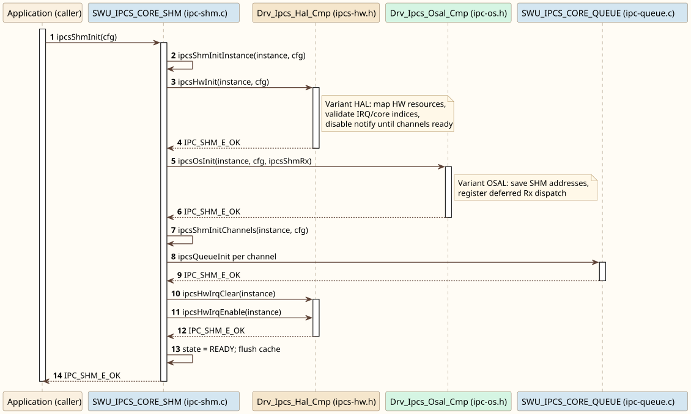

### 4.7.2 Managed Transmit Sequence (CORE-S02) Managed 发送流程

ipcsShmAcquireBuf → 填充数据 → ipcsShmTx → queue push BD → HAL 通知远端。

sequence diagram

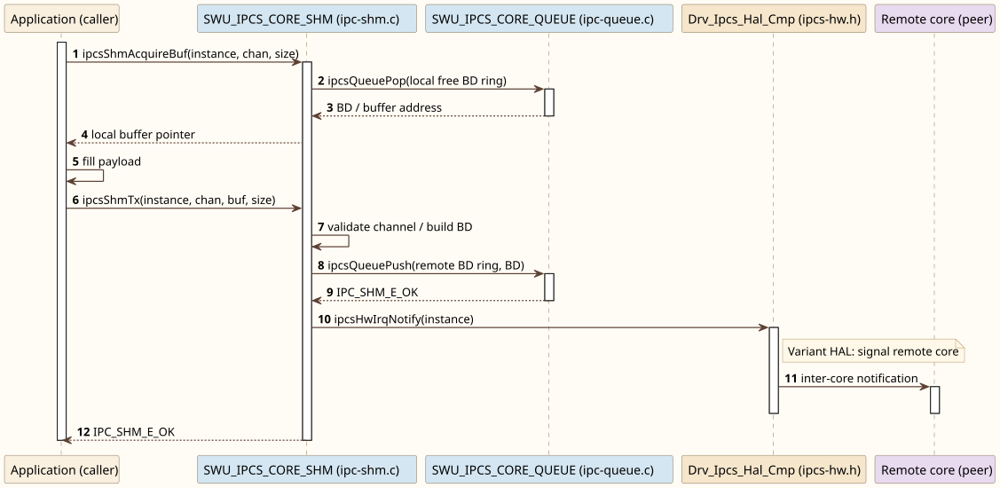

### 4.7.3 Managed Receive and Release Sequence (CORE-S03) Managed 接收与释放流程

OSAL 触发 ipcsShmRx → ipcsChannelRx → 应用回调 → ipcsShmReleaseBuf。

sequence diagram

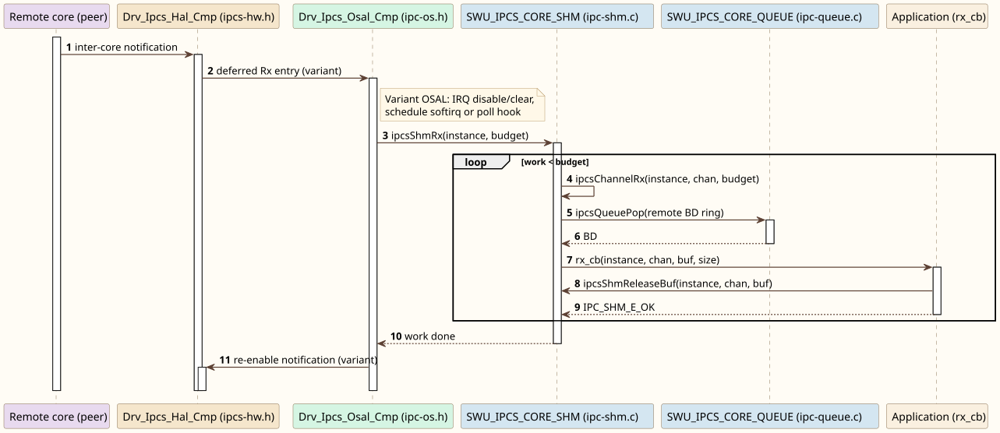

### 4.7.4 Unmanaged Sequence (CORE-S04) Unmanaged 收发流程

ipcsShmUnmanagedAcquire / ipcsShmUnmanagedTx；接收侧检查 tx_count。

sequence diagram

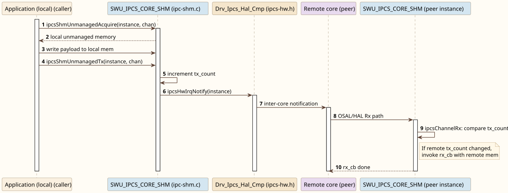

### 4.7.5 Interrupt and Polling Sequence (CORE-S05) 中断与轮询流程

OSAL 注册 hardirq/softirq 或 polling（ipcsShmPollChannels）；Core 按预算分发 channel。

sequence diagram

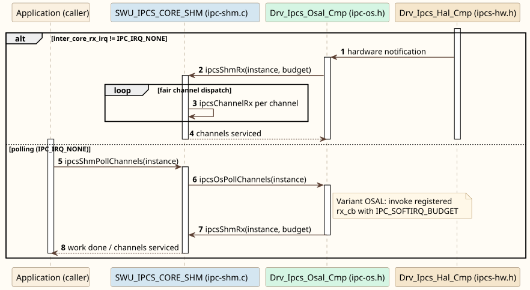

# 5 RTOS VARIANT DETAILED DESIGN RTOS详设

## 5.1 DEFINITION AND SCOPE 定义与范围

RTOS 部署变体在单地址空间内实现 Drv_Ipcs_Osal_Cmp 与 Drv_Ipcs_Hal_Cmp：OS 实现三选一（FreeRTOS、ThreadX、AUTOSAR OS），HAL 位于 `ipcs/mcu/hw/` 并由三种 OS 实现共用。通信核心仍使用第 4 章 `ipcs/ipcs_cores` 与 `ipc-shm.h` 对外 API。

## 5.2 FILE STRUCTURE 文件结构

### 5.2.1 File List 文件列表

| 组件 | 文件 |
|---|---|
| Drv_Ipcs_Hal_Cmp | ipcs/mcu/hw/ipc-hw-platform.h |
| Drv_Ipcs_Hal_Cmp | ipcs/mcu/hw/ipc-hw.c |
| Drv_Ipcs_Hal_Cmp | ipcs/mcu/hw/ipc-hw.h |
| Drv_Ipcs_Osal_Cmp | ipcs/mcu/os/autosar/ipc-os-autosar.c |
| Drv_Ipcs_Osal_Cmp | ipcs/mcu/os/freertos/ipc-os-freertos.c |
| Drv_Ipcs_Osal_Cmp | ipcs/mcu/os/ipc-os.h |
| Drv_Ipcs_Osal_Cmp | ipcs/mcu/os/threadx/ipc-os-threadx.c |

### 5.2.2 ipc-hw-platform.h

描述：

> ipcs/mcu/hw/ipc-hw-platform.h 属于 Drv_Ipcs_Hal_Cmp / 平台定义。

依赖关系：

C1_M7_COMMON.h、C1_SCB.h、C1_MSCM.h（与 `ipcs/mcu/hw/ipc-hw-platform.h` 一致）

### 5.2.3 ipc-hw.c

描述：

> ipcs/mcu/hw/ipc-hw.c 属于 Drv_Ipcs_Hal_Cmp / IPCS-HAL。

依赖关系：

ipc-shm.h、ipc-os.h、ipc-hw.h、ipc-hw-platform.h（与 `ipcs/mcu/hw/ipc-hw.c` 中 #include 顺序一致）

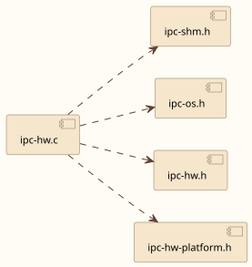

### 5.2.4 ipc-hw.h

描述：

> ipcs/mcu/hw/ipc-hw.h 属于 Drv_Ipcs_Hal_Cmp / IPCS-HAL。

依赖关系：

本头文件未 #include 工程内其他头文件（仅 HAL API 声明）。

### 5.2.5 ipc-os-autosar.c

描述：

> ipcs/mcu/os/autosar/ipc-os-autosar.c 属于 Drv_Ipcs_Osal_Cmp / AUTOSAR OS 实现。

依赖关系：

Os.h、ipc-shm.h、ipc-os.h、ipc-hw.h（与 `ipcs/mcu/os/autosar/ipc-os-autosar.c` 中 #include 顺序一致）

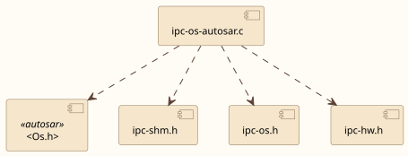

### 5.2.6 ipc-os-freertos.c

描述：

> ipcs/mcu/os/freertos/ipc-os-freertos.c 属于 Drv_Ipcs_Osal_Cmp / FreeRTOS 实现。

依赖关系：

ipc-shm.h、ipc-os.h、ipc-hw.h、FreeRTOS.h、task.h（与 `ipcs/mcu/os/freertos/ipc-os-freertos.c` 一致）

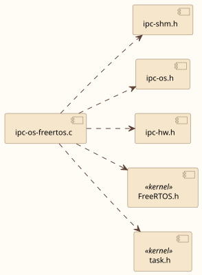

### 5.2.7 ipc-os.h

描述：

> ipcs/mcu/os/ipc-os.h 属于 Drv_Ipcs_Osal_Cmp / IPCS-OSAL。

依赖关系：

本头文件未 #include 工程内其他头文件（OSAL 宏与 API 声明）。

### 5.2.8 ipc-os-threadx.c

描述：

> ipcs/mcu/os/threadx/ipc-os-threadx.c 属于 Drv_Ipcs_Osal_Cmp / ThreadX 实现。

依赖关系：

ipc-shm.h、ipc-os.h、ipc-hw.h、tx_api.h、tx_event_flags.h（与 `ipcs/mcu/os/threadx/ipc-os-threadx.c` 一致）

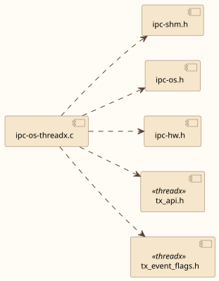

## 5.3 SWU_IPCS_OSAL_AUTOSAR DESIGN 单元设计

### 4.4.41 ipcsOsInit

<table border="1" cellspacing="0" cellpadding="4">
<tbody>
<tr>
<td>对应软件架构ID</td>
<td colspan="4">Drv_Ipcs_Osal_Cmp</td>
</tr>
<tr>
<td>软件单元 ID</td>
<td colspan="4">SWU_IPCS_OSAL_AUTOSAR</td>
</tr>
<tr>
<td>函数说明</td>
<td colspan="4">OS specific initialization code</td>
</tr>
<tr>
<td>函数原型</td>
<td colspan="4">sint32 ipcsOsInit(const uint8 instance, const struct IPCS_SHM_CFG_TYPE *cfg, sint32 (*rx_cb)(const uint8, sint32))</td>
</tr>
<tr>
<td>制约条件</td>
<td colspan="4">-</td>
</tr>
<tr>
<td rowspan="4">输入/输出参数</td>
<td>I/O</td>
<td>参数名</td>
<td>数据类型</td>
<td>说明</td>
</tr>
<tr>
<td>I</td>
<td>instance</td>
<td>const uint8</td>
<td>IPCS shared memory instance 索引</td>
</tr>
<tr>
<td>I</td>
<td>cfg</td>
<td>const struct IPCS_SHM_CFG_TYPE *</td>
<td>configuration parameters</td>
</tr>
<tr>
<td>I</td>
<td>rx_cb</td>
<td>sint32 (*rx_cb)(const uint8, sint32)</td>
<td>rx callback to be called from rx softirq</td>
</tr>
<tr>
<td rowspan="2">返回值</td>
<td colspan="2">数据类型</td>
<td colspan="2">说明</td>
</tr>
<tr>
<td colspan="2">sint32</td>
<td colspan="2">IPC_SHM_E_OK on success, -IPC_SHM_E_NOTSUP if softirq task not in</td>
</tr>
<tr>
<td>函数定义文件</td>
<td colspan="4">ipcs/mcu/os/autosar/ipc-os-autosar.c</td>
</tr>
<tr>
<td>函数声明文件</td>
<td colspan="4">ipcs/mcu/os/ipc-os.h</td>
</tr>
</tbody>
</table>

processing flow

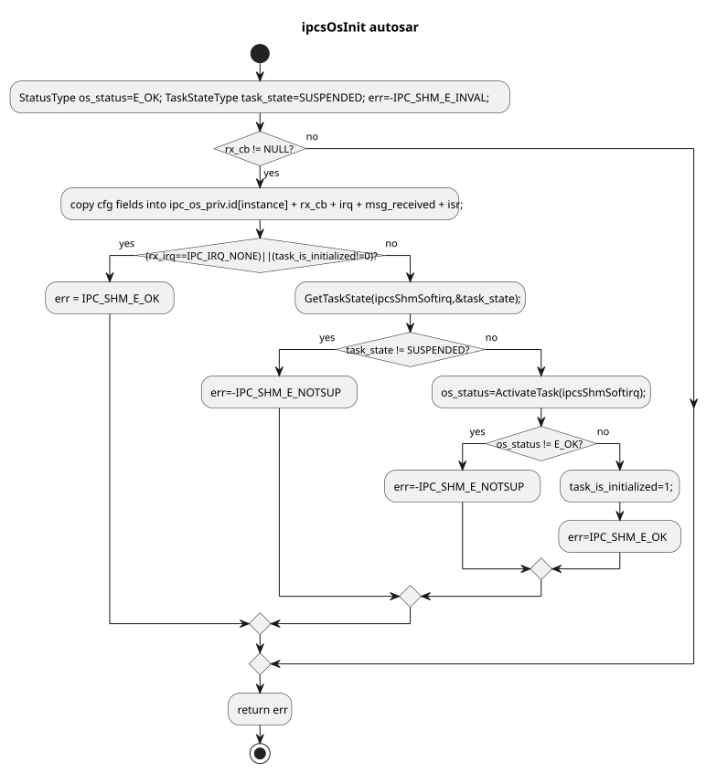

### 4.4.42 ipcsOsFree

<table border="1" cellspacing="0" cellpadding="4">
<tbody>
<tr>
<td>对应软件架构ID</td>
<td colspan="4">Drv_Ipcs_Osal_Cmp</td>
</tr>
<tr>
<td>软件单元 ID</td>
<td colspan="4">SWU_IPCS_OSAL_AUTOSAR</td>
</tr>
<tr>
<td>函数说明</td>
<td colspan="4">free OS specific resources</td>
</tr>
<tr>
<td>函数原型</td>
<td colspan="4">void ipcsOsFree(const uint8 instance)</td>
</tr>
<tr>
<td>制约条件</td>
<td colspan="4">-</td>
</tr>
<tr>
<td rowspan="2">输入/输出参数</td>
<td>I/O</td>
<td>参数名</td>
<td>数据类型</td>
<td>说明</td>
</tr>
<tr>
<td>I</td>
<td>instance</td>
<td>const uint8</td>
<td>IPCS shared memory instance 索引</td>
</tr>
<tr>
<td rowspan="2">返回值</td>
<td colspan="2">数据类型</td>
<td colspan="2">说明</td>
</tr>
<tr>
<td colspan="4">-</td>
</tr>
<tr>
<td>函数定义文件</td>
<td colspan="4">ipcs/mcu/os/autosar/ipc-os-autosar.c</td>
</tr>
<tr>
<td>函数声明文件</td>
<td colspan="4">ipcs/mcu/os/ipc-os.h</td>
</tr>
</tbody>
</table>

processing flow

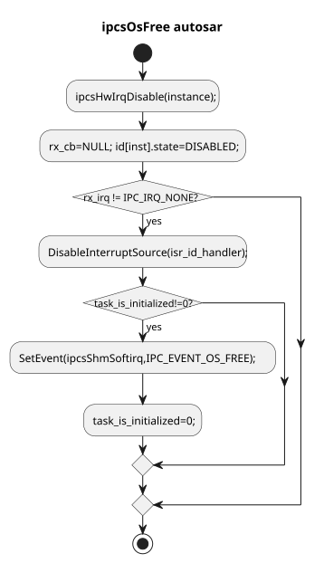

### 4.4.43 ipcsShmSoftirq

<table border="1" cellspacing="0" cellpadding="4">
<tbody>
<tr>
<td>对应软件架构ID</td>
<td colspan="4">Drv_Ipcs_Osal_Cmp</td>
</tr>
<tr>
<td>软件单元 ID</td>
<td colspan="4">SWU_IPCS_OSAL_AUTOSAR</td>
</tr>
<tr>
<td>函数说明</td>
<td colspan="4">task acting as deferred interrupt handler</td>
</tr>
<tr>
<td>函数原型</td>
<td colspan="4">TASK(ipcsShmSoftirq)</td>
</tr>
<tr>
<td>制约条件</td>
<td colspan="4">-</td>
</tr>
<tr>
<td rowspan="2">输入/输出参数</td>
<td>I/O</td>
<td>参数名</td>
<td>数据类型</td>
<td>说明</td>
</tr>
<tr>
<td>-</td>
<td>-</td>
<td>-</td>
<td>-</td>
</tr>
<tr>
<td rowspan="2">返回值</td>
<td colspan="2">数据类型</td>
<td colspan="2">说明</td>
</tr>
<tr>
<td colspan="4">-</td>
</tr>
<tr>
<td>函数定义文件</td>
<td colspan="4">ipcs/mcu/os/autosar/ipc-os-autosar.c</td>
</tr>
<tr>
<td>函数声明文件</td>
<td colspan="4">-</td>
</tr>
</tbody>
</table>

processing flow

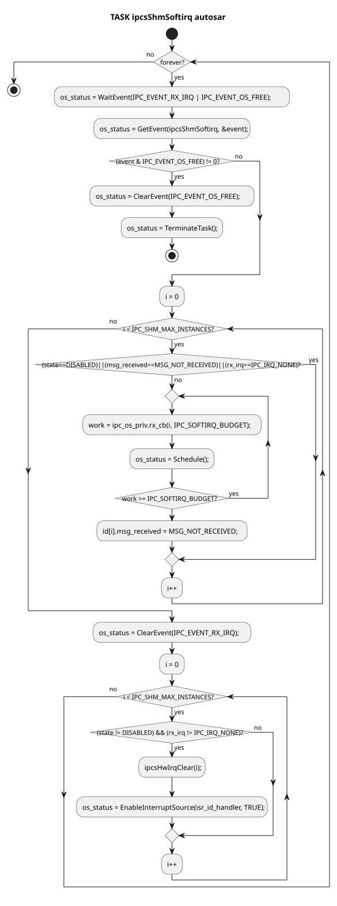

### 4.4.44 ipcsShmHardirq

<table border="1" cellspacing="0" cellpadding="4">
<tbody>
<tr>
<td>对应软件架构ID</td>
<td colspan="4">Drv_Ipcs_Osal_Cmp</td>
</tr>
<tr>
<td>软件单元 ID</td>
<td colspan="4">SWU_IPCS_OSAL_AUTOSAR</td>
</tr>
<tr>
<td>函数说明</td>
<td colspan="4">driver interrupt service routine</td>
</tr>
<tr>
<td>函数原型</td>
<td colspan="4">void ipcsShmHardirq(void)</td>
</tr>
<tr>
<td>制约条件</td>
<td colspan="4">-</td>
</tr>
<tr>
<td rowspan="2">输入/输出参数</td>
<td>I/O</td>
<td>参数名</td>
<td>数据类型</td>
<td>说明</td>
</tr>
<tr>
<td>-</td>
<td>-</td>
<td>-</td>
<td>-</td>
</tr>
<tr>
<td rowspan="2">返回值</td>
<td colspan="2">数据类型</td>
<td colspan="2">说明</td>
</tr>
<tr>
<td colspan="4">-</td>
</tr>
<tr>
<td>函数定义文件</td>
<td colspan="4">ipcs/mcu/os/autosar/ipc-os-autosar.c</td>
</tr>
<tr>
<td>函数声明文件</td>
<td colspan="4">ipcs/mcu/os/ipc-os.h</td>
</tr>
</tbody>
</table>

processing flow

### 4.4.45 ipcsShmHardirqInstance

<table border="1" cellspacing="0" cellpadding="4">
<tbody>
<tr>
<td>对应软件架构ID</td>
<td colspan="4">Drv_Ipcs_Osal_Cmp</td>
</tr>
<tr>
<td>软件单元 ID</td>
<td colspan="4">SWU_IPCS_OSAL_AUTOSAR</td>
</tr>
<tr>
<td>函数说明</td>
<td colspan="4">driver interrupt service routine</td>
</tr>
<tr>
<td>函数原型</td>
<td colspan="4">void ipcsShmHardirqInstance(const uint8 instance)</td>
</tr>
<tr>
<td>制约条件</td>
<td colspan="4">-</td>
</tr>
<tr>
<td rowspan="2">输入/输出参数</td>
<td>I/O</td>
<td>参数名</td>
<td>数据类型</td>
<td>说明</td>
</tr>
<tr>
<td>I</td>
<td>instance</td>
<td>const uint8</td>
<td>IPCS shared memory instance 索引</td>
</tr>
<tr>
<td rowspan="2">返回值</td>
<td colspan="2">数据类型</td>
<td colspan="2">说明</td>
</tr>
<tr>
<td colspan="4">-</td>
</tr>
<tr>
<td>函数定义文件</td>
<td colspan="4">ipcs/mcu/os/autosar/ipc-os-autosar.c</td>
</tr>
<tr>
<td>函数声明文件</td>
<td colspan="4">ipcs/mcu/os/ipc-os.h</td>
</tr>
</tbody>
</table>

processing flow

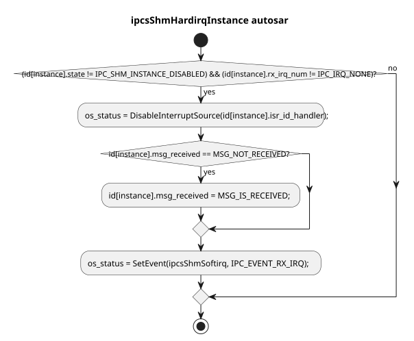

### 4.4.46 ipcsOsGetLocalShm

<table border="1" cellspacing="0" cellpadding="4">
<tbody>
<tr>
<td>对应软件架构ID</td>
<td colspan="4">Drv_Ipcs_Osal_Cmp</td>
</tr>
<tr>
<td>软件单元 ID</td>
<td colspan="4">SWU_IPCS_OSAL_AUTOSAR</td>
</tr>
<tr>
<td>函数说明</td>
<td colspan="4">get local shared mem address</td>
</tr>
<tr>
<td>函数原型</td>
<td colspan="4">uintptr_t ipcsOsGetLocalShm(const uint8 instance)</td>
</tr>
<tr>
<td>制约条件</td>
<td colspan="4">-</td>
</tr>
<tr>
<td rowspan="2">输入/输出参数</td>
<td>I/O</td>
<td>参数名</td>
<td>数据类型</td>
<td>说明</td>
</tr>
<tr>
<td>I</td>
<td>instance</td>
<td>const uint8</td>
<td>IPCS shared memory instance 索引</td>
</tr>
<tr>
<td rowspan="2">返回值</td>
<td colspan="2">数据类型</td>
<td colspan="2">说明</td>
</tr>
<tr>
<td colspan="2">uintptr_t</td>
<td colspan="2">源码返回值</td>
</tr>
<tr>
<td>函数定义文件</td>
<td colspan="4">ipcs/mcu/os/autosar/ipc-os-autosar.c</td>
</tr>
<tr>
<td>函数声明文件</td>
<td colspan="4">ipcs/mcu/os/ipc-os.h</td>
</tr>
</tbody>
</table>

processing flow

### 4.4.47 ipcsOsGetRemoteShm

<table border="1" cellspacing="0" cellpadding="4">
<tbody>
<tr>
<td>对应软件架构ID</td>
<td colspan="4">Drv_Ipcs_Osal_Cmp</td>
</tr>
<tr>
<td>软件单元 ID</td>
<td colspan="4">SWU_IPCS_OSAL_AUTOSAR</td>
</tr>
<tr>
<td>函数说明</td>
<td colspan="4">get remote shared mem address</td>
</tr>
<tr>
<td>函数原型</td>
<td colspan="4">uintptr_t ipcsOsGetRemoteShm(const uint8 instance)</td>
</tr>
<tr>
<td>制约条件</td>
<td colspan="4">-</td>
</tr>
<tr>
<td rowspan="2">输入/输出参数</td>
<td>I/O</td>
<td>参数名</td>
<td>数据类型</td>
<td>说明</td>
</tr>
<tr>
<td>I</td>
<td>instance</td>
<td>const uint8</td>
<td>IPCS shared memory instance 索引</td>
</tr>
<tr>
<td rowspan="2">返回值</td>
<td colspan="2">数据类型</td>
<td colspan="2">说明</td>
</tr>
<tr>
<td colspan="2">uintptr_t</td>
<td colspan="2">源码返回值</td>
</tr>
<tr>
<td>函数定义文件</td>
<td colspan="4">ipcs/mcu/os/autosar/ipc-os-autosar.c</td>
</tr>
<tr>
<td>函数声明文件</td>
<td colspan="4">ipcs/mcu/os/ipc-os.h</td>
</tr>
</tbody>
</table>

processing flow

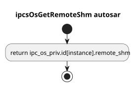

### 4.4.48 ipcsOsPollChannels

<table border="1" cellspacing="0" cellpadding="4">
<tbody>
<tr>
<td>对应软件架构ID</td>
<td colspan="4">Drv_Ipcs_Osal_Cmp</td>
</tr>
<tr>
<td>软件单元 ID</td>
<td colspan="4">SWU_IPCS_OSAL_AUTOSAR</td>
</tr>
<tr>
<td>函数说明</td>
<td colspan="4">invoke rx callback configured at initialization</td>
</tr>
<tr>
<td>函数原型</td>
<td colspan="4">sint32 ipcsOsPollChannels(const uint8 instance)</td>
</tr>
<tr>
<td>制约条件</td>
<td colspan="4">-</td>
</tr>
<tr>
<td rowspan="2">输入/输出参数</td>
<td>I/O</td>
<td>参数名</td>
<td>数据类型</td>
<td>说明</td>
</tr>
<tr>
<td>I</td>
<td>instance</td>
<td>const uint8</td>
<td>IPCS shared memory instance 索引</td>
</tr>
<tr>
<td rowspan="2">返回值</td>
<td colspan="2">数据类型</td>
<td colspan="2">说明</td>
</tr>
<tr>
<td colspan="2">sint32</td>
<td colspan="2">work done, error code otherwise</td>
</tr>
<tr>
<td>函数定义文件</td>
<td colspan="4">ipcs/mcu/os/autosar/ipc-os-autosar.c</td>
</tr>
<tr>
<td>函数声明文件</td>
<td colspan="4">ipcs/mcu/os/ipc-os.h</td>
</tr>
</tbody>
</table>

processing flow

## 5.4 SWU_IPCS_OSAL_FREERTOS DESIGN 单元设计

### 4.4.49 ipcsOsInit

<table border="1" cellspacing="0" cellpadding="4">
<tbody>
<tr>
<td>对应软件架构ID</td>
<td colspan="4">Drv_Ipcs_Osal_Cmp</td>
</tr>
<tr>
<td>软件单元 ID</td>
<td colspan="4">SWU_IPCS_OSAL_FREERTOS</td>
</tr>
<tr>
<td>函数说明</td>
<td colspan="4">OS specific initialization code</td>
</tr>
<tr>
<td>函数原型</td>
<td colspan="4">sint32 ipcsOsInit(const uint8 instance, const struct IPCS_SHM_CFG_TYPE *cfg, sint32 (*rx_cb)(const uint8, sint32))</td>
</tr>
<tr>
<td>制约条件</td>
<td colspan="4">-</td>
</tr>
<tr>
<td rowspan="4">输入/输出参数</td>
<td>I/O</td>
<td>参数名</td>
<td>数据类型</td>
<td>说明</td>
</tr>
<tr>
<td>I</td>
<td>instance</td>
<td>const uint8</td>
<td>IPCS shared memory instance 索引</td>
</tr>
<tr>
<td>I</td>
<td>cfg</td>
<td>const struct IPCS_SHM_CFG_TYPE *</td>
<td>configuration parameters</td>
</tr>
<tr>
<td>I</td>
<td>rx_cb</td>
<td>sint32 (*rx_cb)(const uint8, sint32)</td>
<td>rx callback to be called from rx softirq</td>
</tr>
<tr>
<td rowspan="2">返回值</td>
<td colspan="2">数据类型</td>
<td colspan="2">说明</td>
</tr>
<tr>
<td colspan="2">sint32</td>
<td colspan="2">IPC_SHM_E_OK on success, -IPC_SHM_E_NOMEM if the softirq task creation</td>
</tr>
<tr>
<td>函数定义文件</td>
<td colspan="4">ipcs/mcu/os/freertos/ipc-os-freertos.c</td>
</tr>
<tr>
<td>函数声明文件</td>
<td colspan="4">ipcs/mcu/os/ipc-os.h</td>
</tr>
</tbody>
</table>

processing flow

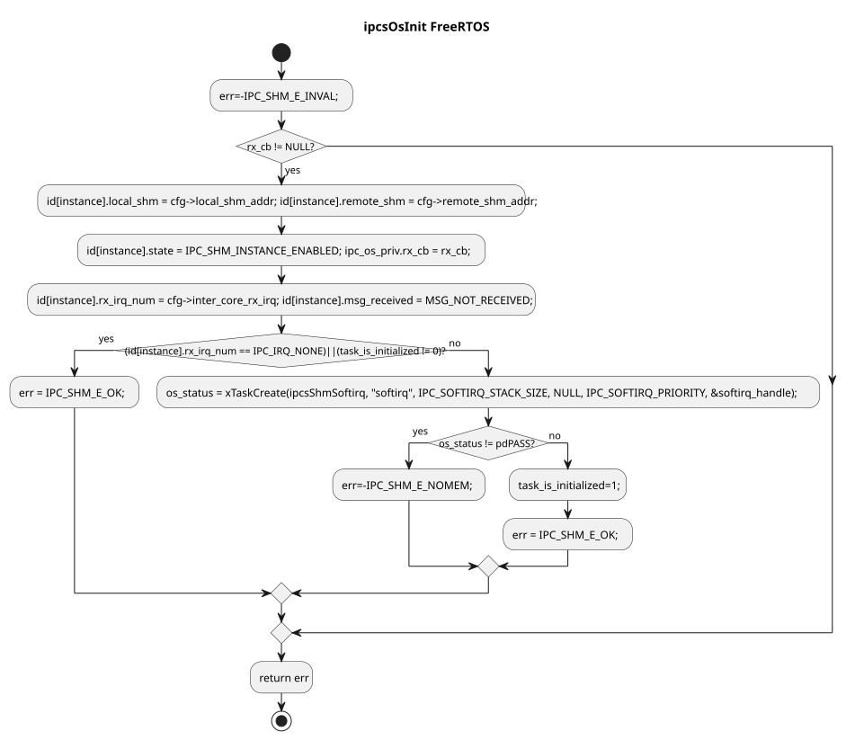

### 4.4.50 ipcsOsFree

<table border="1" cellspacing="0" cellpadding="4">
<tbody>
<tr>
<td>对应软件架构ID</td>
<td colspan="4">Drv_Ipcs_Osal_Cmp</td>
</tr>
<tr>
<td>软件单元 ID</td>
<td colspan="4">SWU_IPCS_OSAL_FREERTOS</td>
</tr>
<tr>
<td>函数说明</td>
<td colspan="4">free OS specific resources</td>
</tr>
<tr>
<td>函数原型</td>
<td colspan="4">void ipcsOsFree(const uint8 instance)</td>
</tr>
<tr>
<td>制约条件</td>
<td colspan="4">-</td>
</tr>
<tr>
<td rowspan="2">输入/输出参数</td>
<td>I/O</td>
<td>参数名</td>
<td>数据类型</td>
<td>说明</td>
</tr>
<tr>
<td>I</td>
<td>instance</td>
<td>const uint8</td>
<td>IPCS shared memory instance 索引</td>
</tr>
<tr>
<td rowspan="2">返回值</td>
<td colspan="2">数据类型</td>
<td colspan="2">说明</td>
</tr>
<tr>
<td colspan="4">-</td>
</tr>
<tr>
<td>函数定义文件</td>
<td colspan="4">ipcs/mcu/os/freertos/ipc-os-freertos.c</td>
</tr>
<tr>
<td>函数声明文件</td>
<td colspan="4">ipcs/mcu/os/ipc-os.h</td>
</tr>
</tbody>
</table>

processing flow

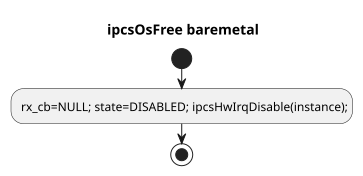

### 4.4.58 ipcsShmSoftirq

<table border="1" cellspacing="0" cellpadding="4">
<tbody>
<tr>
<td>对应软件架构ID</td>
<td colspan="4">Drv_Ipcs_Osal_Cmp</td>
</tr>
<tr>
<td>软件单元 ID</td>
<td colspan="4">SWU_IPCS_OSAL_FREERTOS</td>
</tr>
<tr>
<td>函数说明</td>
<td colspan="4">task acting as deferred interrupt handler</td>
</tr>
<tr>
<td>函数原型</td>
<td colspan="4">static void ipcsShmSoftirq(void)</td>
</tr>
<tr>
<td>制约条件</td>
<td colspan="4">-</td>
</tr>
<tr>
<td rowspan="2">输入/输出参数</td>
<td>I/O</td>
<td>参数名</td>
<td>数据类型</td>
<td>说明</td>
</tr>
<tr>
<td>-</td>
<td>-</td>
<td>-</td>
<td>-</td>
</tr>
<tr>
<td rowspan="2">返回值</td>
<td colspan="2">数据类型</td>
<td colspan="2">说明</td>
</tr>
<tr>
<td colspan="2">void</td>
<td colspan="2">源码返回值</td>
</tr>
<tr>
<td>函数定义文件</td>
<td colspan="4">ipcs/mcu/os/freertos/ipc-os-freertos.c</td>
</tr>
<tr>
<td>函数声明文件</td>
<td colspan="4">-</td>
</tr>
</tbody>
</table>

processing flow

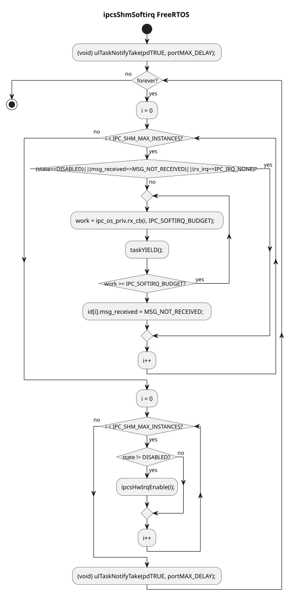

### 4.4.51 ipcsShmHardirq

<table border="1" cellspacing="0" cellpadding="4">
<tbody>
<tr>
<td>对应软件架构ID</td>
<td colspan="4">Drv_Ipcs_Osal_Cmp</td>
</tr>
<tr>
<td>软件单元 ID</td>
<td colspan="4">SWU_IPCS_OSAL_FREERTOS</td>
</tr>
<tr>
<td>函数说明</td>
<td colspan="4">driver interrupt service routine</td>
</tr>
<tr>
<td>函数原型</td>
<td colspan="4">void ipcsShmHardirq(void)</td>
</tr>
<tr>
<td>制约条件</td>
<td colspan="4">-</td>
</tr>
<tr>
<td rowspan="2">输入/输出参数</td>
<td>I/O</td>
<td>参数名</td>
<td>数据类型</td>
<td>说明</td>
</tr>
<tr>
<td>-</td>
<td>-</td>
<td>-</td>
<td>-</td>
</tr>
<tr>
<td rowspan="2">返回值</td>
<td colspan="2">数据类型</td>
<td colspan="2">说明</td>
</tr>
<tr>
<td colspan="4">-</td>
</tr>
<tr>
<td>函数定义文件</td>
<td colspan="4">ipcs/mcu/os/freertos/ipc-os-freertos.c</td>
</tr>
<tr>
<td>函数声明文件</td>
<td colspan="4">ipcs/mcu/os/ipc-os.h</td>
</tr>
</tbody>
</table>

processing flow

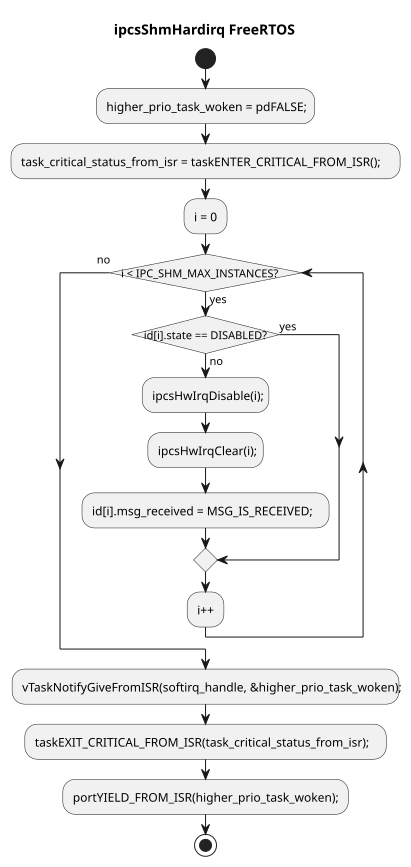

### 4.4.52 ipcsShmHardirqInstance

<table border="1" cellspacing="0" cellpadding="4">
<tbody>
<tr>
<td>对应软件架构ID</td>
<td colspan="4">Drv_Ipcs_Osal_Cmp</td>
</tr>
<tr>
<td>软件单元 ID</td>
<td colspan="4">SWU_IPCS_OSAL_FREERTOS</td>
</tr>
<tr>
<td>函数说明</td>
<td colspan="4">driver interrupt service routine</td>
</tr>
<tr>
<td>函数原型</td>
<td colspan="4">void ipcsShmHardirqInstance(const uint8 instance)</td>
</tr>
<tr>
<td>制约条件</td>
<td colspan="4">-</td>
</tr>
<tr>
<td rowspan="2">输入/输出参数</td>
<td>I/O</td>
<td>参数名</td>
<td>数据类型</td>
<td>说明</td>
</tr>
<tr>
<td>I</td>
<td>instance</td>
<td>const uint8</td>
<td>IPCS shared memory instance 索引</td>
</tr>
<tr>
<td rowspan="2">返回值</td>
<td colspan="2">数据类型</td>
<td colspan="2">说明</td>
</tr>
<tr>
<td colspan="4">-</td>
</tr>
<tr>
<td>函数定义文件</td>
<td colspan="4">ipcs/mcu/os/freertos/ipc-os-freertos.c</td>
</tr>
<tr>
<td>函数声明文件</td>
<td colspan="4">ipcs/mcu/os/ipc-os.h</td>
</tr>
</tbody>
</table>

processing flow

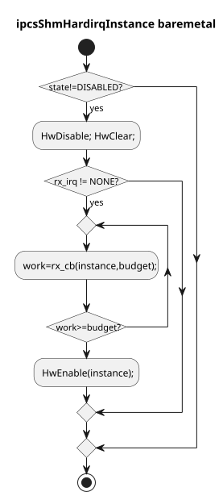

### 4.4.53 ipcsOsGetLocalShm

<table border="1" cellspacing="0" cellpadding="4">
<tbody>
<tr>
<td>对应软件架构ID</td>
<td colspan="4">Drv_Ipcs_Osal_Cmp</td>
</tr>
<tr>
<td>软件单元 ID</td>
<td colspan="4">SWU_IPCS_OSAL_FREERTOS</td>
</tr>
<tr>
<td>函数说明</td>
<td colspan="4">get local shared mem address</td>
</tr>
<tr>
<td>函数原型</td>
<td colspan="4">uintptr_t ipcsOsGetLocalShm(const uint8 instance)</td>
</tr>
<tr>
<td>制约条件</td>
<td colspan="4">-</td>
</tr>
<tr>
<td rowspan="2">输入/输出参数</td>
<td>I/O</td>
<td>参数名</td>
<td>数据类型</td>
<td>说明</td>
</tr>
<tr>
<td>I</td>
<td>instance</td>
<td>const uint8</td>
<td>IPCS shared memory instance 索引</td>
</tr>
<tr>
<td rowspan="2">返回值</td>
<td colspan="2">数据类型</td>
<td colspan="2">说明</td>
</tr>
<tr>
<td colspan="2">uintptr_t</td>
<td colspan="2">源码返回值</td>
</tr>
<tr>
<td>函数定义文件</td>
<td colspan="4">ipcs/mcu/os/freertos/ipc-os-freertos.c</td>
</tr>
<tr>
<td>函数声明文件</td>
<td colspan="4">ipcs/mcu/os/ipc-os.h</td>
</tr>
</tbody>
</table>

processing flow

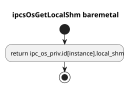

### 4.4.54 ipcsOsGetRemoteShm

<table border="1" cellspacing="0" cellpadding="4">
<tbody>
<tr>
<td>对应软件架构ID</td>
<td colspan="4">Drv_Ipcs_Osal_Cmp</td>
</tr>
<tr>
<td>软件单元 ID</td>
<td colspan="4">SWU_IPCS_OSAL_FREERTOS</td>
</tr>
<tr>
<td>函数说明</td>
<td colspan="4">get remote shared mem address</td>
</tr>
<tr>
<td>函数原型</td>
<td colspan="4">uintptr_t ipcsOsGetRemoteShm(const uint8 instance)</td>
</tr>
<tr>
<td>制约条件</td>
<td colspan="4">-</td>
</tr>
<tr>
<td rowspan="2">输入/输出参数</td>
<td>I/O</td>
<td>参数名</td>
<td>数据类型</td>
<td>说明</td>
</tr>
<tr>
<td>I</td>
<td>instance</td>
<td>const uint8</td>
<td>IPCS shared memory instance 索引</td>
</tr>
<tr>
<td rowspan="2">返回值</td>
<td colspan="2">数据类型</td>
<td colspan="2">说明</td>
</tr>
<tr>
<td colspan="2">uintptr_t</td>
<td colspan="2">源码返回值</td>
</tr>
<tr>
<td>函数定义文件</td>
<td colspan="4">ipcs/mcu/os/freertos/ipc-os-freertos.c</td>
</tr>
<tr>
<td>函数声明文件</td>
<td colspan="4">ipcs/mcu/os/ipc-os.h</td>
</tr>
</tbody>
</table>

processing flow

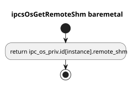

### 4.4.55 ipcsOsPollChannels

<table border="1" cellspacing="0" cellpadding="4">
<tbody>
<tr>
<td>对应软件架构ID</td>
<td colspan="4">Drv_Ipcs_Osal_Cmp</td>
</tr>
<tr>
<td>软件单元 ID</td>
<td colspan="4">SWU_IPCS_OSAL_FREERTOS</td>
</tr>
<tr>
<td>函数说明</td>
<td colspan="4">invoke rx callback configured at initialization</td>
</tr>
<tr>
<td>函数原型</td>
<td colspan="4">sint32 ipcsOsPollChannels(const uint8 instance)</td>
</tr>
<tr>
<td>制约条件</td>
<td colspan="4">-</td>
</tr>
<tr>
<td rowspan="2">输入/输出参数</td>
<td>I/O</td>
<td>参数名</td>
<td>数据类型</td>
<td>说明</td>
</tr>
<tr>
<td>I</td>
<td>instance</td>
<td>const uint8</td>
<td>IPCS shared memory instance 索引</td>
</tr>
<tr>
<td rowspan="2">返回值</td>
<td colspan="2">数据类型</td>
<td colspan="2">说明</td>
</tr>
<tr>
<td colspan="2">sint32</td>
<td colspan="2">work done, error code otherwise</td>
</tr>
<tr>
<td>函数定义文件</td>
<td colspan="4">ipcs/mcu/os/freertos/ipc-os-freertos.c</td>
</tr>
<tr>
<td>函数声明文件</td>
<td colspan="4">ipcs/mcu/os/ipc-os.h</td>
</tr>
</tbody>
</table>

processing flow

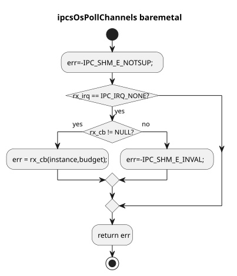

## 5.5 SWU_IPCS_OSAL_THREADX DESIGN 单元设计

### 4.4.56 ipcsOsInit

<table border="1" cellspacing="0" cellpadding="4">
<tbody>
<tr>
<td>对应软件架构ID</td>
<td colspan="4">Drv_Ipcs_Osal_Cmp</td>
</tr>
<tr>
<td>软件单元 ID</td>
<td colspan="4">SWU_IPCS_OSAL_THREADX</td>
</tr>
<tr>
<td>函数说明</td>
<td colspan="4">OS specific initialization code. When inter_core_rx_irq is disabled by passing IPC_IRQ_NONE, the softirq task will not be created.</td>
</tr>
<tr>
<td>函数原型</td>
<td colspan="4">sint32 ipcsOsInit(const uint8 instance, const struct IPCS_SHM_CFG_TYPE *cfg, sint32 (*rx_cb)(const uint8 instance, sint32 budget))</td>
</tr>
<tr>
<td>制约条件</td>
<td colspan="4">-</td>
</tr>
<tr>
<td rowspan="4">输入/输出参数</td>
<td>I/O</td>
<td>参数名</td>
<td>数据类型</td>
<td>说明</td>
</tr>
<tr>
<td>I</td>
<td>instance</td>
<td>const uint8</td>
<td>IPCS shared memory instance 索引</td>
</tr>
<tr>
<td>I</td>
<td>cfg</td>
<td>const struct IPCS_SHM_CFG_TYPE *</td>
<td>configuration parameters</td>
</tr>
<tr>
<td>I</td>
<td>rx_cb</td>
<td>sint32 (*rx_cb)(const uint8 instance, sint32 budget)</td>
<td>rx callback to be called from rx softirq</td>
</tr>
<tr>
<td rowspan="2">返回值</td>
<td colspan="2">数据类型</td>
<td colspan="2">说明</td>
</tr>
<tr>
<td colspan="2">sint32</td>
<td colspan="2">IPC_SHM_E_OK on success, -IPC_SHM_E_NOMEM if softirq task or event flags creation failed, -IPC_SHM_E_INVAL for invalid rx_cb or cfg</td>
</tr>
<tr>
<td>函数定义文件</td>
<td colspan="4">ipcs/mcu/os/threadx/ipc-os-threadx.c</td>
</tr>
<tr>
<td>函数声明文件</td>
<td colspan="4">ipcs/mcu/os/ipc-os.h</td>
</tr>
</tbody>
</table>

processing flow

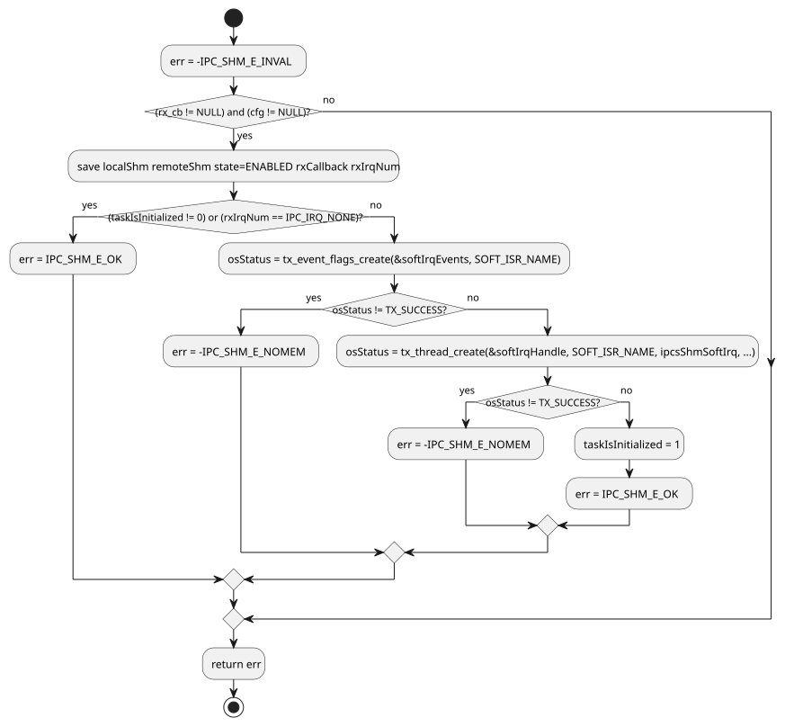

### 4.4.57 ipcsOsFree

<table border="1" cellspacing="0" cellpadding="4">
<tbody>
<tr>
<td>对应软件架构ID</td>
<td colspan="4">Drv_Ipcs_Osal_Cmp</td>
</tr>
<tr>
<td>软件单元 ID</td>
<td colspan="4">SWU_IPCS_OSAL_THREADX</td>
</tr>
<tr>
<td>函数说明</td>
<td colspan="4">free OS specific resources</td>
</tr>
<tr>
<td>函数原型</td>
<td colspan="4">void ipcsOsFree(const uint8 instance)</td>
</tr>
<tr>
<td>制约条件</td>
<td colspan="4">-</td>
</tr>
<tr>
<td rowspan="2">输入/输出参数</td>
<td>I/O</td>
<td>参数名</td>
<td>数据类型</td>
<td>说明</td>
</tr>
<tr>
<td>I</td>
<td>instance</td>
<td>const uint8</td>
<td>IPCS shared memory instance 索引</td>
</tr>
<tr>
<td rowspan="2">返回值</td>
<td colspan="2">数据类型</td>
<td colspan="2">说明</td>
</tr>
<tr>
<td colspan="4">-</td>
</tr>
<tr>
<td>函数定义文件</td>
<td colspan="4">ipcs/mcu/os/threadx/ipc-os-threadx.c</td>
</tr>
<tr>
<td>函数声明文件</td>
<td colspan="4">ipcs/mcu/os/ipc-os.h</td>
</tr>
</tbody>
</table>

processing flow

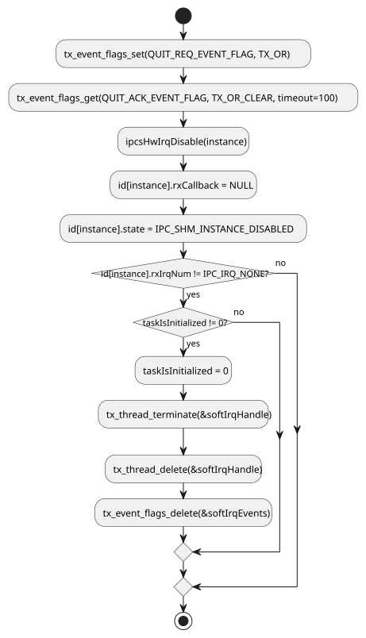

### 4.4.58 ipcsShmSoftIrq

<table border="1" cellspacing="0" cellpadding="4">
<tbody>
<tr>
<td>对应软件架构ID</td>
<td colspan="4">Drv_Ipcs_Osal_Cmp</td>
</tr>
<tr>
<td>软件单元 ID</td>
<td colspan="4">SWU_IPCS_OSAL_THREADX</td>
</tr>
<tr>
<td>函数说明</td>
<td colspan="4">task acting as deferred interrupt handler. Waits on event flags, calls upper layer rx callback registered with ipcsOsInit(), re-enables IRQ when work is done. Terminates when ipcsOsFree() sets quit request.</td>
</tr>
<tr>
<td>函数原型</td>
<td colspan="4">static void ipcsShmSoftIrq(uint32 ulInput)</td>
</tr>
<tr>
<td>制约条件</td>
<td colspan="4">-</td>
</tr>
<tr>
<td rowspan="2">输入/输出参数</td>
<td>I/O</td>
<td>参数名</td>
<td>数据类型</td>
<td>说明</td>
</tr>
<tr>
<td>I</td>
<td>ulInput</td>
<td>uint32</td>
<td>ThreadX thread entry parameter (unused)</td>
</tr>
<tr>
<td rowspan="2">返回值</td>
<td colspan="2">数据类型</td>
<td colspan="2">说明</td>
</tr>
<tr>
<td colspan="2">void</td>
<td colspan="2">-</td>
</tr>
<tr>
<td>函数定义文件</td>
<td colspan="4">ipcs/mcu/os/threadx/ipc-os-threadx.c</td>
</tr>
<tr>
<td>函数声明文件</td>
<td colspan="4">-</td>
</tr>
</tbody>
</table>

processing flow

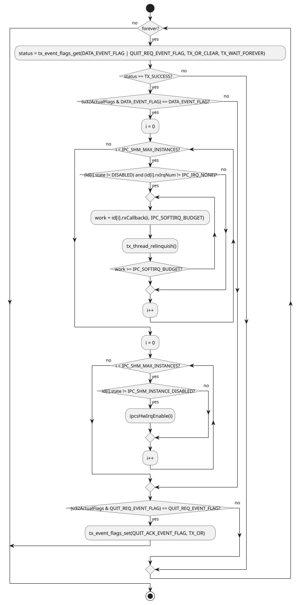

### 4.4.59 ipcsShmHardIrq

<table border="1" cellspacing="0" cellpadding="4">
<tbody>
<tr>
<td>对应软件架构ID</td>
<td colspan="4">Drv_Ipcs_Osal_Cmp</td>
</tr>
<tr>
<td>软件单元 ID</td>
<td colspan="4">SWU_IPCS_OSAL_THREADX</td>
</tr>
<tr>
<td>函数说明</td>
<td colspan="4">driver interrupt service routine</td>
</tr>
<tr>
<td>函数原型</td>
<td colspan="4">void ipcsShmHardIrq(void)</td>
</tr>
<tr>
<td>制约条件</td>
<td colspan="4">-</td>
</tr>
<tr>
<td rowspan="2">输入/输出参数</td>
<td>I/O</td>
<td>参数名</td>
<td>数据类型</td>
<td>说明</td>
</tr>
<tr>
<td>-</td>
<td>-</td>
<td>-</td>
<td>-</td>
</tr>
<tr>
<td rowspan="2">返回值</td>
<td colspan="2">数据类型</td>
<td colspan="2">说明</td>
</tr>
<tr>
<td colspan="4">-</td>
</tr>
<tr>
<td>函数定义文件</td>
<td colspan="4">ipcs/mcu/os/threadx/ipc-os-threadx.c</td>
</tr>
<tr>
<td>函数声明文件</td>
<td colspan="4">ipcs/mcu/os/ipc-os.h</td>
</tr>
</tbody>
</table>

processing flow

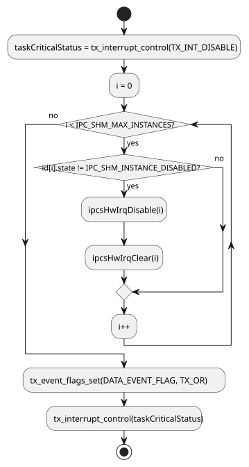

### 4.4.61 ipcsOsGetLocalShm

<table border="1" cellspacing="0" cellpadding="4">
<tbody>
<tr>
<td>对应软件架构ID</td>
<td colspan="4">Drv_Ipcs_Osal_Cmp</td>
</tr>
<tr>
<td>软件单元 ID</td>
<td colspan="4">SWU_IPCS_OSAL_THREADX</td>
</tr>
<tr>
<td>函数说明</td>
<td colspan="4">get local shared mem address</td>
</tr>
<tr>
<td>函数原型</td>
<td colspan="4">uintptr_t ipcsOsGetLocalShm(const uint8 instance)</td>
</tr>
<tr>
<td>制约条件</td>
<td colspan="4">-</td>
</tr>
<tr>
<td rowspan="2">输入/输出参数</td>
<td>I/O</td>
<td>参数名</td>
<td>数据类型</td>
<td>说明</td>
</tr>
<tr>
<td>I</td>
<td>instance</td>
<td>const uint8</td>
<td>IPCS shared memory instance 索引</td>
</tr>
<tr>
<td rowspan="2">返回值</td>
<td colspan="2">数据类型</td>
<td colspan="2">说明</td>
</tr>
<tr>
<td colspan="2">uintptr_t</td>
<td colspan="2">local shared memory address for instance</td>
</tr>
<tr>
<td>函数定义文件</td>
<td colspan="4">ipcs/mcu/os/threadx/ipc-os-threadx.c</td>
</tr>
<tr>
<td>函数声明文件</td>
<td colspan="4">ipcs/mcu/os/ipc-os.h</td>
</tr>
</tbody>
</table>

processing flow

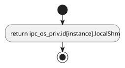

### 4.4.62 ipcsOsGetRemoteShm

<table border="1" cellspacing="0" cellpadding="4">
<tbody>
<tr>
<td>对应软件架构ID</td>
<td colspan="4">Drv_Ipcs_Osal_Cmp</td>
</tr>
<tr>
<td>软件单元 ID</td>
<td colspan="4">SWU_IPCS_OSAL_THREADX</td>
</tr>
<tr>
<td>函数说明</td>
<td colspan="4">get remote shared mem address</td>
</tr>
<tr>
<td>函数原型</td>
<td colspan="4">uintptr_t ipcsOsGetRemoteShm(const uint8 instance)</td>
</tr>
<tr>
<td>制约条件</td>
<td colspan="4">-</td>
</tr>
<tr>
<td rowspan="2">输入/输出参数</td>
<td>I/O</td>
<td>参数名</td>
<td>数据类型</td>
<td>说明</td>
</tr>
<tr>
<td>I</td>
<td>instance</td>
<td>const uint8</td>
<td>IPCS shared memory instance 索引</td>
</tr>
<tr>
<td rowspan="2">返回值</td>
<td colspan="2">数据类型</td>
<td colspan="2">说明</td>
</tr>
<tr>
<td colspan="2">uintptr_t</td>
<td colspan="2">remote shared memory address for instance</td>
</tr>
<tr>
<td>函数定义文件</td>
<td colspan="4">ipcs/mcu/os/threadx/ipc-os-threadx.c</td>
</tr>
<tr>
<td>函数声明文件</td>
<td colspan="4">ipcs/mcu/os/ipc-os.h</td>
</tr>
</tbody>
</table>

processing flow

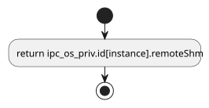

### 4.4.63 ipcsOsPollChannels

<table border="1" cellspacing="0" cellpadding="4">
<tbody>
<tr>
<td>对应软件架构ID</td>
<td colspan="4">Drv_Ipcs_Osal_Cmp</td>
</tr>
<tr>
<td>软件单元 ID</td>
<td colspan="4">SWU_IPCS_OSAL_THREADX</td>
</tr>
<tr>
<td>函数说明</td>
<td colspan="4">invoke rx callback configured at initialization. The softirq task handles rx operation when rx interrupt is configured.</td>
</tr>
<tr>
<td>函数原型</td>
<td colspan="4">sint32 ipcsOsPollChannels(const uint8 instance)</td>
</tr>
<tr>
<td>制约条件</td>
<td colspan="4">-</td>
</tr>
<tr>
<td rowspan="2">输入/输出参数</td>
<td>I/O</td>
<td>参数名</td>
<td>数据类型</td>
<td>说明</td>
</tr>
<tr>
<td>I</td>
<td>instance</td>
<td>const uint8</td>
<td>IPCS shared memory instance 索引</td>
</tr>
<tr>
<td rowspan="2">返回值</td>
<td colspan="2">数据类型</td>
<td colspan="2">说明</td>
</tr>
<tr>
<td colspan="2">sint32</td>
<td colspan="2">work done when rx_irq is IPC_IRQ_NONE; IPC_SHM_E_OK if rx_irq configured but callback not invoked; -IPC_SHM_E_INVAL when rx interrupt is configured</td>
</tr>
<tr>
<td>函数定义文件</td>
<td colspan="4">ipcs/mcu/os/threadx/ipc-os-threadx.c</td>
</tr>
<tr>
<td>函数声明文件</td>
<td colspan="4">ipcs/mcu/os/ipc-os.h</td>
</tr>
</tbody>
</table>

processing flow

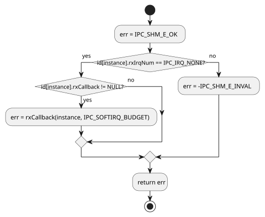

## 5.6 SWU_IPCS_HAL_MCU DESIGN 单元设计

本节严格按照 reference.md 的内部函数表格格式描述内部函数。除 3.3 中列出的 9 个对外接口之外，其余内部函数、跨组件调用接口和 OS task 单元均作为内部接口。

### 5.6.1 ipcsHwGetCoreIndexM7

<table border="1" cellspacing="0" cellpadding="4">
<tbody>
<tr>
<td>对应软件架构ID</td>
<td colspan="4">Drv_Ipcs_Hal_Cmp</td>
</tr>
<tr>
<td>软件单元 ID</td>
<td colspan="4">SWU_IPCS_HAL_MCU</td>
</tr>
<tr>
<td>函数说明</td>
<td colspan="4">Validate and get core index if core type is m7</td>
</tr>
<tr>
<td>函数原型</td>
<td colspan="4">static sint8 ipcsHwGetCoreIndexM7(uint8 index)</td>
</tr>
<tr>
<td>制约条件</td>
<td colspan="4">-</td>
</tr>
<tr>
<td rowspan="2">输入/输出参数</td>
<td>I/O</td>
<td>参数名</td>
<td>数据类型</td>
<td>说明</td>
</tr>
<tr>
<td>I</td>
<td>index</td>
<td>uint8</td>
<td>core 或 IRQ 配置索引</td>
</tr>
<tr>
<td rowspan="2">返回值</td>
<td colspan="2">数据类型</td>
<td colspan="2">说明</td>
</tr>
<tr>
<td colspan="2">sint8</td>
<td colspan="2">core_index if core type is m7</td>
</tr>
<tr>
<td>函数定义文件</td>
<td colspan="4">ipcs/mcu/hw/ipc-hw.c</td>
</tr>
<tr>
<td>函数声明文件</td>
<td colspan="4">-</td>
</tr>
</tbody>
</table>

processing flow

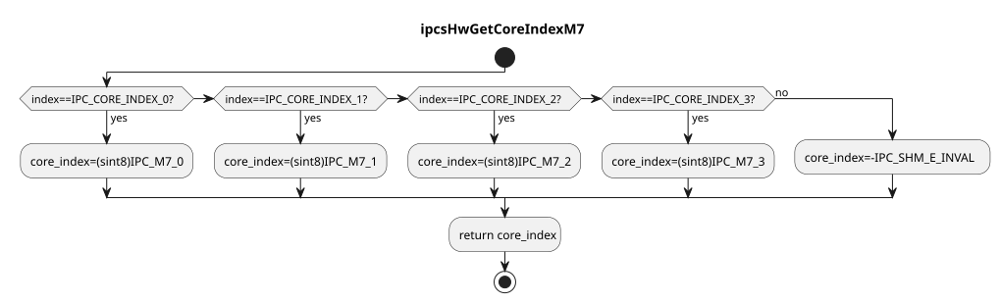

### 5.6.2 ipcsHwGetCoreIndexA53

<table border="1" cellspacing="0" cellpadding="4">
<tbody>
<tr>
<td>对应软件架构ID</td>
<td colspan="4">Drv_Ipcs_Hal_Cmp</td>
</tr>
<tr>
<td>软件单元 ID</td>
<td colspan="4">SWU_IPCS_HAL_MCU</td>
</tr>
<tr>
<td>函数说明</td>
<td colspan="4">Validate and get core index if core type is a53</td>
</tr>
<tr>
<td>函数原型</td>
<td colspan="4">static sint8 ipcsHwGetCoreIndexA53(uint8 index)</td>
</tr>
<tr>
<td>制约条件</td>
<td colspan="4">-</td>
</tr>
<tr>
<td rowspan="2">输入/输出参数</td>
<td>I/O</td>
<td>参数名</td>
<td>数据类型</td>
<td>说明</td>
</tr>
<tr>
<td>I</td>
<td>index</td>
<td>uint8</td>
<td>core 或 IRQ 配置索引</td>
</tr>
<tr>
<td rowspan="2">返回值</td>
<td colspan="2">数据类型</td>
<td colspan="2">说明</td>
</tr>
<tr>
<td colspan="2">sint8</td>
<td colspan="2">core_index if core type is a53</td>
</tr>
<tr>
<td>函数定义文件</td>
<td colspan="4">ipcs/mcu/hw/ipc-hw.c</td>
</tr>
<tr>
<td>函数声明文件</td>
<td colspan="4">-</td>
</tr>
</tbody>
</table>

processing flow

### 5.6.3 ipcsHwSetRemoteCore

<table border="1" cellspacing="0" cellpadding="4">
<tbody>
<tr>
<td>对应软件架构ID</td>
<td colspan="4">Drv_Ipcs_Hal_Cmp</td>
</tr>
<tr>
<td>软件单元 ID</td>
<td colspan="4">SWU_IPCS_HAL_MCU</td>
</tr>
<tr>
<td>函数说明</td>
<td colspan="4">get remote core for platform private data</td>
</tr>
<tr>
<td>函数原型</td>
<td colspan="4">static sint8 ipcsHwSetRemoteCore(const uint8 instance, const struct IPCS_SHM_CFG_TYPE *cfg)</td>
</tr>
<tr>
<td>制约条件</td>
<td colspan="4">-</td>
</tr>
<tr>
<td rowspan="3">输入/输出参数</td>
<td>I/O</td>
<td>参数名</td>
<td>数据类型</td>
<td>说明</td>
</tr>
<tr>
<td>I</td>
<td>instance</td>
<td>const uint8</td>
<td>configuration parameters</td>
</tr>
<tr>
<td>I</td>
<td>cfg</td>
<td>const struct IPCS_SHM_CFG_TYPE *</td>
<td>:     Local core type from ipcf configuration</td>
</tr>
<tr>
<td rowspan="2">返回值</td>
<td colspan="2">数据类型</td>
<td colspan="2">说明</td>
</tr>
<tr>
<td colspan="2">sint8</td>
<td colspan="2">IPC_SHM_E_OK for success, -IPC_SHM_E_INVAL for invalid core</td>
</tr>
<tr>
<td>函数定义文件</td>
<td colspan="4">ipcs/mcu/hw/ipc-hw.c</td>
</tr>
<tr>
<td>函数声明文件</td>
<td colspan="4">-</td>
</tr>
</tbody>
</table>

processing flow

### 5.6.4 ipcsHwSetLocalCore

<table border="1" cellspacing="0" cellpadding="4">
<tbody>
<tr>
<td>对应软件架构ID</td>
<td colspan="4">Drv_Ipcs_Hal_Cmp</td>
</tr>
<tr>
<td>软件单元 ID</td>
<td colspan="4">SWU_IPCS_HAL_MCU</td>
</tr>
<tr>
<td>函数说明</td>
<td colspan="4">get local core for platform private data</td>
</tr>
<tr>
<td>函数原型</td>
<td colspan="4">static sint8 ipcsHwSetLocalCore(const uint8 instance, const struct IPCS_SHM_CFG_TYPE *cfg)</td>
</tr>
<tr>
<td>制约条件</td>
<td colspan="4">-</td>
</tr>
<tr>
<td rowspan="3">输入/输出参数</td>
<td>I/O</td>
<td>参数名</td>
<td>数据类型</td>
<td>说明</td>
</tr>
<tr>
<td>I</td>
<td>instance</td>
<td>const uint8</td>
<td>configuration parameters</td>
</tr>
<tr>
<td>I</td>
<td>cfg</td>
<td>const struct IPCS_SHM_CFG_TYPE *</td>
<td>:     Local core type from ipcf configuration</td>
</tr>
<tr>
<td rowspan="2">返回值</td>
<td colspan="2">数据类型</td>
<td colspan="2">说明</td>
</tr>
<tr>
<td colspan="2">sint8</td>
<td colspan="2">IPC_SHM_E_OK for success, -IPC_SHM_E_INVAL for invalid core</td>
</tr>
<tr>
<td>函数定义文件</td>
<td colspan="4">ipcs/mcu/hw/ipc-hw.c</td>
</tr>
<tr>
<td>函数声明文件</td>
<td colspan="4">-</td>
</tr>
</tbody>
</table>

processing flow

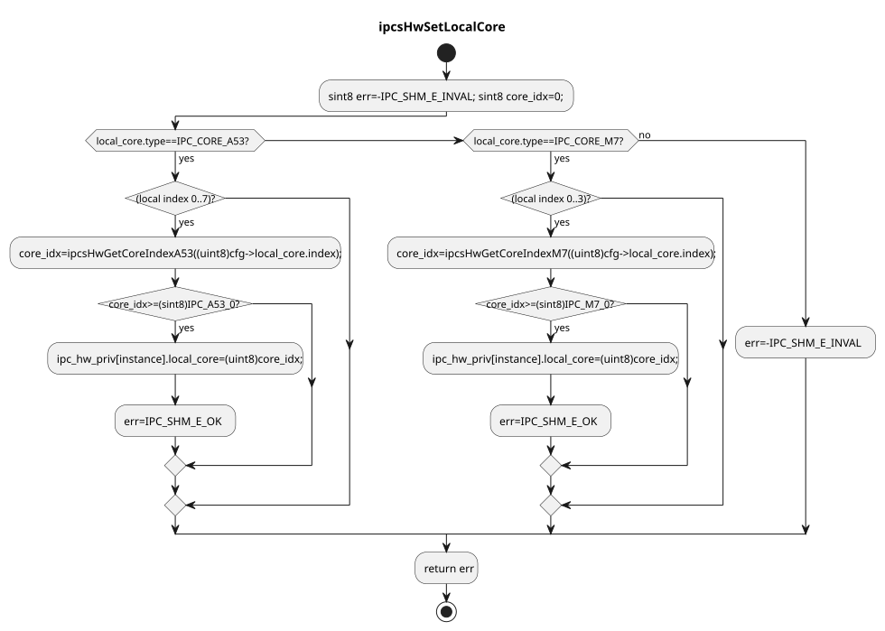

### 5.6.5 ipcsHwSetCore

<table border="1" cellspacing="0" cellpadding="4">
<tbody>
<tr>
<td>对应软件架构ID</td>
<td colspan="4">Drv_Ipcs_Hal_Cmp</td>
</tr>
<tr>
<td>软件单元 ID</td>
<td colspan="4">SWU_IPCS_HAL_MCU</td>
</tr>
<tr>
<td>函数说明</td>
<td colspan="4">get local and remote core for platform private data</td>
</tr>
<tr>
<td>函数原型</td>
<td colspan="4">static sint8 ipcsHwSetCore(const uint8 instance, const struct IPCS_SHM_CFG_TYPE *cfg)</td>
</tr>
<tr>
<td>制约条件</td>
<td colspan="4">-</td>
</tr>
<tr>
<td rowspan="3">输入/输出参数</td>
<td>I/O</td>
<td>参数名</td>
<td>数据类型</td>
<td>说明</td>
</tr>
<tr>
<td>I</td>
<td>instance</td>
<td>const uint8</td>
<td>configuration parameters</td>
</tr>
<tr>
<td>I</td>
<td>cfg</td>
<td>const struct IPCS_SHM_CFG_TYPE *</td>
<td>:     Local core type from ipcf configuration</td>
</tr>
<tr>
<td rowspan="2">返回值</td>
<td colspan="2">数据类型</td>
<td colspan="2">说明</td>
</tr>
<tr>
<td colspan="2">sint8</td>
<td colspan="2">IPC_SHM_E_OK for success, -IPC_SHM_E_INVAL for invalid core</td>
</tr>
<tr>
<td>函数定义文件</td>
<td colspan="4">ipcs/mcu/hw/ipc-hw.c</td>
</tr>
<tr>
<td>函数声明文件</td>
<td colspan="4">-</td>
</tr>
</tbody>
</table>

processing flow

### 5.6.6 ipcsHwSetTxIrqIdx

<table border="1" cellspacing="0" cellpadding="4">
<tbody>
<tr>
<td>对应软件架构ID</td>
<td colspan="4">Drv_Ipcs_Hal_Cmp</td>
</tr>
<tr>
<td>软件单元 ID</td>
<td colspan="4">SWU_IPCS_HAL_MCU</td>
</tr>
<tr>
<td>函数说明</td>
<td colspan="4">get tx irq and msi index for platform private data</td>
</tr>
<tr>
<td>函数原型</td>
<td colspan="4">static sint8 ipcsHwSetTxIrqIdx(const uint8 instance, const struct IPCS_SHM_CFG_TYPE *cfg)</td>
</tr>
<tr>
<td>制约条件</td>
<td colspan="4">-</td>
</tr>
<tr>
<td rowspan="3">输入/输出参数</td>
<td>I/O</td>
<td>参数名</td>
<td>数据类型</td>
<td>说明</td>
</tr>
<tr>
<td>I</td>
<td>instance</td>
<td>const uint8</td>
<td>configuration parameters</td>
</tr>
<tr>
<td>I</td>
<td>cfg</td>
<td>const struct IPCS_SHM_CFG_TYPE *</td>
<td>:     Local core type from ipcf configuration</td>
</tr>
<tr>
<td rowspan="2">返回值</td>
<td colspan="2">数据类型</td>
<td colspan="2">说明</td>
</tr>
<tr>
<td colspan="2">sint8</td>
<td colspan="2">IPC_SHM_E_OK for success, -IPC_SHM_E_INVAL for invalid interrupt</td>
</tr>
<tr>
<td>函数定义文件</td>
<td colspan="4">ipcs/mcu/hw/ipc-hw.c</td>
</tr>
<tr>
<td>函数声明文件</td>
<td colspan="4">-</td>
</tr>
</tbody>
</table>

processing flow

### 5.6.7 ipcsHwSetRxIrqIdx

<table border="1" cellspacing="0" cellpadding="4">
<tbody>
<tr>
<td>对应软件架构ID</td>
<td colspan="4">Drv_Ipcs_Hal_Cmp</td>
</tr>
<tr>
<td>软件单元 ID</td>
<td colspan="4">SWU_IPCS_HAL_MCU</td>
</tr>
<tr>
<td>函数说明</td>
<td colspan="4">get rx irq and msi index for platform private data</td>
</tr>
<tr>
<td>函数原型</td>
<td colspan="4">static sint8 ipcsHwSetRxIrqIdx(const uint8 instance, const struct IPCS_SHM_CFG_TYPE *cfg)</td>
</tr>
<tr>
<td>制约条件</td>
<td colspan="4">-</td>
</tr>
<tr>
<td rowspan="3">输入/输出参数</td>
<td>I/O</td>
<td>参数名</td>
<td>数据类型</td>
<td>说明</td>
</tr>
<tr>
<td>I</td>
<td>instance</td>
<td>const uint8</td>
<td>configuration parameters</td>
</tr>
<tr>
<td>I</td>
<td>cfg</td>
<td>const struct IPCS_SHM_CFG_TYPE *</td>
<td>:     Local core type from ipcf configuration</td>
</tr>
<tr>
<td rowspan="2">返回值</td>
<td colspan="2">数据类型</td>
<td colspan="2">说明</td>
</tr>
<tr>
<td colspan="2">sint8</td>
<td colspan="2">IPC_SHM_E_OK for success, -IPC_SHM_E_INVAL for invalid interrupt</td>
</tr>
<tr>
<td>函数定义文件</td>
<td colspan="4">ipcs/mcu/hw/ipc-hw.c</td>
</tr>
<tr>
<td>函数声明文件</td>
<td colspan="4">-</td>
</tr>
</tbody>
</table>

processing flow

### 5.6.8 ipcsHwSetIrqIdx

<table border="1" cellspacing="0" cellpadding="4">
<tbody>
<tr>
<td>对应软件架构ID</td>
<td colspan="4">Drv_Ipcs_Hal_Cmp</td>
</tr>
<tr>
<td>软件单元 ID</td>
<td colspan="4">SWU_IPCS_HAL_MCU</td>
</tr>
<tr>
<td>函数说明</td>
<td colspan="4">get irq and msi index for platform private data</td>
</tr>
<tr>
<td>函数原型</td>
<td colspan="4">static sint8 ipcsHwSetIrqIdx(const uint8 instance, const struct IPCS_SHM_CFG_TYPE *cfg)</td>
</tr>
<tr>
<td>制约条件</td>
<td colspan="4">-</td>
</tr>
<tr>
<td rowspan="3">输入/输出参数</td>
<td>I/O</td>
<td>参数名</td>
<td>数据类型</td>
<td>说明</td>
</tr>
<tr>
<td>I</td>
<td>instance</td>
<td>const uint8</td>
<td>configuration parameters</td>
</tr>
<tr>
<td>I</td>
<td>cfg</td>
<td>const struct IPCS_SHM_CFG_TYPE *</td>
<td>:     Local core type from ipcf configuration</td>
</tr>
<tr>
<td rowspan="2">返回值</td>
<td colspan="2">数据类型</td>
<td colspan="2">说明</td>
</tr>
<tr>
<td colspan="2">sint8</td>
<td colspan="2">IPC_SHM_E_OK for success, -IPC_SHM_E_INVAL for invalid interrupt</td>
</tr>
<tr>
<td>函数定义文件</td>
<td colspan="4">ipcs/mcu/hw/ipc-hw.c</td>
</tr>
<tr>
<td>函数声明文件</td>
<td colspan="4">-</td>
</tr>
</tbody>
</table>

processing flow

### 5.6.9 ipcsHwInit

<table border="1" cellspacing="0" cellpadding="4">
<tbody>
<tr>
<td>对应软件架构ID</td>
<td colspan="4">Drv_Ipcs_Hal_Cmp</td>
</tr>
<tr>
<td>软件单元 ID</td>
<td colspan="4">SWU_IPCS_HAL_MCU</td>
</tr>
<tr>
<td>函数说明</td>
<td colspan="4">platform specific initialization</td>
</tr>
<tr>
<td>函数原型</td>
<td colspan="4">sint8 ipcsHwInit(const uint8 instance, const struct IPCS_SHM_CFG_TYPE *cfg)</td>
</tr>
<tr>
<td>制约条件</td>
<td colspan="4">-</td>
</tr>
<tr>
<td rowspan="3">输入/输出参数</td>
<td>I/O</td>
<td>参数名</td>
<td>数据类型</td>
<td>说明</td>
</tr>
<tr>
<td>I</td>
<td>instance</td>
<td>const uint8</td>
<td>IPCS shared memory instance 索引</td>
</tr>
<tr>
<td>I</td>
<td>cfg</td>
<td>const struct IPCS_SHM_CFG_TYPE *</td>
<td>configuration parameters</td>
</tr>
<tr>
<td rowspan="2">返回值</td>
<td colspan="2">数据类型</td>
<td colspan="2">说明</td>
</tr>
<tr>
<td colspan="2">sint8</td>
<td colspan="2">IPC_SHM_E_OK for success, -IPC_SHM_E_INVAL for either inter core</td>
</tr>
<tr>
<td>函数定义文件</td>
<td colspan="4">ipcs/mcu/hw/ipc-hw.c</td>
</tr>
<tr>
<td>函数声明文件</td>
<td colspan="4">ipcs/mcu/hw/ipc-hw.h</td>
</tr>
</tbody>
</table>

processing flow

### 5.6.10 ipcsHwFree

<table border="1" cellspacing="0" cellpadding="4">
<tbody>
<tr>
<td>对应软件架构ID</td>
<td colspan="4">Drv_Ipcs_Hal_Cmp</td>
</tr>
<tr>
<td>软件单元 ID</td>
<td colspan="4">SWU_IPCS_HAL_MCU</td>
</tr>
<tr>
<td>函数说明</td>
<td colspan="4">free hw resources</td>
</tr>
<tr>
<td>函数原型</td>
<td colspan="4">void ipcsHwFree(const uint8 instance)</td>
</tr>
<tr>
<td>制约条件</td>
<td colspan="4">-</td>
</tr>
<tr>
<td rowspan="2">输入/输出参数</td>
<td>I/O</td>
<td>参数名</td>
<td>数据类型</td>
<td>说明</td>
</tr>
<tr>
<td>I</td>
<td>instance</td>
<td>const uint8</td>
<td>IPCS shared memory instance 索引</td>
</tr>
<tr>
<td rowspan="2">返回值</td>
<td colspan="2">数据类型</td>
<td colspan="2">说明</td>
</tr>
<tr>
<td colspan="4">-</td>
</tr>
<tr>
<td>函数定义文件</td>
<td colspan="4">ipcs/mcu/hw/ipc-hw.c</td>
</tr>
<tr>
<td>函数声明文件</td>
<td colspan="4">ipcs/mcu/hw/ipc-hw.h</td>
</tr>
</tbody>
</table>

processing flow

### 5.6.11 ipcsHwIrqEnable

<table border="1" cellspacing="0" cellpadding="4">
<tbody>
<tr>
<td>对应软件架构ID</td>
<td colspan="4">Drv_Ipcs_Hal_Cmp</td>
</tr>
<tr>
<td>软件单元 ID</td>
<td colspan="4">SWU_IPCS_HAL_MCU</td>
</tr>
<tr>
<td>函数说明</td>
<td colspan="4">enable notifications from remote</td>
</tr>
<tr>
<td>函数原型</td>
<td colspan="4">void ipcsHwIrqEnable(const uint8 instance)</td>
</tr>
<tr>
<td>制约条件</td>
<td colspan="4">-</td>
</tr>
<tr>
<td rowspan="2">输入/输出参数</td>
<td>I/O</td>
<td>参数名</td>
<td>数据类型</td>
<td>说明</td>
</tr>
<tr>
<td>I</td>
<td>instance</td>
<td>const uint8</td>
<td>IPCS shared memory instance 索引</td>
</tr>
<tr>
<td rowspan="2">返回值</td>
<td colspan="2">数据类型</td>
<td colspan="2">说明</td>
</tr>
<tr>
<td colspan="4">-</td>
</tr>
<tr>
<td>函数定义文件</td>
<td colspan="4">ipcs/mcu/hw/ipc-hw.c</td>
</tr>
<tr>
<td>函数声明文件</td>
<td colspan="4">ipcs/mcu/hw/ipc-hw.h</td>
</tr>
</tbody>
</table>

processing flow

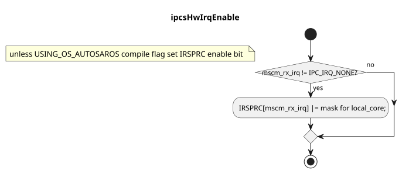

### 5.6.12 ipcsHwIrqDisable

<table border="1" cellspacing="0" cellpadding="4">
<tbody>
<tr>
<td>对应软件架构ID</td>
<td colspan="4">Drv_Ipcs_Hal_Cmp</td>
</tr>
<tr>
<td>软件单元 ID</td>
<td colspan="4">SWU_IPCS_HAL_MCU</td>
</tr>
<tr>
<td>函数说明</td>
<td colspan="4">disable notifications from remote</td>
</tr>
<tr>
<td>函数原型</td>
<td colspan="4">void ipcsHwIrqDisable(const uint8 instance)</td>
</tr>
<tr>
<td>制约条件</td>
<td colspan="4">-</td>
</tr>
<tr>
<td rowspan="2">输入/输出参数</td>
<td>I/O</td>
<td>参数名</td>
<td>数据类型</td>
<td>说明</td>
</tr>
<tr>
<td>I</td>
<td>instance</td>
<td>const uint8</td>
<td>IPCS shared memory instance 索引</td>
</tr>
<tr>
<td rowspan="2">返回值</td>
<td colspan="2">数据类型</td>
<td colspan="2">说明</td>
</tr>
<tr>
<td colspan="4">-</td>
</tr>
<tr>
<td>函数定义文件</td>
<td colspan="4">ipcs/mcu/hw/ipc-hw.c</td>
</tr>
<tr>
<td>函数声明文件</td>
<td colspan="4">ipcs/mcu/hw/ipc-hw.h</td>
</tr>
</tbody>
</table>

processing flow

### 5.6.13 ipcsHwIrqNotify

<table border="1" cellspacing="0" cellpadding="4">
<tbody>
<tr>
<td>对应软件架构ID</td>
<td colspan="4">Drv_Ipcs_Hal_Cmp</td>
</tr>
<tr>
<td>软件单元 ID</td>
<td colspan="4">SWU_IPCS_HAL_MCU</td>
</tr>
<tr>
<td>函数说明</td>
<td colspan="4">notify remote that data is available</td>
</tr>
<tr>
<td>函数原型</td>
<td colspan="4">void ipcsHwIrqNotify(const uint8 instance)</td>
</tr>
<tr>
<td>制约条件</td>
<td colspan="4">-</td>
</tr>
<tr>
<td rowspan="2">输入/输出参数</td>
<td>I/O</td>
<td>参数名</td>
<td>数据类型</td>
<td>说明</td>
</tr>
<tr>
<td>I</td>
<td>instance</td>
<td>const uint8</td>
<td>IPCS shared memory instance 索引</td>
</tr>
<tr>
<td rowspan="2">返回值</td>
<td colspan="2">数据类型</td>
<td colspan="2">说明</td>
</tr>
<tr>
<td colspan="4">-</td>
</tr>
<tr>
<td>函数定义文件</td>
<td colspan="4">ipcs/mcu/hw/ipc-hw.c</td>
</tr>
<tr>
<td>函数声明文件</td>
<td colspan="4">ipcs/mcu/hw/ipc-hw.h</td>
</tr>
</tbody>
</table>

processing flow

### 5.6.14 ipcsHwIrqClear

<table border="1" cellspacing="0" cellpadding="4">
<tbody>
<tr>
<td>对应软件架构ID</td>
<td colspan="4">Drv_Ipcs_Hal_Cmp</td>
</tr>
<tr>
<td>软件单元 ID</td>
<td colspan="4">SWU_IPCS_HAL_MCU</td>
</tr>
<tr>
<td>函数说明</td>
<td colspan="4">clear available data notification</td>
</tr>
<tr>
<td>函数原型</td>
<td colspan="4">void ipcsHwIrqClear(const uint8 instance)</td>
</tr>
<tr>
<td>制约条件</td>
<td colspan="4">-</td>
</tr>
<tr>
<td rowspan="2">输入/输出参数</td>
<td>I/O</td>
<td>参数名</td>
<td>数据类型</td>
<td>说明</td>
</tr>
<tr>
<td>I</td>
<td>instance</td>
<td>const uint8</td>
<td>IPCS shared memory instance 索引</td>
</tr>
<tr>
<td rowspan="2">返回值</td>
<td colspan="2">数据类型</td>
<td colspan="2">说明</td>
</tr>
<tr>
<td colspan="4">-</td>
</tr>
<tr>
<td>函数定义文件</td>
<td colspan="4">ipcs/mcu/hw/ipc-hw.c</td>
</tr>
<tr>
<td>函数声明文件</td>
<td colspan="4">ipcs/mcu/hw/ipc-hw.h</td>
</tr>
</tbody>
</table>

processing flow

### 5.6.15 ipcsHwFlushCache

<table border="1" cellspacing="0" cellpadding="4">
<tbody>
<tr>
<td>对应软件架构ID</td>
<td colspan="4">Drv_Ipcs_Hal_Cmp</td>
</tr>
<tr>
<td>软件单元 ID</td>
<td colspan="4">SWU_IPCS_HAL_MCU</td>
</tr>
<tr>
<td>函数说明</td>
<td colspan="4">-</td>
</tr>
<tr>
<td>函数原型</td>
<td colspan="4">static void ipcsHwFlushCache(uint32 data_addr, uint32 data_size)</td>
</tr>
<tr>
<td>制约条件</td>
<td colspan="4">-</td>
</tr>
<tr>
<td rowspan="3">输入/输出参数</td>
<td>I/O</td>
<td>参数名</td>
<td>数据类型</td>
<td>说明</td>
</tr>
<tr>
<td>I</td>
<td>data_addr</td>
<td>uint32</td>
<td>源码参数</td>
</tr>
<tr>
<td>I</td>
<td>data_size</td>
<td>uint32</td>
<td>复制数据大小，单位为 byte</td>
</tr>
<tr>
<td rowspan="2">返回值</td>
<td colspan="2">数据类型</td>
<td colspan="2">说明</td>
</tr>
<tr>
<td colspan="2">void</td>
<td colspan="2">源码返回值</td>
</tr>
<tr>
<td>函数定义文件</td>
<td colspan="4">ipcs/mcu/hw/ipc-hw.c</td>
</tr>
<tr>
<td>函数声明文件</td>
<td colspan="4">-</td>
</tr>
</tbody>
</table>

processing flow

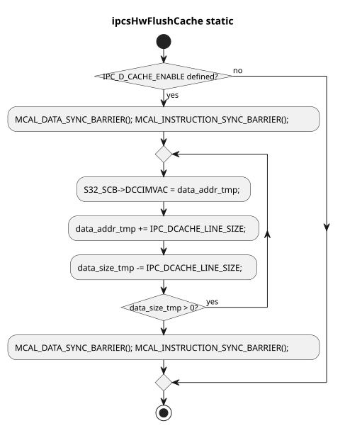

### 5.6.16 ipcsHwFlushCacheLocal

<table border="1" cellspacing="0" cellpadding="4">
<tbody>
<tr>
<td>对应软件架构ID</td>
<td colspan="4">Drv_Ipcs_Hal_Cmp</td>
</tr>
<tr>
<td>软件单元 ID</td>
<td colspan="4">SWU_IPCS_HAL_MCU</td>
</tr>
<tr>
<td>函数说明</td>
<td colspan="4">Clear and invalidate cache content</td>
</tr>
<tr>
<td>函数原型</td>
<td colspan="4">void ipcsHwFlushCacheLocal(const uint8 instance)</td>
</tr>
<tr>
<td>制约条件</td>
<td colspan="4">-</td>
</tr>
<tr>
<td rowspan="2">输入/输出参数</td>
<td>I/O</td>
<td>参数名</td>
<td>数据类型</td>
<td>说明</td>
</tr>
<tr>
<td>I</td>
<td>instance</td>
<td>const uint8</td>
<td>instance id</td>
</tr>
<tr>
<td rowspan="2">返回值</td>
<td colspan="2">数据类型</td>
<td colspan="2">说明</td>
</tr>
<tr>
<td colspan="4">-</td>
</tr>
<tr>
<td>函数定义文件</td>
<td colspan="4">ipcs/mcu/hw/ipc-hw.c</td>
</tr>
<tr>
<td>函数声明文件</td>
<td colspan="4">ipcs/mcu/hw/ipc-hw.h</td>
</tr>
</tbody>
</table>

processing flow

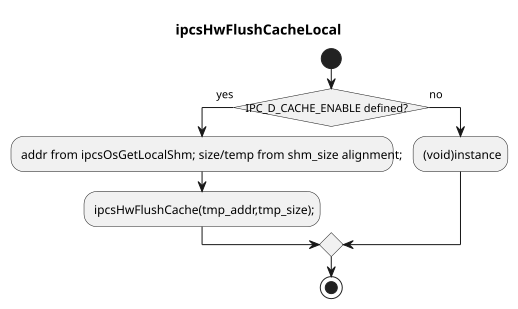

### 5.6.17 ipcsHwFlushCacheRemote

<table border="1" cellspacing="0" cellpadding="4">
<tbody>
<tr>
<td>对应软件架构ID</td>
<td colspan="4">Drv_Ipcs_Hal_Cmp</td>
</tr>
<tr>
<td>软件单元 ID</td>
<td colspan="4">SWU_IPCS_HAL_MCU</td>
</tr>
<tr>
<td>函数说明</td>
<td colspan="4">Clear and invalidate cache content</td>
</tr>
<tr>
<td>函数原型</td>
<td colspan="4">void ipcsHwFlushCacheRemote(const uint8 instance)</td>
</tr>
<tr>
<td>制约条件</td>
<td colspan="4">-</td>
</tr>
<tr>
<td rowspan="2">输入/输出参数</td>
<td>I/O</td>
<td>参数名</td>
<td>数据类型</td>
<td>说明</td>
</tr>
<tr>
<td>I</td>
<td>instance</td>
<td>const uint8</td>
<td>instance id</td>
</tr>
<tr>
<td rowspan="2">返回值</td>
<td colspan="2">数据类型</td>
<td colspan="2">说明</td>
</tr>
<tr>
<td colspan="4">-</td>
</tr>
<tr>
<td>函数定义文件</td>
<td colspan="4">ipcs/mcu/hw/ipc-hw.c</td>
</tr>
<tr>
<td>函数声明文件</td>
<td colspan="4">ipcs/mcu/hw/ipc-hw.h</td>
</tr>
</tbody>
</table>

processing flow

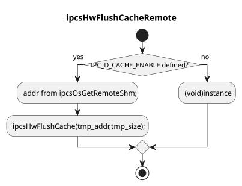

## 5.7 GLOBAL VARIABLES 全局变量

| 全局变量名称 | 全局变量类型 | 全局变量范围 | 全局变量描述 | 全局变量的存储RAM区 |
|---|---|---|---|---|
| ipc_os_priv | static struct IPCS_OS_PRIV_TYPE_TYPE | ipcs/mcu/os/autosar/ipc-os-autosar.c | AUTOSAR OS 实现私有数据 | 编译器/链接器默认 RAM（.bss，未指定 section） |
| ipc_os_priv | static struct IPCS_OS_PRIV_TYPE_TYPE | ipcs/mcu/os/freertos/ipc-os-freertos.c | FreeRTOS 实现私有数据 | 编译器/链接器默认 RAM（.bss，未指定 section） |
| ipc_os_priv | static struct（见 章节5.8.7） | ipcs/mcu/os/threadx/ipc-os-threadx.c | ThreadX 实现私有数据 | 编译器/链接器默认 RAM（.bss，未指定 section） |
| ipc_hw_priv | static struct IPCS_HW_PRIV_TYPE_TYPE [IPC_SHM_MAX_INSTANCES] | ipcs/mcu/hw/ipc-hw.c | 每 instance 平台 HAL 私有数据 | 编译器/链接器默认 RAM（.bss，未指定 section） |

## 5.8 DATA TYPES 类型定义

### 5.8.3 struct IPCS_OS_PRIV_INSTANCE_TYPE（FreeRTOS 实现）

定义于 `ipcs/mcu/os/freertos/ipc-os-freertos.c`。

| Type | Name | Description |
|---|---|---|
| uintptr_t | local_shm | local shared memory address |
| uintptr_t | remote_shm | remote shared memory address |
| sint32 | state | state of instance |
| sint32 | rx_irq_num | rx interrupt number |
| sint32 | msg_received | state to indicate notification received for a new message |

### 5.8.4 struct IPCS_OS_PRIV_TYPE_TYPE（AUTOSAR 实现）

定义于 `ipcs/mcu/os/autosar/ipc-os-autosar.c`。

| Type | Name | Description |
|---|---|---|
| struct IPCS_OS_PRIV_INSTANCE_TYPE | id[IPC_SHM_MAX_INSTANCES] | private data per instance |
| sint32 (*rx_cb)(const uint8 instance, sint32 budget) | rx_cb | upper layer rx callback |
| sint32 | task_is_initialized | flag to know if the softirq task is initialized |

### 5.8.5 struct IPCS_OS_PRIV_TYPE_TYPE（FreeRTOS 实现）

定义于 `ipcs/mcu/os/freertos/ipc-os-freertos.c`。

| Type | Name | Description |
|---|---|---|
| struct IPCS_OS_PRIV_INSTANCE_TYPE | id[IPC_SHM_MAX_INSTANCES] | private data per instance |
| sint32 (*rx_cb)(const uint8 instance, sint32 budget) | rx_cb | upper layer rx callback |
| TaskHandle_t | softirq_handle | rx task handle used by the ISR to notify the rx task |
| sint32 | task_is_initialized | flag to know if the softirq task is initialized |

### 5.8.6 IPC_OS_PRIV_INSTANCE_T（ThreadX 实现）

定义于 `ipcs/mcu/os/threadx/ipc-os-threadx.c`（typedef struct）。

| Type | Name | Description |
|---|---|---|
| uintptr_t | localShm | local shared memory address |
| uintptr_t | remoteShm | remote shared memory address |
| sint32 | state | state of u8Instance |
| sint32 | rxIrqNum | rx interrupt number |
| sint32 (*rxCallback)(const uint8 u8Instance, sint32 budget) | rxCallback | upper layer rx callback registered per instance |

### 5.8.7 ThreadX ipc_os_priv 聚合类型

`ipc_os_priv` 在 `ipcs/mcu/os/threadx/ipc-os-threadx.c` 中为匿名 static struct，成员如下。

| Type | Name | Description |
|---|---|---|
| IPC_OS_PRIV_INSTANCE_T | id[IPC_SHM_MAX_INSTANCES] | private data per u8Instance |
| TX_EVENT_FLAGS_GROUP | softIrqEvents | event flags used by hardirq to notify softirq thread |
| uint8 | ipcSoftIrqStack[IPC_SOFTIRQ_STACK_SIZE] | softirq thread stack |
| TX_THREAD | softIrqHandle | rx task handle used by the ISR to notify the rx task |
| sint32 | taskIsInitialized | flag to know if the softirq task is initialized |

### 5.8.8 struct IPCS_HW_PRIV_TYPE_TYPE

定义于 `ipcs/mcu/hw/ipc-hw.c`。

| Type | Name | Description |
|---|---|---|
| uint8 | msi_tx_irq | MSI index of inter-core interrupt corresponds to mscm_tx_irq |
| uint8 | msi_rx_irq | MSI index of inter-core interrupt corresponds to mscm_rx_irq |
| uint8 | remote_core | remote core to trigger the interrupt on |
| uint8 | local_core | local core on where this instance is running |
| uint32 | shm_size | local/remote shared memory size |
| sint16 | mscm_tx_irq | 核间中断控制器 inter-core interrupt reserved for shm driver tx |
| sint16 | mscm_rx_irq | 核间中断控制器 inter-core interrupt reserved for shm driver rx |

### 5.8.9 enum IPCS_PROCESSOR_IDX_E

定义于 `ipcs/mcu/hw/ipc-hw-platform.h`。

| Name | Description |
|---|---|
| IPC_A53_0 | ARM Cortex-A53 cluster 0 core 0 |
| IPC_A53_1 | ARM Cortex-A53 cluster 1 core 1 |
| IPC_A53_2 | ARM Cortex-A53 cluster 1 core 0 |
| IPC_A53_3 | ARM Cortex-A53 cluster 1 core 1 |
| IPC_M7_0 | ARM Cortex-M7 core 0 |
| IPC_M7_1 | ARM Cortex-M7 core 1 |
| IPC_M7_2 | ARM Cortex-M7 core 2 |
| IPC_M7_3 | ARM Cortex-M7 core 2 |
| IPC_A53_4 | ARM Cortex-A53 cluster 0 core 2 |
| IPC_A53_5 | ARM Cortex-A53 cluster 0 core 3 |
| IPC_A53_6 | ARM Cortex-A53 cluster 1 core 2 |
| IPC_A53_7 | ARM Cortex-A53 cluster 1 core 3 |

### 5.8.10 IPCS_MSCM_IRCP_IR_TYPE

定义于 `ipcs/mcu/hw/ipc-hw-platform.h`（typedef struct）。

| Type | Name | Description |
|---|---|---|
| volatile uint32 | IPC_ISR | Interrupt Router CPn Interruptx Status Register |
| volatile uint32 | IPC_IGR | Interrupt Router CPn Interruptx Generation Register |

### 5.8.11 IPCS_MSCM_IRCPnIRx_TYPE

定义于 `ipcs/mcu/hw/ipc-hw-platform.h`（typedef struct）。

| Type | Name | Description |
|---|---|---|
| IPCS_MSCM_IRCP_IR_TYPE | IRCPnIRx[IPC_MSCM_CPX_COUNT][IPC_MSCM_MSI_COUNT] | memory-mapped 核间中断控制器 interrupt router register array |

## 5.9 DYNAMIC DETAILED DESIGN 动态详细设计

RTOS 部署变体与 Linux 部署变体共用 **SHM / OSAL / HAL 三层固定接口契约**（`ipc-shm.h`、`ipc-os.h`、`ipc-hw.h`；架构见 章节3.1）。Core 层通过同一组 `ipcsOs*`、`ipcsHw*` 原型调用 OSAL 与 HAL；FreeRTOS、ThreadX、AUTOSAR OS 三套实现及共用 `SWU_IPCS_HAL_MCU` **不改变** 该边界。因此，与 章节4.7 重复的跨单元 UML 序列图不在本节再次展开。

# 6 LINUX VARIANT DETAIL DESIGN LINUX详设

## 6.1 DEFINITION AND SCOPE 定义与范围

Linux 部署变体通过 `ipcs/mpu` 实现 Drv_Ipcs_Linux_Adapt_Cmp 与 Drv_Ipcs_Hal_Cmp：UIO、CDEV 为用户侧代理加内核 Backend；全内核形态将 OSAL 与 HAL 均置于内核模块（见 章节3.3）。通信核心仍使用第 4 章 `ipcs/ipcs_cores`。

## 6.2 FILE STRUCTURE 文件结构

### 6.2.1 File List 文件列表

| 组件 | 文件 |
|---|---|
| Drv_Ipcs_Linux_Adapt_Cmp | ipcs/mpu/os_uio/ipc-os.c |
| Drv_Ipcs_Linux_Adapt_Cmp | ipcs/mpu/os_uio/ipc-os.h |
| Drv_Ipcs_Linux_Adapt_Cmp | ipcs/mpu/os_cdev/ipc-os.c |
| Drv_Ipcs_Linux_Adapt_Cmp | ipcs/mpu/os_cdev/ipc-os.h |
| Drv_Ipcs_Linux_Adapt_Cmp | ipcs/mpu/os_kernel/ipc-os.c |
| Drv_Ipcs_Linux_Adapt_Cmp | ipcs/mpu/os_kernel/ipc-os.h |
| Drv_Ipcs_Linux_Adapt_Cmp | ipcs/mpu/os_kernel/ipc-uio.c |
| Drv_Ipcs_Linux_Adapt_Cmp | ipcs/mpu/os_kernel/ipc-uio.h |
| Drv_Ipcs_Linux_Adapt_Cmp | ipcs/mpu/os_kernel/ipc-cdev.c |
| Drv_Ipcs_Linux_Adapt_Cmp | ipcs/mpu/os_kernel/ipc-cdev.h |
| Drv_Ipcs_Hal_Cmp | ipcs/mpu/hw/c1/ipc-hw.c |
| Drv_Ipcs_Hal_Cmp | ipcs/mpu/hw/c1/ipc-hw-platform.h |
| Drv_Ipcs_Hal_Cmp | ipcs/mpu/hw/ipc-hw.h |

### 6.2.2 ipc-os.c (UIO User Proxy) UIO 用户侧代理

描述：

> ipcs/mpu/os_uio/ipc-os.c 属于 Drv_Ipcs_Linux_Adapt_Cmp / UIO 用户侧代理。

依赖关系：

fcntl.h、unistd.h、stdio.h、sys/mman.h、sys/syscall.h、pthread.h、stdlib.h、dirent.h、ipc-os.h、ipc-hw.h、ipc-shm.h、ipc-uio.h（与 `ipcs/mpu/os_uio/ipc-os.c` 中 #include 顺序一致）

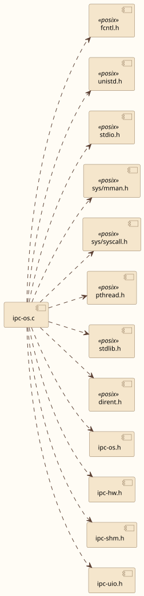

### 6.2.3 ipc-os.h (UIO User Proxy) UIO 用户侧头文件

描述：

> ipcs/mpu/os_uio/ipc-os.h 属于 Drv_Ipcs_Linux_Adapt_Cmp / UIO 用户侧 OSAL 头。

依赖关系：

errno.h、stdint.h、stdbool.h、string.h、stdio.h；无 ipcs 内其他头文件。

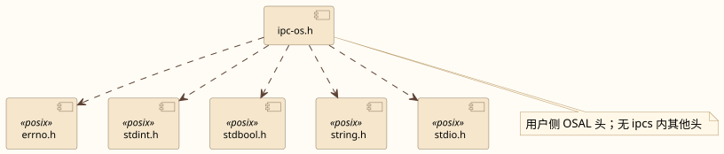

### 6.2.4 ipc-os.c (CDEV User Proxy) CDEV 用户侧代理

描述：

> ipcs/mpu/os_cdev/ipc-os.c 属于 Drv_Ipcs_Linux_Adapt_Cmp / CDEV 用户侧代理。

依赖关系：

fcntl.h、unistd.h、stdio.h、sys/mman.h、sys/syscall.h、sys/ioctl.h、pthread.h、stdlib.h、dirent.h、ipc-os.h、ipc-hw.h、ipc-shm.h、ipc-cdev.h（与 `ipcs/mpu/os_cdev/ipc-os.c` 一致）

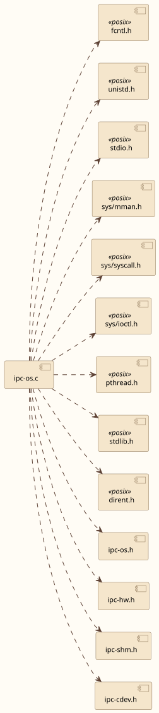

### 6.2.5 ipc-os.h (CDEV User Proxy) CDEV 用户侧头文件

描述：

> ipcs/mpu/os_cdev/ipc-os.h 属于 Drv_Ipcs_Linux_Adapt_Cmp / CDEV 用户侧 OSAL 头。

依赖关系：

errno.h、stdint.h、stdbool.h、string.h、stdio.h；无 ipcs 内其他头文件。

### 6.2.6 ipc-os.c (In-Kernel OSAL) 全内核 OSAL

描述：

> ipcs/mpu/os_kernel/ipc-os.c 属于 Drv_Ipcs_Linux_Adapt_Cmp / 全内核 OSAL 实现。

依赖关系：

linux/ioport.h、linux/io.h、linux/interrupt.h、linux/of_irq.h、linux/of_address.h、linux/version.h、ipc-os.h、ipc-hw.h、ipc-shm.h（与 `ipcs/mpu/os_kernel/ipc-os.c` 一致）

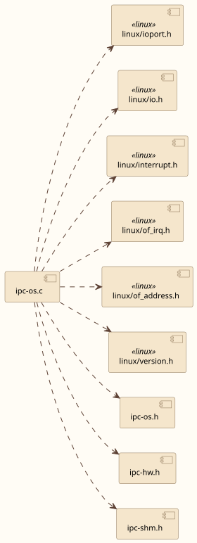

### 6.2.7 ipc-os.h (In-Kernel OSAL) 全内核 OSAL 头文件

描述：

> ipcs/mpu/os_kernel/ipc-os.h 属于 Drv_Ipcs_Linux_Adapt_Cmp / 内核 OSAL 头。

依赖关系：

linux/module.h

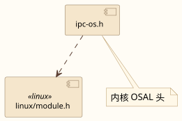

### 6.2.8 ipc-uio.c

描述：

> ipcs/mpu/os_kernel/ipc-uio.c 属于 Drv_Ipcs_Linux_Adapt_Cmp / UIO 内核 Backend。

依赖关系：

linux/module.h、linux/platform_device.h、linux/mod_devicetable.h、linux/uio_driver.h、linux/cdev.h、ipc-shm.h、ipc-os.h、ipc-hw.h、ipc-uio.h（与 `ipcs/mpu/os_kernel/ipc-uio.c` 一致）

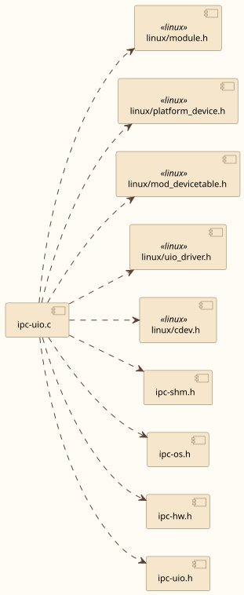

### 6.2.9 ipc-uio.h

描述：

> ipcs/mpu/os_kernel/ipc-uio.h 属于 Drv_Ipcs_Linux_Adapt_Cmp / UIO 命令与宏定义。

依赖关系：

本头文件无 #include（UIO 命令宏）。

### 6.2.10 ipc-cdev.c

描述：

> ipcs/mpu/os_kernel/ipc-cdev.c 属于 Drv_Ipcs_Linux_Adapt_Cmp / CDEV 内核 Backend。

依赖关系：

linux/module.h、linux/kernel.h、linux/fs.h、linux/cdev.h、linux/interrupt.h、linux/of_irq.h、linux/of_address.h、linux/wait.h、asm/errno.h、ipc-os.h、ipc-hw.h、ipc-shm.h、ipc-cdev.h（与 `ipcs/mpu/os_kernel/ipc-cdev.c` 一致）

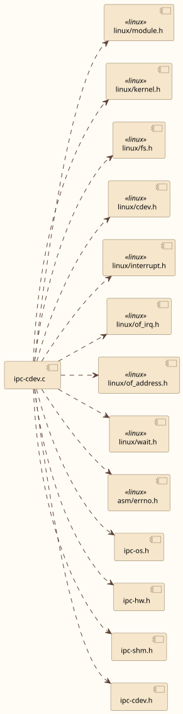

### 6.2.11 ipc-cdev.h

描述：

> ipcs/mpu/os_kernel/ipc-cdev.h 属于 Drv_Ipcs_Linux_Adapt_Cmp / CDEV ioctl 定义。

依赖关系：

linux/ioctl.h、sys/ioctl.h

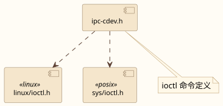

### 6.2.12 ipc-hw.c

描述：

> ipcs/mpu/hw/c1/ipc-hw.c 属于 Drv_Ipcs_Hal_Cmp / Linux HAL 实现。

依赖关系：

linux/io.h、ipc-shm.h、ipc-os.h、ipc-hw.h、ipc-hw-platform.h（与 `ipcs/mpu/hw/c1/ipc-hw.c` 一致）

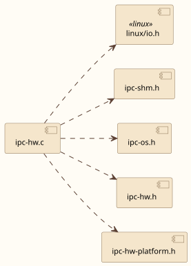

### 6.2.13 ipc-hw-platform.h

描述：

> ipcs/mpu/hw/c1/ipc-hw-platform.h 属于 Drv_Ipcs_Hal_Cmp / Linux 平台定义。

依赖关系：

本头文件无 #include（核索引与 核间中断控制器 寄存器布局宏）。

### 6.2.14 ipc-hw.h

描述：

> ipcs/mpu/hw/ipc-hw.h 属于 Drv_Ipcs_Hal_Cmp / HAL API 声明（Linux 构建包含路径）。

依赖关系：

本头文件无 #include（HAL API 声明）。

## 6.3 SWU_IPCS_LINUX_OS_KERN DESIGN 单元设计

### 6.3.1 ipcsShmSoftirq

<table border="1" cellspacing="0" cellpadding="4">
<tbody>
<tr>
<td>对应软件架构ID</td>
<td colspan="4">Drv_Ipcs_Osal_Cmp / Drv_Ipcs_Linux_Adapt_Cmp</td>
</tr>
<tr>
<td>软件单元 ID</td>
<td colspan="4">SWU_IPCS_LINUX_OS_KERN</td>
</tr>
<tr>
<td>函数说明</td>
<td colspan="4">延迟收包处理，遍历实例并调用上层 rx_cb，完成后重新使能 IRQ。</td>
</tr>
<tr>
<td>函数原型</td>
<td colspan="4">static void ipcsShmSoftirq(unsigned long arg)</td>
</tr>
<tr>
<td>制约条件</td>
<td colspan="4">按 `ipcs/mpu/os_kernel/ipc-os.c` 中的入参检查、实例状态和内核资源状态执行</td>
</tr>
<tr>
<td rowspan="2">输入/输出参数</td>
<td>I/O</td>
<td>参数名</td>
<td>数据类型</td>
<td>说明</td>
</tr>
<tr>
<td>I</td>
<td>arg</td>
<td>unsigned long arg</td>
<td>[IN] arg</td>
</tr>
<tr>
<td rowspan="2">返回值</td>
<td colspan="2">数据类型</td>
<td colspan="2">说明</td>
</tr>
<tr>
<td colspan="4">-</td>
</tr>
<tr>
<td>函数定义文件</td>
<td colspan="4">ipcs/mpu/os_kernel/ipc-os.c</td>
</tr>
<tr>
<td>函数声明文件</td>
<td colspan="4">ipcs/mpu/os_kernel/ipc-os.h</td>
</tr>
</tbody>
</table>

processing flow

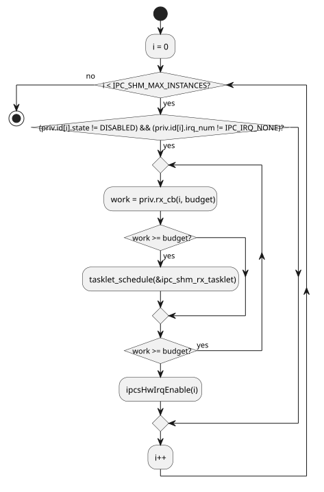

### 6.3.2 ipcsShmHardirq

<table border="1" cellspacing="0" cellpadding="4">
<tbody>
<tr>
<td>对应软件架构ID</td>
<td colspan="4">Drv_Ipcs_Osal_Cmp / Drv_Ipcs_Linux_Adapt_Cmp</td>
</tr>
<tr>
<td>软件单元 ID</td>
<td colspan="4">SWU_IPCS_LINUX_OS_KERN</td>
</tr>
<tr>
<td>函数说明</td>
<td colspan="4">硬中断处理，禁止并清除远端通知，中断后续处理交给 tasklet 或等待队列。</td>
</tr>
<tr>
<td>函数原型</td>
<td colspan="4">static irqreturn_t ipcsShmHardirq(int irq, void *dev)</td>
</tr>
<tr>
<td>制约条件</td>
<td colspan="4">按 `ipcs/mpu/os_kernel/ipc-os.c` 中的入参检查、实例状态和内核资源状态执行</td>
</tr>
<tr>
<td rowspan="3">输入/输出参数</td>
<td>I/O</td>
<td>参数名</td>
<td>数据类型</td>
<td>说明</td>
</tr>
<tr>
<td>I</td>
<td>irq</td>
<td>int irq</td>
<td>[IN] irq</td>
</tr>
<tr>
<td>I</td>
<td>dev</td>
<td>void *dev</td>
<td>[IN] dev</td>
</tr>
<tr>
<td rowspan="2">返回值</td>
<td colspan="2">数据类型</td>
<td colspan="2">说明</td>
</tr>
<tr>
<td colspan="2">irqreturn_t</td>
<td colspan="2">-</td>
</tr>
<tr>
<td>函数定义文件</td>
<td colspan="4">ipcs/mpu/os_kernel/ipc-os.c</td>
</tr>
<tr>
<td>函数声明文件</td>
<td colspan="4">ipcs/mpu/os_kernel/ipc-os.h</td>
</tr>
</tbody>
</table>

processing flow

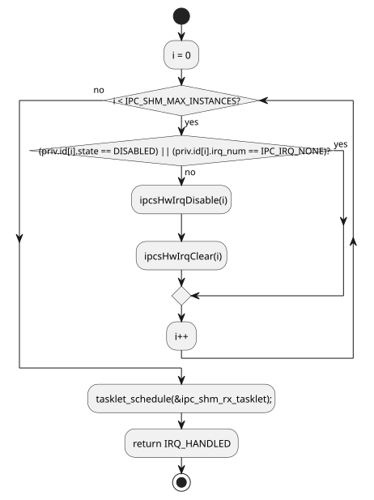

### 6.3.3 ipcsOsInit

<table border="1" cellspacing="0" cellpadding="4">
<tbody>
<tr>
<td>对应软件架构ID</td>
<td colspan="4">Drv_Ipcs_Osal_Cmp / Drv_Ipcs_Linux_Adapt_Cmp</td>
</tr>
<tr>
<td>软件单元 ID</td>
<td colspan="4">SWU_IPCS_LINUX_OS_KERN</td>
</tr>
<tr>
<td>函数说明</td>
<td colspan="4">初始化指定实例的 Linux OSAL 资源，建立共享内存映射、记录回调并配置接收中断。</td>
</tr>
<tr>
<td>函数原型</td>
<td colspan="4">int ipcsOsInit(const uint8_t instance, const struct IPCS_SHM_CFG_TYPE *cfg, int (*rx_cb)(const uint8_t, int))</td>
</tr>
<tr>
<td>制约条件</td>
<td colspan="4">按 `ipcs/mpu/os_kernel/ipc-os.c` 中的入参检查、实例状态和内核资源状态执行</td>
</tr>
<tr>
<td rowspan="4">输入/输出参数</td>
<td>I/O</td>
<td>参数名</td>
<td>数据类型</td>
<td>说明</td>
</tr>
<tr>
<td>I</td>
<td>instance</td>
<td>const uint8_t instance</td>
<td>[IN] instance</td>
</tr>
<tr>
<td>I</td>
<td>cfg</td>
<td>const struct IPCS_SHM_CFG_TYPE *cfg</td>
<td>[IN] cfg</td>
</tr>
<tr>
<td>I</td>
<td>rx_cb</td>
<td>int (*rx_cb)(const uint8_t, int)</td>
<td>[IN] rx_cb</td>
</tr>
<tr>
<td rowspan="2">返回值</td>
<td colspan="2">数据类型</td>
<td colspan="2">说明</td>
</tr>
<tr>
<td colspan="2">int</td>
<td colspan="2">-</td>
</tr>
<tr>
<td>函数定义文件</td>
<td colspan="4">ipcs/mpu/os_kernel/ipc-os.c</td>
</tr>
<tr>
<td>函数声明文件</td>
<td colspan="4">ipcs/mpu/os_kernel/ipc-os.h</td>
</tr>
</tbody>
</table>

processing flow

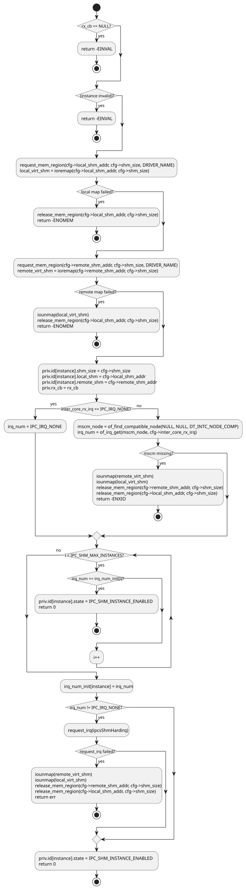

### 6.3.4 ipcsOsFree

<table border="1" cellspacing="0" cellpadding="4">
<tbody>
<tr>
<td>对应软件架构ID</td>
<td colspan="4">Drv_Ipcs_Osal_Cmp / Drv_Ipcs_Linux_Adapt_Cmp</td>
</tr>
<tr>
<td>软件单元 ID</td>
<td colspan="4">SWU_IPCS_LINUX_OS_KERN</td>
</tr>
<tr>
<td>函数说明</td>
<td colspan="4">释放指定实例 OSAL 资源，关闭线程/设备、解除映射并清理状态。</td>
</tr>
<tr>
<td>函数原型</td>
<td colspan="4">void ipcsOsFree(const uint8_t instance)</td>
</tr>
<tr>
<td>制约条件</td>
<td colspan="4">按 `ipcs/mpu/os_kernel/ipc-os.c` 中的入参检查、实例状态和内核资源状态执行</td>
</tr>
<tr>
<td rowspan="2">输入/输出参数</td>
<td>I/O</td>
<td>参数名</td>
<td>数据类型</td>
<td>说明</td>
</tr>
<tr>
<td>I</td>
<td>instance</td>
<td>const uint8_t instance</td>
<td>[IN] instance</td>
</tr>
<tr>
<td rowspan="2">返回值</td>
<td colspan="2">数据类型</td>
<td colspan="2">说明</td>
</tr>
<tr>
<td colspan="4">-</td>
</tr>
<tr>
<td>函数定义文件</td>
<td colspan="4">ipcs/mpu/os_kernel/ipc-os.c</td>
</tr>
<tr>
<td>函数声明文件</td>
<td colspan="4">ipcs/mpu/os_kernel/ipc-os.h</td>
</tr>
</tbody>
</table>

processing flow

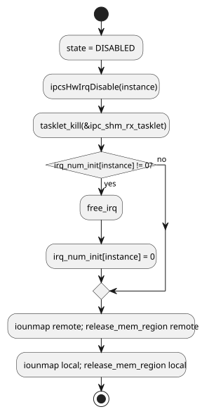

### 6.3.5 ipcsOsGetLocalShm

<table border="1" cellspacing="0" cellpadding="4">
<tbody>
<tr>
<td>对应软件架构ID</td>
<td colspan="4">Drv_Ipcs_Osal_Cmp / Drv_Ipcs_Linux_Adapt_Cmp</td>
</tr>
<tr>
<td>软件单元 ID</td>
<td colspan="4">SWU_IPCS_LINUX_OS_KERN</td>
</tr>
<tr>
<td>函数说明</td>
<td colspan="4">返回本地共享内存虚拟地址。</td>
</tr>
<tr>
<td>函数原型</td>
<td colspan="4">uintptr_t ipcsOsGetLocalShm(const uint8_t instance)</td>
</tr>
<tr>
<td>制约条件</td>
<td colspan="4">按 `ipcs/mpu/os_kernel/ipc-os.c` 中的入参检查、实例状态和内核资源状态执行</td>
</tr>
<tr>
<td rowspan="2">输入/输出参数</td>
<td>I/O</td>
<td>参数名</td>
<td>数据类型</td>
<td>说明</td>
</tr>
<tr>
<td>I</td>
<td>instance</td>
<td>const uint8_t instance</td>
<td>[IN] instance</td>
</tr>
<tr>
<td rowspan="2">返回值</td>
<td colspan="2">数据类型</td>
<td colspan="2">说明</td>
</tr>
<tr>
<td colspan="2">uintptr_t</td>
<td colspan="2">-</td>
</tr>
<tr>
<td>函数定义文件</td>
<td colspan="4">ipcs/mpu/os_kernel/ipc-os.c</td>
</tr>
<tr>
<td>函数声明文件</td>
<td colspan="4">ipcs/mpu/os_kernel/ipc-os.h</td>
</tr>
</tbody>
</table>

processing flow

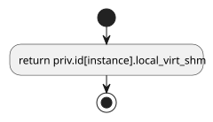

### 6.3.6 ipcsOsGetRemoteShm

<table border="1" cellspacing="0" cellpadding="4">
<tbody>
<tr>
<td>对应软件架构ID</td>
<td colspan="4">Drv_Ipcs_Osal_Cmp / Drv_Ipcs_Linux_Adapt_Cmp</td>
</tr>
<tr>
<td>软件单元 ID</td>
<td colspan="4">SWU_IPCS_LINUX_OS_KERN</td>
</tr>
<tr>
<td>函数说明</td>
<td colspan="4">返回远端共享内存虚拟地址。</td>
</tr>
<tr>
<td>函数原型</td>
<td colspan="4">uintptr_t ipcsOsGetRemoteShm(const uint8_t instance)</td>
</tr>
<tr>
<td>制约条件</td>
<td colspan="4">按 `ipcs/mpu/os_kernel/ipc-os.c` 中的入参检查、实例状态和内核资源状态执行</td>
</tr>
<tr>
<td rowspan="2">输入/输出参数</td>
<td>I/O</td>
<td>参数名</td>
<td>数据类型</td>
<td>说明</td>
</tr>
<tr>
<td>I</td>
<td>instance</td>
<td>const uint8_t instance</td>
<td>[IN] instance</td>
</tr>
<tr>
<td rowspan="2">返回值</td>
<td colspan="2">数据类型</td>
<td colspan="2">说明</td>
</tr>
<tr>
<td colspan="2">uintptr_t</td>
<td colspan="2">-</td>
</tr>
<tr>
<td>函数定义文件</td>
<td colspan="4">ipcs/mpu/os_kernel/ipc-os.c</td>
</tr>
<tr>
<td>函数声明文件</td>
<td colspan="4">ipcs/mpu/os_kernel/ipc-os.h</td>
</tr>
</tbody>
</table>

processing flow

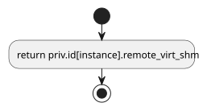

### 6.3.7 ipcsOsMapIntc

<table border="1" cellspacing="0" cellpadding="4">
<tbody>
<tr>
<td>对应软件架构ID</td>
<td colspan="4">Drv_Ipcs_Osal_Cmp / Drv_Ipcs_Linux_Adapt_Cmp</td>
</tr>
<tr>
<td>软件单元 ID</td>
<td colspan="4">SWU_IPCS_LINUX_OS_KERN</td>
</tr>
<tr>
<td>函数说明</td>
<td colspan="4">映射或返回中断控制器寄存器空间。</td>
</tr>
<tr>
<td>函数原型</td>
<td colspan="4">void *ipcsOsMapIntc(void)</td>
</tr>
<tr>
<td>制约条件</td>
<td colspan="4">按 `ipcs/mpu/os_kernel/ipc-os.c` 中的入参检查、实例状态和内核资源状态执行</td>
</tr>
<tr>
<td>输入/输出参数</td>
<td colspan="4">-</td>
</tr>
<tr>
<td rowspan="2">返回值</td>
<td colspan="2">数据类型</td>
<td colspan="2">说明</td>
</tr>
<tr>
<td colspan="2">void *</td>
<td colspan="2">-</td>
</tr>
<tr>
<td>函数定义文件</td>
<td colspan="4">ipcs/mpu/os_kernel/ipc-os.c</td>
</tr>
<tr>
<td>函数声明文件</td>
<td colspan="4">ipcs/mpu/os_kernel/ipc-os.h</td>
</tr>
</tbody>
</table>

processing flow

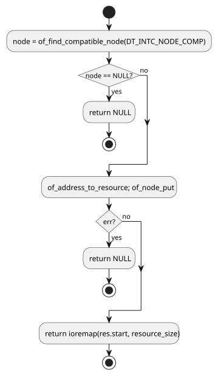

### 6.3.8 ipcsOsUnmapIntc

<table border="1" cellspacing="0" cellpadding="4">
<tbody>
<tr>
<td>对应软件架构ID</td>
<td colspan="4">Drv_Ipcs_Osal_Cmp / Drv_Ipcs_Linux_Adapt_Cmp</td>
</tr>
<tr>
<td>软件单元 ID</td>
<td colspan="4">SWU_IPCS_LINUX_OS_KERN</td>
</tr>
<tr>
<td>函数说明</td>
<td colspan="4">释放中断控制器寄存器映射或提供对应空实现。</td>
</tr>
<tr>
<td>函数原型</td>
<td colspan="4">void ipcsOsUnmapIntc(void *addr)</td>
</tr>
<tr>
<td>制约条件</td>
<td colspan="4">按 `ipcs/mpu/os_kernel/ipc-os.c` 中的入参检查、实例状态和内核资源状态执行</td>
</tr>
<tr>
<td rowspan="2">输入/输出参数</td>
<td>I/O</td>
<td>参数名</td>
<td>数据类型</td>
<td>说明</td>
</tr>
<tr>
<td>I</td>
<td>addr</td>
<td>void *addr</td>
<td>[IN] addr</td>
</tr>
<tr>
<td rowspan="2">返回值</td>
<td colspan="2">数据类型</td>
<td colspan="2">说明</td>
</tr>
<tr>
<td colspan="4">-</td>
</tr>
<tr>
<td>函数定义文件</td>
<td colspan="4">ipcs/mpu/os_kernel/ipc-os.c</td>
</tr>
<tr>
<td>函数声明文件</td>
<td colspan="4">ipcs/mpu/os_kernel/ipc-os.h</td>
</tr>
</tbody>
</table>

processing flow

### 6.3.9 ipcsOsPollChannels

<table border="1" cellspacing="0" cellpadding="4">
<tbody>
<tr>
<td>对应软件架构ID</td>
<td colspan="4">Drv_Ipcs_Osal_Cmp / Drv_Ipcs_Linux_Adapt_Cmp</td>
</tr>
<tr>
<td>软件单元 ID</td>
<td colspan="4">SWU_IPCS_LINUX_OS_KERN</td>
</tr>
<tr>
<td>函数说明</td>
<td colspan="4">在轮询模式下触发 rx_cb 处理接收通道。</td>
</tr>
<tr>
<td>函数原型</td>
<td colspan="4">int ipcsOsPollChannels(const uint8_t instance)</td>
</tr>
<tr>
<td>制约条件</td>
<td colspan="4">按 `ipcs/mpu/os_kernel/ipc-os.c` 中的入参检查、实例状态和内核资源状态执行</td>
</tr>
<tr>
<td rowspan="2">输入/输出参数</td>
<td>I/O</td>
<td>参数名</td>
<td>数据类型</td>
<td>说明</td>
</tr>
<tr>
<td>I</td>
<td>instance</td>
<td>const uint8_t instance</td>
<td>[IN] instance</td>
</tr>
<tr>
<td rowspan="2">返回值</td>
<td colspan="2">数据类型</td>
<td colspan="2">说明</td>
</tr>
<tr>
<td colspan="2">int</td>
<td colspan="2">-</td>
</tr>
<tr>
<td>函数定义文件</td>
<td colspan="4">ipcs/mpu/os_kernel/ipc-os.c</td>
</tr>
<tr>
<td>函数声明文件</td>
<td colspan="4">ipcs/mpu/os_kernel/ipc-os.h</td>
</tr>
</tbody>
</table>

processing flow

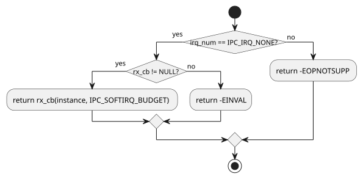

### 6.3.10 shm_mod_init

<table border="1" cellspacing="0" cellpadding="4">
<tbody>
<tr>
<td>对应软件架构ID</td>
<td colspan="4">Drv_Ipcs_Osal_Cmp / Drv_Ipcs_Linux_Adapt_Cmp</td>
</tr>
<tr>
<td>软件单元 ID</td>
<td colspan="4">SWU_IPCS_LINUX_OS_KERN</td>
</tr>
<tr>
<td>函数说明</td>
<td colspan="4">Linux 全内核模块初始化入口。</td>
</tr>
<tr>
<td>函数原型</td>
<td colspan="4">static int __init shm_mod_init(void)</td>
</tr>
<tr>
<td>制约条件</td>
<td colspan="4">按 `ipcs/mpu/os_kernel/ipc-os.c` 中的入参检查、实例状态和内核资源状态执行</td>
</tr>
<tr>
<td>输入/输出参数</td>
<td colspan="4">-</td>
</tr>
<tr>
<td rowspan="2">返回值</td>
<td colspan="2">数据类型</td>
<td colspan="2">说明</td>
</tr>
<tr>
<td colspan="2">int __init</td>
<td colspan="2">-</td>
</tr>
<tr>
<td>函数定义文件</td>
<td colspan="4">ipcs/mpu/os_kernel/ipc-os.c</td>
</tr>
<tr>
<td>函数声明文件</td>
<td colspan="4">ipcs/mpu/os_kernel/ipc-os.h</td>
</tr>
</tbody>
</table>

processing flow

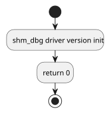

### 6.3.11 shm_mod_exit

<table border="1" cellspacing="0" cellpadding="4">
<tbody>
<tr>
<td>对应软件架构ID</td>
<td colspan="4">Drv_Ipcs_Osal_Cmp / Drv_Ipcs_Linux_Adapt_Cmp</td>
</tr>
<tr>
<td>软件单元 ID</td>
<td colspan="4">SWU_IPCS_LINUX_OS_KERN</td>
</tr>
<tr>
<td>函数说明</td>
<td colspan="4">Linux 全内核模块退出入口。</td>
</tr>
<tr>
<td>函数原型</td>
<td colspan="4">static void __exit shm_mod_exit(void)</td>
</tr>
<tr>
<td>制约条件</td>
<td colspan="4">按 `ipcs/mpu/os_kernel/ipc-os.c` 中的入参检查、实例状态和内核资源状态执行</td>
</tr>
<tr>
<td>输入/输出参数</td>
<td colspan="4">-</td>
</tr>
<tr>
<td rowspan="2">返回值</td>
<td colspan="2">数据类型</td>
<td colspan="2">说明</td>
</tr>
<tr>
<td colspan="2">void __exit</td>
<td colspan="2">-</td>
</tr>
<tr>
<td>函数定义文件</td>
<td colspan="4">ipcs/mpu/os_kernel/ipc-os.c</td>
</tr>
<tr>
<td>函数声明文件</td>
<td colspan="4">ipcs/mpu/os_kernel/ipc-os.h</td>
</tr>
</tbody>
</table>

processing flow

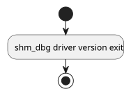

## 6.4 SWU_IPCS_LINUX_OS_UIO DESIGN 单元设计

### 6.4.1 line_from_file

<table border="1" cellspacing="0" cellpadding="4">
<tbody>
<tr>
<td>对应软件架构ID</td>
<td colspan="4">Drv_Ipcs_Linux_Adapt_Cmp</td>
</tr>
<tr>
<td>软件单元 ID</td>
<td colspan="4">SWU_IPCS_LINUX_OS_UIO</td>
</tr>
<tr>
<td>函数说明</td>
<td colspan="4">读取 sysfs 文件中的一行内容。</td>
</tr>
<tr>
<td>函数原型</td>
<td colspan="4">static int line_from_file(char *filename, char *buf)</td>
</tr>
<tr>
<td>制约条件</td>
<td colspan="4">按 `ipcs/mpu/os_uio/ipc-os.c` 中的入参检查、实例状态和内核资源状态执行</td>
</tr>
<tr>
<td rowspan="3">输入/输出参数</td>
<td>I/O</td>
<td>参数名</td>
<td>数据类型</td>
<td>说明</td>
</tr>
<tr>
<td>I</td>
<td>filename</td>
<td>char *filename</td>
<td>[IN] filename</td>
</tr>
<tr>
<td>I</td>
<td>buf</td>
<td>char *buf</td>
<td>[IN] buf</td>
</tr>
<tr>
<td rowspan="2">返回值</td>
<td colspan="2">数据类型</td>
<td colspan="2">说明</td>
</tr>
<tr>
<td colspan="2">int</td>
<td colspan="2">-</td>
</tr>
<tr>
<td>函数定义文件</td>
<td colspan="4">ipcs/mpu/os_uio/ipc-os.c</td>
</tr>
<tr>
<td>函数声明文件</td>
<td colspan="4">ipcs/mpu/os_uio/ipc-os.h</td>
</tr>
</tbody>
</table>

processing flow

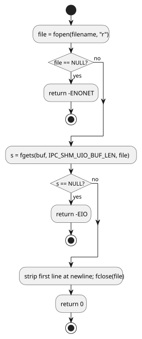

### 6.4.2 line_match

<table border="1" cellspacing="0" cellpadding="4">
<tbody>
<tr>
<td>对应软件架构ID</td>
<td colspan="4">Drv_Ipcs_Linux_Adapt_Cmp</td>
</tr>
<tr>
<td>软件单元 ID</td>
<td colspan="4">SWU_IPCS_LINUX_OS_UIO</td>
</tr>
<tr>
<td>函数说明</td>
<td colspan="4">比较 sysfs 文件内容与目标过滤字符串。</td>
</tr>
<tr>
<td>函数原型</td>
<td colspan="4">static int line_match(char *filename, char *filter)</td>
</tr>
<tr>
<td>制约条件</td>
<td colspan="4">按 `ipcs/mpu/os_uio/ipc-os.c` 中的入参检查、实例状态和内核资源状态执行</td>
</tr>
<tr>
<td rowspan="3">输入/输出参数</td>
<td>I/O</td>
<td>参数名</td>
<td>数据类型</td>
<td>说明</td>
</tr>
<tr>
<td>I</td>
<td>filename</td>
<td>char *filename</td>
<td>[IN] filename</td>
</tr>
<tr>
<td>I</td>
<td>filter</td>
<td>char *filter</td>
<td>[IN] filter</td>
</tr>
<tr>
<td rowspan="2">返回值</td>
<td colspan="2">数据类型</td>
<td colspan="2">说明</td>
</tr>
<tr>
<td colspan="2">int</td>
<td colspan="2">-</td>
</tr>
<tr>
<td>函数定义文件</td>
<td colspan="4">ipcs/mpu/os_uio/ipc-os.c</td>
</tr>
<tr>
<td>函数声明文件</td>
<td colspan="4">ipcs/mpu/os_uio/ipc-os.h</td>
</tr>
</tbody>
</table>

processing flow

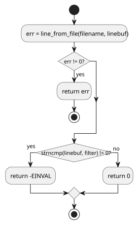

### 6.4.3 get_uio_dev_name

<table border="1" cellspacing="0" cellpadding="4">
<tbody>
<tr>
<td>对应软件架构ID</td>
<td colspan="4">Drv_Ipcs_Linux_Adapt_Cmp</td>
</tr>
<tr>
<td>软件单元 ID</td>
<td colspan="4">SWU_IPCS_LINUX_OS_UIO</td>
</tr>
<tr>
<td>函数说明</td>
<td colspan="4">在 sysfs 中查找匹配实例的 UIO 设备名。</td>
</tr>
<tr>
<td>函数原型</td>
<td colspan="4">static int get_uio_dev_name(char *dev_name, const uint8_t instance)</td>
</tr>
<tr>
<td>制约条件</td>
<td colspan="4">按 `ipcs/mpu/os_uio/ipc-os.c` 中的入参检查、实例状态和内核资源状态执行</td>
</tr>
<tr>
<td rowspan="3">输入/输出参数</td>
<td>I/O</td>
<td>参数名</td>
<td>数据类型</td>
<td>说明</td>
</tr>
<tr>
<td>I</td>
<td>dev_name</td>
<td>char *dev_name</td>
<td>[IN] dev_name</td>
</tr>
<tr>
<td>I</td>
<td>instance</td>
<td>const uint8_t instance</td>
<td>[IN] instance</td>
</tr>
<tr>
<td rowspan="2">返回值</td>
<td colspan="2">数据类型</td>
<td colspan="2">说明</td>
</tr>
<tr>
<td colspan="2">int</td>
<td colspan="2">-</td>
</tr>
<tr>
<td>函数定义文件</td>
<td colspan="4">ipcs/mpu/os_uio/ipc-os.c</td>
</tr>
<tr>
<td>函数声明文件</td>
<td colspan="4">ipcs/mpu/os_uio/ipc-os.h</td>
</tr>
</tbody>
</table>

processing flow

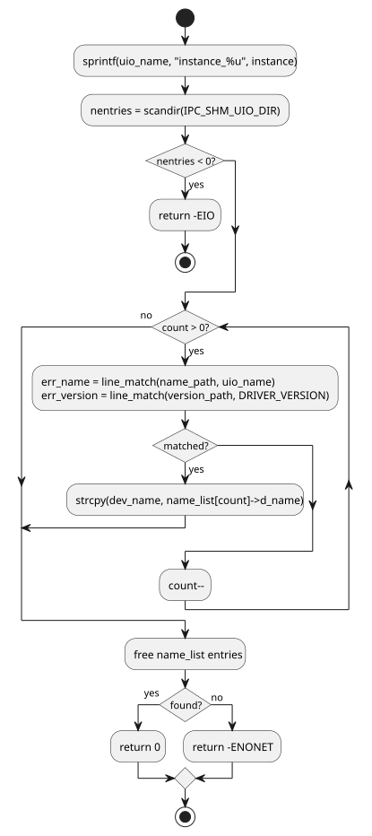

### 6.4.4 ipcsShmSoftirq

<table border="1" cellspacing="0" cellpadding="4">
<tbody>
<tr>
<td>对应软件架构ID</td>
<td colspan="4">Drv_Ipcs_Linux_Adapt_Cmp</td>
</tr>
<tr>
<td>软件单元 ID</td>
<td colspan="4">SWU_IPCS_LINUX_OS_UIO</td>
</tr>
<tr>
<td>函数说明</td>
<td colspan="4">延迟收包处理，遍历实例并调用上层 rx_cb，完成后重新使能 IRQ。</td>
</tr>
<tr>
<td>函数原型</td>
<td colspan="4">static void *ipcsShmSoftirq(void *arg)</td>
</tr>
<tr>
<td>制约条件</td>
<td colspan="4">按 `ipcs/mpu/os_uio/ipc-os.c` 中的入参检查、实例状态和内核资源状态执行</td>
</tr>
<tr>
<td rowspan="2">输入/输出参数</td>
<td>I/O</td>
<td>参数名</td>
<td>数据类型</td>
<td>说明</td>
</tr>
<tr>
<td>I</td>
<td>arg</td>
<td>void *arg</td>
<td>[IN] arg</td>
</tr>
<tr>
<td rowspan="2">返回值</td>
<td colspan="2">数据类型</td>
<td colspan="2">说明</td>
</tr>
<tr>
<td colspan="2">void *</td>
<td colspan="2">-</td>
</tr>
<tr>
<td>函数定义文件</td>
<td colspan="4">ipcs/mpu/os_uio/ipc-os.c</td>
</tr>
<tr>
<td>函数声明文件</td>
<td colspan="4">ipcs/mpu/os_uio/ipc-os.h</td>
</tr>
</tbody>
</table>

processing flow

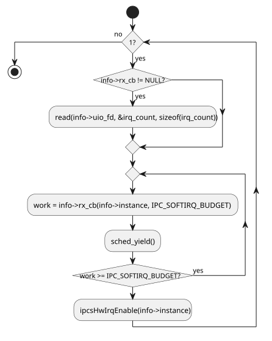

### 6.4.5 ipcsOsInit

<table border="1" cellspacing="0" cellpadding="4">
<tbody>
<tr>
<td>对应软件架构ID</td>
<td colspan="4">Drv_Ipcs_Linux_Adapt_Cmp</td>
</tr>
<tr>
<td>软件单元 ID</td>
<td colspan="4">SWU_IPCS_LINUX_OS_UIO</td>
</tr>
<tr>
<td>函数说明</td>
<td colspan="4">初始化指定实例的 Linux OSAL 资源，建立共享内存映射、记录回调并配置接收中断。</td>
</tr>
<tr>
<td>函数原型</td>
<td colspan="4">int ipcsOsInit(const uint8_t instance, const struct IPCS_SHM_CFG_TYPE *cfg, int (*rx_cb)(const uint8_t, int))</td>
</tr>
<tr>
<td>制约条件</td>
<td colspan="4">按 `ipcs/mpu/os_uio/ipc-os.c` 中的入参检查、实例状态和内核资源状态执行</td>
</tr>
<tr>
<td rowspan="4">输入/输出参数</td>
<td>I/O</td>
<td>参数名</td>
<td>数据类型</td>
<td>说明</td>
</tr>
<tr>
<td>I</td>
<td>instance</td>
<td>const uint8_t instance</td>
<td>[IN] instance</td>
</tr>
<tr>
<td>I</td>
<td>cfg</td>
<td>const struct IPCS_SHM_CFG_TYPE *cfg</td>
<td>[IN] cfg</td>
</tr>
<tr>
<td>I</td>
<td>rx_cb</td>
<td>int (*rx_cb)(const uint8_t, int)</td>
<td>[IN] rx_cb</td>
</tr>
<tr>
<td rowspan="2">返回值</td>
<td colspan="2">数据类型</td>
<td colspan="2">说明</td>
</tr>
<tr>
<td colspan="2">int</td>
<td colspan="2">-</td>
</tr>
<tr>
<td>函数定义文件</td>
<td colspan="4">ipcs/mpu/os_uio/ipc-os.c</td>
</tr>
<tr>
<td>函数声明文件</td>
<td colspan="4">ipcs/mpu/os_uio/ipc-os.h</td>
</tr>
</tbody>
</table>

processing flow

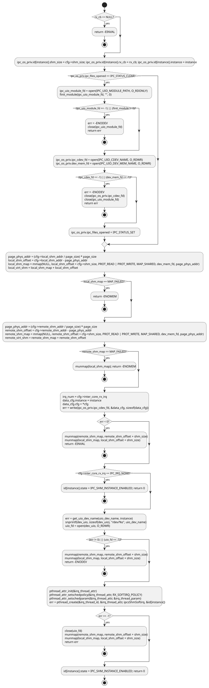

### 6.4.6 ipcsOsFree

<table border="1" cellspacing="0" cellpadding="4">
<tbody>
<tr>
<td>对应软件架构ID</td>
<td colspan="4">Drv_Ipcs_Linux_Adapt_Cmp</td>
</tr>
<tr>
<td>软件单元 ID</td>
<td colspan="4">SWU_IPCS_LINUX_OS_UIO</td>
</tr>
<tr>
<td>函数说明</td>
<td colspan="4">释放指定实例 OSAL 资源，关闭线程/设备、解除映射并清理状态。</td>
</tr>
<tr>
<td>函数原型</td>
<td colspan="4">void ipcsOsFree(const uint8_t instance)</td>
</tr>
<tr>
<td>制约条件</td>
<td colspan="4">按 `ipcs/mpu/os_uio/ipc-os.c` 中的入参检查、实例状态和内核资源状态执行</td>
</tr>
<tr>
<td rowspan="2">输入/输出参数</td>
<td>I/O</td>
<td>参数名</td>
<td>数据类型</td>
<td>说明</td>
</tr>
<tr>
<td>I</td>
<td>instance</td>
<td>const uint8_t instance</td>
<td>[IN] instance</td>
</tr>
<tr>
<td rowspan="2">返回值</td>
<td colspan="2">数据类型</td>
<td colspan="2">说明</td>
</tr>
<tr>
<td colspan="4">-</td>
</tr>
<tr>
<td>函数定义文件</td>
<td colspan="4">ipcs/mpu/os_uio/ipc-os.c</td>
</tr>
<tr>
<td>函数声明文件</td>
<td colspan="4">ipcs/mpu/os_uio/ipc-os.h</td>
</tr>
</tbody>
</table>

processing flow

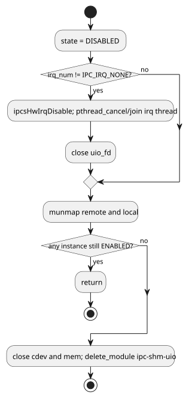

### 6.4.7 ipcsOsGetLocalShm

<table border="1" cellspacing="0" cellpadding="4">
<tbody>
<tr>
<td>对应软件架构ID</td>
<td colspan="4">Drv_Ipcs_Linux_Adapt_Cmp</td>
</tr>
<tr>
<td>软件单元 ID</td>
<td colspan="4">SWU_IPCS_LINUX_OS_UIO</td>
</tr>
<tr>
<td>函数说明</td>
<td colspan="4">返回本地共享内存虚拟地址。</td>
</tr>
<tr>
<td>函数原型</td>
<td colspan="4">uintptr_t ipcsOsGetLocalShm(const uint8_t instance)</td>
</tr>
<tr>
<td>制约条件</td>
<td colspan="4">按 `ipcs/mpu/os_uio/ipc-os.c` 中的入参检查、实例状态和内核资源状态执行</td>
</tr>
<tr>
<td rowspan="2">输入/输出参数</td>
<td>I/O</td>
<td>参数名</td>
<td>数据类型</td>
<td>说明</td>
</tr>
<tr>
<td>I</td>
<td>instance</td>
<td>const uint8_t instance</td>
<td>[IN] instance</td>
</tr>
<tr>
<td rowspan="2">返回值</td>
<td colspan="2">数据类型</td>
<td colspan="2">说明</td>
</tr>
<tr>
<td colspan="2">uintptr_t</td>
<td colspan="2">-</td>
</tr>
<tr>
<td>函数定义文件</td>
<td colspan="4">ipcs/mpu/os_uio/ipc-os.c</td>
</tr>
<tr>
<td>函数声明文件</td>
<td colspan="4">ipcs/mpu/os_uio/ipc-os.h</td>
</tr>
</tbody>
</table>

processing flow

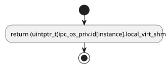

### 6.4.8 ipcsOsGetRemoteShm

<table border="1" cellspacing="0" cellpadding="4">
<tbody>
<tr>
<td>对应软件架构ID</td>
<td colspan="4">Drv_Ipcs_Linux_Adapt_Cmp</td>
</tr>
<tr>
<td>软件单元 ID</td>
<td colspan="4">SWU_IPCS_LINUX_OS_UIO</td>
</tr>
<tr>
<td>函数说明</td>
<td colspan="4">返回远端共享内存虚拟地址。</td>
</tr>
<tr>
<td>函数原型</td>
<td colspan="4">uintptr_t ipcsOsGetRemoteShm(const uint8_t instance)</td>
</tr>
<tr>
<td>制约条件</td>
<td colspan="4">按 `ipcs/mpu/os_uio/ipc-os.c` 中的入参检查、实例状态和内核资源状态执行</td>
</tr>
<tr>
<td rowspan="2">输入/输出参数</td>
<td>I/O</td>
<td>参数名</td>
<td>数据类型</td>
<td>说明</td>
</tr>
<tr>
<td>I</td>
<td>instance</td>
<td>const uint8_t instance</td>
<td>[IN] instance</td>
</tr>
<tr>
<td rowspan="2">返回值</td>
<td colspan="2">数据类型</td>
<td colspan="2">说明</td>
</tr>
<tr>
<td colspan="2">uintptr_t</td>
<td colspan="2">-</td>
</tr>
<tr>
<td>函数定义文件</td>
<td colspan="4">ipcs/mpu/os_uio/ipc-os.c</td>
</tr>
<tr>
<td>函数声明文件</td>
<td colspan="4">ipcs/mpu/os_uio/ipc-os.h</td>
</tr>
</tbody>
</table>

processing flow

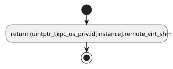

### 6.4.9 ipcsOsPollChannels

<table border="1" cellspacing="0" cellpadding="4">
<tbody>
<tr>
<td>对应软件架构ID</td>
<td colspan="4">Drv_Ipcs_Linux_Adapt_Cmp</td>
</tr>
<tr>
<td>软件单元 ID</td>
<td colspan="4">SWU_IPCS_LINUX_OS_UIO</td>
</tr>
<tr>
<td>函数说明</td>
<td colspan="4">在轮询模式下触发 rx_cb 处理接收通道。</td>
</tr>
<tr>
<td>函数原型</td>
<td colspan="4">int ipcsOsPollChannels(const uint8_t instance)</td>
</tr>
<tr>
<td>制约条件</td>
<td colspan="4">按 `ipcs/mpu/os_uio/ipc-os.c` 中的入参检查、实例状态和内核资源状态执行</td>
</tr>
<tr>
<td rowspan="2">输入/输出参数</td>
<td>I/O</td>
<td>参数名</td>
<td>数据类型</td>
<td>说明</td>
</tr>
<tr>
<td>I</td>
<td>instance</td>
<td>const uint8_t instance</td>
<td>[IN] instance</td>
</tr>
<tr>
<td rowspan="2">返回值</td>
<td colspan="2">数据类型</td>
<td colspan="2">说明</td>
</tr>
<tr>
<td colspan="2">int</td>
<td colspan="2">-</td>
</tr>
<tr>
<td>函数定义文件</td>
<td colspan="4">ipcs/mpu/os_uio/ipc-os.c</td>
</tr>
<tr>
<td>函数声明文件</td>
<td colspan="4">ipcs/mpu/os_uio/ipc-os.h</td>
</tr>
</tbody>
</table>

processing flow

### 6.4.10 ipcsSendUioCmd

<table border="1" cellspacing="0" cellpadding="4">
<tbody>
<tr>
<td>对应软件架构ID</td>
<td colspan="4">Drv_Ipcs_Linux_Adapt_Cmp</td>
</tr>
<tr>
<td>软件单元 ID</td>
<td colspan="4">SWU_IPCS_LINUX_OS_UIO</td>
</tr>
<tr>
<td>函数说明</td>
<td colspan="4">向 UIO fd 写入命令，代理 IRQ 使能、禁止或通知。</td>
</tr>
<tr>
<td>函数原型</td>
<td colspan="4">static void ipcsSendUioCmd(uint32_t uio_fd, int32_t cmd)</td>
</tr>
<tr>
<td>制约条件</td>
<td colspan="4">按 `ipcs/mpu/os_uio/ipc-os.c` 中的入参检查、实例状态和内核资源状态执行</td>
</tr>
<tr>
<td rowspan="3">输入/输出参数</td>
<td>I/O</td>
<td>参数名</td>
<td>数据类型</td>
<td>说明</td>
</tr>
<tr>
<td>I</td>
<td>uio_fd</td>
<td>uint32_t uio_fd</td>
<td>[IN] uio_fd</td>
</tr>
<tr>
<td>I</td>
<td>cmd</td>
<td>int32_t cmd</td>
<td>[IN] cmd</td>
</tr>
<tr>
<td rowspan="2">返回值</td>
<td colspan="2">数据类型</td>
<td colspan="2">说明</td>
</tr>
<tr>
<td colspan="4">-</td>
</tr>
<tr>
<td>函数定义文件</td>
<td colspan="4">ipcs/mpu/os_uio/ipc-os.c</td>
</tr>
<tr>
<td>函数声明文件</td>
<td colspan="4">ipcs/mpu/os_uio/ipc-os.h</td>
</tr>
</tbody>
</table>

processing flow

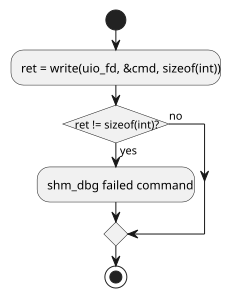

### 6.4.11 ipcsHwIrqEnable

<table border="1" cellspacing="0" cellpadding="4">
<tbody>
<tr>
<td>对应软件架构ID</td>
<td colspan="4">Drv_Ipcs_Linux_Adapt_Cmp</td>
</tr>
<tr>
<td>软件单元 ID</td>
<td colspan="4">SWU_IPCS_LINUX_OS_UIO</td>
</tr>
<tr>
<td>函数说明</td>
<td colspan="4">使能指定实例接收中断；用户侧为转发代理，内核侧访问硬件。</td>
</tr>
<tr>
<td>函数原型</td>
<td colspan="4">void ipcsHwIrqEnable(const uint8_t instance)</td>
</tr>
<tr>
<td>制约条件</td>
<td colspan="4">按 `ipcs/mpu/os_uio/ipc-os.c` 中的入参检查、实例状态和内核资源状态执行</td>
</tr>
<tr>
<td rowspan="2">输入/输出参数</td>
<td>I/O</td>
<td>参数名</td>
<td>数据类型</td>
<td>说明</td>
</tr>
<tr>
<td>I</td>
<td>instance</td>
<td>const uint8_t instance</td>
<td>[IN] instance</td>
</tr>
<tr>
<td rowspan="2">返回值</td>
<td colspan="2">数据类型</td>
<td colspan="2">说明</td>
</tr>
<tr>
<td colspan="4">-</td>
</tr>
<tr>
<td>函数定义文件</td>
<td colspan="4">ipcs/mpu/os_uio/ipc-os.c</td>
</tr>
<tr>
<td>函数声明文件</td>
<td colspan="4">ipcs/mpu/os_uio/ipc-os.h</td>
</tr>
</tbody>
</table>

processing flow

### 6.4.12 ipcsHwIrqDisable

<table border="1" cellspacing="0" cellpadding="4">
<tbody>
<tr>
<td>对应软件架构ID</td>
<td colspan="4">Drv_Ipcs_Linux_Adapt_Cmp</td>
</tr>
<tr>
<td>软件单元 ID</td>
<td colspan="4">SWU_IPCS_LINUX_OS_UIO</td>
</tr>
<tr>
<td>函数说明</td>
<td colspan="4">禁止指定实例接收中断；用户侧为转发代理，内核侧访问硬件。</td>
</tr>
<tr>
<td>函数原型</td>
<td colspan="4">void ipcsHwIrqDisable(const uint8_t instance)</td>
</tr>
<tr>
<td>制约条件</td>
<td colspan="4">按 `ipcs/mpu/os_uio/ipc-os.c` 中的入参检查、实例状态和内核资源状态执行</td>
</tr>
<tr>
<td rowspan="2">输入/输出参数</td>
<td>I/O</td>
<td>参数名</td>
<td>数据类型</td>
<td>说明</td>
</tr>
<tr>
<td>I</td>
<td>instance</td>
<td>const uint8_t instance</td>
<td>[IN] instance</td>
</tr>
<tr>
<td rowspan="2">返回值</td>
<td colspan="2">数据类型</td>
<td colspan="2">说明</td>
</tr>
<tr>
<td colspan="4">-</td>
</tr>
<tr>
<td>函数定义文件</td>
<td colspan="4">ipcs/mpu/os_uio/ipc-os.c</td>
</tr>
<tr>
<td>函数声明文件</td>
<td colspan="4">ipcs/mpu/os_uio/ipc-os.h</td>
</tr>
</tbody>
</table>

processing flow

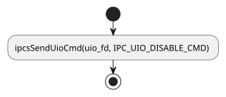

### 6.4.13 ipcsHwIrqNotify

<table border="1" cellspacing="0" cellpadding="4">
<tbody>
<tr>
<td>对应软件架构ID</td>
<td colspan="4">Drv_Ipcs_Linux_Adapt_Cmp</td>
</tr>
<tr>
<td>软件单元 ID</td>
<td colspan="4">SWU_IPCS_LINUX_OS_UIO</td>
</tr>
<tr>
<td>函数说明</td>
<td colspan="4">通知远端有数据可用；用户侧为转发代理，内核侧触发硬件中断。</td>
</tr>
<tr>
<td>函数原型</td>
<td colspan="4">void ipcsHwIrqNotify(const uint8_t instance)</td>
</tr>
<tr>
<td>制约条件</td>
<td colspan="4">按 `ipcs/mpu/os_uio/ipc-os.c` 中的入参检查、实例状态和内核资源状态执行</td>
</tr>
<tr>
<td rowspan="2">输入/输出参数</td>
<td>I/O</td>
<td>参数名</td>
<td>数据类型</td>
<td>说明</td>
</tr>
<tr>
<td>I</td>
<td>instance</td>
<td>const uint8_t instance</td>
<td>[IN] instance</td>
</tr>
<tr>
<td rowspan="2">返回值</td>
<td colspan="2">数据类型</td>
<td colspan="2">说明</td>
</tr>
<tr>
<td colspan="4">-</td>
</tr>
<tr>
<td>函数定义文件</td>
<td colspan="4">ipcs/mpu/os_uio/ipc-os.c</td>
</tr>
<tr>
<td>函数声明文件</td>
<td colspan="4">ipcs/mpu/os_uio/ipc-os.h</td>
</tr>
</tbody>
</table>

processing flow

### 6.4.14 ipcsHwInit

<table border="1" cellspacing="0" cellpadding="4">
<tbody>
<tr>
<td>对应软件架构ID</td>
<td colspan="4">Drv_Ipcs_Linux_Adapt_Cmp</td>
</tr>
<tr>
<td>软件单元 ID</td>
<td colspan="4">SWU_IPCS_LINUX_OS_UIO</td>
</tr>
<tr>
<td>函数说明</td>
<td colspan="4">初始化 HAL 资源；用户侧为空实现，内核侧映射并配置 核间中断控制器/IRQ。</td>
</tr>
<tr>
<td>函数原型</td>
<td colspan="4">int ipcsHwInit(const uint8_t instance, const struct IPCS_SHM_CFG_TYPE *cfg)</td>
</tr>
<tr>
<td>制约条件</td>
<td colspan="4">按 `ipcs/mpu/os_uio/ipc-os.c` 中的入参检查、实例状态和内核资源状态执行</td>
</tr>
<tr>
<td rowspan="3">输入/输出参数</td>
<td>I/O</td>
<td>参数名</td>
<td>数据类型</td>
<td>说明</td>
</tr>
<tr>
<td>I</td>
<td>instance</td>
<td>const uint8_t instance</td>
<td>[IN] instance</td>
</tr>
<tr>
<td>I</td>
<td>cfg</td>
<td>const struct IPCS_SHM_CFG_TYPE *cfg</td>
<td>[IN] cfg</td>
</tr>
<tr>
<td rowspan="2">返回值</td>
<td colspan="2">数据类型</td>
<td colspan="2">说明</td>
</tr>
<tr>
<td colspan="2">int</td>
<td colspan="2">-</td>
</tr>
<tr>
<td>函数定义文件</td>
<td colspan="4">ipcs/mpu/os_uio/ipc-os.c</td>
</tr>
<tr>
<td>函数声明文件</td>
<td colspan="4">ipcs/mpu/os_uio/ipc-os.h</td>
</tr>
</tbody>
</table>

processing flow

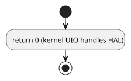

### 6.4.15 ipcsHwFree

<table border="1" cellspacing="0" cellpadding="4">
<tbody>
<tr>
<td>对应软件架构ID</td>
<td colspan="4">Drv_Ipcs_Linux_Adapt_Cmp</td>
</tr>
<tr>
<td>软件单元 ID</td>
<td colspan="4">SWU_IPCS_LINUX_OS_UIO</td>
</tr>
<tr>
<td>函数说明</td>
<td colspan="4">释放 HAL 资源；用户侧为空实现，内核侧释放映射状态。</td>
</tr>
<tr>
<td>函数原型</td>
<td colspan="4">void ipcsHwFree(const uint8_t instance)</td>
</tr>
<tr>
<td>制约条件</td>
<td colspan="4">按 `ipcs/mpu/os_uio/ipc-os.c` 中的入参检查、实例状态和内核资源状态执行</td>
</tr>
<tr>
<td rowspan="2">输入/输出参数</td>
<td>I/O</td>
<td>参数名</td>
<td>数据类型</td>
<td>说明</td>
</tr>
<tr>
<td>I</td>
<td>instance</td>
<td>const uint8_t instance</td>
<td>[IN] instance</td>
</tr>
<tr>
<td rowspan="2">返回值</td>
<td colspan="2">数据类型</td>
<td colspan="2">说明</td>
</tr>
<tr>
<td colspan="4">-</td>
</tr>
<tr>
<td>函数定义文件</td>
<td colspan="4">ipcs/mpu/os_uio/ipc-os.c</td>
</tr>
<tr>
<td>函数声明文件</td>
<td colspan="4">ipcs/mpu/os_uio/ipc-os.h</td>
</tr>
</tbody>
</table>

processing flow

## 6.5 SWU_IPCS_LINUX_UIO_KO DESIGN 单元设计

### 6.5.1 ipcsShmUioOpen

<table border="1" cellspacing="0" cellpadding="4">
<tbody>
<tr>
<td>对应软件架构ID</td>
<td colspan="4">Drv_Ipcs_Linux_Adapt_Cmp</td>
</tr>
<tr>
<td>软件单元 ID</td>
<td colspan="4">SWU_IPCS_LINUX_UIO_KO</td>
</tr>
<tr>
<td>函数说明</td>
<td colspan="4">处理 UIO 设备打开请求并维护引用计数。</td>
</tr>
<tr>
<td>函数原型</td>
<td colspan="4">static int ipcsShmUioOpen(struct uio_info *info, struct inode *inode)</td>
</tr>
<tr>
<td>制约条件</td>
<td colspan="4">按 `ipcs/mpu/os_kernel/ipc-uio.c` 中的入参检查、实例状态和内核资源状态执行</td>
</tr>
<tr>
<td rowspan="3">输入/输出参数</td>
<td>I/O</td>
<td>参数名</td>
<td>数据类型</td>
<td>说明</td>
</tr>
<tr>
<td>I</td>
<td>info</td>
<td>struct uio_info *info</td>
<td>[IN] info</td>
</tr>
<tr>
<td>I</td>
<td>inode</td>
<td>struct inode *inode</td>
<td>[IN] inode</td>
</tr>
<tr>
<td rowspan="2">返回值</td>
<td colspan="2">数据类型</td>
<td colspan="2">说明</td>
</tr>
<tr>
<td colspan="2">int</td>
<td colspan="2">-</td>
</tr>
<tr>
<td>函数定义文件</td>
<td colspan="4">ipcs/mpu/os_kernel/ipc-uio.c</td>
</tr>
<tr>
<td>函数声明文件</td>
<td colspan="4">ipcs/mpu/os_kernel/ipc-uio.h</td>
</tr>
</tbody>
</table>

processing flow

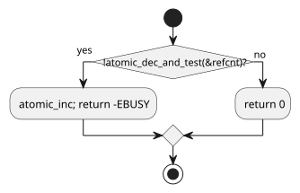

### 6.5.2 ipcsShmUioRelease

<table border="1" cellspacing="0" cellpadding="4">
<tbody>
<tr>
<td>对应软件架构ID</td>
<td colspan="4">Drv_Ipcs_Linux_Adapt_Cmp</td>
</tr>
<tr>
<td>软件单元 ID</td>
<td colspan="4">SWU_IPCS_LINUX_UIO_KO</td>
</tr>
<tr>
<td>函数说明</td>
<td colspan="4">处理 UIO 设备关闭请求并恢复引用计数。</td>
</tr>
<tr>
<td>函数原型</td>
<td colspan="4">static int ipcsShmUioRelease(struct uio_info *info, struct inode *inode)</td>
</tr>
<tr>
<td>制约条件</td>
<td colspan="4">按 `ipcs/mpu/os_kernel/ipc-uio.c` 中的入参检查、实例状态和内核资源状态执行</td>
</tr>
<tr>
<td rowspan="3">输入/输出参数</td>
<td>I/O</td>
<td>参数名</td>
<td>数据类型</td>
<td>说明</td>
</tr>
<tr>
<td>I</td>
<td>info</td>
<td>struct uio_info *info</td>
<td>[IN] info</td>
</tr>
<tr>
<td>I</td>
<td>inode</td>
<td>struct inode *inode</td>
<td>[IN] inode</td>
</tr>
<tr>
<td rowspan="2">返回值</td>
<td colspan="2">数据类型</td>
<td colspan="2">说明</td>
</tr>
<tr>
<td colspan="2">int</td>
<td colspan="2">-</td>
</tr>
<tr>
<td>函数定义文件</td>
<td colspan="4">ipcs/mpu/os_kernel/ipc-uio.c</td>
</tr>
<tr>
<td>函数声明文件</td>
<td colspan="4">ipcs/mpu/os_kernel/ipc-uio.h</td>
</tr>
</tbody>
</table>

processing flow

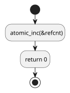

### 6.5.3 ipcsShmUioIrqcontrol

<table border="1" cellspacing="0" cellpadding="4">
<tbody>
<tr>
<td>对应软件架构ID</td>
<td colspan="4">Drv_Ipcs_Linux_Adapt_Cmp</td>
</tr>
<tr>
<td>软件单元 ID</td>
<td colspan="4">SWU_IPCS_LINUX_UIO_KO</td>
</tr>
<tr>
<td>函数说明</td>
<td colspan="4">处理 UIO irqcontrol 命令并调用 HAL IRQ 操作。</td>
</tr>
<tr>
<td>函数原型</td>
<td colspan="4">static int ipcsShmUioIrqcontrol(struct uio_info *dev_info, int cmd)</td>
</tr>
<tr>
<td>制约条件</td>
<td colspan="4">按 `ipcs/mpu/os_kernel/ipc-uio.c` 中的入参检查、实例状态和内核资源状态执行</td>
</tr>
<tr>
<td rowspan="3">输入/输出参数</td>
<td>I/O</td>
<td>参数名</td>
<td>数据类型</td>
<td>说明</td>
</tr>
<tr>
<td>I</td>
<td>dev_info</td>
<td>struct uio_info *dev_info</td>
<td>[IN] dev_info</td>
</tr>
<tr>
<td>I</td>
<td>cmd</td>
<td>int cmd</td>
<td>[IN] cmd</td>
</tr>
<tr>
<td rowspan="2">返回值</td>
<td colspan="2">数据类型</td>
<td colspan="2">说明</td>
</tr>
<tr>
<td colspan="2">int</td>
<td colspan="2">-</td>
</tr>
<tr>
<td>函数定义文件</td>
<td colspan="4">ipcs/mpu/os_kernel/ipc-uio.c</td>
</tr>
<tr>
<td>函数声明文件</td>
<td colspan="4">ipcs/mpu/os_kernel/ipc-uio.h</td>
</tr>
</tbody>
</table>

processing flow

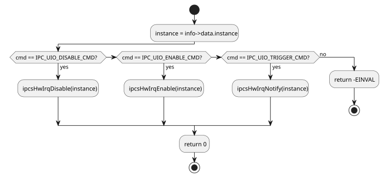

### 6.5.4 ipcsShmUioHandler

<table border="1" cellspacing="0" cellpadding="4">
<tbody>
<tr>
<td>对应软件架构ID</td>
<td colspan="4">Drv_Ipcs_Linux_Adapt_Cmp</td>
</tr>
<tr>
<td>软件单元 ID</td>
<td colspan="4">SWU_IPCS_LINUX_UIO_KO</td>
</tr>
<tr>
<td>函数说明</td>
<td colspan="4">UIO 中断处理，禁止并清除 IRQ，返回 IRQ_HANDLED 唤醒用户态。</td>
</tr>
<tr>
<td>函数原型</td>
<td colspan="4">static irqreturn_t ipcsShmUioHandler(int irq, struct uio_info *dev_info)</td>
</tr>
<tr>
<td>制约条件</td>
<td colspan="4">按 `ipcs/mpu/os_kernel/ipc-uio.c` 中的入参检查、实例状态和内核资源状态执行</td>
</tr>
<tr>
<td rowspan="3">输入/输出参数</td>
<td>I/O</td>
<td>参数名</td>
<td>数据类型</td>
<td>说明</td>
</tr>
<tr>
<td>I</td>
<td>irq</td>
<td>int irq</td>
<td>[IN] irq</td>
</tr>
<tr>
<td>I</td>
<td>dev_info</td>
<td>struct uio_info *dev_info</td>
<td>[IN] dev_info</td>
</tr>
<tr>
<td rowspan="2">返回值</td>
<td colspan="2">数据类型</td>
<td colspan="2">说明</td>
</tr>
<tr>
<td colspan="2">irqreturn_t</td>
<td colspan="2">-</td>
</tr>
<tr>
<td>函数定义文件</td>
<td colspan="4">ipcs/mpu/os_kernel/ipc-uio.c</td>
</tr>
<tr>
<td>函数声明文件</td>
<td colspan="4">ipcs/mpu/os_kernel/ipc-uio.h</td>
</tr>
</tbody>
</table>

processing flow

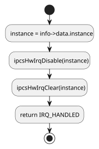

### 6.5.5 ipcsUioInit

<table border="1" cellspacing="0" cellpadding="4">
<tbody>
<tr>
<td>对应软件架构ID</td>
<td colspan="4">Drv_Ipcs_Linux_Adapt_Cmp</td>
</tr>
<tr>
<td>软件单元 ID</td>
<td colspan="4">SWU_IPCS_LINUX_UIO_KO</td>
</tr>
<tr>
<td>函数说明</td>
<td colspan="4">根据用户配置初始化 UIO 实例、HAL 与 IRQ，并注册 UIO 设备。</td>
</tr>
<tr>
<td>函数原型</td>
<td colspan="4">static int ipcsUioInit(struct IPCS_UIO_CDEV_DATA_TYPE *data)</td>
</tr>
<tr>
<td>制约条件</td>
<td colspan="4">按 `ipcs/mpu/os_kernel/ipc-uio.c` 中的入参检查、实例状态和内核资源状态执行</td>
</tr>
<tr>
<td rowspan="2">输入/输出参数</td>
<td>I/O</td>
<td>参数名</td>
<td>数据类型</td>
<td>说明</td>
</tr>
<tr>
<td>I</td>
<td>data</td>
<td>struct IPCS_UIO_CDEV_DATA_TYPE *data</td>
<td>[IN] data</td>
</tr>
<tr>
<td rowspan="2">返回值</td>
<td colspan="2">数据类型</td>
<td colspan="2">说明</td>
</tr>
<tr>
<td colspan="2">int</td>
<td colspan="2">-</td>
</tr>
<tr>
<td>函数定义文件</td>
<td colspan="4">ipcs/mpu/os_kernel/ipc-uio.c</td>
</tr>
<tr>
<td>函数声明文件</td>
<td colspan="4">ipcs/mpu/os_kernel/ipc-uio.h</td>
</tr>
</tbody>
</table>

processing flow

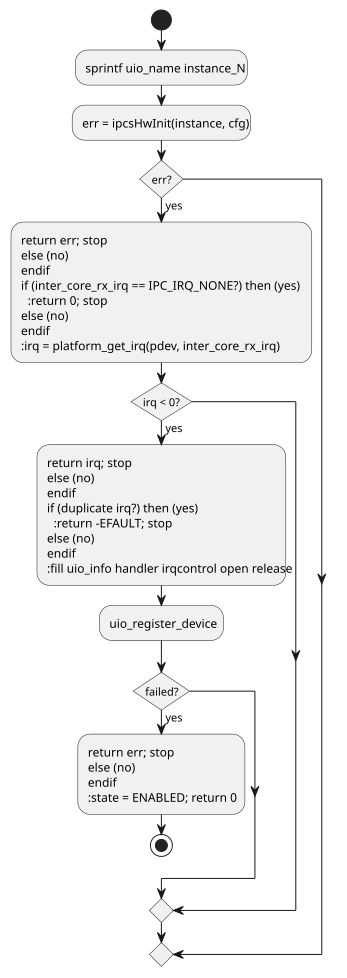

### 6.5.6 ipcsCdevOpen

<table border="1" cellspacing="0" cellpadding="4">
<tbody>
<tr>
<td>对应软件架构ID</td>
<td colspan="4">Drv_Ipcs_Linux_Adapt_Cmp</td>
</tr>
<tr>
<td>软件单元 ID</td>
<td colspan="4">SWU_IPCS_LINUX_UIO_KO</td>
</tr>
<tr>
<td>函数说明</td>
<td colspan="4">处理字符设备打开请求。</td>
</tr>
<tr>
<td>函数原型</td>
<td colspan="4">static int ipcsCdevOpen(struct inode *inode, struct file *filp)</td>
</tr>
<tr>
<td>制约条件</td>
<td colspan="4">按 `ipcs/mpu/os_kernel/ipc-uio.c` 中的入参检查、实例状态和内核资源状态执行</td>
</tr>
<tr>
<td rowspan="3">输入/输出参数</td>
<td>I/O</td>
<td>参数名</td>
<td>数据类型</td>
<td>说明</td>
</tr>
<tr>
<td>I</td>
<td>inode</td>
<td>struct inode *inode</td>
<td>[IN] inode</td>
</tr>
<tr>
<td>I</td>
<td>filp</td>
<td>struct file *filp</td>
<td>[IN] filp</td>
</tr>
<tr>
<td rowspan="2">返回值</td>
<td colspan="2">数据类型</td>
<td colspan="2">说明</td>
</tr>
<tr>
<td colspan="2">int</td>
<td colspan="2">-</td>
</tr>
<tr>
<td>函数定义文件</td>
<td colspan="4">ipcs/mpu/os_kernel/ipc-uio.c</td>
</tr>
<tr>
<td>函数声明文件</td>
<td colspan="4">ipcs/mpu/os_kernel/ipc-uio.h</td>
</tr>
</tbody>
</table>

processing flow

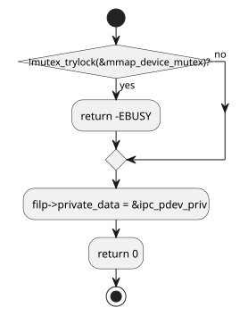

### 6.5.7 ipcsCdevRelease

<table border="1" cellspacing="0" cellpadding="4">
<tbody>
<tr>
<td>对应软件架构ID</td>
<td colspan="4">Drv_Ipcs_Linux_Adapt_Cmp</td>
</tr>
<tr>
<td>软件单元 ID</td>
<td colspan="4">SWU_IPCS_LINUX_UIO_KO</td>
</tr>
<tr>
<td>函数说明</td>
<td colspan="4">处理字符设备关闭请求。</td>
</tr>
<tr>
<td>函数原型</td>
<td colspan="4">static int ipcsCdevRelease(struct inode *inode, struct file *filp)</td>
</tr>
<tr>
<td>制约条件</td>
<td colspan="4">按 `ipcs/mpu/os_kernel/ipc-uio.c` 中的入参检查、实例状态和内核资源状态执行</td>
</tr>
<tr>
<td rowspan="3">输入/输出参数</td>
<td>I/O</td>
<td>参数名</td>
<td>数据类型</td>
<td>说明</td>
</tr>
<tr>
<td>I</td>
<td>inode</td>
<td>struct inode *inode</td>
<td>[IN] inode</td>
</tr>
<tr>
<td>I</td>
<td>filp</td>
<td>struct file *filp</td>
<td>[IN] filp</td>
</tr>
<tr>
<td rowspan="2">返回值</td>
<td colspan="2">数据类型</td>
<td colspan="2">说明</td>
</tr>
<tr>
<td colspan="2">int</td>
<td colspan="2">-</td>
</tr>
<tr>
<td>函数定义文件</td>
<td colspan="4">ipcs/mpu/os_kernel/ipc-uio.c</td>
</tr>
<tr>
<td>函数声明文件</td>
<td colspan="4">ipcs/mpu/os_kernel/ipc-uio.h</td>
</tr>
</tbody>
</table>

processing flow

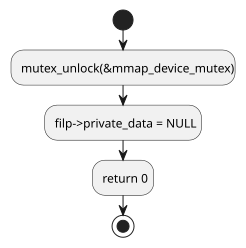

### 6.5.8 ipcsCdevWrite

<table border="1" cellspacing="0" cellpadding="4">
<tbody>
<tr>
<td>对应软件架构ID</td>
<td colspan="4">Drv_Ipcs_Linux_Adapt_Cmp</td>
</tr>
<tr>
<td>软件单元 ID</td>
<td colspan="4">SWU_IPCS_LINUX_UIO_KO</td>
</tr>
<tr>
<td>函数说明</td>
<td colspan="4">接收用户侧 UIO 配置并初始化对应 UIO 设备。</td>
</tr>
<tr>
<td>函数原型</td>
<td colspan="4">static ssize_t ipcsCdevWrite(struct file *file, const char __user *user_buffer, size_t size, loff_t *offset)</td>
</tr>
<tr>
<td>制约条件</td>
<td colspan="4">按 `ipcs/mpu/os_kernel/ipc-uio.c` 中的入参检查、实例状态和内核资源状态执行</td>
</tr>
<tr>
<td rowspan="5">输入/输出参数</td>
<td>I/O</td>
<td>参数名</td>
<td>数据类型</td>
<td>说明</td>
</tr>
<tr>
<td>I</td>
<td>file</td>
<td>struct file *file</td>
<td>[IN] file</td>
</tr>
<tr>
<td>I</td>
<td>user_buffer</td>
<td>const char __user *user_buffer</td>
<td>[IN] user_buffer</td>
</tr>
<tr>
<td>I</td>
<td>size</td>
<td>size_t size</td>
<td>[IN] size</td>
</tr>
<tr>
<td>I</td>
<td>offset</td>
<td>loff_t *offset</td>
<td>[IN] offset</td>
</tr>
<tr>
<td rowspan="2">返回值</td>
<td colspan="2">数据类型</td>
<td colspan="2">说明</td>
</tr>
<tr>
<td colspan="2">ssize_t</td>
<td colspan="2">-</td>
</tr>
<tr>
<td>函数定义文件</td>
<td colspan="4">ipcs/mpu/os_kernel/ipc-uio.c</td>
</tr>
<tr>
<td>函数声明文件</td>
<td colspan="4">ipcs/mpu/os_kernel/ipc-uio.h</td>
</tr>
</tbody>
</table>

processing flow

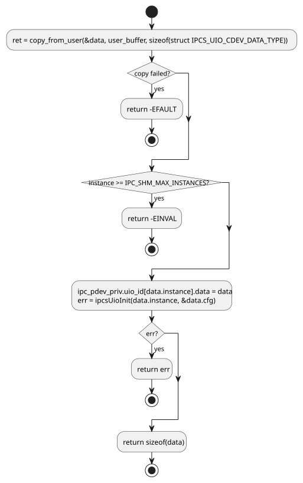

### 6.5.9 ipcsShmUioProbe

<table border="1" cellspacing="0" cellpadding="4">
<tbody>
<tr>
<td>对应软件架构ID</td>
<td colspan="4">Drv_Ipcs_Linux_Adapt_Cmp</td>
</tr>
<tr>
<td>软件单元 ID</td>
<td colspan="4">SWU_IPCS_LINUX_UIO_KO</td>
</tr>
<tr>
<td>函数说明</td>
<td colspan="4">平台驱动 probe，映射 核间中断控制器 资源并创建设备节点。</td>
</tr>
<tr>
<td>函数原型</td>
<td colspan="4">static int ipcsShmUioProbe(struct platform_device *pdev)</td>
</tr>
<tr>
<td>制约条件</td>
<td colspan="4">按 `ipcs/mpu/os_kernel/ipc-uio.c` 中的入参检查、实例状态和内核资源状态执行</td>
</tr>
<tr>
<td rowspan="2">输入/输出参数</td>
<td>I/O</td>
<td>参数名</td>
<td>数据类型</td>
<td>说明</td>
</tr>
<tr>
<td>I</td>
<td>pdev</td>
<td>struct platform_device *pdev</td>
<td>[IN] pdev</td>
</tr>
<tr>
<td rowspan="2">返回值</td>
<td colspan="2">数据类型</td>
<td colspan="2">说明</td>
</tr>
<tr>
<td colspan="2">int</td>
<td colspan="2">-</td>
</tr>
<tr>
<td>函数定义文件</td>
<td colspan="4">ipcs/mpu/os_kernel/ipc-uio.c</td>
</tr>
<tr>
<td>函数声明文件</td>
<td colspan="4">ipcs/mpu/os_kernel/ipc-uio.h</td>
</tr>
</tbody>
</table>

processing flow

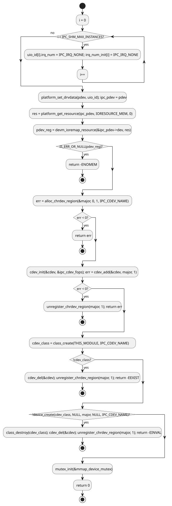

### 6.5.10 ipcsShmUioRemove

<table border="1" cellspacing="0" cellpadding="4">
<tbody>
<tr>
<td>对应软件架构ID</td>
<td colspan="4">Drv_Ipcs_Linux_Adapt_Cmp</td>
</tr>
<tr>
<td>软件单元 ID</td>
<td colspan="4">SWU_IPCS_LINUX_UIO_KO</td>
</tr>
<tr>
<td>函数说明</td>
<td colspan="4">平台驱动 remove，注销设备并释放 UIO 实例。</td>
</tr>
<tr>
<td>函数原型</td>
<td colspan="4">static int ipcsShmUioRemove(struct platform_device *pdev)</td>
</tr>
<tr>
<td>制约条件</td>
<td colspan="4">按 `ipcs/mpu/os_kernel/ipc-uio.c` 中的入参检查、实例状态和内核资源状态执行</td>
</tr>
<tr>
<td rowspan="2">输入/输出参数</td>
<td>I/O</td>
<td>参数名</td>
<td>数据类型</td>
<td>说明</td>
</tr>
<tr>
<td>I</td>
<td>pdev</td>
<td>struct platform_device *pdev</td>
<td>[IN] pdev</td>
</tr>
<tr>
<td rowspan="2">返回值</td>
<td colspan="2">数据类型</td>
<td colspan="2">说明</td>
</tr>
<tr>
<td colspan="2">int</td>
<td colspan="2">-</td>
</tr>
<tr>
<td>函数定义文件</td>
<td colspan="4">ipcs/mpu/os_kernel/ipc-uio.c</td>
</tr>
<tr>
<td>函数声明文件</td>
<td colspan="4">ipcs/mpu/os_kernel/ipc-uio.h</td>
</tr>
</tbody>
</table>

processing flow

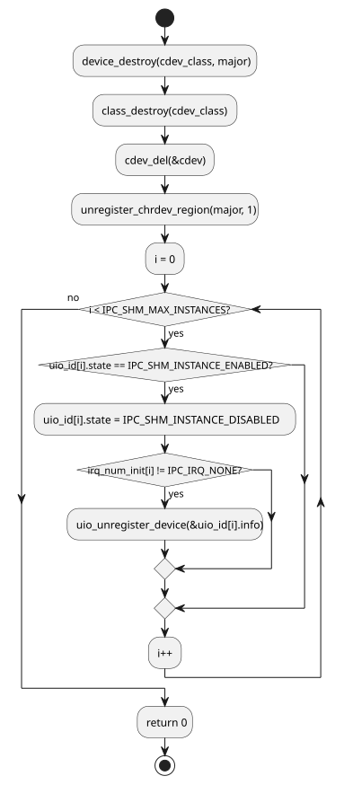

### 6.5.11 ipcsOsMapIntc

<table border="1" cellspacing="0" cellpadding="4">
<tbody>
<tr>
<td>对应软件架构ID</td>
<td colspan="4">Drv_Ipcs_Linux_Adapt_Cmp</td>
</tr>
<tr>
<td>软件单元 ID</td>
<td colspan="4">SWU_IPCS_LINUX_UIO_KO</td>
</tr>
<tr>
<td>函数说明</td>
<td colspan="4">映射或返回中断控制器寄存器空间。</td>
</tr>
<tr>
<td>函数原型</td>
<td colspan="4">void *ipcsOsMapIntc(void)</td>
</tr>
<tr>
<td>制约条件</td>
<td colspan="4">按 `ipcs/mpu/os_kernel/ipc-uio.c` 中的入参检查、实例状态和内核资源状态执行</td>
</tr>
<tr>
<td>输入/输出参数</td>
<td colspan="4">-</td>
</tr>
<tr>
<td rowspan="2">返回值</td>
<td colspan="2">数据类型</td>
<td colspan="2">说明</td>
</tr>
<tr>
<td colspan="2">void *</td>
<td colspan="2">-</td>
</tr>
<tr>
<td>函数定义文件</td>
<td colspan="4">ipcs/mpu/os_kernel/ipc-uio.c</td>
</tr>
<tr>
<td>函数声明文件</td>
<td colspan="4">ipcs/mpu/os_kernel/ipc-uio.h</td>
</tr>
</tbody>
</table>

processing flow

### 6.5.12 ipcsOsUnmapIntc

<table border="1" cellspacing="0" cellpadding="4">
<tbody>
<tr>
<td>对应软件架构ID</td>
<td colspan="4">Drv_Ipcs_Linux_Adapt_Cmp</td>
</tr>
<tr>
<td>软件单元 ID</td>
<td colspan="4">SWU_IPCS_LINUX_UIO_KO</td>
</tr>
<tr>
<td>函数说明</td>
<td colspan="4">释放中断控制器寄存器映射或提供对应空实现。</td>
</tr>
<tr>
<td>函数原型</td>
<td colspan="4">void ipcsOsUnmapIntc(void *addr)</td>
</tr>
<tr>
<td>制约条件</td>
<td colspan="4">按 `ipcs/mpu/os_kernel/ipc-uio.c` 中的入参检查、实例状态和内核资源状态执行</td>
</tr>
<tr>
<td rowspan="2">输入/输出参数</td>
<td>I/O</td>
<td>参数名</td>
<td>数据类型</td>
<td>说明</td>
</tr>
<tr>
<td>I</td>
<td>addr</td>
<td>void *addr</td>
<td>[IN] addr</td>
</tr>
<tr>
<td rowspan="2">返回值</td>
<td colspan="2">数据类型</td>
<td colspan="2">说明</td>
</tr>
<tr>
<td colspan="4">-</td>
</tr>
<tr>
<td>函数定义文件</td>
<td colspan="4">ipcs/mpu/os_kernel/ipc-uio.c</td>
</tr>
<tr>
<td>函数声明文件</td>
<td colspan="4">ipcs/mpu/os_kernel/ipc-uio.h</td>
</tr>
</tbody>
</table>

processing flow

## 6.6 SWU_IPCS_LINUX_OS_CDEV DESIGN 单元设计

### 6.6.1 ipcsOsInit

<table border="1" cellspacing="0" cellpadding="4">
<tbody>
<tr>
<td>对应软件架构ID</td>
<td colspan="4">Drv_Ipcs_Linux_Adapt_Cmp</td>
</tr>
<tr>
<td>软件单元 ID</td>
<td colspan="4">SWU_IPCS_LINUX_OS_CDEV</td>
</tr>
<tr>
<td>函数说明</td>
<td colspan="4">初始化指定实例的 Linux OSAL 资源，建立共享内存映射、记录回调并配置接收中断。</td>
</tr>
<tr>
<td>函数原型</td>
<td colspan="4">int ipcsOsInit(const uint8_t instance, const struct IPCS_SHM_CFG_TYPE *cfg, int (*rx_cb)(const uint8_t, int))</td>
</tr>
<tr>
<td>制约条件</td>
<td colspan="4">按 `ipcs/mpu/os_cdev/ipc-os.c` 中的入参检查、实例状态和内核资源状态执行</td>
</tr>
<tr>
<td rowspan="4">输入/输出参数</td>
<td>I/O</td>
<td>参数名</td>
<td>数据类型</td>
<td>说明</td>
</tr>
<tr>
<td>I</td>
<td>instance</td>
<td>const uint8_t instance</td>
<td>[IN] instance</td>
</tr>
<tr>
<td>I</td>
<td>cfg</td>
<td>const struct IPCS_SHM_CFG_TYPE *cfg</td>
<td>[IN] cfg</td>
</tr>
<tr>
<td>I</td>
<td>rx_cb</td>
<td>int (*rx_cb)(const uint8_t, int)</td>
<td>[IN] rx_cb</td>
</tr>
<tr>
<td rowspan="2">返回值</td>
<td colspan="2">数据类型</td>
<td colspan="2">说明</td>
</tr>
<tr>
<td colspan="2">int</td>
<td colspan="2">-</td>
</tr>
<tr>
<td>函数定义文件</td>
<td colspan="4">ipcs/mpu/os_cdev/ipc-os.c</td>
</tr>
<tr>
<td>函数声明文件</td>
<td colspan="4">ipcs/mpu/os_cdev/ipc-os.h</td>
</tr>
</tbody>
</table>

processing flow

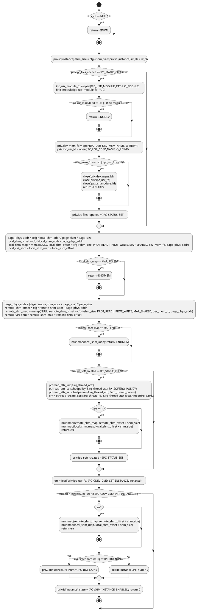

### 6.6.2 ipcsOsFree

<table border="1" cellspacing="0" cellpadding="4">
<tbody>
<tr>
<td>对应软件架构ID</td>
<td colspan="4">Drv_Ipcs_Linux_Adapt_Cmp</td>
</tr>
<tr>
<td>软件单元 ID</td>
<td colspan="4">SWU_IPCS_LINUX_OS_CDEV</td>
</tr>
<tr>
<td>函数说明</td>
<td colspan="4">释放指定实例 OSAL 资源，关闭线程/设备、解除映射并清理状态。</td>
</tr>
<tr>
<td>函数原型</td>
<td colspan="4">void ipcsOsFree(const uint8_t instance)</td>
</tr>
<tr>
<td>制约条件</td>
<td colspan="4">按 `ipcs/mpu/os_cdev/ipc-os.c` 中的入参检查、实例状态和内核资源状态执行</td>
</tr>
<tr>
<td rowspan="2">输入/输出参数</td>
<td>I/O</td>
<td>参数名</td>
<td>数据类型</td>
<td>说明</td>
</tr>
<tr>
<td>I</td>
<td>instance</td>
<td>const uint8_t instance</td>
<td>[IN] instance</td>
</tr>
<tr>
<td rowspan="2">返回值</td>
<td colspan="2">数据类型</td>
<td colspan="2">说明</td>
</tr>
<tr>
<td colspan="4">-</td>
</tr>
<tr>
<td>函数定义文件</td>
<td colspan="4">ipcs/mpu/os_cdev/ipc-os.c</td>
</tr>
<tr>
<td>函数声明文件</td>
<td colspan="4">ipcs/mpu/os_cdev/ipc-os.h</td>
</tr>
</tbody>
</table>

processing flow

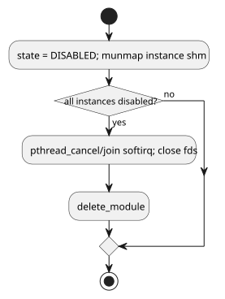

### 6.6.3 ipcsOsGetLocalShm

<table border="1" cellspacing="0" cellpadding="4">
<tbody>
<tr>
<td>对应软件架构ID</td>
<td colspan="4">Drv_Ipcs_Linux_Adapt_Cmp</td>
</tr>
<tr>
<td>软件单元 ID</td>
<td colspan="4">SWU_IPCS_LINUX_OS_CDEV</td>
</tr>
<tr>
<td>函数说明</td>
<td colspan="4">返回本地共享内存虚拟地址。</td>
</tr>
<tr>
<td>函数原型</td>
<td colspan="4">uintptr_t ipcsOsGetLocalShm(const uint8_t instance)</td>
</tr>
<tr>
<td>制约条件</td>
<td colspan="4">按 `ipcs/mpu/os_cdev/ipc-os.c` 中的入参检查、实例状态和内核资源状态执行</td>
</tr>
<tr>
<td rowspan="2">输入/输出参数</td>
<td>I/O</td>
<td>参数名</td>
<td>数据类型</td>
<td>说明</td>
</tr>
<tr>
<td>I</td>
<td>instance</td>
<td>const uint8_t instance</td>
<td>[IN] instance</td>
</tr>
<tr>
<td rowspan="2">返回值</td>
<td colspan="2">数据类型</td>
<td colspan="2">说明</td>
</tr>
<tr>
<td colspan="2">uintptr_t</td>
<td colspan="2">-</td>
</tr>
<tr>
<td>函数定义文件</td>
<td colspan="4">ipcs/mpu/os_cdev/ipc-os.c</td>
</tr>
<tr>
<td>函数声明文件</td>
<td colspan="4">ipcs/mpu/os_cdev/ipc-os.h</td>
</tr>
</tbody>
</table>

processing flow

### 6.6.4 ipcsOsGetRemoteShm

<table border="1" cellspacing="0" cellpadding="4">
<tbody>
<tr>
<td>对应软件架构ID</td>
<td colspan="4">Drv_Ipcs_Linux_Adapt_Cmp</td>
</tr>
<tr>
<td>软件单元 ID</td>
<td colspan="4">SWU_IPCS_LINUX_OS_CDEV</td>
</tr>
<tr>
<td>函数说明</td>
<td colspan="4">返回远端共享内存虚拟地址。</td>
</tr>
<tr>
<td>函数原型</td>
<td colspan="4">uintptr_t ipcsOsGetRemoteShm(const uint8_t instance)</td>
</tr>
<tr>
<td>制约条件</td>
<td colspan="4">按 `ipcs/mpu/os_cdev/ipc-os.c` 中的入参检查、实例状态和内核资源状态执行</td>
</tr>
<tr>
<td rowspan="2">输入/输出参数</td>
<td>I/O</td>
<td>参数名</td>
<td>数据类型</td>
<td>说明</td>
</tr>
<tr>
<td>I</td>
<td>instance</td>
<td>const uint8_t instance</td>
<td>[IN] instance</td>
</tr>
<tr>
<td rowspan="2">返回值</td>
<td colspan="2">数据类型</td>
<td colspan="2">说明</td>
</tr>
<tr>
<td colspan="2">uintptr_t</td>
<td colspan="2">-</td>
</tr>
<tr>
<td>函数定义文件</td>
<td colspan="4">ipcs/mpu/os_cdev/ipc-os.c</td>
</tr>
<tr>
<td>函数声明文件</td>
<td colspan="4">ipcs/mpu/os_cdev/ipc-os.h</td>
</tr>
</tbody>
</table>

processing flow

### 6.6.5 ipcsOsPollChannels

<table border="1" cellspacing="0" cellpadding="4">
<tbody>
<tr>
<td>对应软件架构ID</td>
<td colspan="4">Drv_Ipcs_Linux_Adapt_Cmp</td>
</tr>
<tr>
<td>软件单元 ID</td>
<td colspan="4">SWU_IPCS_LINUX_OS_CDEV</td>
</tr>
<tr>
<td>函数说明</td>
<td colspan="4">在轮询模式下触发 rx_cb 处理接收通道。</td>
</tr>
<tr>
<td>函数原型</td>
<td colspan="4">int ipcsOsPollChannels(const uint8_t instance)</td>
</tr>
<tr>
<td>制约条件</td>
<td colspan="4">按 `ipcs/mpu/os_cdev/ipc-os.c` 中的入参检查、实例状态和内核资源状态执行</td>
</tr>
<tr>
<td rowspan="2">输入/输出参数</td>
<td>I/O</td>
<td>参数名</td>
<td>数据类型</td>
<td>说明</td>
</tr>
<tr>
<td>I</td>
<td>instance</td>
<td>const uint8_t instance</td>
<td>[IN] instance</td>
</tr>
<tr>
<td rowspan="2">返回值</td>
<td colspan="2">数据类型</td>
<td colspan="2">说明</td>
</tr>
<tr>
<td colspan="2">int</td>
<td colspan="2">-</td>
</tr>
<tr>
<td>函数定义文件</td>
<td colspan="4">ipcs/mpu/os_cdev/ipc-os.c</td>
</tr>
<tr>
<td>函数声明文件</td>
<td colspan="4">ipcs/mpu/os_cdev/ipc-os.h</td>
</tr>
</tbody>
</table>

processing flow

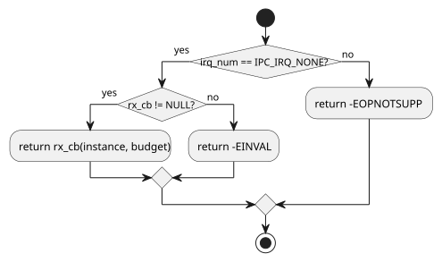

### 6.6.6 ipcsHwIrqEnable

<table border="1" cellspacing="0" cellpadding="4">
<tbody>
<tr>
<td>对应软件架构ID</td>
<td colspan="4">Drv_Ipcs_Linux_Adapt_Cmp</td>
</tr>
<tr>
<td>软件单元 ID</td>
<td colspan="4">SWU_IPCS_LINUX_OS_CDEV</td>
</tr>
<tr>
<td>函数说明</td>
<td colspan="4">使能指定实例接收中断；用户侧为转发代理，内核侧访问硬件。</td>
</tr>
<tr>
<td>函数原型</td>
<td colspan="4">void ipcsHwIrqEnable(const uint8_t instance)</td>
</tr>
<tr>
<td>制约条件</td>
<td colspan="4">按 `ipcs/mpu/os_cdev/ipc-os.c` 中的入参检查、实例状态和内核资源状态执行</td>
</tr>
<tr>
<td rowspan="2">输入/输出参数</td>
<td>I/O</td>
<td>参数名</td>
<td>数据类型</td>
<td>说明</td>
</tr>
<tr>
<td>I</td>
<td>instance</td>
<td>const uint8_t instance</td>
<td>[IN] instance</td>
</tr>
<tr>
<td rowspan="2">返回值</td>
<td colspan="2">数据类型</td>
<td colspan="2">说明</td>
</tr>
<tr>
<td colspan="4">-</td>
</tr>
<tr>
<td>函数定义文件</td>
<td colspan="4">ipcs/mpu/os_cdev/ipc-os.c</td>
</tr>
<tr>
<td>函数声明文件</td>
<td colspan="4">ipcs/mpu/os_cdev/ipc-os.h</td>
</tr>
</tbody>
</table>

processing flow

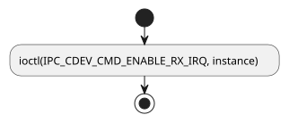

### 6.6.7 ipcsHwIrqDisable

<table border="1" cellspacing="0" cellpadding="4">
<tbody>
<tr>
<td>对应软件架构ID</td>
<td colspan="4">Drv_Ipcs_Linux_Adapt_Cmp</td>
</tr>
<tr>
<td>软件单元 ID</td>
<td colspan="4">SWU_IPCS_LINUX_OS_CDEV</td>
</tr>
<tr>
<td>函数说明</td>
<td colspan="4">禁止指定实例接收中断；用户侧为转发代理，内核侧访问硬件。</td>
</tr>
<tr>
<td>函数原型</td>
<td colspan="4">void ipcsHwIrqDisable(const uint8_t instance)</td>
</tr>
<tr>
<td>制约条件</td>
<td colspan="4">按 `ipcs/mpu/os_cdev/ipc-os.c` 中的入参检查、实例状态和内核资源状态执行</td>
</tr>
<tr>
<td rowspan="2">输入/输出参数</td>
<td>I/O</td>
<td>参数名</td>
<td>数据类型</td>
<td>说明</td>
</tr>
<tr>
<td>I</td>
<td>instance</td>
<td>const uint8_t instance</td>
<td>[IN] instance</td>
</tr>
<tr>
<td rowspan="2">返回值</td>
<td colspan="2">数据类型</td>
<td colspan="2">说明</td>
</tr>
<tr>
<td colspan="4">-</td>
</tr>
<tr>
<td>函数定义文件</td>
<td colspan="4">ipcs/mpu/os_cdev/ipc-os.c</td>
</tr>
<tr>
<td>函数声明文件</td>
<td colspan="4">ipcs/mpu/os_cdev/ipc-os.h</td>
</tr>
</tbody>
</table>

processing flow

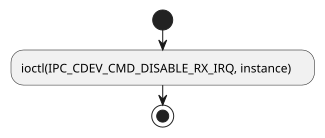

### 6.6.8 ipcsHwIrqNotify

<table border="1" cellspacing="0" cellpadding="4">
<tbody>
<tr>
<td>对应软件架构ID</td>
<td colspan="4">Drv_Ipcs_Linux_Adapt_Cmp</td>
</tr>
<tr>
<td>软件单元 ID</td>
<td colspan="4">SWU_IPCS_LINUX_OS_CDEV</td>
</tr>
<tr>
<td>函数说明</td>
<td colspan="4">通知远端有数据可用；用户侧为转发代理，内核侧触发硬件中断。</td>
</tr>
<tr>
<td>函数原型</td>
<td colspan="4">void ipcsHwIrqNotify(const uint8_t instance)</td>
</tr>
<tr>
<td>制约条件</td>
<td colspan="4">按 `ipcs/mpu/os_cdev/ipc-os.c` 中的入参检查、实例状态和内核资源状态执行</td>
</tr>
<tr>
<td rowspan="2">输入/输出参数</td>
<td>I/O</td>
<td>参数名</td>
<td>数据类型</td>
<td>说明</td>
</tr>
<tr>
<td>I</td>
<td>instance</td>
<td>const uint8_t instance</td>
<td>[IN] instance</td>
</tr>
<tr>
<td rowspan="2">返回值</td>
<td colspan="2">数据类型</td>
<td colspan="2">说明</td>
</tr>
<tr>
<td colspan="4">-</td>
</tr>
<tr>
<td>函数定义文件</td>
<td colspan="4">ipcs/mpu/os_cdev/ipc-os.c</td>
</tr>
<tr>
<td>函数声明文件</td>
<td colspan="4">ipcs/mpu/os_cdev/ipc-os.h</td>
</tr>
</tbody>
</table>

processing flow

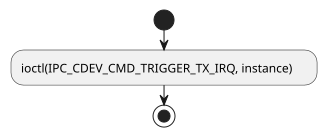

### 6.6.9 ipcsHwInit

<table border="1" cellspacing="0" cellpadding="4">
<tbody>
<tr>
<td>对应软件架构ID</td>
<td colspan="4">Drv_Ipcs_Linux_Adapt_Cmp</td>
</tr>
<tr>
<td>软件单元 ID</td>
<td colspan="4">SWU_IPCS_LINUX_OS_CDEV</td>
</tr>
<tr>
<td>函数说明</td>
<td colspan="4">初始化 HAL 资源；用户侧为空实现，内核侧映射并配置 核间中断控制器/IRQ。</td>
</tr>
<tr>
<td>函数原型</td>
<td colspan="4">int ipcsHwInit(const uint8_t instance, const struct IPCS_SHM_CFG_TYPE *cfg)</td>
</tr>
<tr>
<td>制约条件</td>
<td colspan="4">按 `ipcs/mpu/os_cdev/ipc-os.c` 中的入参检查、实例状态和内核资源状态执行</td>
</tr>
<tr>
<td rowspan="3">输入/输出参数</td>
<td>I/O</td>
<td>参数名</td>
<td>数据类型</td>
<td>说明</td>
</tr>
<tr>
<td>I</td>
<td>instance</td>
<td>const uint8_t instance</td>
<td>[IN] instance</td>
</tr>
<tr>
<td>I</td>
<td>cfg</td>
<td>const struct IPCS_SHM_CFG_TYPE *cfg</td>
<td>[IN] cfg</td>
</tr>
<tr>
<td rowspan="2">返回值</td>
<td colspan="2">数据类型</td>
<td colspan="2">说明</td>
</tr>
<tr>
<td colspan="2">int</td>
<td colspan="2">-</td>
</tr>
<tr>
<td>函数定义文件</td>
<td colspan="4">ipcs/mpu/os_cdev/ipc-os.c</td>
</tr>
<tr>
<td>函数声明文件</td>
<td colspan="4">ipcs/mpu/os_cdev/ipc-os.h</td>
</tr>
</tbody>
</table>

processing flow

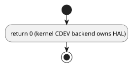

### 6.6.10 ipcsHwFree

<table border="1" cellspacing="0" cellpadding="4">
<tbody>
<tr>
<td>对应软件架构ID</td>
<td colspan="4">Drv_Ipcs_Linux_Adapt_Cmp</td>
</tr>
<tr>
<td>软件单元 ID</td>
<td colspan="4">SWU_IPCS_LINUX_OS_CDEV</td>
</tr>
<tr>
<td>函数说明</td>
<td colspan="4">释放 HAL 资源；用户侧为空实现，内核侧释放映射状态。</td>
</tr>
<tr>
<td>函数原型</td>
<td colspan="4">void ipcsHwFree(const uint8_t instance)</td>
</tr>
<tr>
<td>制约条件</td>
<td colspan="4">按 `ipcs/mpu/os_cdev/ipc-os.c` 中的入参检查、实例状态和内核资源状态执行</td>
</tr>
<tr>
<td rowspan="2">输入/输出参数</td>
<td>I/O</td>
<td>参数名</td>
<td>数据类型</td>
<td>说明</td>
</tr>
<tr>
<td>I</td>
<td>instance</td>
<td>const uint8_t instance</td>
<td>[IN] instance</td>
</tr>
<tr>
<td rowspan="2">返回值</td>
<td colspan="2">数据类型</td>
<td colspan="2">说明</td>
</tr>
<tr>
<td colspan="4">-</td>
</tr>
<tr>
<td>函数定义文件</td>
<td colspan="4">ipcs/mpu/os_cdev/ipc-os.c</td>
</tr>
<tr>
<td>函数声明文件</td>
<td colspan="4">ipcs/mpu/os_cdev/ipc-os.h</td>
</tr>
</tbody>
</table>

processing flow

## 6.7 SWU_IPCS_LINUX_CDEV_KO DESIGN 单元设计

### 6.7.1 ipcsShmHardirq

<table border="1" cellspacing="0" cellpadding="4">
<tbody>
<tr>
<td>对应软件架构ID</td>
<td colspan="4">Drv_Ipcs_Linux_Adapt_Cmp</td>
</tr>
<tr>
<td>软件单元 ID</td>
<td colspan="4">SWU_IPCS_LINUX_CDEV_KO</td>
</tr>
<tr>
<td>函数说明</td>
<td colspan="4">硬中断处理，禁止并清除远端通知，中断后续处理交给 tasklet 或等待队列。</td>
</tr>
<tr>
<td>函数原型</td>
<td colspan="4">static irqreturn_t ipcsShmHardirq(int irq, void *dev)</td>
</tr>
<tr>
<td>制约条件</td>
<td colspan="4">按 `ipcs/mpu/os_kernel/ipc-cdev.c` 中的入参检查、实例状态和内核资源状态执行</td>
</tr>
<tr>
<td rowspan="3">输入/输出参数</td>
<td>I/O</td>
<td>参数名</td>
<td>数据类型</td>
<td>说明</td>
</tr>
<tr>
<td>I</td>
<td>irq</td>
<td>int irq</td>
<td>[IN] irq</td>
</tr>
<tr>
<td>I</td>
<td>dev</td>
<td>void *dev</td>
<td>[IN] dev</td>
</tr>
<tr>
<td rowspan="2">返回值</td>
<td colspan="2">数据类型</td>
<td colspan="2">说明</td>
</tr>
<tr>
<td colspan="2">irqreturn_t</td>
<td colspan="2">-</td>
</tr>
<tr>
<td>函数定义文件</td>
<td colspan="4">ipcs/mpu/os_kernel/ipc-cdev.c</td>
</tr>
<tr>
<td>函数声明文件</td>
<td colspan="4">ipcs/mpu/os_kernel/ipc-cdev.h</td>
</tr>
</tbody>
</table>

processing flow

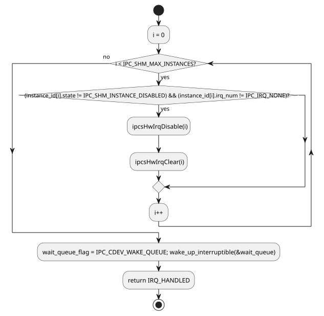

### 6.7.2 ipcsOsMapIntc

<table border="1" cellspacing="0" cellpadding="4">
<tbody>
<tr>
<td>对应软件架构ID</td>
<td colspan="4">Drv_Ipcs_Linux_Adapt_Cmp</td>
</tr>
<tr>
<td>软件单元 ID</td>
<td colspan="4">SWU_IPCS_LINUX_CDEV_KO</td>
</tr>
<tr>
<td>函数说明</td>
<td colspan="4">映射或返回中断控制器寄存器空间。</td>
</tr>
<tr>
<td>函数原型</td>
<td colspan="4">void *ipcsOsMapIntc(void)</td>
</tr>
<tr>
<td>制约条件</td>
<td colspan="4">按 `ipcs/mpu/os_kernel/ipc-cdev.c` 中的入参检查、实例状态和内核资源状态执行</td>
</tr>
<tr>
<td>输入/输出参数</td>
<td colspan="4">-</td>
</tr>
<tr>
<td rowspan="2">返回值</td>
<td colspan="2">数据类型</td>
<td colspan="2">说明</td>
</tr>
<tr>
<td colspan="2">void *</td>
<td colspan="2">-</td>
</tr>
<tr>
<td>函数定义文件</td>
<td colspan="4">ipcs/mpu/os_kernel/ipc-cdev.c</td>
</tr>
<tr>
<td>函数声明文件</td>
<td colspan="4">ipcs/mpu/os_kernel/ipc-cdev.h</td>
</tr>
</tbody>
</table>

processing flow

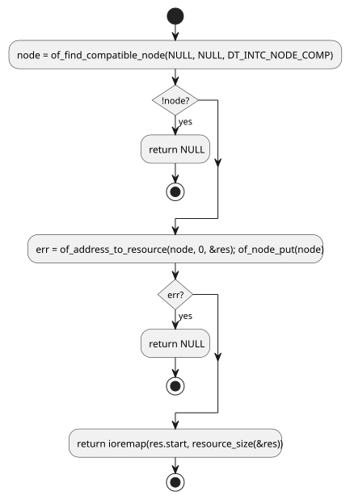

### 6.7.3 ipcsOsUnmapIntc

<table border="1" cellspacing="0" cellpadding="4">
<tbody>
<tr>
<td>对应软件架构ID</td>
<td colspan="4">Drv_Ipcs_Linux_Adapt_Cmp</td>
</tr>
<tr>
<td>软件单元 ID</td>
<td colspan="4">SWU_IPCS_LINUX_CDEV_KO</td>
</tr>
<tr>
<td>函数说明</td>
<td colspan="4">释放中断控制器寄存器映射或提供对应空实现。</td>
</tr>
<tr>
<td>函数原型</td>
<td colspan="4">void ipcsOsUnmapIntc(void *addr)</td>
</tr>
<tr>
<td>制约条件</td>
<td colspan="4">按 `ipcs/mpu/os_kernel/ipc-cdev.c` 中的入参检查、实例状态和内核资源状态执行</td>
</tr>
<tr>
<td rowspan="2">输入/输出参数</td>
<td>I/O</td>
<td>参数名</td>
<td>数据类型</td>
<td>说明</td>
</tr>
<tr>
<td>I</td>
<td>addr</td>
<td>void *addr</td>
<td>[IN] addr</td>
</tr>
<tr>
<td rowspan="2">返回值</td>
<td colspan="2">数据类型</td>
<td colspan="2">说明</td>
</tr>
<tr>
<td colspan="4">-</td>
</tr>
<tr>
<td>函数定义文件</td>
<td colspan="4">ipcs/mpu/os_kernel/ipc-cdev.c</td>
</tr>
<tr>
<td>函数声明文件</td>
<td colspan="4">ipcs/mpu/os_kernel/ipc-cdev.h</td>
</tr>
</tbody>
</table>

processing flow

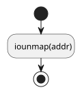

### 6.7.4 ipcsCdevOpen

<table border="1" cellspacing="0" cellpadding="4">
<tbody>
<tr>
<td>对应软件架构ID</td>
<td colspan="4">Drv_Ipcs_Linux_Adapt_Cmp</td>
</tr>
<tr>
<td>软件单元 ID</td>
<td colspan="4">SWU_IPCS_LINUX_CDEV_KO</td>
</tr>
<tr>
<td>函数说明</td>
<td colspan="4">处理字符设备打开请求。</td>
</tr>
<tr>
<td>函数原型</td>
<td colspan="4">static int ipcsCdevOpen(struct inode *inode, struct file *file)</td>
</tr>
<tr>
<td>制约条件</td>
<td colspan="4">按 `ipcs/mpu/os_kernel/ipc-cdev.c` 中的入参检查、实例状态和内核资源状态执行</td>
</tr>
<tr>
<td rowspan="3">输入/输出参数</td>
<td>I/O</td>
<td>参数名</td>
<td>数据类型</td>
<td>说明</td>
</tr>
<tr>
<td>I</td>
<td>inode</td>
<td>struct inode *inode</td>
<td>[IN] inode</td>
</tr>
<tr>
<td>I</td>
<td>file</td>
<td>struct file *file</td>
<td>[IN] file</td>
</tr>
<tr>
<td rowspan="2">返回值</td>
<td colspan="2">数据类型</td>
<td colspan="2">说明</td>
</tr>
<tr>
<td colspan="2">int</td>
<td colspan="2">-</td>
</tr>
<tr>
<td>函数定义文件</td>
<td colspan="4">ipcs/mpu/os_kernel/ipc-cdev.c</td>
</tr>
<tr>
<td>函数声明文件</td>
<td colspan="4">ipcs/mpu/os_kernel/ipc-cdev.h</td>
</tr>
</tbody>
</table>

processing flow

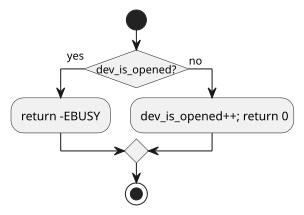

### 6.7.5 ipcsCdevRelease

<table border="1" cellspacing="0" cellpadding="4">
<tbody>
<tr>
<td>对应软件架构ID</td>
<td colspan="4">Drv_Ipcs_Linux_Adapt_Cmp</td>
</tr>
<tr>
<td>软件单元 ID</td>
<td colspan="4">SWU_IPCS_LINUX_CDEV_KO</td>
</tr>
<tr>
<td>函数说明</td>
<td colspan="4">处理字符设备关闭请求。</td>
</tr>
<tr>
<td>函数原型</td>
<td colspan="4">static int ipcsCdevRelease(struct inode *inode, struct file *file)</td>
</tr>
<tr>
<td>制约条件</td>
<td colspan="4">按 `ipcs/mpu/os_kernel/ipc-cdev.c` 中的入参检查、实例状态和内核资源状态执行</td>
</tr>
<tr>
<td rowspan="3">输入/输出参数</td>
<td>I/O</td>
<td>参数名</td>
<td>数据类型</td>
<td>说明</td>
</tr>
<tr>
<td>I</td>
<td>inode</td>
<td>struct inode *inode</td>
<td>[IN] inode</td>
</tr>
<tr>
<td>I</td>
<td>file</td>
<td>struct file *file</td>
<td>[IN] file</td>
</tr>
<tr>
<td rowspan="2">返回值</td>
<td colspan="2">数据类型</td>
<td colspan="2">说明</td>
</tr>
<tr>
<td colspan="2">int</td>
<td colspan="2">-</td>
</tr>
<tr>
<td>函数定义文件</td>
<td colspan="4">ipcs/mpu/os_kernel/ipc-cdev.c</td>
</tr>
<tr>
<td>函数声明文件</td>
<td colspan="4">ipcs/mpu/os_kernel/ipc-cdev.h</td>
</tr>
</tbody>
</table>

processing flow

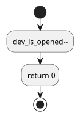

### 6.7.6 ipcsCdevRead

<table border="1" cellspacing="0" cellpadding="4">
<tbody>
<tr>
<td>对应软件架构ID</td>
<td colspan="4">Drv_Ipcs_Linux_Adapt_Cmp</td>
</tr>
<tr>
<td>软件单元 ID</td>
<td colspan="4">SWU_IPCS_LINUX_CDEV_KO</td>
</tr>
<tr>
<td>函数说明</td>
<td colspan="4">阻塞等待内核接收中断唤醒。</td>
</tr>
<tr>
<td>函数原型</td>
<td colspan="4">static ssize_t ipcsCdevRead(struct file *file, char __user *user_buffer, size_t size, loff_t *offset)</td>
</tr>
<tr>
<td>制约条件</td>
<td colspan="4">按 `ipcs/mpu/os_kernel/ipc-cdev.c` 中的入参检查、实例状态和内核资源状态执行</td>
</tr>
<tr>
<td rowspan="5">输入/输出参数</td>
<td>I/O</td>
<td>参数名</td>
<td>数据类型</td>
<td>说明</td>
</tr>
<tr>
<td>I</td>
<td>file</td>
<td>struct file *file</td>
<td>[IN] file</td>
</tr>
<tr>
<td>I</td>
<td>user_buffer</td>
<td>char __user *user_buffer</td>
<td>[IN] user_buffer</td>
</tr>
<tr>
<td>I</td>
<td>size</td>
<td>size_t size</td>
<td>[IN] size</td>
</tr>
<tr>
<td>I</td>
<td>offset</td>
<td>loff_t *offset</td>
<td>[IN] offset</td>
</tr>
<tr>
<td rowspan="2">返回值</td>
<td colspan="2">数据类型</td>
<td colspan="2">说明</td>
</tr>
<tr>
<td colspan="2">ssize_t</td>
<td colspan="2">-</td>
</tr>
<tr>
<td>函数定义文件</td>
<td colspan="4">ipcs/mpu/os_kernel/ipc-cdev.c</td>
</tr>
<tr>
<td>函数声明文件</td>
<td colspan="4">ipcs/mpu/os_kernel/ipc-cdev.h</td>
</tr>
</tbody>
</table>

processing flow

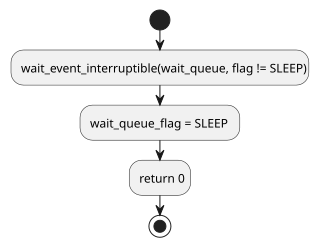

### 6.7.7 ipcsCdevOsInit

<table border="1" cellspacing="0" cellpadding="4">
<tbody>
<tr>
<td>对应软件架构ID</td>
<td colspan="4">Drv_Ipcs_Linux_Adapt_Cmp</td>
</tr>
<tr>
<td>软件单元 ID</td>
<td colspan="4">SWU_IPCS_LINUX_CDEV_KO</td>
</tr>
<tr>
<td>函数说明</td>
<td colspan="4">初始化 CDEV 后端实例、HAL 和接收 IRQ。</td>
</tr>
<tr>
<td>函数原型</td>
<td colspan="4">static int ipcsCdevOsInit(const uint8_t instance, const struct IPCS_SHM_CFG_TYPE *cfg)</td>
</tr>
<tr>
<td>制约条件</td>
<td colspan="4">按 `ipcs/mpu/os_kernel/ipc-cdev.c` 中的入参检查、实例状态和内核资源状态执行</td>
</tr>
<tr>
<td rowspan="3">输入/输出参数</td>
<td>I/O</td>
<td>参数名</td>
<td>数据类型</td>
<td>说明</td>
</tr>
<tr>
<td>I</td>
<td>instance</td>
<td>const uint8_t instance</td>
<td>[IN] instance</td>
</tr>
<tr>
<td>I</td>
<td>cfg</td>
<td>const struct IPCS_SHM_CFG_TYPE *cfg</td>
<td>[IN] cfg</td>
</tr>
<tr>
<td rowspan="2">返回值</td>
<td colspan="2">数据类型</td>
<td colspan="2">说明</td>
</tr>
<tr>
<td colspan="2">int</td>
<td colspan="2">-</td>
</tr>
<tr>
<td>函数定义文件</td>
<td colspan="4">ipcs/mpu/os_kernel/ipc-cdev.c</td>
</tr>
<tr>
<td>函数声明文件</td>
<td colspan="4">ipcs/mpu/os_kernel/ipc-cdev.h</td>
</tr>
</tbody>
</table>

processing flow

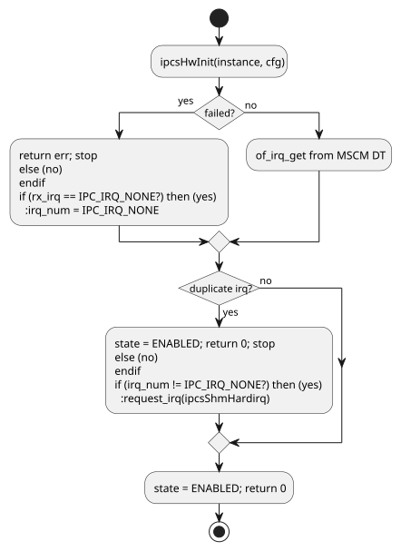

### 6.7.8 ipcsCdevIoctl

<table border="1" cellspacing="0" cellpadding="4">
<tbody>
<tr>
<td>对应软件架构ID</td>
<td colspan="4">Drv_Ipcs_Linux_Adapt_Cmp</td>
</tr>
<tr>
<td>软件单元 ID</td>
<td colspan="4">SWU_IPCS_LINUX_CDEV_KO</td>
</tr>
<tr>
<td>函数说明</td>
<td colspan="4">处理 CDEV 用户侧 ioctl 命令，包括实例初始化和 IRQ 操作代理。</td>
</tr>
<tr>
<td>函数原型</td>
<td colspan="4">static long ipcsCdevIoctl(struct file *file, unsigned int ioctl_cmd, unsigned long ioctl_arg)</td>
</tr>
<tr>
<td>制约条件</td>
<td colspan="4">按 `ipcs/mpu/os_kernel/ipc-cdev.c` 中的入参检查、实例状态和内核资源状态执行</td>
</tr>
<tr>
<td rowspan="4">输入/输出参数</td>
<td>I/O</td>
<td>参数名</td>
<td>数据类型</td>
<td>说明</td>
</tr>
<tr>
<td>I</td>
<td>file</td>
<td>struct file *file</td>
<td>[IN] file</td>
</tr>
<tr>
<td>I</td>
<td>ioctl_cmd</td>
<td>unsigned int ioctl_cmd</td>
<td>[IN] ioctl_cmd</td>
</tr>
<tr>
<td>I</td>
<td>ioctl_arg</td>
<td>unsigned long ioctl_arg</td>
<td>[IN] ioctl_arg</td>
</tr>
<tr>
<td rowspan="2">返回值</td>
<td colspan="2">数据类型</td>
<td colspan="2">说明</td>
</tr>
<tr>
<td colspan="2">long</td>
<td colspan="2">-</td>
</tr>
<tr>
<td>函数定义文件</td>
<td colspan="4">ipcs/mpu/os_kernel/ipc-cdev.c</td>
</tr>
<tr>
<td>函数声明文件</td>
<td colspan="4">ipcs/mpu/os_kernel/ipc-cdev.h</td>
</tr>
</tbody>
</table>

processing flow

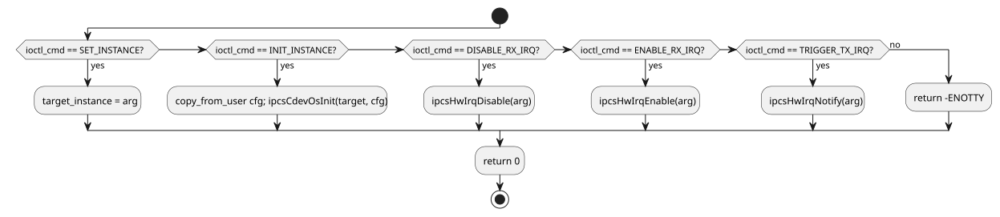

### 6.7.9 ipcsCdevInit

<table border="1" cellspacing="0" cellpadding="4">
<tbody>
<tr>
<td>对应软件架构ID</td>
<td colspan="4">Drv_Ipcs_Linux_Adapt_Cmp</td>
</tr>
<tr>
<td>软件单元 ID</td>
<td colspan="4">SWU_IPCS_LINUX_CDEV_KO</td>
</tr>
<tr>
<td>函数说明</td>
<td colspan="4">CDEV 模块初始化，创建字符设备和 wait queue。</td>
</tr>
<tr>
<td>函数原型</td>
<td colspan="4">static int ipcsCdevInit(void)</td>
</tr>
<tr>
<td>制约条件</td>
<td colspan="4">按 `ipcs/mpu/os_kernel/ipc-cdev.c` 中的入参检查、实例状态和内核资源状态执行</td>
</tr>
<tr>
<td>输入/输出参数</td>
<td colspan="4">-</td>
</tr>
<tr>
<td rowspan="2">返回值</td>
<td colspan="2">数据类型</td>
<td colspan="2">说明</td>
</tr>
<tr>
<td colspan="2">int</td>
<td colspan="2">-</td>
</tr>
<tr>
<td>函数定义文件</td>
<td colspan="4">ipcs/mpu/os_kernel/ipc-cdev.c</td>
</tr>
<tr>
<td>函数声明文件</td>
<td colspan="4">ipcs/mpu/os_kernel/ipc-cdev.h</td>
</tr>
</tbody>
</table>

processing flow

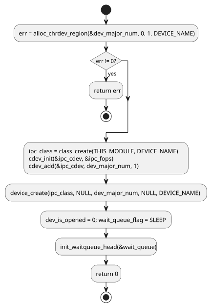

### 6.7.10 ipcsCdevClean

<table border="1" cellspacing="0" cellpadding="4">
<tbody>
<tr>
<td>对应软件架构ID</td>
<td colspan="4">Drv_Ipcs_Linux_Adapt_Cmp</td>
</tr>
<tr>
<td>软件单元 ID</td>
<td colspan="4">SWU_IPCS_LINUX_CDEV_KO</td>
</tr>
<tr>
<td>函数说明</td>
<td colspan="4">CDEV 模块清理，禁止 IRQ、释放中断并销毁字符设备。</td>
</tr>
<tr>
<td>函数原型</td>
<td colspan="4">static void ipcsCdevClean(void)</td>
</tr>
<tr>
<td>制约条件</td>
<td colspan="4">按 `ipcs/mpu/os_kernel/ipc-cdev.c` 中的入参检查、实例状态和内核资源状态执行</td>
</tr>
<tr>
<td>输入/输出参数</td>
<td colspan="4">-</td>
</tr>
<tr>
<td rowspan="2">返回值</td>
<td colspan="2">数据类型</td>
<td colspan="2">说明</td>
</tr>
<tr>
<td colspan="4">-</td>
</tr>
<tr>
<td>函数定义文件</td>
<td colspan="4">ipcs/mpu/os_kernel/ipc-cdev.c</td>
</tr>
<tr>
<td>函数声明文件</td>
<td colspan="4">ipcs/mpu/os_kernel/ipc-cdev.h</td>
</tr>
</tbody>
</table>

processing flow

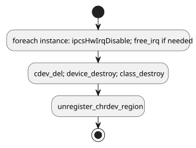

## 6.8 SWU_IPCS_HAL_LINUX DESIGN 单元设计

Linux 内核侧 HAL，完成 核间中断控制器 映射、核索引解析、IRQ 使能/禁止/通知/清除等硬件操作。

### 6.8.1 ipcsHwGetRxIrq

<table border="1" cellspacing="0" cellpadding="4">
<tbody>
<tr>
<td>对应软件架构ID</td>
<td colspan="4">Drv_Ipcs_Hal_Cmp</td>
</tr>
<tr>
<td>软件单元 ID</td>
<td colspan="4">SWU_IPCS_HAL_LINUX</td>
</tr>
<tr>
<td>函数说明</td>
<td colspan="4">返回指定实例使用的 核间中断控制器 接收中断索引。</td>
</tr>
<tr>
<td>函数原型</td>
<td colspan="4">int ipcsHwGetRxIrq(const uint8_t instance)</td>
</tr>
<tr>
<td>制约条件</td>
<td colspan="4">按 `ipcs/mpu/hw/c1/ipc-hw.c` 中的入参检查、实例状态和内核资源状态执行</td>
</tr>
<tr>
<td rowspan="2">输入/输出参数</td>
<td>I/O</td>
<td>参数名</td>
<td>数据类型</td>
<td>说明</td>
</tr>
<tr>
<td>I</td>
<td>instance</td>
<td>const uint8_t instance</td>
<td>[IN] instance</td>
</tr>
<tr>
<td rowspan="2">返回值</td>
<td colspan="2">数据类型</td>
<td colspan="2">说明</td>
</tr>
<tr>
<td colspan="2">int</td>
<td colspan="2">-</td>
</tr>
<tr>
<td>函数定义文件</td>
<td colspan="4">ipcs/mpu/hw/c1/ipc-hw.c</td>
</tr>
<tr>
<td>函数声明文件</td>
<td colspan="4">ipcs/mpu/hw/ipc-hw.h</td>
</tr>
</tbody>
</table>

processing flow

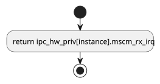

### 6.8.2 ipcsHwInit

<table border="1" cellspacing="0" cellpadding="4">
<tbody>
<tr>
<td>对应软件架构ID</td>
<td colspan="4">Drv_Ipcs_Hal_Cmp</td>
</tr>
<tr>
<td>软件单元 ID</td>
<td colspan="4">SWU_IPCS_HAL_LINUX</td>
</tr>
<tr>
<td>函数说明</td>
<td colspan="4">初始化 HAL 资源；用户侧为空实现，内核侧映射并配置 核间中断控制器/IRQ。</td>
</tr>
<tr>
<td>函数原型</td>
<td colspan="4">int ipcsHwInit(const uint8_t instance, const struct IPCS_SHM_CFG_TYPE *cfg)</td>
</tr>
<tr>
<td>制约条件</td>
<td colspan="4">按 `ipcs/mpu/hw/c1/ipc-hw.c` 中的入参检查、实例状态和内核资源状态执行</td>
</tr>
<tr>
<td rowspan="3">输入/输出参数</td>
<td>I/O</td>
<td>参数名</td>
<td>数据类型</td>
<td>说明</td>
</tr>
<tr>
<td>I</td>
<td>instance</td>
<td>const uint8_t instance</td>
<td>[IN] instance</td>
</tr>
<tr>
<td>I</td>
<td>cfg</td>
<td>const struct IPCS_SHM_CFG_TYPE *cfg</td>
<td>[IN] cfg</td>
</tr>
<tr>
<td rowspan="2">返回值</td>
<td colspan="2">数据类型</td>
<td colspan="2">说明</td>
</tr>
<tr>
<td colspan="2">int</td>
<td colspan="2">-</td>
</tr>
<tr>
<td>函数定义文件</td>
<td colspan="4">ipcs/mpu/hw/c1/ipc-hw.c</td>
</tr>
<tr>
<td>函数声明文件</td>
<td colspan="4">ipcs/mpu/hw/ipc-hw.h</td>
</tr>
</tbody>
</table>

processing flow

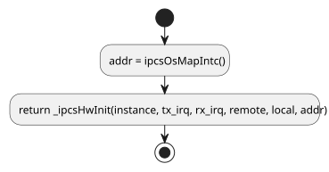

### 6.8.3 _ipcsHwInit

<table border="1" cellspacing="0" cellpadding="4">
<tbody>
<tr>
<td>对应软件架构ID</td>
<td colspan="4">Drv_Ipcs_Hal_Cmp</td>
</tr>
<tr>
<td>软件单元 ID</td>
<td colspan="4">SWU_IPCS_HAL_LINUX</td>
</tr>
<tr>
<td>函数说明</td>
<td colspan="4">HAL 底层初始化，供 Linux UIO 等内核路径复用。</td>
</tr>
<tr>
<td>函数原型</td>
<td colspan="4">int _ipcsHwInit(const uint8_t instance, int tx_irq, int rx_irq, const struct IPCS_SHM_REMOTE_CORE_TYPE *remote_core, const struct IPCS_SHM_LOCAL_CORE_TYPE *local_core, void *mscm_addr)</td>
</tr>
<tr>
<td>制约条件</td>
<td colspan="4">按 `ipcs/mpu/hw/c1/ipc-hw.c` 中的入参检查、实例状态和内核资源状态执行</td>
</tr>
<tr>
<td rowspan="7">输入/输出参数</td>
<td>I/O</td>
<td>参数名</td>
<td>数据类型</td>
<td>说明</td>
</tr>
<tr>
<td>I</td>
<td>instance</td>
<td>const uint8_t instance</td>
<td>[IN] instance</td>
</tr>
<tr>
<td>I</td>
<td>tx_irq</td>
<td>int tx_irq</td>
<td>[IN] tx_irq</td>
</tr>
<tr>
<td>I</td>
<td>rx_irq</td>
<td>int rx_irq</td>
<td>[IN] rx_irq</td>
</tr>
<tr>
<td>I</td>
<td>remote_core</td>
<td>const struct IPCS_SHM_REMOTE_CORE_TYPE *remote_core</td>
<td>[IN] remote_core</td>
</tr>
<tr>
<td>I</td>
<td>local_core</td>
<td>const struct IPCS_SHM_LOCAL_CORE_TYPE *local_core</td>
<td>[IN] local_core</td>
</tr>
<tr>
<td>I</td>
<td>mscm_addr</td>
<td>void *mscm_addr</td>
<td>[IN] mscm_addr</td>
</tr>
<tr>
<td rowspan="2">返回值</td>
<td colspan="2">数据类型</td>
<td colspan="2">说明</td>
</tr>
<tr>
<td colspan="2">int</td>
<td colspan="2">-</td>
</tr>
<tr>
<td>函数定义文件</td>
<td colspan="4">ipcs/mpu/hw/c1/ipc-hw.c</td>
</tr>
<tr>
<td>函数声明文件</td>
<td colspan="4">ipcs/mpu/hw/ipc-hw.h</td>
</tr>
</tbody>
</table>

processing flow

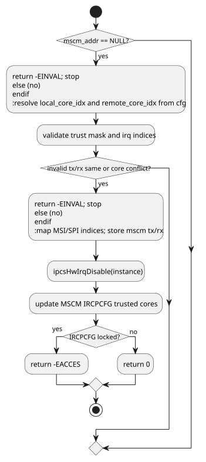

### 6.8.4 ipcsHwFree

<table border="1" cellspacing="0" cellpadding="4">
<tbody>
<tr>
<td>对应软件架构ID</td>
<td colspan="4">Drv_Ipcs_Hal_Cmp</td>
</tr>
<tr>
<td>软件单元 ID</td>
<td colspan="4">SWU_IPCS_HAL_LINUX</td>
</tr>
<tr>
<td>函数说明</td>
<td colspan="4">释放 HAL 资源；用户侧为空实现，内核侧释放映射状态。</td>
</tr>
<tr>
<td>函数原型</td>
<td colspan="4">void ipcsHwFree(const uint8_t instance)</td>
</tr>
<tr>
<td>制约条件</td>
<td colspan="4">按 `ipcs/mpu/hw/c1/ipc-hw.c` 中的入参检查、实例状态和内核资源状态执行</td>
</tr>
<tr>
<td rowspan="2">输入/输出参数</td>
<td>I/O</td>
<td>参数名</td>
<td>数据类型</td>
<td>说明</td>
</tr>
<tr>
<td>I</td>
<td>instance</td>
<td>const uint8_t instance</td>
<td>[IN] instance</td>
</tr>
<tr>
<td rowspan="2">返回值</td>
<td colspan="2">数据类型</td>
<td colspan="2">说明</td>
</tr>
<tr>
<td colspan="4">-</td>
</tr>
<tr>
<td>函数定义文件</td>
<td colspan="4">ipcs/mpu/hw/c1/ipc-hw.c</td>
</tr>
<tr>
<td>函数声明文件</td>
<td colspan="4">ipcs/mpu/hw/ipc-hw.h</td>
</tr>
</tbody>
</table>

processing flow

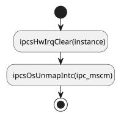

### 6.8.5 ipcsHwIrqEnable

<table border="1" cellspacing="0" cellpadding="4">
<tbody>
<tr>
<td>对应软件架构ID</td>
<td colspan="4">Drv_Ipcs_Hal_Cmp</td>
</tr>
<tr>
<td>软件单元 ID</td>
<td colspan="4">SWU_IPCS_HAL_LINUX</td>
</tr>
<tr>
<td>函数说明</td>
<td colspan="4">使能指定实例接收中断；用户侧为转发代理，内核侧访问硬件。</td>
</tr>
<tr>
<td>函数原型</td>
<td colspan="4">void ipcsHwIrqEnable(const uint8_t instance)</td>
</tr>
<tr>
<td>制约条件</td>
<td colspan="4">按 `ipcs/mpu/hw/c1/ipc-hw.c` 中的入参检查、实例状态和内核资源状态执行</td>
</tr>
<tr>
<td rowspan="2">输入/输出参数</td>
<td>I/O</td>
<td>参数名</td>
<td>数据类型</td>
<td>说明</td>
</tr>
<tr>
<td>I</td>
<td>instance</td>
<td>const uint8_t instance</td>
<td>[IN] instance</td>
</tr>
<tr>
<td rowspan="2">返回值</td>
<td colspan="2">数据类型</td>
<td colspan="2">说明</td>
</tr>
<tr>
<td colspan="4">-</td>
</tr>
<tr>
<td>函数定义文件</td>
<td colspan="4">ipcs/mpu/hw/c1/ipc-hw.c</td>
</tr>
<tr>
<td>函数声明文件</td>
<td colspan="4">ipcs/mpu/hw/ipc-hw.h</td>
</tr>
</tbody>
</table>

processing flow

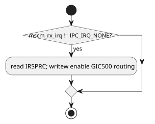

### 6.8.6 ipcsHwIrqDisable

<table border="1" cellspacing="0" cellpadding="4">
<tbody>
<tr>
<td>对应软件架构ID</td>
<td colspan="4">Drv_Ipcs_Hal_Cmp</td>
</tr>
<tr>
<td>软件单元 ID</td>
<td colspan="4">SWU_IPCS_HAL_LINUX</td>
</tr>
<tr>
<td>函数说明</td>
<td colspan="4">禁止指定实例接收中断；用户侧为转发代理，内核侧访问硬件。</td>
</tr>
<tr>
<td>函数原型</td>
<td colspan="4">void ipcsHwIrqDisable(const uint8_t instance)</td>
</tr>
<tr>
<td>制约条件</td>
<td colspan="4">按 `ipcs/mpu/hw/c1/ipc-hw.c` 中的入参检查、实例状态和内核资源状态执行</td>
</tr>
<tr>
<td rowspan="2">输入/输出参数</td>
<td>I/O</td>
<td>参数名</td>
<td>数据类型</td>
<td>说明</td>
</tr>
<tr>
<td>I</td>
<td>instance</td>
<td>const uint8_t instance</td>
<td>[IN] instance</td>
</tr>
<tr>
<td rowspan="2">返回值</td>
<td colspan="2">数据类型</td>
<td colspan="2">说明</td>
</tr>
<tr>
<td colspan="4">-</td>
</tr>
<tr>
<td>函数定义文件</td>
<td colspan="4">ipcs/mpu/hw/c1/ipc-hw.c</td>
</tr>
<tr>
<td>函数声明文件</td>
<td colspan="4">ipcs/mpu/hw/ipc-hw.h</td>
</tr>
</tbody>
</table>

processing flow

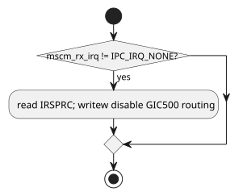

### 6.8.7 ipcsHwIrqNotify

<table border="1" cellspacing="0" cellpadding="4">
<tbody>
<tr>
<td>对应软件架构ID</td>
<td colspan="4">Drv_Ipcs_Hal_Cmp</td>
</tr>
<tr>
<td>软件单元 ID</td>
<td colspan="4">SWU_IPCS_HAL_LINUX</td>
</tr>
<tr>
<td>函数说明</td>
<td colspan="4">通知远端有数据可用；用户侧为转发代理，内核侧触发硬件中断。</td>
</tr>
<tr>
<td>函数原型</td>
<td colspan="4">void ipcsHwIrqNotify(const uint8_t instance)</td>
</tr>
<tr>
<td>制约条件</td>
<td colspan="4">按 `ipcs/mpu/hw/c1/ipc-hw.c` 中的入参检查、实例状态和内核资源状态执行</td>
</tr>
<tr>
<td rowspan="2">输入/输出参数</td>
<td>I/O</td>
<td>参数名</td>
<td>数据类型</td>
<td>说明</td>
</tr>
<tr>
<td>I</td>
<td>instance</td>
<td>const uint8_t instance</td>
<td>[IN] instance</td>
</tr>
<tr>
<td rowspan="2">返回值</td>
<td colspan="2">数据类型</td>
<td colspan="2">说明</td>
</tr>
<tr>
<td colspan="4">-</td>
</tr>
<tr>
<td>函数定义文件</td>
<td colspan="4">ipcs/mpu/hw/c1/ipc-hw.c</td>
</tr>
<tr>
<td>函数声明文件</td>
<td colspan="4">ipcs/mpu/hw/ipc-hw.h</td>
</tr>
</tbody>
</table>

processing flow

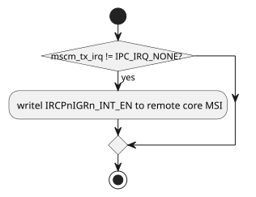

### 6.8.8 ipcsHwIrqClear

<table border="1" cellspacing="0" cellpadding="4">
<tbody>
<tr>
<td>对应软件架构ID</td>
<td colspan="4">Drv_Ipcs_Hal_Cmp</td>
</tr>
<tr>
<td>软件单元 ID</td>
<td colspan="4">SWU_IPCS_HAL_LINUX</td>
</tr>
<tr>
<td>函数说明</td>
<td colspan="4">清除指定实例接收中断状态。</td>
</tr>
<tr>
<td>函数原型</td>
<td colspan="4">void ipcsHwIrqClear(const uint8_t instance)</td>
</tr>
<tr>
<td>制约条件</td>
<td colspan="4">按 `ipcs/mpu/hw/c1/ipc-hw.c` 中的入参检查、实例状态和内核资源状态执行</td>
</tr>
<tr>
<td rowspan="2">输入/输出参数</td>
<td>I/O</td>
<td>参数名</td>
<td>数据类型</td>
<td>说明</td>
</tr>
<tr>
<td>I</td>
<td>instance</td>
<td>const uint8_t instance</td>
<td>[IN] instance</td>
</tr>
<tr>
<td rowspan="2">返回值</td>
<td colspan="2">数据类型</td>
<td colspan="2">说明</td>
</tr>
<tr>
<td colspan="4">-</td>
</tr>
<tr>
<td>函数定义文件</td>
<td colspan="4">ipcs/mpu/hw/c1/ipc-hw.c</td>
</tr>
<tr>
<td>函数声明文件</td>
<td colspan="4">ipcs/mpu/hw/ipc-hw.h</td>
</tr>
</tbody>
</table>

processing flow

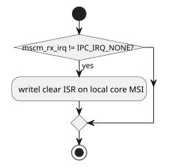

## 6.9 DYNAMIC DETAILED DESIGN 动态详细设计

| 场景 ID | 场景名称 | 涉及软件单元 | 设计依据 |
|---|---|---|---|
| LIN-S01 | UIO 初始化 | CORE_SHM、LINUX_OS_UIO、LINUX_UIO_KO、HAL_LINUX | `ipcsOsInit`（os_uio）+ `ipcsCdevWrite`/`ipcsUioInit` |
| LIN-S02 | CDEV 初始化 | CORE_SHM、LINUX_OS_CDEV、LINUX_CDEV_KO、HAL_LINUX | `ipcsOsInit`（os_cdev）+ `ioctl` INIT |
| LIN-S03 | 全内核初始化 | CORE_SHM、LINUX_OS_KERN、HAL_LINUX | `ipcsOsInit`（os_kernel） |
| LIN-S04 | UIO 发送通知 | CORE_SHM、LINUX_OS_UIO、LINUX_UIO_KO、HAL_LINUX | `ipcsSendUioCmd` / `ipcsShmUioIrqcontrol` |
| LIN-S05 | CDEV 发送通知 | CORE_SHM、LINUX_OS_CDEV、LINUX_CDEV_KO、HAL_LINUX | `ioctl(TRIGGER_TX_IRQ)` |
| LIN-S06 | UIO 接收唤醒 | HAL_LINUX、LINUX_UIO_KO、LINUX_OS_UIO、CORE_SHM | `ipcsShmUioHandler` + pthread `read` |
| LIN-S07 | CDEV 接收唤醒 | HAL_LINUX、LINUX_CDEV_KO、LINUX_OS_CDEV、CORE_SHM | `ipcsShmHardirq` + `wait_queue` |
| LIN-S08 | 全内核接收 | HAL_LINUX、LINUX_OS_KERN、CORE_SHM | `ipcsShmHardirq` + tasklet |

### 6.9.1 UIO Initialization (LIN-S01) UIO 初始化

sequence diagram

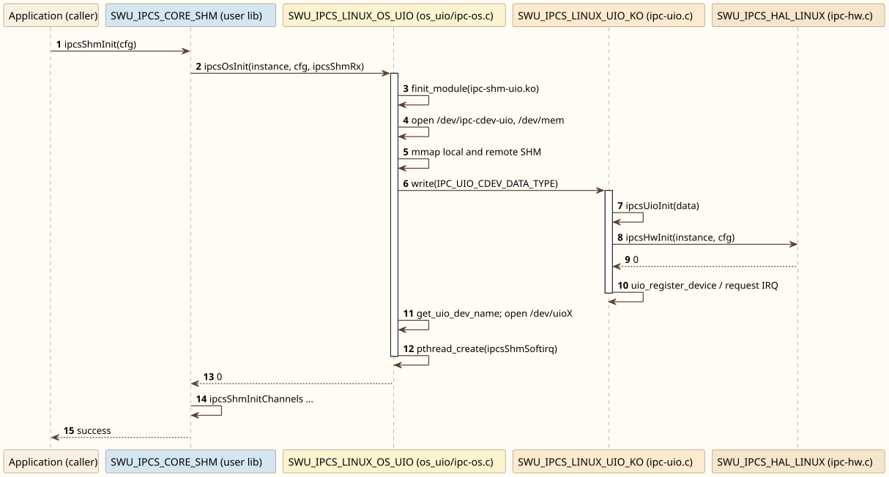

### 6.9.2 CDEV Initialization (LIN-S02) CDEV 初始化

sequence diagram

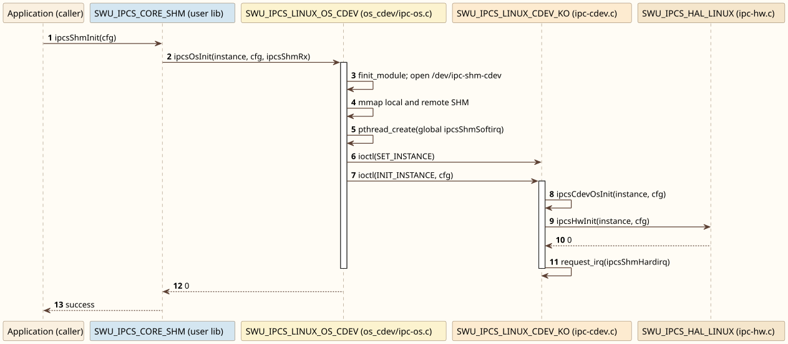

### 6.9.3 In-Kernel Initialization (LIN-S03) 全内核初始化

sequence diagram

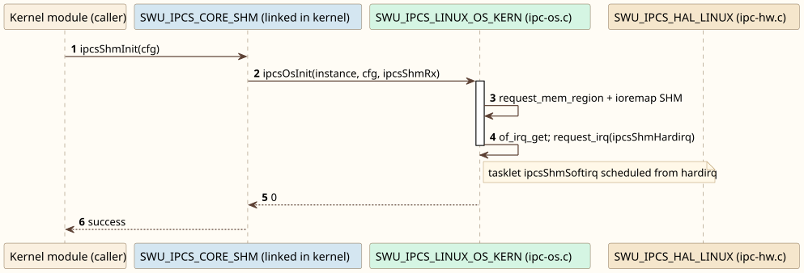

### 6.9.4 UIO Transmit Notify (LIN-S04) UIO 发送通知

sequence diagram

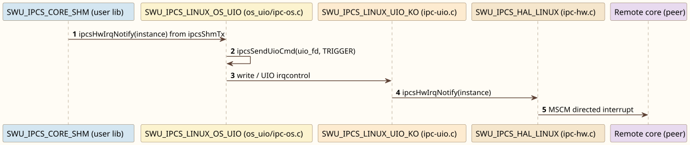

### 6.9.5 CDEV Transmit Notify (LIN-S05) CDEV 发送通知

sequence diagram

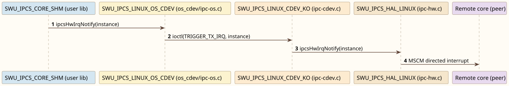

### 6.9.6 UIO Receive Wakeup (LIN-S06) UIO 接收唤醒

sequence diagram

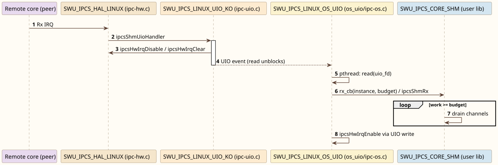

### 6.9.7 CDEV Receive Wakeup (LIN-S07) CDEV 接收唤醒

sequence diagram

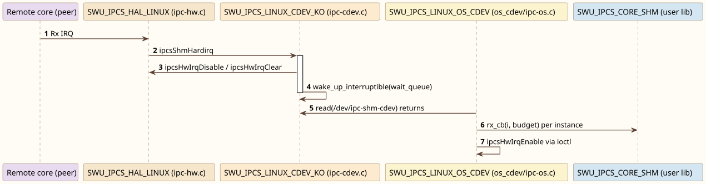

### 6.9.8 In-Kernel Receive (LIN-S08) 全内核接收

sequence diagram

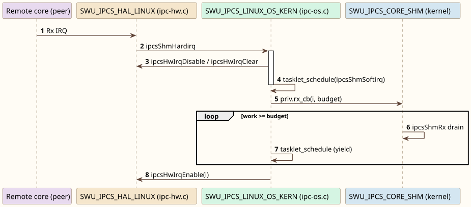

## 6.10 GLOBAL VARIABLES 全局变量

| 全局变量名称 | 全局变量类型 | 全局变量范围 | 全局变量描述 | 全局变量的存储RAM区 |
|---|---|---|---|---|
| ipc_os_priv | static struct IPCS_OS_PRIV_TYPE_TYPE | ipcs/mpu/os_uio/ipc-os.c | UIO 用户侧 OSAL 代理私有数据 | 编译器/链接器默认 RAM（.bss，未指定 section） |
| priv | static struct IPCS_OS_PRIV_TYPE | ipcs/mpu/os_cdev/ipc-os.c | CDEV 用户侧 OSAL 代理私有数据 | 编译器/链接器默认 RAM（.bss，未指定 section） |
| priv | static struct IPCS_OS_PRIV_TYPE | ipcs/mpu/os_kernel/ipc-os.c | 全内核 OSAL 实现私有数据 | 编译器/链接器默认 RAM（.bss，未指定 section） |
| ipc_pdev_priv | struct IPCS_PDEV_PRIV_TYPE_TYPE | ipcs/mpu/os_kernel/ipc-uio.c | UIO 内核 Backend 平台设备与 cdev/UIO 实例状态 | 编译器/链接器默认 RAM（.bss，未指定 section） |
| ipc_cdev_priv | struct IPCS_CDEV_PRIV_TYPE_TYPE | ipcs/mpu/os_kernel/ipc-cdev.c | CDEV 内核 Backend 字符设备与 wait queue 状态 | 编译器/链接器默认 RAM（.bss，未指定 section） |
| ipc_hw_priv | static struct IPCS_HW_PRIV_TYPE_TYPE [IPC_SHM_MAX_INSTANCES] | ipcs/mpu/hw/c1/ipc-hw.c | 每 instance Linux HAL 私有数据 | 编译器/链接器默认 RAM（.bss，未指定 section） |

## 6.11 DATA TYPES 类型定义

### 6.11.1 enum IPCS_STATUS_E（UIO 用户侧）

定义于 `ipcs/mpu/os_uio/ipc-os.c`。

| Name | Description |
|---|---|
| IPC_STATUS_CLEAR | 0 |
| IPC_STATUS_SET | 1 |

### 6.11.2 enum IPCS_STATUS_E（CDEV 用户侧）

定义于 `ipcs/mpu/os_cdev/ipc-os.c`（枚举名与 UIO 实现相同，取值一致）。

| Name | Description |
|---|---|
| IPC_STATUS_CLEAR | 0 |
| IPC_STATUS_SET | 1 |

### 6.11.3 struct IPCS_OS_PRIV_INSTANCE_TYPE（UIO 用户侧）

定义于 `ipcs/mpu/os_uio/ipc-os.c`。

| Type | Name | Description |
|---|---|---|
| uint8_t | state | state to indicate whether instance is initialized |
| uint8_t | instance | target instance |
| int | irq_num | target instance interrupt index |
| int | uio_fd | UIO device file descriptor |
| void * | local_virt_shm | local ShM virtual address |
| void * | remote_virt_shm | remote ShM virtual address |
| void * | local_shm_map | local ShM mapped page address |
| void * | remote_shm_map | remote ShM mapped page address |
| size_t | local_shm_offset | local ShM offset in mapped page |
| size_t | remote_shm_offset | remote ShM offset in mapped page |
| size_t | shm_size | local/remote ShM size |
| int (*rx_cb)(const uint8_t instance, int budget) | rx_cb | upper layer Rx callback function |
| pthread_t | irq_thread_id | Rx interrupt thread id |

### 6.11.4 struct IPCS_OS_PRIV_TYPE_TYPE（UIO 用户侧）

定义于 `ipcs/mpu/os_uio/ipc-os.c`。

| Type | Name | Description |
|---|---|---|
| uint8_t | ipc_files_opened | indicate whether device files are opened |
| int | ipc_cdev_fd | kernel character device file descriptor |
| int | dev_mem_fd | MEM device file descriptor |
| struct IPCS_OS_PRIV_INSTANCE_TYPE | id[IPC_SHM_MAX_INSTANCES] | private data per instance |

### 6.11.5 struct IPCS_OS_PRIV_INSTANCE_TYPE（CDEV 用户侧）

定义于 `ipcs/mpu/os_cdev/ipc-os.c`。

| Type | Name | Description |
|---|---|---|
| uint8_t | state | state to indicate whether instance is initialized |
| int | irq_num | rx interrupt number using to check for polling |
| size_t | shm_size | local/remote ShM size |
| void * | local_virt_shm | local ShM virtual address |
| void * | remote_virt_shm | remote ShM virtual address |
| void * | local_shm_map | local ShM mapped page address |
| void * | remote_shm_map | remote ShM mapped page address |
| size_t | local_shm_offset | local ShM offset in mapped page |
| size_t | remote_shm_offset | remote ShM offset in mapped page |

### 6.11.6 struct IPCS_OS_PRIV_TYPE（CDEV 用户侧）

定义于 `ipcs/mpu/os_cdev/ipc-os.c`。

| Type | Name | Description |
|---|---|---|
| uint8_t | ipc_files_opened | indicate whether device files are opened |
| uint8_t | ipc_soft_created | indicate whether ipcsShmSoftirq thread is opened |
| int | ipc_usr_fd | ipc-shm-usr kernel device file descriptor |
| int | dev_mem_fd | MEM device file descriptor |
| pthread_t | irq_thread_id | Rx interrupt thread id |
| struct IPCS_OS_PRIV_INSTANCE_TYPE | id[IPC_SHM_MAX_INSTANCES] | private data per instance |
| int (*rx_cb)(const uint8_t instance, int budget) | rx_cb | upper layer rx callback function |

### 6.11.7 struct IPCS_OS_PRIV_INSTANCE_TYPE（全内核 OSAL）

定义于 `ipcs/mpu/os_kernel/ipc-os.c`。

| Type | Name | Description |
|---|---|---|
| int | shm_size | local/remote shared memory size |
| uintptr_t | local_phys_shm | local shared memory physical address |
| uintptr_t | remote_phys_shm | remote shared memory physical address |
| uintptr_t | local_virt_shm | local shared memory virtual address |
| uintptr_t | remote_virt_shm | remote shared memory virtual address |
| int | irq_num | Linux IRQ number |
| int | state | state to indicate whether instance is initialized |

### 6.11.8 struct IPCS_OS_PRIV_TYPE（全内核 OSAL）

定义于 `ipcs/mpu/os_kernel/ipc-os.c`。

| Type | Name | Description |
|---|---|---|
| struct IPCS_OS_PRIV_INSTANCE_TYPE | id[IPC_SHM_MAX_INSTANCES] | private data per instance |
| int (*rx_cb)(const uint8_t instance, int budget) | rx_cb | upper layer rx callback |
| int | irq_num_init[IPC_SHM_MAX_INSTANCES] | array to save all initialized irq |

### 6.11.9 struct IPCS_UIO_CDEV_DATA_TYPE

定义于 `ipcs/mpu/os_kernel/ipc-uio.h`。

| Type | Name | Description |
|---|---|---|
| uint8_t | instance | target instance |
| struct IPCS_SHM_CFG_TYPE | cfg | instance configuration passed from user space |

### 6.11.10 struct IPCS_UIO_PRIV_TYPE_TYPE

定义于 `ipcs/mpu/os_kernel/ipc-uio.c`。

| Type | Name | Description |
|---|---|---|
| int | state | instance state (initialized or not) |
| int | irq_num | rx interrupt number using to request irq |
| struct device * | dev | Linux device capabilities |
| atomic_t | refcnt | reference counter to allow a single UIO device open at a time |
| struct uio_info | info | UIO device capabilities |
| struct IPCS_UIO_CDEV_DATA_TYPE | data | Chrdev private data to get user space configuration |
| char | uio_name[32] | UIO device name |

### 6.11.11 struct IPCS_PDEV_PRIV_TYPE_TYPE

定义于 `ipcs/mpu/os_kernel/ipc-uio.c`。

| Type | Name | Description |
|---|---|---|
| dev_t | major | chrdev major number which is allocated dynamically |
| int | irq_num_init[IPC_SHM_MAX_INSTANCES] | interrupt index for each instance |
| struct platform_device * | ipc_pdev | Linux platform device capabilities |
| void __iomem * | pdev_reg | Platform device register |
| struct class * | cdev_class | class use to create device file in /dev |
| struct cdev | cdev | variable use for character device |
| struct IPCS_UIO_PRIV_TYPE_TYPE | uio_id[IPC_SHM_MAX_INSTANCES] | IPCS SHM UIO device data for each instance |

### 6.11.12 struct IPCS_OS_PRIV_INSTANCE_TYPE（CDEV 内核 Backend）

定义于 `ipcs/mpu/os_kernel/ipc-cdev.c`。

| Type | Name | Description |
|---|---|---|
| int | state | instance state (initialized or not) |
| int | irq_num | rx interrupt number using to request irq |

### 6.11.13 struct IPCS_CDEV_PRIV_TYPE_TYPE

定义于 `ipcs/mpu/os_kernel/ipc-cdev.c`。

| Type | Name | Description |
|---|---|---|
| char | dev_is_opened | to check if device is open or not |
| uint8_t | target_instance | instance to be initialized |
| uint8_t | wait_queue_flag | flag to wake up the wait queue |
| int | irq_num_init[IPC_SHM_MAX_INSTANCES] | array to save all initialized irq |
| wait_queue_head_t | wait_queue | variable use for wait queue operation |
| dev_t | dev_major_num | major number is dynamically allocated when initialize |
| struct class * | ipc_class | class use to create device file in /dev |
| struct cdev | ipc_cdev | variable use for character device |
| struct IPCS_OS_PRIV_INSTANCE_TYPE | instance_id[IPC_SHM_MAX_INSTANCES] | private data per instance |

### 6.11.14 struct IPCS_HW_PRIV_TYPE_TYPE（Linux HAL）

定义于 `ipcs/mpu/hw/c1/ipc-hw.c`。

| Type | Name | Description |
|---|---|---|
| uint8_t | msi_tx_irq | MSI index of inter-core interrupt corresponds to mscm_tx_irq |
| uint8_t | msi_rx_irq | MSI index of inter-core interrupt corresponds to mscm_rx_irq |
| uint8_t | spi_index | shared peripheral interrupts index |
| int | mscm_tx_irq | 核间中断控制器 inter-core interrupt reserved for shm driver tx |
| int | mscm_rx_irq | 核间中断控制器 inter-core interrupt reserved for shm driver rx |
| int | remote_core | index of remote core to trigger the interrupt on |
| int | local_core | index of the local core targeted by remote |
| struct IPCS_MSCM_REGS_TYPE * | ipc_mscm | pointer to memory-mapped hardware peripheral 核间中断控制器 |

### 6.11.15 enum IPCS_C1_PROCESSOR_IDX_E

定义于 `ipcs/mpu/hw/c1/ipc-hw-platform.h`。

| Name | Description |
|---|---|
| IPC_A53_0 | ARM Cortex-A53 cluster 0 core 0 |
| IPC_A53_1 | ARM Cortex-A53 cluster 1 core 1 |
| IPC_A53_2 | ARM Cortex-A53 cluster 1 core 0 |
| IPC_A53_3 | ARM Cortex-A53 cluster 1 core 1 |
| IPC_M7_0 | ARM Cortex-M7 core 0 |
| IPC_M7_1 | ARM Cortex-M7 core 1 |
| IPC_M7_2 | ARM Cortex-M7 core 2 |
| IPC_M7_3 | ARM Cortex-M7 core 2 |
| IPC_A53_4 | ARM Cortex-A53 cluster 0 core 2 |
| IPC_A53_5 | ARM Cortex-A53 cluster 0 core 3 |
| IPC_A53_6 | ARM Cortex-A53 cluster 1 core 2 |
| IPC_A53_7 | ARM Cortex-A53 cluster 1 core 3 |

### 6.11.16 struct IPCS_MSCM_REGS_TYPE

定义于 `ipcs/mpu/hw/c1/ipc-hw-platform.h`（核间中断控制器 Peripheral Register Structure）。

| Type | Name | Description |
|---|---|---|
| volatile const uint32_t | CPXTYPE | 源码未提供描述 |
| volatile const uint32_t | CPXNUM | 源码未提供描述 |
| volatile const uint32_t | CPXREV | 源码未提供描述 |
| volatile const uint32_t | CPXCFG[IPC_MSCM_CPnCFG_COUNT] | 源码未提供描述 |
| uint8_t | RESERVED00[IPC_MSCM_RESERVED00_COUNT] | 源码未提供描述 |
| volatile const uint32_t | CP0TYPE | 源码未提供描述 |
| volatile const uint32_t | CP0NUM | 源码未提供描述 |
| volatile const uint32_t | CP0REV | 源码未提供描述 |
| volatile const uint32_t | CP0CFG[IPC_MSCM_CPnCFG_COUNT] | 源码未提供描述 |
| uint8_t | RESERVED01[IPC_MSCM_RESERVED00_COUNT] | 源码未提供描述 |
| volatile const uint32_t | CP1TYPE | 源码未提供描述 |
| volatile const uint32_t | CP1NUM | 源码未提供描述 |
| volatile const uint32_t | CP1REV | 源码未提供描述 |
| volatile const uint32_t | CP1CFG[IPC_MSCM_CPnCFG_COUNT] | 源码未提供描述 |
| uint8_t | RESERVED02[IPC_MSCM_RESERVED00_COUNT] | 源码未提供描述 |
| volatile const uint32_t | CP2TYPE | 源码未提供描述 |
| volatile const uint32_t | CP2NUM | 源码未提供描述 |
| volatile const uint32_t | CP2REV | 源码未提供描述 |
| volatile const uint32_t | CP2CFG[IPC_MSCM_CPnCFG_COUNT] | 源码未提供描述 |
| uint8_t | RESERVED03[IPC_MSCM_RESERVED00_COUNT] | 源码未提供描述 |
| volatile const uint32_t | CP3TYPE | 源码未提供描述 |
| volatile const uint32_t | CP3NUM | 源码未提供描述 |
| volatile const uint32_t | CP3REV | 源码未提供描述 |
| volatile const uint32_t | CP3CFG[IPC_MSCM_CPnCFG_COUNT] | 源码未提供描述 |
| uint8_t | RESERVED04[IPC_MSCM_RESERVED00_COUNT] | 源码未提供描述 |
| volatile const uint32_t | CP4TYPE | 源码未提供描述 |
| volatile const uint32_t | CP4NUM | 源码未提供描述 |
| volatile const uint32_t | CP4REV | 源码未提供描述 |
| volatile const uint32_t | CP4CFG[IPC_MSCM_CPnCFG_COUNT] | 源码未提供描述 |
| uint8_t | RESERVED05[IPC_MSCM_RESERVED00_COUNT] | 源码未提供描述 |
| volatile const uint32_t | CP5TYPE | 源码未提供描述 |
| volatile const uint32_t | CP5NUM | 源码未提供描述 |
| volatile const uint32_t | CP5REV | 源码未提供描述 |
| volatile const uint32_t | CP5CFG[IPC_MSCM_CPnCFG_COUNT] | 源码未提供描述 |
| uint8_t | RESERVED06[IPC_MSCM_RESERVED00_COUNT] | 源码未提供描述 |
| volatile const uint32_t | CP6TYPE | 源码未提供描述 |
| volatile const uint32_t | CP6NUM | 源码未提供描述 |
| volatile const uint32_t | CP6REV | 源码未提供描述 |
| volatile const uint32_t | CP6CFG[IPC_MSCM_CPnCFG_COUNT] | 源码未提供描述 |
| uint8_t | RESERVED07[IPC_MSCM_RESERVED00_COUNT] | 源码未提供描述 |
| volatile const uint32_t | CP7TYPE | 源码未提供描述 |
| volatile const uint32_t | CP7NUM | 源码未提供描述 |
| volatile const uint32_t | CP7REV | 源码未提供描述 |
| volatile const uint32_t | CP7CFG[IPC_MSCM_CPnCFG_COUNT] | 源码未提供描述 |
| uint8_t | RESERVED08[IPC_MSCM_RESERVED00_COUNT] | 源码未提供描述 |
| volatile const uint32_t | CP8TYPE | 源码未提供描述 |
| volatile const uint32_t | CP8NUM | 源码未提供描述 |
| volatile const uint32_t | CP8REV | 源码未提供描述 |
| volatile const uint32_t | CP8CFG[IPC_MSCM_CPnCFG_COUNT] | 源码未提供描述 |
| uint8_t | RESERVED09[IPC_MSCM_RESERVED00_COUNT] | 源码未提供描述 |
| volatile const uint32_t | CP9TYPE | 源码未提供描述 |
| volatile const uint32_t | CP9NUM | 源码未提供描述 |
| volatile const uint32_t | CP9REV | 源码未提供描述 |
| volatile const uint32_t | CP9CFG[IPC_MSCM_CPnCFG_COUNT] | 源码未提供描述 |
| uint8_t | RESERVED010[IPC_MSCM_RESERVED00_COUNT] | 源码未提供描述 |
| volatile const uint32_t | CP10TYPE | 源码未提供描述 |
| volatile const uint32_t | CP10NUM | 源码未提供描述 |
| volatile const uint32_t | CP10REV | 源码未提供描述 |
| volatile const uint32_t | CP10CFG[IPC_MSCM_CPnCFG_COUNT] | 源码未提供描述 |
| uint8_t | RESERVED011[IPC_MSCM_RESERVED00_COUNT] | 源码未提供描述 |
| volatile const uint32_t | CP11TYPE | 源码未提供描述 |
| volatile const uint32_t | CP11NUM | 源码未提供描述 |
| volatile const uint32_t | CP11REV | 源码未提供描述 |
| volatile const uint32_t | CP11CFG[IPC_MSCM_CPnCFG_COUNT] | 源码未提供描述 |
| uint8_t | RESERVED012[IPC_MSCM_RESERVED01_COUNT] | 源码未提供描述 |
| volatile uint32_t | IRCPCFG | 源码未提供描述 |
| uint8_t | RESERVED013[IPC_MSCM_RESERVED02_COUNT] | 源码未提供描述 |
| volatile uint32_t | IRNMIC | 源码未提供描述 |
| uint8_t | RESERVED14[IPC_MSCM_RESERVED03_COUNT] | 源码未提供描述 |
| volatile uint16_t | IRSPRC[IPC_MSCM_IRSPRC_COUNT] | 源码未提供描述 |
| struct { volatile uint32_t IPC_ISR; volatile uint32_t IPC_IGR; } | IRCPnIRx[IPC_MSCM_CP_COUNT][IPC_MSCM_IRQ_COUNT] | 源码未提供描述 |

# 7 TRACE & CONSISTENCY 双向追溯一致性

## 7.1 TRACEABILITY STATEMENT 追溯策略声明

本章节建立本模块软件详细设计与上游（软件需求、软件架构）及下游（物理源代码）之间的双向追溯关系，满足 ASPICE SWE.3.BP4 要求。

需求—架构组件分配依据架构设计规范的章节2.4；架构组件—软件单元映射依据本文档 章节2.1–章节2.2；单元行为与接口依据 章节4–章节6。本矩阵用于证明：已分配至本驱动的架构组件与需求在详细设计单元及物理实现中均有对应实体，并支持变更影响分析。

## 7.2 TRACEABILITY MATRIX 双向追溯矩阵

| 软件需求 ID (SWE.1) | 架构组件 ID (SWE.2) | 本详细设计单元 ID (SWE.3) | 物理源代码实体 (Code) | 追溯关系及设计覆盖说明 |
| :--- | :--- | :--- | :--- | :--- |
| IPCS_001 | Drv_Ipcs_Core_Cmp、Drv_Ipcs_Queue_Cmp、Drv_Ipcs_Osal_Cmp、Drv_Ipcs_Hal_Cmp、Drv_Ipcs_Conf_Cmp | SWU_IPCS_CORE_SHM、SWU_IPCS_CORE_UTIL、SWU_IPCS_CORE_QUEUE；章节2.1 所列 OSAL/HAL 单元；Conf 见 章节4.6 | `ipcs/ipcs_cores/ipc-shm.c`、`ipc-queue.c`、`ipc-util.c`、`ipc-types.h`；`ipcs/mcu/os/`、`ipcs/mcu/hw/ipc-hw.c`；`ipcs/mpu/` 各实现文件 | 同核/异核点对点双向通信：实例、通道、队列、共享内存映射与核间通知 |
| IPCS_002 | Drv_Ipcs_Osal_Cmp | SWU_IPCS_OSAL_AUTOSAR | `ipcs/mcu/os/autosar/ipc-os-autosar.c` | AutoSAR OS 部署下 OSAL 集成边界；安全目标与证据见项目安全工件 |
| IPCS_003 | Drv_Ipcs_Core_Cmp、Drv_Ipcs_Queue_Cmp、Drv_Ipcs_Hal_Cmp | SWU_IPCS_CORE_SHM、SWU_IPCS_CORE_QUEUE、SWU_IPCS_HAL_MCU、SWU_IPCS_HAL_LINUX | `ipcs/ipcs_cores/ipc-shm.c`、`ipc-queue.c`；`ipcs/mcu/hw/ipc-hw.c`；`ipcs/mpu/hw/c1/ipc-hw.c` | 可移植逻辑在 Core/Queue；平台与字节序相关行为在 HAL |
| IPCS_005 | Drv_Ipcs_Osal_Cmp | SWU_IPCS_OSAL_AUTOSAR | `ipcs/mcu/os/autosar/ipc-os-autosar.c` | AutoSAR CDD/OS 封装、调度与错误处理 |
| IPCS_006 | Drv_Ipcs_Osal_Cmp | SWU_IPCS_OSAL_THREADX | `ipcs/mcu/os/threadx/ipc-os-threadx.c` | ThreadX 任务、中断与同步原语映射 |
| IPCS_010 | Drv_Ipcs_Core_Cmp、Drv_Ipcs_Queue_Cmp | SWU_IPCS_CORE_SHM、SWU_IPCS_CORE_QUEUE | `ipcs/ipcs_cores/ipc-shm.c`、`ipc-queue.c` | 传输路径可观测计数/时间戳（可选编译） |
| IPCS_012 | Drv_Ipcs_Core_Cmp、Drv_Ipcs_Queue_Cmp、Drv_Ipcs_Osal_Cmp、Drv_Ipcs_Hal_Cmp | 章节2.1 Core/OSAL/HAL 单元 | `ipcs/` 目录下对应单元源文件 | OSAL/HAL 接口可替换实现，便于单元测试 |
| IPCS_014 | Drv_Ipcs_Core_Cmp、Drv_Ipcs_Queue_Cmp、Drv_Ipcs_Conf_Cmp | SWU_IPCS_CORE_SHM、SWU_IPCS_CORE_QUEUE；Conf 见 章节4.6 | `ipcs/ipcs_cores/ipc-shm.c`、`ipc-queue.c`、`ipc-types.h` | 多通信通道与共享内存布局 |
| IPCS_015 | Drv_Ipcs_Core_Cmp、Drv_Ipcs_Queue_Cmp | SWU_IPCS_CORE_SHM、SWU_IPCS_CORE_QUEUE | `ipcs/ipcs_cores/ipc-shm.c`、`ipc-queue.c` | 单通道内消息顺序保持 |
| IPCS_016 | Drv_Ipcs_Core_Cmp、Drv_Ipcs_Queue_Cmp、Drv_Ipcs_Conf_Cmp | SWU_IPCS_CORE_SHM、SWU_IPCS_CORE_QUEUE；Conf 见 章节4.6 | `ipcs/ipcs_cores/ipc-shm.c`、`ipc-queue.c`、`ipc-types.h` | 每通道多缓冲池与队列管理 |
| IPCS_017 | Drv_Ipcs_Core_Cmp、Drv_Ipcs_Osal_Cmp、Drv_Ipcs_Conf_Cmp | SWU_IPCS_CORE_SHM；章节2.1 OSAL 单元；Conf 见 章节4.6 | `ipcs/ipcs_cores/ipc-shm.c`；各 `ipc-os-*.c` | 多 instance 与每核 OSAL 执行及中断亲和 |
| IPCS_018 | Drv_Ipcs_Core_Cmp、Drv_Ipcs_Queue_Cmp | SWU_IPCS_CORE_SHM、SWU_IPCS_CORE_QUEUE | `ipcs/ipcs_cores/ipc-shm.c`、`ipc-queue.c` | 零拷贝：BD/指针传递缓冲区 |
| IPCS_019 | Drv_Ipcs_Core_Cmp、Drv_Ipcs_Osal_Cmp | SWU_IPCS_CORE_SHM；章节2.1 OSAL 单元 | `ipcs/ipcs_cores/ipc-shm.c`；各 OSAL 实现文件 | 基于通知的异步接收与回调分发 |
| IPCS_020 | Drv_Ipcs_Core_Cmp、Drv_Ipcs_Conf_Cmp | SWU_IPCS_CORE_SHM；Conf 见 章节4.6 | `ipcs/ipcs_cores/ipc-shm.c`、`ipc-types.h`；集成配置 `ipcf_Ip_Cfg*.h` | 通信端内存隔离：布局配置与 Core 边界检查 |
| IPCS_021 | Drv_Ipcs_Core_Cmp、Drv_Ipcs_Conf_Cmp | SWU_IPCS_CORE_SHM；Conf 见 章节4.6 | `ipcs/ipcs_cores/ipc-shm.c` | 非托管通道：`ipcsShmUnmanagedAcquire`/`ipcsShmUnmanagedTx` |
| IPCS_022 | Drv_Ipcs_Core_Cmp、Drv_Ipcs_Queue_Cmp、Drv_Ipcs_Osal_Cmp、Drv_Ipcs_Hal_Cmp | 章节2.1 所列相关单元 | `ipcs/ipcs_cores/`；OSAL/HAL 源文件 | 虚拟中断与队列状态协调，避免陈旧数据投递 |
| IPCS_023 | Drv_Ipcs_Core_Cmp、Drv_Ipcs_Queue_Cmp | SWU_IPCS_CORE_SHM、SWU_IPCS_CORE_QUEUE | `ipcs/ipcs_cores/ipc-shm.c`、`ipc-queue.c` | 共享内存提交顺序保证；可与 IPCS_039 轮询协同 |
| IPCS_024 | Drv_Ipcs_Osal_Cmp、Drv_Ipcs_Conf_Cmp | SWU_IPCS_OSAL_AUTOSAR；Conf 见 章节4.6 | `ipcs/mcu/os/autosar/ipc-os-autosar.c`、`ipc-types.h` | 与 AUTOSAR R4.4+ 接口及配置模型对齐 |
| IPCS_025 | Drv_Ipcs_Conf_Cmp | 章节4.6 类型定义（无独立 SWU） | `ipcs/ipcs_cores/ipc-types.h`；`ipcf_Ip_Cfg*.h` | 缓冲池数量与大小由集成配置提供 |
| IPCS_028 | Drv_Ipcs_Hal_Cmp、Drv_Ipcs_Osal_Cmp | SWU_IPCS_HAL_MCU、SWU_IPCS_HAL_LINUX；章节2.1 OSAL 单元 | `ipcs/mcu/hw/ipc-hw.c`、`ipcs/mpu/hw/c1/ipc-hw.c`；各 OSAL 文件 | 核间中断作为收发通知 |
| IPCS_029 | Drv_Ipcs_Core_Cmp、Drv_Ipcs_Queue_Cmp、Drv_Ipcs_Osal_Cmp | SWU_IPCS_CORE_SHM、SWU_IPCS_CORE_QUEUE、SWU_IPCS_CORE_UTIL；OSAL 单元 | `ipcs/ipcs_cores/`；`ipcs/mcu/os/`、`ipcs/mpu/os_kernel/`、`ipcs/mpu/os_uio/`、`ipcs/mpu/os_cdev/` | 静态分配池与队列，无动态堆 |
| IPCS_031 | Drv_Ipcs_Core_Cmp、Drv_Ipcs_Conf_Cmp | SWU_IPCS_CORE_SHM；Conf 见 章节4.6 | `ipcs/ipcs_cores/ipc-shm.c`、`ipc-types.h` | 多核多 instance 独立 SHM/IRQ 配置 |
| IPCS_034 | Drv_Ipcs_Core_Cmp | SWU_IPCS_CORE_SHM | `ipcs/ipcs_cores/ipc-shm.c`、`ipc-shm.h` | 公共 API 参数校验 |
| IPCS_035 | Drv_Ipcs_Core_Cmp | SWU_IPCS_CORE_SHM | `ipcs/ipcs_cores/ipc-shm.c` | managed/unmanaged 与 channel 类型及操作一致性 |
| IPCS_036 | Drv_Ipcs_Core_Cmp、Drv_Ipcs_Queue_Cmp、Drv_Ipcs_Osal_Cmp、Drv_Ipcs_Hal_Cmp、Drv_Ipcs_Linux_Adapt_Cmp、Drv_Ipcs_Conf_Cmp | 章节2.1 全部软件单元 | `ipcs/` 实现目录 | 按部署变体与编译选项裁剪 HW/OS/传输实现 |
| IPCS_039 | Drv_Ipcs_Osal_Cmp、Drv_Ipcs_Hal_Cmp | 章节2.1 OSAL/HAL 单元 | `ipcsShmPollChannels`（`ipc-shm.c`）；各 OSAL/HAL 文件 | IRQ_NONE 轮询接收路径 |
